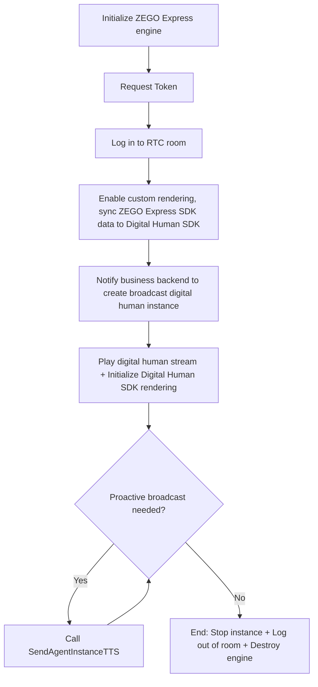
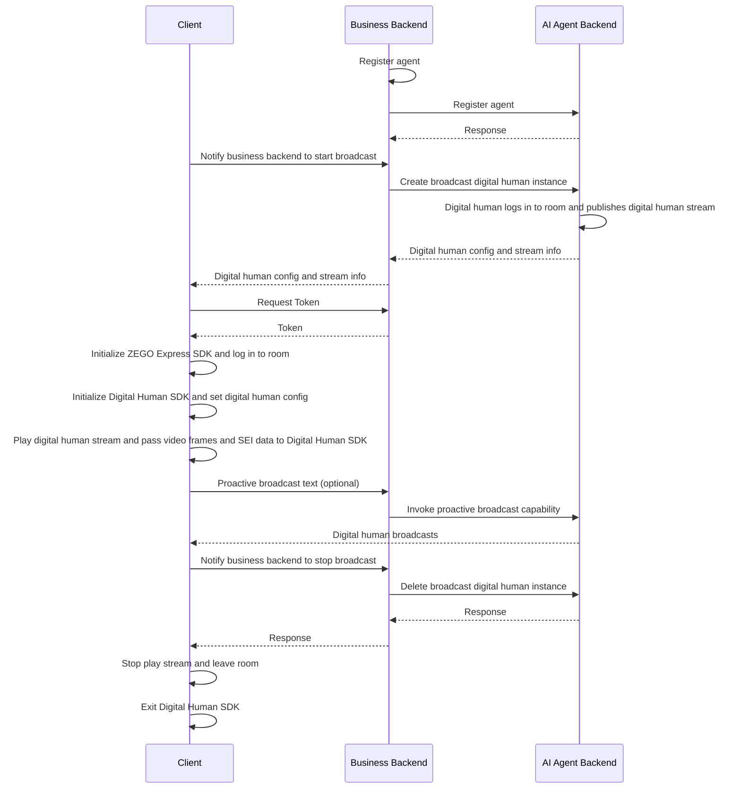
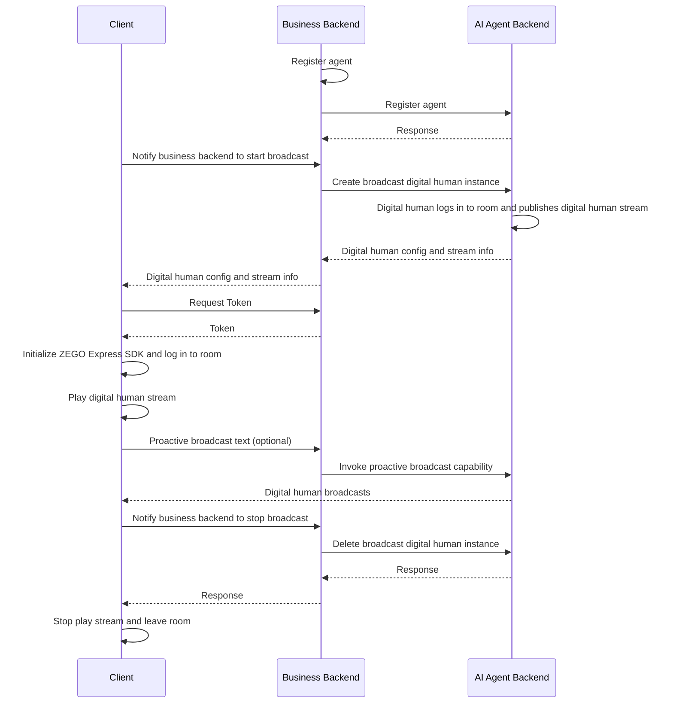

import {getPlatformData} from "/snippets/utils-content-parser.js"


export const expressSDKMap = {
  'Android': <a href='/real-time-voice-android/quick-start/integrating-sdk' target='_blank'>ZEGO Express SDK</a>,
  'iOS': <a href='/real-time-voice-ios/quick-start/integrating-sdk' target='_blank'>ZEGO Express SDK</a>,
  'Web': <a href='/real-time-voice-web/quick-start/integrating-sdk' target='_blank'>ZEGO Express SDK</a>,
}

# Implement Live Digital Human Broadcasting

:::if{props.platform="undefined|iOS"}
This document describes how to quickly integrate the client SDKs (ZEGO Express SDK and Digital Human SDK) to implement live digital human broadcasting.<br/>
Unlike digital human video calls, digital human broadcasting is a one-way viewing scenario - users do not interact with the digital human, they simply play stream the digital human's broadcast content for viewing.<br/>
The client only needs to log in to an [RTC room](/glossary/term-explanation#rtc-room-) and [play stream](/glossary/term-explanation#pull-stream); it does not need to capture or [publish stream](/glossary/term-explanation#publish-stream) the user's audio and video. After creating a broadcast instance, the server can proactively make the digital human broadcast specified text via the TTS API.<br/>
Suitable for scenarios such as digital human live streaming, news broadcasting, event hosting, and scripted broadcasts.
:::
:::if{props.platform="Web"}
This document describes how to quickly integrate the client SDK (ZEGO Express SDK) to implement live digital human broadcasting.<br/>
Unlike digital human video calls, digital human broadcasting is a one-way viewing scenario - users do not interact with the digital human, they simply play stream the digital human's broadcast content for viewing.<br/>
The client only needs to log in to an [RTC room](/glossary/term-explanation#rtc-room-) and [play stream](/glossary/term-explanation#pull-stream); it does not need to capture or [publish stream](/glossary/term-explanation#publish-stream) the user's audio and video. After creating a broadcast instance, the server can proactively make the digital human broadcast specified text via the TTS API.<br/>
Suitable for scenarios such as digital human live streaming, news broadcasting, event hosting, and scripted broadcasts.
:::

## Differences from Digital Human Video Calls

| Item | Digital Human Video Call | Live Digital Human Broadcasting |
| --- | --- | --- |
| Interaction mode | Two-way: the digital human responds after the user speaks | One-way: users only view the digital human's broadcast content |
| Use cases | Conversational AI, AI customer service, digital human tutor | Digital human live streaming, news broadcasting |
| Does the client need to capture user audio? | Yes | No |
| Digital human driving mechanism | After receiving user audio, LLM outputs a response and drives the digital human via TTS | Broadcast content is fully controlled by the server, driving the digital human via TTS |
| Instance creation API | [CreateDigitalHumanAgentInstance](/aiagent-server/api-reference/agent-instance-management/create-digital-human-agent-instance) | [CreateLiveDigitalHumanAgentInstance](/aiagent-server/api-reference/agent-instance-management/create-live-digital-human-agent-instance) |
| Requires user_id, user_stream_id | Yes | No |

## Prerequisites

- You have created a project in the [ZEGOCLOUD Console](https://console.zegocloud.com/){/* Chinese console link: https://console.zego.im/ */} and obtained a valid AppID and ServerSecret (for server API signing and RTC Token04 generation). For details, see [Console - Project Information](/console/project-info).
- You have contacted ZEGOCLOUD Technical Support to enable the Digital Human PaaS service and the relevant API permissions.
- You have obtained a valid `digital_human_id` (for testing, you can use the public ID: 63c3aa64-1d80-4b04-a0be-1c65614eb7eb).
- You have integrated the broadcast digital human server APIs as described in [Server Quick Start Guide](/aiagent-server/quick-start-with-live-digital-human).
:::if{props.platform="undefined|iOS"}
- You have downloaded the ZEGO Express SDK optimized for AI Agent from the [download page](./introduction/download.mdx) and integrated it into your project.
:::
:::if{props.platform="Web"}
- You have contacted ZEGOCLOUD Technical Support to obtain the ZEGO Express SDK optimized for AI Agent and integrated it into your project.
:::

<Warning title="Note">
Digital human broadcasting does not require microphone permissions and does not publish local streams. If the same app also includes voice call or digital human video call entries, those entries still need to request microphone permissions as described in their respective documentation.
</Warning>

## Sample Code

The following is the business backend sample code for integrating the Conversational AI Agent API. You can refer to the sample code to implement your own business logic.

<CardGroup cols={2}>
<Card title="Business Backend Sample Code" href="https://github.com/ZEGOCLOUD/ai_agent_quick_start_server" target="_blank">
Includes obtaining ZEGO Token, registering an agent, creating a broadcast digital human instance, proactively invoking TTS, and stopping instances.
</Card>
</CardGroup>

The following is the client sample code. You can refer to the sample code to implement your own business logic.

<CardGroup cols={2}>
:::if{props.platform=undefined}
<Card title="Android Client Sample Code" href="https://github.com/ZEGOCLOUD/ai_agent_quick_start/tree/master/android" target="_blank">
The entry point is `StartLiveDigitalHumanCall`, corresponding to `video.LiveDigitalHumanActivity`. It includes login, play stream, digital human rendering, proactive TTS, and leaving the room.
</Card>
:::
:::if{props.platform="iOS"}
<Card title="iOS Client Sample Code" href="https://github.com/ZEGOCLOUD/ai_agent_quick_start/tree/master/ios" target="_blank">
The entry point is `StartLiveDigitalHuman`. It completes login, play stream, digital human rendering, proactive TTS, and leaving the room through the broadcast mode on the digital human page.
</Card>
:::
:::if{props.platform="Web"}
<Card title="Web Client Sample Code" href="https://github.com/ZEGOCLOUD/ai_agent_quick_start/tree/master/web" target="_blank">
The entry point is `Start Live Digital Human`. It includes login, play stream, proactive TTS, and leaving the room.
</Card>
:::
</CardGroup>

:::if{props.platform="undefined|Web"}
The following video demonstrates how to run through the server and client (Web) sample code and interact with the agent via voice.
<Video src="https://doc-media.zego.im/docuo/557a014d7c.mp4" />
:::
:::if{props.platform="iOS"}
The following video demonstrates how to run through the server and client (iOS) sample code and interact with the agent via voice.
<Video src="https://doc-media.zego.im/docuo/aaaa65c2d4.mp4" />
:::

## Overall Business Flow

1. On the server side, refer to the [Server Quick Start Guide](/aiagent-server/quick-start-with-live-digital-human) to run through the business backend sample code and deploy the business backend.
    - Integrate the Conversational AI Agent API to manage agents.
:::if{props.platform="Web"}
2. On the client side, run through the sample code.
    - Create and manage agents through the business backend.
    - Integrate {getPlatformData(props,expressSDKMap)} for real-time communication.
:::
:::if{props.platform="undefined|iOS"}
2. On the client side, run through the sample code.
    - Create and manage agents through the business backend.
    - Integrate {getPlatformData(props,expressSDKMap)} and the Digital Human SDK for real-time communication.
:::

After completing the above two steps, you can view digital human broadcasts.

:::if{props.platform=undefined}

:::
:::if{props.platform="iOS"}

:::
:::if{props.platform="Web"}

:::

## Core Feature Implementation

### Integrating ZEGO Express SDK

:::if{props.platform=undefined}

Please refer to [Integrate SDK > 2.2 > Method 2](/real-time-voice-android/quick-start/integrating-sdk) to manually integrate the SDK. The sample project uses `ZegoExpressEngine` and `ZegoDigitalMobile`.

Add the Digital Human SDK in `app/build.gradle`:

```groovy app/build.gradle
dependencies {
    implementation 'im.zego:digitalmobile:1.3.0.43'
}
```

Declare network permissions in `AndroidManifest.xml`. The broadcast digital human scenario does not require declaring or requesting `RECORD_AUDIO`:

```xml AndroidManifest.xml
<uses-permission android:name="android.permission.ACCESS_NETWORK_STATE" />
<uses-permission android:name="android.permission.INTERNET" />
```

<Warning title="Difference from Video Call">
The Android quickstart retains `RECORD_AUDIO` in the Manifest to support both voice calls and digital human video calls. When entering `LiveDigitalHumanActivity`, the permission is not requested and no local audio stream is created. If only the broadcast entry is needed, this permission can be removed.
</Warning>

The broadcast scenario does not require runtime microphone permission. After entering the page, you can directly initialize the ZEGO Express SDK:

```java {3}
ZegoEngineProfile profile = new ZegoEngineProfile();
profile.appID = appID; // Obtain from ZEGOCLOUD Console
profile.scenario = ZegoScenario.HIGH_QUALITY_CHATROOM;
profile.application = getApplication();
ZegoExpressEngine.createEngine(profile, null);
```

<Note title="Emulator Compatibility Note">
If running on an Android emulator, some audio/video capabilities and digital human rendering depend on hardware decoding and GPU acceleration on real devices, which may cause the display not to work properly or result in a black screen. It is recommended to debug and verify the digital human broadcast effect on a real device.
</Note>

:::

:::if{props.platform="iOS"}

The iOS quickstart integrates the SDK via CocoaPods:

```ruby Podfile
target 'ai_agent_quickstart' do
  use_frameworks! :linkage => :static
  use_modular_headers!

  pod 'ZegoExpressEngine', :path => 'libs/Express'
  pod 'Masonry', '1.1.0'
  pod 'ZegoDigitalMobile', '>= 1.3.0'
end
```

Digital human broadcasting is a one-way viewing scenario. You do not need to add `NSMicrophoneUsageDescription` in `Info.plist` or call `requestRecordPermission:`. If the same app also supports digital human video calls, you can keep the microphone permission declaration required for video calls.

When initializing the broadcast page, call `ZegoExpressEngine` directly without requesting microphone permission:

```objc
- (void)initZegoExpressEngine {
    ZegoEngineProfile *profile = [[ZegoEngineProfile alloc] init];
    profile.appID = appID; // Obtain from ZEGOCLOUD Console
    profile.scenario = ZegoScenarioHighQualityChatroom;
    [ZegoExpressEngine createEngineWithProfile:profile eventHandler:self];
}
```

:::

:::if{props.platform="Web"}

The Web quickstart uses `zego-express-engine-webrtc`. The broadcast entry does not create audio streams or call `startPublishingStream`, so no microphone permission is needed:

```bash
npm install zego-express-engine-webrtc
```

```ts
import { ZegoExpressEngine } from "zego-express-engine-webrtc";

// appID: number, obtained from ZEGOCLOUD Console project information
// server: signaling server address; for ZEGO Express SDK 3.7.0 and above, you can use the Server address from the console or leave it as an empty string
const zg = new ZegoExpressEngine(appID, "");
```

Below are commonly used variable declarations/configurations for the Web client:

```ts
// Obtain from ZEGOCLOUD Console
const APP_ID = 1234567890; // AppID, number type
const SERVER = ""; // Signaling server address, can be empty string for 3.7.0+
// Obtain from business backend
const BASE_URL = "http://your-server-host:3000"; // Business backend address
const ROOM_ID = "room_xxx"; // RTC room ID
const USER_ID = "user_xxx"; // User ID
const DIGITAL_HUMAN_ID = "63c3aa64-1d80-4b04-a0be-1c65614eb7eb"; // Digital human ID
const CONFIG_ID = "web"; // Use "web" for Web client


// Module-level variables, used by roomStreamUpdate / remoteCameraStatusUpdate / exit
let agentStreamId = "";
let agentInstanceId = "";
```

```ts
const loginResult = await zg.loginRoom(roomID, token, {
    userID,
    userName,
});

if (!loginResult) {
  throw new Error("Failed to log in to RTC room");
}
```

The current quickstart's common initialization logic still calls `checkSystemRequirements` to check WebRTC and microphone capabilities for compatibility with the voice call entry. If your Web app only implements digital human broadcasting, you can remove the microphone check.

:::

:::if{props.platform="undefined"}

### Integrating the Digital Human SDK

<div>
The Digital Human SDK has been published to the Maven repository. Refer to the following steps to integrate it into your project.
<Steps>
<Step title="Add `maven` configuration">
Choose the appropriate steps based on your Android Gradle plugin version.

<Tabs>
<Tab title="7.1.0 or higher">
Go to the project root directory, open the `settings.gradle` file, and add the Maven repository under `dependencyResolutionManagement` > `repositories` as shown below:
```groovy {6}
dependencyResolutionManagement {
  repositoriesMode.set(RepositoriesMode.FAIL_ON_PROJECT_REPOS)
  repositories {
      google()
      mavenCentral()
      maven { url 'https://maven.zego.im' }   // <- Add this line.
  }
}
```
</Tab>
<Tab title="Lower than 7.1.0">
Go to the project root directory, open the `build.gradle` file, and add the Maven repository under `allprojects`->`repositories` as shown below:
```groovy
allprojects {
    repositories {
        google()
        mavenCentral()
        maven { url 'https://maven.zego.im' }   // <- Add this line.
    }
}
```
</Tab>
</Tabs>
</Step>
<Step title="Modify your app-level build.gradle file">
```groovy
dependencies {
    ...
    // Digital Human SDK dependency
    implementation "im.zego:digitalmobile:1.3.0.43"
}
```
<Warning title="Note">Supports Android 6.0 (API 23) and above.</Warning>
</Step>
</Steps>
</div>

:::

:::if{props.platform="iOS"}

### Integrating the Digital Human SDK

<div>

<Warning title="Note">Supports iOS 12 and above.</Warning>

<Tabs>
<Tab title="Integrate via CocoaPods">
<Steps>
  <Step title="Add dependencies in Podfile">
    ```ruby
    pod 'ZegoDigitalMobile', '>= 1.3.0'
    ```
  </Step>
  <Step title="Install the SDK">
    Run the following command in the project root directory:
    ```bash
    pod repo update && pod install
    ```
  </Step>
</Steps>
</Tab>
<Tab title="Manual Integration">
<Steps>
  <Step title="Download the latest SDK version">
    Download the latest version of the [SDK](https://artifact-node.zego.cloud/generic/digithuman/public/ZegoDigitalMobile/release/ios/ZegoDigitalMobile.zip?version=1.3.0.53).
  </Step>
  <Step title="Extract the SDK">
    Extract the SDK package to the project directory, for example, under the "libs" folder.
    <Frame width="512" height="auto" caption="">
      
    </Frame>
  </Step>
  <Step>
    Select "TARGETS > General > Frameworks, Libraries, and Embedded Content" and add ZegoDigitalMobile.xcframework, setting "Embed" to "Embed & Sign".
    <Frame width="512" height="auto" caption="">
      
    </Frame>
  </Step>
</Steps>
</Tab>
</Tabs>

</div>

:::

### Notify the Business Backend to Create a Broadcast Digital Human Instance

The client calls the business backend's `POST /api/start-live-digital-human`. Upon receiving the request, the business backend calls ZEGOCLOUD's `CreateLiveDigitalHumanAgentInstance` API to create a broadcast digital human instance. For detailed parameters, see [Create Broadcast Digital Human Instance](/aiagent-server/api-reference/agent-instance-management/create-live-digital-human-agent-instance). In RTC mode, the request body must at least contain `room_id`, `digital_human_id`, and `config_id`; `user_id` and `user_stream_id` are not required.

```json
{
  "room_id": "room_xxxxxxxx",
  "digital_human_id": "digital_human_xxxxxxxx",
  "config_id": "mobile"
}
```

`digital_human_id` corresponds to the server-side `DigitalHuman` structure. Its core fields are as follows:

| Field | Description |
| --- | --- |
| `digital_human_id` | Digital human ID, used to specify the digital human appearance. |
| `encode_code` | Encoding type. Only supports `mobile` (Android/iOS) and `web` (Web). Android and iOS use `mobile`, Web uses `web`. |

For Android and iOS, `config_id` uses `mobile`; for Web, it uses `web`. The valid values for `DigitalHumanConfig.EncodeCode` are only `mobile` and `web`.

When calling the ZEGOCLOUD API, the business backend needs to construct the `digital_human_id` and `config_id` into a `DigitalHuman` object:

```json
{
    "DigitalHumanId": "63c3aa64-1d80-4b04-a0be-1c65614eb7eb",
    "ConfigId": "mobile",
    "EncodeCode": "H264"
}
```

The successful server response should return the following information to the client:

| Field | Purpose |
| --- | --- |
| `agent_instance_id` | For calling the proactive TTS and stop instance APIs |
| `agent_stream_id` | The ID of the digital human stream in the RTC room |
| `agent_user_id` | The digital human's user ID in the RTC room |
| `digital_human_config` | Configuration for initializing the Android/iOS Digital Human SDK |

:::if{props.platform=undefined}

Android uses `OkHttp` to directly request the business backend:

```java
private void startLiveDigitalHuman(String baseUrl, String digitalHumanId,
                                   String configId, String roomId) {
    JSONObject bodyJson = new JSONObject();
    bodyJson.put("digital_human_id", digitalHumanId);
    bodyJson.put("config_id", configId);
    bodyJson.put("room_id", roomId);

    RequestBody body = RequestBody.create(
        bodyJson.toString(), MediaType.parse("application/json; charset=utf-8"));
    Request request = new Request.Builder()
        .url(baseUrl + "/api/start-live-digital-human")
        .post(body)
        .build();

    new OkHttpClient().newCall(request).enqueue(new Callback() {
        @Override
        public void onFailure(@NonNull Call call, @NonNull IOException e) {
            // Handle network error
        }

        @Override
        public void onResponse(@NonNull Call call, @NonNull Response response)
            throws IOException {
            JSONObject result = new JSONObject(response.body().string());
            if (result.getInt("code") == 0) {
                String agentInstanceId = result.getString("agent_instance_id");
                String agentStreamId = result.getString("agent_stream_id");
                String digitalHumanConfig = result.getString("digital_human_config");
                // Save agentInstanceId for subsequent TTS and stop calls
                startPlayingStream(agentStreamId);
                initDigitalMobileSDK(digitalHumanConfig);
            }
        }
    });
}
```

:::

:::if{props.platform="iOS"}

iOS uses `NSURLSession` to directly request the business backend and saves the instance ID, stream ID, and digital human config from the response:

```objc
- (void)startLiveDigitalHuman {
    NSURL *url = [NSURL URLWithString:
        [baseURL stringByAppendingString:@"/api/start-live-digital-human"]];
    NSMutableURLRequest *request = [NSMutableURLRequest requestWithURL:url];
    request.HTTPMethod = @"POST";
    [request setValue:@"application/json" forHTTPHeaderField:@"Content-Type"];

    NSDictionary *params = @{
        @"digital_human_id": digitalHumanId,
        @"config_id": @"mobile",
        @"room_id": roomID,
    };
    request.HTTPBody = [NSJSONSerialization dataWithJSONObject:params options:0 error:nil];

    [[[NSURLSession sharedSession] dataTaskWithRequest:request
        completionHandler:^(NSData *data, NSURLResponse *response, NSError *error) {
        NSDictionary *result = [NSJSONSerialization JSONObjectWithData:data options:0 error:nil];
        if (error == nil && [result[@"code"] integerValue] == 0) {
            agentInstanceId = result[@"agent_instance_id"];
            agentStreamId = result[@"agent_stream_id"];
            NSString *config = result[@"digital_human_config"];
            [self initDigitalMobileSDK:config];
        }
    }] resume];
}
```

:::

:::if{props.platform="Web"}

Web uses `fetch` to directly request the business backend. The example only passes the RTC room ID, so no local user or local stream information is sent:

```ts
async function startLiveDigitalHuman(roomId: string) {
  const response = await fetch(`${baseURL}/api/start-live-digital-human`, {
    method: "POST",
    headers: { "Content-Type": "application/json" },
    body: JSON.stringify({
    digital_human_id: config.digitalHuman.id,
    config_id: config.digitalHuman.configId,
    room_id: roomId,
    }),
  });
  const result = await response.json();
  if (result.code !== 0) throw new Error(result.message);
  return result;
}
```

:::

### User Enters the Room (No Stream Publishing)

Broadcast digital human only requires logging in to the RTC room and receiving the digital human stream. The client does not need to create a local stream or call `startPublishingStream`.

:::if{props.platform=undefined}

Android needs to first obtain the Token from the business backend using `OkHttp`, then call the ZEGO Express SDK to log in to the room. After successful login, enable custom video rendering, then create a broadcast digital human instance:

```java
String tokenUrl = baseUrl + "/api/zego-token?userId=" + userId;
Request tokenRequest = new Request.Builder().url(tokenUrl).get().build();
new OkHttpClient().newCall(tokenRequest).enqueue(new Callback() {
    @Override
    public void onResponse(@NonNull Call call, @NonNull Response response)
        throws IOException {
        String token = new JSONObject(response.body().string()).getString("token");

        ZegoEngineConfig engineConfig = new ZegoEngineConfig();
        engineConfig.advancedConfig = new HashMap<String, String>() {{
            //===== Digital human specific ====//
            put("set_audio_volume_ducking_mode", "1");           // Audio volume ducking toggle, enabled by default
            put("enable_rnd_volume_adaptive", "true");           // Playback volume adaptive toggle, enabled by default
            put("sideinfo_callback_version", "3");               // Make SEI and frame correspond one-to-one, for ZEGO Express SDK 3.17
            put("sideinfo_bound_to_video_decoder", "true");      // Make SEI and frame correspond one-to-one, for ZEGO Express SDK 3.18
        }};
        ZegoExpressEngine.setEngineConfig(engineConfig);

        ZegoRoomConfig roomConfig = new ZegoRoomConfig();
        roomConfig.isUserStatusNotify = true;
        roomConfig.token = token;
        ZegoExpressEngine.getEngine().loginRoom(
            roomId, new ZegoUser(userId, userId), roomConfig,
            (errorCode, extendedData) -> {
                if (errorCode == 0) {
                    openExpressCustomRender();
                    startLiveDigitalHuman(baseUrl, digitalHumanId, "mobile", roomId);
                }
            });
    }

    @Override
    public void onFailure(@NonNull Call call, @NonNull IOException e) {
        // Handle Token retrieval failure
    }
});
```

:::

:::if{props.platform="iOS"}

iOS uses `NSURLSession` to obtain the Token, then calls `loginRoom` directly. The broadcast scenario does not call `startPublishingStream`:

```objc
- (void)loginRoomForBroadcast:(NSString *)token {
    ZegoRoomConfig *roomConfig = [[ZegoRoomConfig alloc] init];
    roomConfig.isUserStatusNotify = YES;
    roomConfig.token = token;

    ZegoUser *user = [[ZegoUser alloc] initWithUserID:userID userName:userID];
    [[ZegoExpressEngine sharedEngine] loginRoom:roomID
                                           user:user
                                         config:roomConfig
                                        callback:^(int errorCode, NSDictionary *extendedData) {
        if (errorCode == 0) {
            [self enableCustomVideoRender];
            [self startLiveDigitalHuman];
        }
    }];
}
```

:::

:::if{props.platform="Web"}

Web logs in to the room directly. The broadcast scenario does not create audio streams or publish local streams:

```ts
// 1. Obtain Token from business backend
const tokenRes = await fetch(`${BASE_URL}/api/zego-token?userId=${USER_ID}&roomId=${ROOM_ID}`);
const { token } = await tokenRes.json();

// 2. Log in to RTC room
await zg.loginRoom(ROOM_ID, token, { userID: USER_ID, userName: USER_ID });

// 3. Create broadcast digital human instance
const result = await startLiveDigitalHuman(ROOM_ID);
// 4. Extract and save agent_stream_id and agent_instance_id for subsequent play stream, TTS, and exit
agentStreamId = result.agent_stream_id;
agentInstanceId = result.agent_instance_id;
```

:::

### Initializing the Digital Human SDK and Custom Rendering

Android and iOS need to pass the raw video frames and SEI data received by the ZEGO Express SDK to the Digital Human SDK, which then renders the digital human. You must enable custom video rendering before calling `startPlayingStream`.

:::if{props.platform=undefined}

Android initializes the Digital Human SDK. The example involves three view member variables that need to be declared and initialized in the layout beforehand:

- `digitalView`: The container for the Digital Human SDK rendering output. The digital human is ultimately drawn on this View. It is passed to the Digital Human SDK via `attach` during initialization.
- `loadingView`: A loading placeholder view displayed before the digital human's first frame is rendered. It is hidden in the first frame draw callback.
- `digitalPic`: A static cover placeholder image. Similar to `loadingView`, it is hidden in the first frame draw callback to prevent the screen from staying on a static image.

```java
private void initDigitalMobileSDK(String digitalHumanConfig) {
    digitalMobileSDK = ZegoDigitalHuman.create(this);
    digitalMobileSDK.start(digitalHumanConfig,
        new IZegoDigitalMobile.ZegoDigitalMobileListener() {
            @Override
            public void onSurfaceFirstFrameDraw() {
                loadingView.setVisibility(View.GONE);
                digitalPic.setVisibility(View.GONE);
            }
        });
    digitalMobileSDK.attach(digitalView);
}
```

In `openExpressCustomRender`, configure RAW_DATA and forward the callback data to the Digital Human SDK. `onPlayerSyncRecvSEI` is used to receive the SEI (Supplemental Enhancement Information) data parsed by the ZEGO Express SDK and forward it to the Digital Human SDK. The SEI carries additional information such as lip-sync and expressions needed for driving the digital human, which is critical for accurate lip-sync. For details on SEI, see [SEI Advanced Features](/real-time-voice-android/communication/sei).

```java
private void openExpressCustomRender() {
    ZegoCustomVideoRenderConfig renderConfig = new ZegoCustomVideoRenderConfig();
    renderConfig.bufferType = ZegoVideoBufferType.RAW_DATA;
    renderConfig.frameFormatSeries = ZegoVideoFrameFormatSeries.RGB;
    renderConfig.enableEngineRender = false;
    ZegoExpressEngine.getEngine().enableCustomVideoRender(true, renderConfig);

    ZegoExpressEngine.getEngine().setCustomVideoRenderHandler(
        new IZegoCustomVideoRenderHandler() {
            @Override
            public void onRemoteVideoFrameRawData(
                ByteBuffer[] data, int[] dataLength, ZegoVideoFrameParam param,
                String streamID) {
                IZegoDigitalMobile.ZegoVideoFrameParam digitalParam =
                    new IZegoDigitalMobile.ZegoVideoFrameParam();
                digitalParam.format =
                    IZegoDigitalMobile.ZegoVideoFrameFormat.getZegoVideoFrameFormat(
                        param.format.value());
                digitalParam.height = param.height;
                digitalParam.width = param.width;
                digitalParam.rotation = param.rotation;
                for (int i = 0; i < 4; i++) {
                    digitalParam.strides[i] = param.strides[i];
                }

                if (digitalMobileSDK != null) {
                    digitalMobileSDK.onRemoteVideoFrameRawData(
                        data, dataLength, digitalParam, streamID);
                }
            }
        });

    ZegoExpressEngine.getEngine().setEventHandler(new IZegoEventHandler() {
        @Override
        public void onPlayerSyncRecvSEI(String streamID, byte[] data) {
            if (digitalMobileSDK != null) {
                digitalMobileSDK.onPlayerSyncRecvSEI(streamID, data);
            }
        }
    });
}
```

:::

:::if{props.platform="iOS"}

iOS calls `enableCustomVideoRender` before `startPlayingStream` and forwards video frames and SEI in the digital human event handler:

```objc
- (BOOL)enableCustomVideoRender {
    ZegoCustomVideoRenderConfig *renderConfig =
        [[ZegoCustomVideoRenderConfig alloc] init];
    renderConfig.bufferType = ZegoVideoBufferTypeRawData;
    renderConfig.frameFormatSeries = ZegoVideoFrameFormatSeriesRGB;
    renderConfig.enableEngineRender = NO;

    ZegoExpressEngine *engine = [ZegoExpressEngine sharedEngine];
    if (!engine) {
        return NO;
    }

    [engine enableCustomVideoRender:YES config:renderConfig];
    [engine setCustomVideoRenderHandler:self];
    return YES;
}

- (void)onRemoteVideoFrameRawData:(unsigned char **)data
                       dataLength:(unsigned int *)dataLength
                            param:(ZegoVideoFrameParam *)param
                         streamID:(NSString *)streamID {
    ZDMVideoFrameParam *digitalParam = [[ZDMVideoFrameParam alloc] init];
    digitalParam.format = (ZDMVideoFrameFormat)param.format;
    digitalParam.width = param.size.width;
    digitalParam.height = param.size.height;
    digitalParam.rotation = param.rotation;

    for (int i = 0; i < 4; i++) {
        [digitalParam setStride:param.strides[i] atIndex:i];
    }

    if (self.digitalMobile) {
        [self.digitalMobile onRemoteVideoFrameRawData:data
                                           dataLength:dataLength
                                                param:digitalParam
                                             streamID:streamID];
    }
}

- (void)onPlayerSyncRecvSEI:(NSData *)data streamID:(NSString *)streamID {
    if (self.digitalMobile) {
        [self.digitalMobile onPlayerSyncRecvSEI:streamID data:data];
    }
}
```

:::

:::if{props.platform="Web"}

The Web client does not integrate the Digital Human SDK and does not require custom rendering configuration. It directly uses the ZEGO Express SDK to play the digital human video stream.

:::

### Playing the Digital Human Stream

After creating the instance, the client uses the `agent_stream_id` returned by the server to play the digital human stream. The timing for playing streams varies slightly across platform quickstarts: Android plays the stream immediately after the create instance API succeeds; iOS and Web match the target stream via room stream update callbacks before playing.

:::if{props.platform=undefined}

The Android quickstart directly plays the `agent_stream_id` after the broadcast digital human instance is successfully created, without using `onRoomStreamUpdate`:

```java
// Set play stream buffer interval range to mitigate stuttering caused by network jitter; min is the initial buffer (ms), max is the maximum buffer (ms)
ZegoExpressEngine.getEngine()
    .setPlayStreamBufferIntervalRange(agent_stream_id, 100, 2000);
ZegoExpressEngine.getEngine().startPlayingStream(agent_stream_id);
```

:::

:::if{props.platform="iOS"}

Listen for `onRoomStreamUpdate` and start playing the stream only when the `agentStreamId` returned by the server appears in the room:

```objc
- (void)startPlayStream:(NSString *)streamId {
    [[ZegoExpressEngine sharedEngine]
        setPlayStreamBufferIntervalRange:streamId min:0 max:2000];
    [[ZegoExpressEngine sharedEngine] startPlayingStream:streamId];
}

- (void)onRoomStreamUpdate:(ZegoUpdateType)updateType
                streamList:(NSArray<ZegoStream *> *)streamList
              extendedData:(nullable NSDictionary *)extendedData
                    roomID:(NSString *)roomID {
    if (updateType == ZegoUpdateTypeAdd) {
        for (ZegoStream *stream in streamList) {
            if ([stream.streamID isEqualToString:self.agentStreamId]) {
                [self startPlayStream:self.agentStreamId];
                break;
            }
        }
    } else if (updateType == ZegoUpdateTypeDelete) {
        for (ZegoStream *stream in streamList) {
            if ([stream.streamID isEqualToString:self.agentStreamId]) {
                [[ZegoExpressEngine sharedEngine] stopPlayingStream:stream.streamID];
            }
        }
    }
}
```

:::

:::if{props.platform="Web"}

Listen for `roomStreamUpdate` and create a remote stream view after matching the `agentStreamId` returned by the server. The `agentStreamId` comes from the `agent_stream_id` returned by the create instance API, which was extracted from the response after logging in to the room:

```ts
let remoteView: any = null;

zg.on(
  "roomStreamUpdate",
  async (
    roomID: string,
    updateType: "DELETE" | "ADD",
    streamList: ZegoStreamList[],
  ) => {
    if (updateType === "ADD" && streamList.length > 0) {
      for (const stream of streamList) {
        // Only play the digital human stream, filter out other streams in the room
        if (stream.streamID !== agentStreamId) continue;
        const mediaStream = await zg.startPlayingStream(stream.streamID);
        remoteView = await zg.createRemoteStreamView(mediaStream);
        remoteView?.playAudio();
        break;
      }
    }
  },
);

// The digital human video stream is published by the server. Camera status changing to OPEN indicates the video stream is ready, at which point video playback begins
zg.on(
  "remoteCameraStatusUpdate",
  (streamID: string, status: "OPEN" | "MUTE") => {
    if (streamID === agentStreamId && status === "OPEN") {
      remoteView?.playVideo("remoteStreamView");
    }
  }
);
```

:::

<Note title="CDN Mode Stream Playback">
The above describes the RTC mode stream playback method. If using CDN mode, the client does not need to log in to an RTC room or follow the above flow to play an RTC stream. Instead, it can directly use a generic player (such as an HLS/FLV player) to play the `cdn_url` returned by the business backend to view the digital human broadcast. CDN mode does not require integrating the Digital Human SDK.
</Note>

### Proactively Making the Digital Human Broadcast Text

After the digital human instance is successfully created, the client calls the business backend's `POST /api/send-agent-instance-tts`, passing in the instance ID and text:

```json
{
  "agent_instance_id": "2075416950128779264",
  "text": "Hello developer, welcome to ZEGOCLOUD AI Agent."
}
```

The maximum length of `text` is 300 characters. You can also pass additional parameters such as `add_history`, `priority`, and `same_priority_option` as needed. For details, see [Proactive TTS Invocation](/aiagent-server/guides/proactive-invocation-of-llm-and-tts).


<Note title="Instance Lifecycle">
A broadcast digital human instance is automatically destroyed after being idle (no broadcast tasks) for more than 900 seconds. The business side can adjust this idle timeout via `MaxIdleTime`. If you need to keep the instance alive for a long time, periodically invoke proactive TTS or increase `MaxIdleTime`.
</Note>

:::if{props.platform=undefined}

Android uses `OkHttp` to directly call the TTS API:

```java
JSONObject bodyJson = new JSONObject();
bodyJson.put("agent_instance_id", agentInstanceId);
bodyJson.put("text", text);

Request request = new Request.Builder()
    .url(baseUrl + "/api/send-agent-instance-tts")
    .post(RequestBody.create(bodyJson.toString(),
        MediaType.parse("application/json; charset=utf-8")))
    .build();
new OkHttpClient().newCall(request).enqueue(new Callback() {
    @Override
    public void onResponse(@NonNull Call call, @NonNull Response response)
        throws IOException {
        JSONObject result = new JSONObject(response.body().string());
        if (result.getInt("code") != 0) {
            // Handle TTS request failure
        }
    }

    @Override
    public void onFailure(@NonNull Call call, @NonNull IOException e) {
        // Handle network error
    }
});
```

:::

:::if{props.platform="iOS"}

```objc
NSDictionary *params = @{
    @"agent_instance_id": agentInstanceId,
    @"text": text,
};
NSURL *url = [NSURL URLWithString:
    [baseURL stringByAppendingString:@"/api/send-agent-instance-tts"]];
NSMutableURLRequest *request = [NSMutableURLRequest requestWithURL:url];
request.HTTPMethod = @"POST";
[request setValue:@"application/json" forHTTPHeaderField:@"Content-Type"];
request.HTTPBody = [NSJSONSerialization dataWithJSONObject:params options:0 error:nil];

[[NSURLSession.sharedSession dataTaskWithRequest:request
    completionHandler:^(NSData *data, NSURLResponse *response, NSError *error) {
    NSDictionary *result = [NSJSONSerialization JSONObjectWithData:data options:0 error:nil];
    if (error == nil && [result[@"code"] integerValue] == 0) {
        NSLog(@"Broadcast sent successfully");
    }
}] resume];
```

:::

:::if{props.platform="Web"}

```ts
const response = await fetch(`${baseURL}/api/send-agent-instance-tts`, {
  method: "POST",
  headers: { "Content-Type": "application/json" },
  body: JSON.stringify({
    agent_instance_id: agentInstanceId,
    text,
  }),
});
const result = await response.json();
if (result.code !== 0) throw new Error(result.message);
```

The Web quickstart displays a TTS input box in broadcast mode and saves the `agent_instance_id` returned by the server to the page state.

:::

### Leaving the Room and Ending the Broadcast

When exiting, you need to stop the Agent instance, stop playing the stream, log out of the RTC room, and destroy the client SDK. Regardless of whether the stop API call succeeds, RTC resources should be released to avoid lingering rooms and engines.

:::if{props.platform=undefined}

```java
@Override
protected void onDestroy() {
    super.onDestroy();
    JSONObject bodyJson = new JSONObject();
    bodyJson.put("agent_instance_id", agentInstanceId);
    Request request = new Request.Builder()
        .url(baseUrl + "/api/stop")
        .post(RequestBody.create(bodyJson.toString(),
            MediaType.parse("application/json; charset=utf-8")))
        .build();
    new OkHttpClient().newCall(request).enqueue(new Callback() {
        @Override
        public void onResponse(@NonNull Call call, @NonNull Response response) {
            ZegoExpressEngine.getEngine().stopPlayingStream(agentStreamId);
            ZegoExpressEngine.getEngine().logoutRoom();
            digitalMobile.stop();
            ZegoExpressEngine.destroyEngine(null);
        }

        @Override
        public void onFailure(@NonNull Call call, @NonNull IOException e) {
            // Even if the request fails, release local RTC and Digital Human SDK resources
            ZegoExpressEngine.getEngine().logoutRoom();
            digitalMobile.stop();
            ZegoExpressEngine.destroyEngine(null);
        }
    });
}
```

:::

:::if{props.platform="iOS"}

```objc
- (void)stopLiveDigitalHuman {
    NSDictionary *params = @{ @"agent_instance_id": agentInstanceId };
    NSURL *url = [NSURL URLWithString:
        [baseURL stringByAppendingString:@"/api/stop"]];
    NSMutableURLRequest *request = [NSMutableURLRequest requestWithURL:url];
    request.HTTPMethod = @"POST";
    [request setValue:@"application/json" forHTTPHeaderField:@"Content-Type"];
    request.HTTPBody = [NSJSONSerialization dataWithJSONObject:params options:0 error:nil];

    [[[NSURLSession sharedSession] dataTaskWithRequest:request
        completionHandler:^(NSData *data, NSURLResponse *response, NSError *error) {
        [[ZegoExpressEngine sharedEngine] stopPlayingStream:agentStreamId];
        [[ZegoExpressEngine sharedEngine] logoutRoom];
        [digitalMobile stop];
        [ZegoExpressEngine destroyEngine:nil];
    }] resume];
}
```

:::

:::if{props.platform="Web"}

```ts
async function logoutRoom() {
  await fetch(`${baseURL}/api/stop`, {
    method: "POST",
    headers: { "Content-Type": "application/json" },
    body: JSON.stringify({ agent_instance_id: agentInstanceId }),
  });
  zg.stopPlayingStream(agentStreamId);
  zg.logoutRoom(roomID);
  agentInstanceId = "";
}
```

The broadcast scenario has no local audio stream, so there is no need to destroy audio capture streams.

:::

## RTC and CDN Modes

This document uses RTC mode as an example: the client logs in to a room and plays the `agent_stream_id`. If you need large-scale live streaming, you can use CDN mode:

| Mode | Instance Creation Parameters | Client Playback Method | Use Cases |
| --- | --- | --- | --- |
| RTC | `room_id` | ZEGO Express SDK to play RTC stream | Low latency, small-scale interaction |
| CDN | `cdn_url` | Use a player to play CDN stream | Large-scale live streaming |

Both RTC and CDN modes use `agent_instance_id` to call the proactive TTS and stop instance APIs. CDN mode does not require the client to log in to an RTC room or integrate the Digital Human SDK. For CDN stream playback, you can use any CDN-compatible playback method without special configuration.

:::if{props.platform="Web"}

Digital humans support both RTC and CDN stream playback. If you need a large number of users to watch digital human broadcasts, such as in e-commerce live streaming or live classroom scenarios, you can use CDN live streaming mode. In CDN mode, the Web client does not need to integrate the ZEGO Express SDK. Simply use any Web player that supports HLS/FLV (such as hls.js or video.js) to play the `cdn_url`.
:::

## Listening to Callbacks

Please listen to the ZEGO Express SDK's room login, play stream status, and error callbacks. Record the `agent_instance_id`, `agent_stream_id`, `request_id`, and error information in the business backend to help troubleshoot instance creation, stream playback, or TTS failures. The `request_id` is returned by the ZEGOCLOUD server and is a key identifier for troubleshooting server-side issues. When an exception occurs, be sure to provide this information along with the above details to ZEGOCLOUD Technical Support.

During integration testing, it is strongly recommended to listen for callbacks received by the business backend (events where the Event is `Exception`). Use `Data.Code` and `Data.Message` to quickly identify issues with LLM/TTS parameter configurations. For callback and error code details, see [Receiving Callbacks](/aiagent-server/callbacks/receiving-callback) and [Exception Event Error Codes](/aiagent-server/callbacks/exception-codes).

<Warning title="Note">
If the digital human display stays on a static image, please check the following: whether the digital human configuration is valid, whether `agent_stream_id` is correct, whether custom video rendering was enabled before `startPlayingStream`, and whether video frames and SEI data are being passed to the Digital Human SDK.
</Warning>

## Troubleshooting Checklist

If you encounter issues during integration, check against the following checklist item by item.

:::if{props.platform=undefined}

**Android Troubleshooting Checklist**

| Symptom | Troubleshooting Direction |
| --- | --- |
| Room login failed | Check if the Token is valid, if `AppID` matches, and if the network can reach ZEGOCLOUD services. |
| Instance creation failed | Confirm that `digital_human_id`, `config_id` (Android uses `mobile`), and `room_id` are correct, and that the business backend signature is valid. |
| No stream / No video | Confirm `agent_stream_id` matches the server response; check if `enableCustomVideoRender` was called before `startPlayingStream`. |
| Display stays on static image | Check if `digitalView`/`loadingView`/`digitalPic` are correctly `attach`ed; confirm video frames and SEI are forwarded to `digitalMobileSDK`; run on a real device, not an emulator. |
| Inaccurate lip-sync | Confirm SEI data is forwarded via `onPlayerSyncRecvSEI`; confirm SEI-related parameters in `advanceConfig` match the ZEGO Express SDK version. |
| TTS not broadcasting | Confirm `agent_instance_id` is correct, `text` ≤ 300 characters, and the instance has not been destroyed due to 900 seconds of idle time. |

:::
:::if{props.platform="iOS"}

**iOS Troubleshooting Checklist**

| Symptom | Troubleshooting Direction |
| --- | --- |
| Room login failed | Check if the Token is valid, if `AppID` matches, and if the network can reach ZEGOCLOUD services. |
| Instance creation failed | Confirm that `digital_human_id`, `config_id` (iOS uses `mobile`), and `room_id` are correct, and that the business backend signature is valid. |
| No stream / No video | Match `agentStreamId` in `onRoomStreamUpdate` before playing the stream; confirm `enableCustomVideoRender` is called before `startPlayingStream`. |
| Display stays on static image | Confirm video frames and SEI are forwarded to `digitalMobile`; Info.plist does not need microphone permission but must have network permission. |
| TTS not broadcasting | Confirm `agent_instance_id` is correct, `text` ≤ 300 characters, and the instance has not been destroyed due to 900 seconds of idle time. |

:::
:::if{props.platform="Web"}

**Web Troubleshooting Checklist**

| Symptom | Troubleshooting Direction |
| --- | --- |
| Room login failed | Check if the Token is valid, if `AppID` matches; for version 3.7.0 and above, `server` can be an empty string. |
| Instance creation failed | Confirm that `digital_human_id`, `config_id` (Web uses `web`), and `room_id` are correct, and that the business backend signature is valid. |
| No video / No audio | Filter by `agentStreamId` in `roomStreamUpdate` before calling `startPlayingStream`; wait for `remoteCameraStatusUpdate` to be `OPEN` before calling `playVideo`. |
| Video container not displaying | Confirm the container ID passed to `playVideo` is `remoteStreamView` (check spelling). |
| TTS not broadcasting | Confirm `agent_instance_id` is correct, `text` ≤ 300 characters, and the instance has not been destroyed due to 900 seconds of idle time. |

:::

For more error codes, see [Exception Event Error Codes](/aiagent-server/callbacks/exception-codes). For callback listening, see [Receiving Callbacks](/aiagent-server/callbacks/receiving-callback).
