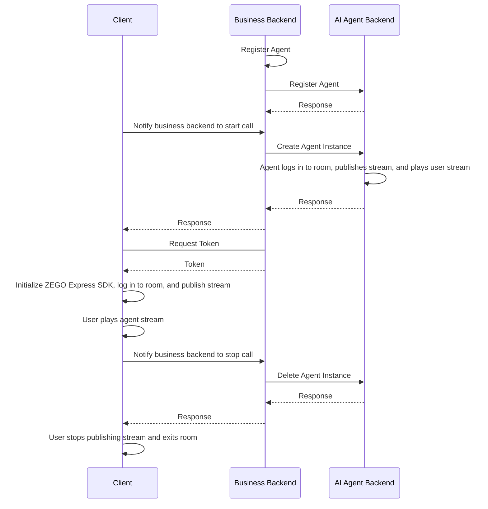
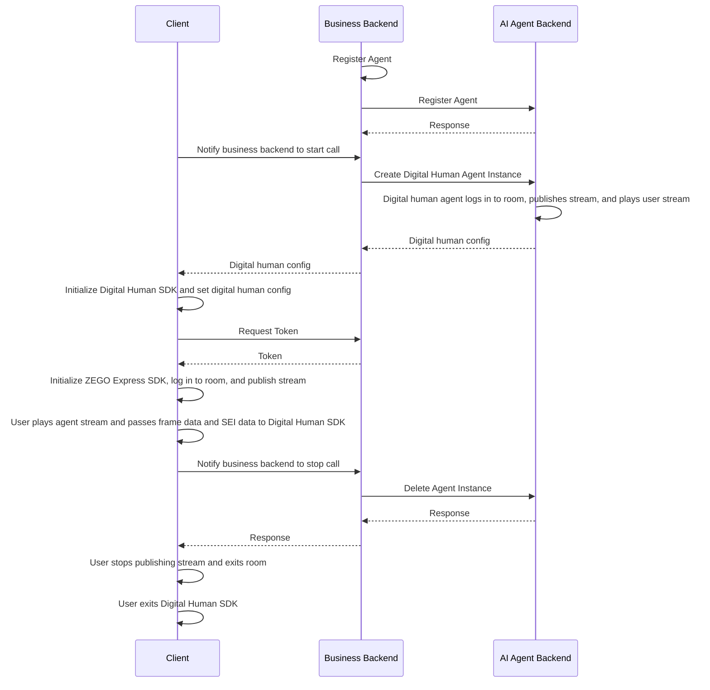
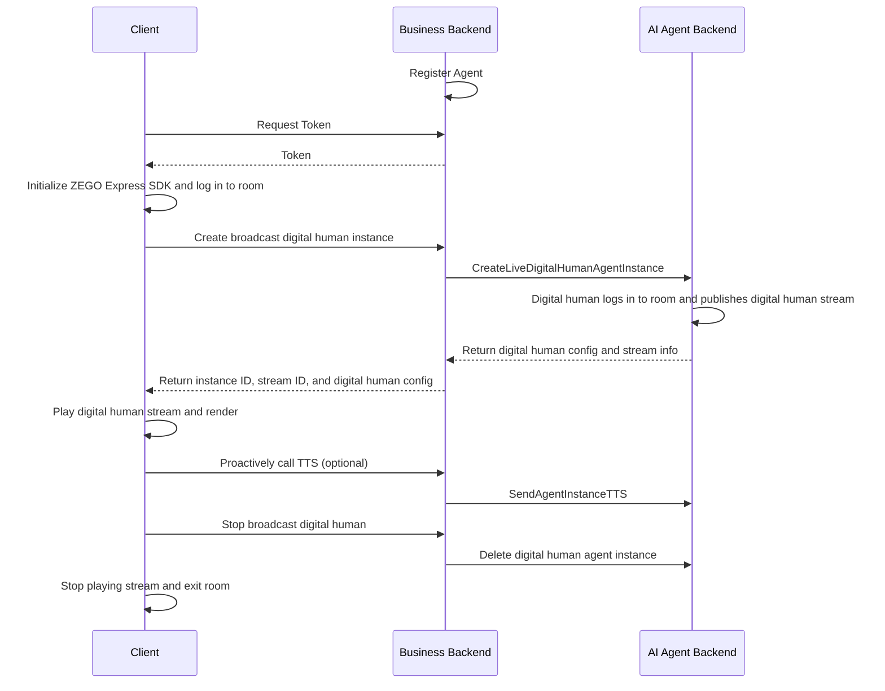

:::if{props.type=undefined}  
# Quick Start Voice Call
  
This document explains how to quickly call AI Agent related backend APIs to achieve voice interaction with AI Agent.  
:::  
  
:::if{props.type="digital-human"}  
# Quick Start Digital Human Video Call
This document explains how to quickly call AI Agent related backend APIs to achieve video interaction with AI Agent.
  
  
## Digital Human Introduction
  
With just a photo or image of a real person or anime character from the waist up, you can obtain a 1080P digital human with accurate lip-sync and realistic appearance. When used with the AI Agent product, you can quickly achieve video interaction chat with AI digital humans with an overall latency of about 1.5s, suitable for scenarios such as digital human 1V1 interactive video, digital human customer service, and digital human live streaming.
  
- More natural driving effects: supports subtle body movements, natural facial expressions without distortion, providing a more realistic and immersive interaction compared to voice calls;
- Multi-language accurate lip-sync: natural and accurate lip movements, especially optimized for Chinese and English;
- Ultra-low interaction latency: digital human driving latency < 200ms, combined with AI Agent interaction latency < 1.5s;
- Higher clarity: true 1080P effect, 20%+ improvement in clarity compared to traditional image-based digital humans.
  
Go to the [download page](./introduction/download.mdx) to download and experience.
  
<Video src="https://doc-media.zego.im/docuo/9f0143abe9.mp4" />
  
:::  
  
:::if{props.type="live-digital-human"}  
# Quick Start Digital Human Live Broadcast
  
This document explains how to call AI Agent related backend APIs to implement digital human live broadcast.<br/>
  
Unlike digital human video calls, digital human broadcasting is a one-way viewing scenario — users do not interact with the digital human, but only watch the broadcast content. The client only needs to log in to the [RTC room](/glossary/term-explanation#rtc-room-) and [play stream](/glossary/term-explanation#pull-stream) of the digital human, without capturing or [publishing stream](/glossary/term-explanation#publish-stream) of the user's audio and video. After creating a broadcast instance, the server can proactively make the digital human broadcast specified text via the TTS API.<br/>
  
Suitable for scenarios such as digital human live streaming, news broadcasting, event hosting, and scripted broadcast.
  
### Differences from Digital Human Video Calls
  
| Item | Digital Human Video Call | Digital Human Live Broadcast |  
| --- | --- | --- |  
| Interaction Mode | Two-way, the digital human responds after the user speaks | One-way, users only watch the digital human broadcast content |  
| Use Cases | AI interaction, AI customer service, digital human tutor | Digital human live streaming, news broadcasting |  
| Client Requires User Audio Capture | Yes | No |  
| Digital Human Driving Mechanism | After receiving user audio, the LLM generates a response and drives the digital human via TTS | Broadcast content is fully controlled by the server; the digital human is driven via TTS |  
| Instance Creation API | [CreateDigitalHumanAgentInstance](/aiagent-server/api-reference/agent-instance-management/create-digital-human-agent-instance) | [CreateLiveDigitalHumanAgentInstance](/aiagent-server/api-reference/agent-instance-management/create-live-digital-human-agent-instance) |
| Requires user_id and user_stream_id | Yes | No |  
:::  
  
## Prerequisites
  
- You have created a project in the [ZEGOCLOUD Console](https://console.zegocloud.com/) {/* 英文控制台链接：https://console.zegocloud.com/ */} and obtained a valid AppID and ServerSecret (for server API signing and RTC Token04 generation). For details, see [Console - Project Info](/console/project-info).
- You have contacted ZEGOCLOUD Technical Support to enable the AI Agent related services and obtained LLM and TTS related configuration information. For details, see [Console - AI Agent](/console/service-configuration/ai-agent).
- You have obtained a valid `digital_human_id` (for testing, you can use the public ID: 63c3aa64-1d80-4b04-a0be-1c65614eb7eb).
:::if{props.type="digital-human"}  
- You have contacted ZEGOCLOUD Technical Support to create a digital human.
:::  
<Note title="Note">  
During the test period (within 2 weeks after the AI Agent service is enabled), you can set the LLM and TTS authentication parameters to "zego_test" to use the related services. For details, see [Register Agent > BODY Parameter Description](/aiagent-server/api-reference/agent-configuration-management/register-agent).
  
You can also purchase LLM and TTS services supported by ZEGOCLOUD to obtain authentication information. Alternatively, you can contact ZEGOCLOUD sales to purchase TTS services directly.
</Note>  
  
## Example Code
The following is the example code for the business backend that integrates the real-time interactive AI Agent API. You can refer to the example code to implement your own business logic.
  
<CardGroup cols={2}>  
<Card title="Business Backend Example Code"  href="https://github.com/ZEGOCLOUD/ai_agent_quick_start_server" target="_blank">  
Includes the basic capabilities of obtaining ZEGO Token, registering AI Agent, creating AI Agent instances, and deleting AI Agent instances.
</Card>  
</CardGroup>  
  
The following is the client sample code. You can refer to the example code to implement your own business logic.
<CardGroup cols={2}>  
<Card title="Android Client Sample Code" href="https://github.com/ZEGOCLOUD/ai_agent_quick_start/tree/master/android" target="_blank">  
Includes the basic capabilities of logging in, publishing stream, playing stream, and exiting rooms.
</Card>  
<Card title="iOS Client Sample Code" href="https://github.com/ZEGOCLOUD/ai_agent_quick_start/tree/master/ios" target="_blank">  
Includes the basic capabilities of logging in, publishing stream, playing stream, and exiting rooms.
</Card>  
<Card title="Web Client Sample Code" href="https://github.com/ZEGOCLOUD/ai_agent_quick_start/tree/master/web" target="_blank">  
Includes the basic capabilities of logging in, publishing stream, playing stream, and exiting rooms.
</Card>  
<Card title="Flutter Client Sample Code" href="https://github.com/ZEGOCLOUD/ai_agent_quick_start/tree/master/flutter" target="_blank">  
Includes the basic capabilities of logging in, publishing stream, playing stream, and exiting rooms.
</Card>  
</CardGroup>  
  
:::if{props.type=undefined}  
The following video demonstrates how to run the service backend and client (Web) example code and interact with the AI Agent via voice.
<Video src="https://doc-media.zego.im/docuo/557a014d7c.mp4" />
:::  
:::if{props.type="digital-human"}  
The following video demonstrates how to run the service backend and client (Web) example code and interact with the digital human agent.
<Video src="https://doc-media.zego.im/docuo/4b68fbedda.mp4" />
:::  
  
  
## Overall Business Process
  
1. Service backend: run the business backend example code and deploy the business backend.
    - Integrate the real-time interactive AI Agent API to manage AI Agents.
:::if{props.type=undefined}  
2. Client: refer to the [Android Quick Start](/aiagent-android/quick-start), [iOS Quick Start](/aiagent-ios/quick-start), or [Web Quick Start](/aiagent-web/quick-start) document to run the client example code.
    - Create and manage AI Agents through the business backend.
    - Integrate ZEGO Express SDK for real-time communication.
  
After completing the above two steps, you can achieve real-time interaction between the AI Agent and real users by joining the room.
  

:::  
:::if{props.type="digital-human"}  
2. Client: refer to the [Android Quick Start](/aiagent-android/quick-start-with-digital-human), [iOS Quick Start](/aiagent-ios/quick-start-with-digital-human), or [Web Quick Start](/aiagent-web/quick-start-with-digital-human) document to run the client example code.
    - Create and manage AI Agents through the business backend.
    - Integrate ZEGO Express SDK for real-time communication.
    - Integrate Digital Human SDK for digital human rendering.
  
After completing the above three steps, you can achieve real-time video interaction between the AI Agent and real users by joining the room.
  

:::  
:::if{props.type="live-digital-human"}  
2. Client: refer to the [Android Quick Start](/aiagent-android/quick-start-with-live-digital-human), [iOS Quick Start](/aiagent-ios/quick-start-with-live-digital-human), or [Web Quick Start](/aiagent-web/quick-start-with-live-digital-human) document to run the client example code.
    - Create and manage broadcast digital human instances through the business backend.
    - Integrate ZEGO Express SDK for joining rooms and playing streams.
    - Android/iOS: Integrate Digital Human SDK for digital human rendering.
    - Call the TTS API on demand to proactively broadcast via the digital human.
  
After completing the above two steps, you can watch the digital human broadcast.
  

:::  
  
  
  
## Core Implementation
  
  
<Steps titleSize="h3">  
<Step title="Register Agent">  
[Register Agent](./api-reference/agent-configuration-management/register-agent.mdx) is used to set the basic configuration of the AI Agent, including the agent name, LLM, TTS, ASR, and other related configurations. After registration, the agent can be used as a template to create multiple instances for real-time interaction with multiple real users.
  
Typically, the agent configuration is relatively fixed. Once the relevant parameters (persona) are set, they do not change frequently. **Therefore, it is recommended to register the agent at the appropriate time according to your business flow**. The agent will not be automatically destroyed or recycled after registration. Once an agent instance is created, you can interact with the agent via voice.
  
<Note title="Note">An agent can only be registered once (with the same ID). If you register it again, error code 410001008 will be returned.</Note>  
  
The following is an example of calling the Register Agent API:
  
```javascript Server(NodeJS)  
// Please replace the LLM and TTS authentication parameters (ApiKey, appid, token, etc.) in the following example with your actual authentication parameters.
async registerAgent(agentId: string, agentName: string) {  
    // Request URL: https://aigc-aiagent-api.zegotech.cn?Action=RegisterAgent  
    const action = 'RegisterAgent';  
    const body = {  
        AgentId: agentId,  
        Name: agentName,  
        LLM: {  
            Url: "https://ark.cn-beijing.volces.com/api/v3/chat/completions",  
            ApiKey: "zego_test",  
            Model: "doubao-1-5-pro-32k-250115",  
            SystemPrompt: "You are an AI Agent. Please answer the user's questions."  
        },  
        TTS: {  
            Vendor: "ByteDance",  
            Params: {  
                "app": {  
                    "appid": "zego_test",  
                    "token": "zego_test",  
                    "cluster": "volcano_tts"  
                },  
                "audio": {  
                    "voice_type": "zh_female_wanwanxiaohe_moon_bigtts"  
                }  
            }  
        }  
    };  
    // The sendRequest method encapsulates the request URL and common parameters. For details, see: /aiagent-server/api-reference/accessing-server-apis  
    return this.sendRequest<any>(action, body);  
}  
```  
  
<Warning title="Note">  
- Please ensure all LLM parameters are correctly filled in according to the LLM service provider's official documentation. Otherwise, you may not be able to see the agent's text responses or hear the agent's voice output.
- Please ensure all TTS parameters are correctly filled in according to the TTS service provider's official documentation. Otherwise, you may see the agent's text responses but not hear the agent's voice output.
- If the agent cannot output text or voice, please first check whether the LLM and TTS parameter configurations are completely correct, or refer to [Get AI Agent Service Status - Monitor Server Exception Events](./guides/get-ai-agent-status.mdx#monitor-server-exception-events) to identify the specific issue.
</Warning>  
  
</Step>  
:::if{props.type=undefined}  
<Step title="Create Agent Instance">  
You can use a registered agent as a template to [create multiple agent instances](/aiagent-server/api-reference/agent-instance-management/create-agent-instance) to join different rooms for real-time interaction with different users. After creating an agent instance, the instance will automatically log in to the room and publish stream, while also playing the real user's stream.
  
After successfully creating an agent instance, the real user can interact with the agent in real time by listening for stream change events and playing the stream on the client.
  
<Note title="Note">After the client successfully joins the room, you should immediately call this API so that the agent instance can join the room and start publishing and playing streams.</Note>  
<Warning title="Note">By default, a maximum of 10 agent instances can exist simultaneously under one account. Creating agent instances will fail if this limit is exceeded. To adjust the limit, please contact ZEGOCLOUD sales.</Warning>  
  
The following is an example of calling the Create Agent Instance API:
  
```javascript Server(NodeJS)  
async createAgentInstance(agentId: string, userId: string, rtcInfo: RtcInfo, messages?: any[]) {  
    // Request URL: https://aigc-aiagent-api.zegotech.cn?Action=CreateAgentInstance  
    // const rtcInfo = {  
    //   RoomId: room_id,  
    //   AgentStreamId: agent_stream_id,  
    //   AgentUserId: agent_user_id,  
    //   UserStreamId: user_stream_id,  
    // };  
    const action = 'CreateAgentInstance';  
    const body = {  
        AgentId: agentId,  
        UserId: userId, // Real user ID interacting with this AI Agent instance  
        RTC: rtcInfo,  
        MessageHistory: {  
            SyncMode: 1, // Change to 0 to use history messages from ZIM  
            Messages: messages && messages.length > 0 ? messages : [],  
            WindowSize: 10  
        }  
    };  
    // The sendRequest method encapsulates the request URL and common parameters. For details, see: /aiagent-server/api-reference/accessing-server-apis  
    const result = await this.sendRequest<any>(action, body);  
    console.log("create agent instance result", result);  
    // Save the returned AgentInstanceId on the client for subsequent deletion of the agent instance.  
    return result.AgentInstanceId;  
}  
```  
  
After completing this step, you can create agent instances. Once the client is integrated, you can interact with the agent instance via voice.
</Step>  
:::  
:::if{props.type="digital-human"}  
<Step title="Create Digital Human Agent Instance">  
You can use a registered agent as a template to [create multiple digital human agent instances](./api-reference/agent-instance-management/create-digital-human-agent-instance.mdx) to join different rooms for real-time interaction with different users. After creating a digital human agent instance, the instance will automatically log in to the room and publish stream, while also playing the real user's stream.
  
After successfully creating a digital human agent instance, the digital human config needs to be returned to the client. The client initializes the Digital Human SDK based on the digital human config, and can then interact with the digital human in real time.
  
<Note title="Note">After the client successfully joins the room, you should immediately call this API so that the agent instance can join the room and start publishing and playing streams.</Note>  
<Warning title="Note">By default, a maximum of 10 digital human agent instances can exist simultaneously under one account. Creating digital human agent instances will fail if this limit is exceeded. To adjust the limit, please contact ZEGOCLOUD sales.</Warning>  
  
The following is an example of calling the Create Digital Human Agent Instance API:
  
```javascript  Server(NodeJS)  
async createDigitalHumanAgentInstance(agentId: string, userId: string, rtcInfo: RtcInfo, digitalHuman: DigitalHumanInfo, messages?: any[]) {  
    // Request URL: https://aigc-aiagent-api.zegotech.cn?Action=CreateDigitalHumanAgentInstance  
    // const rtcInfo = {  
    //   RoomId: room_id,  
    //   AgentStreamId: agent_stream_id,  
    //   AgentUserId: agent_user_id,  
    //   UserStreamId: user_stream_id,  
    // };  
    const action = 'CreateDigitalHumanAgentInstance';  
    const body = {  
        AgentId: agentId,  
        UserId: userId, // Real user ID interacting with this AI Agent instance  
        RTC: rtcInfo,  
        DigitalHuman: digitalHuman, // For testing, you can use the public ID: 63c3aa64-1d80-4b04-a0be-1c65614eb7eb  
        MessageHistory: {  
            SyncMode: 1, // Change to 0 to use history messages from ZIM  
            Messages: messages && messages.length > 0 ? messages : [],  
            WindowSize: 10  
        }  
    };  
    // The sendRequest method encapsulates the request URL and common parameters. For details, see: /aiagent-server/api-reference/accessing-server-apis  
    const result = await this.sendRequest<any>(action, body);  
    console.log("create agent instance result", result);  
    // The returned DigitalHumanConfig is the digital human config. The client initializes the Digital Human SDK based on the config, and can then interact with the digital human in real time.  
    return result.AgentInstanceId, result.DigitalHumanConfig;  
}  
```  
After completing this step, you can create digital human agent instances. Once the client is integrated, you can interact with the digital human agent instance via video.
</Step>  
:::  
:::if{props.type="live-digital-human"}  
<Step title="Obtain RTC Token">  
  
The client needs a Token to log in to the RTC room. The Token04 can be generated by the business backend based on the AppID and ServerSecret.
  
```http  
GET /api/zego-token?user_id=<user_id>  
```  
  
Response example:
  
```json  
{  
  "code": 0,  
  "token": "***"  
}  
```  
  
</Step>  
<Step title="Create Broadcast Digital Human Instance">  
  
You can use a registered agent as a template to create a broadcast digital human instance. Unlike digital human video calls, broadcast digital human only needs to join the RTC room and publish the digital human stream, without receiving the real user's stream. Therefore, `UserId` and `UserStreamId` are not required when calling the creation API.
  
The client calls the business backend's `POST /api/start-live-digital-human`. In RTC mode, the request body example is as follows:
  
```json  
{  
    "digital_human_id": "digital_human_id",  
    "config_id": "mobile",  
    "room_id": "room_id"  
}  
```  
After receiving the request, the business backend calls `CreateLiveDigitalHumanAgentInstance` to create the instance, and returns the `AgentInstanceId`, `AgentStreamId`, `AgentUserId`, and `DigitalHumanConfig` to the client after conversion. The client saves the `AgentInstanceId` for subsequent calls to [SendAgentInstanceTTS](/aiagent-server/api-reference/agent-instance-control/send-agent-instance-tts) and deleting the instance.
  
The following is an example of calling the Create Broadcast Digital Human Instance API:
  
<Note title="Note">RTC and CDN parameters are mutually exclusive. If both are set, CDN takes precedence.</Note>  
  
<CodeGroup>  
```javascript Server(NodeJS) — RTC Mode  
async createLiveDigitalHumanAgentInstance(agentId: string, rtcInfo: RtcInfo, digitalHuman: DigitalHumanInfo) {  
    // Request URL: https://aigc-aiagent-api.zegotech.cn?Action=CreateLiveDigitalHumanAgentInstance  
    const action = 'CreateLiveDigitalHumanAgentInstance';  
    const body = {  
        AgentId: agentId,  
        RTC: rtcInfo, // RTC mode  
        DigitalHuman: digitalHuman, // For testing, you can use the public ID: 63c3aa64-1d80-4b04-a0be-1c65614eb7eb  
    };  
    const result = await this.sendRequest<any>(action, body);  
    return {  
        code: 0,  
        message: 'success',  
        agent_instance_id: result.AgentInstanceId,  
        agent_stream_id: result.AgentStreamId,  
        agent_user_id: result.AgentUserId,  
        digital_human_config: result.DigitalHumanConfig  
    };  
}  
```  
  
```javascript Server(NodeJS) — CDN Mode  
async createLiveDigitalHumanAgentInstance(agentId: string, cdnInfo: CdnInfo, digitalHuman: DigitalHumanInfo) {  
    // Request URL: https://aigc-aiagent-api.zegotech.cn?Action=CreateLiveDigitalHumanAgentInstance  
    const action = 'CreateLiveDigitalHumanAgentInstance';  
    const body = {  
        AgentId: agentId,  
        CDN: cdnInfo, // CDN mode  
        DigitalHuman: digitalHuman, // For testing, you can use the public ID: 63c3aa64-1d80-4b04-a0be-1c65614eb7eb  
    };  
    const result = await this.sendRequest<any>(action, body);  
    return {  
        code: 0,  
        message: 'success',  
        agent_instance_id: result.AgentInstanceId,  
        agent_stream_id: result.AgentStreamId,  
        agent_user_id: result.AgentUserId,  
        digital_human_config: result.DigitalHumanConfig  
    };  
}  
```  
</CodeGroup>  
  
<Warning title="Note">By default, a maximum of 10 digital human agent instances can exist simultaneously under one account. Creating instances will fail if this limit is exceeded. To adjust the limit, please contact ZEGOCLOUD sales.</Warning>  
  
</Step>  
:::  
:::if{props.type="live-digital-human"}  
<Step title="Proactively Invoke TTS">  
  
After creating a broadcast digital human instance, the business backend can call `SendAgentInstanceTTS` to proactively send broadcast text.
  
```javascript Server(NodeJS)  
async sendAgentInstanceTTS(agentInstanceId: string, text: string) {  
    const action = 'SendAgentInstanceTTS';  
    const body = {  
        AgentInstanceId: agentInstanceId,  
        Text: text  
    };  
    return this.sendRequest<any>(action, body);  
}  
```  
  
If the business backend exposes a quick-start server API, you can use:
  
`POST /api/send-agent-instance-tts`
  
```http  
Content-Type: application/json  
```  
  
Request example:
  
```json  
{  
  "agent_instance_id": "1912124734317838336",  
  "text": "Hello developer, welcome to ZEGO RTC. Let's build the real-time interactive world together."  
}  
```  
  
<Note title="Note">  
- The maximum length of `Text` is 300 characters.
- Optional parameters: `AddHistory`, `Priority`, `SamePriorityOption`. For details, see [Proactively Invoke LLM or TTS](/aiagent-server/guides/proactive-invocation-of-llm-and-tts) and [SendAgentInstanceTTS](/aiagent-server/api-reference/agent-instance-control/send-agent-instance-tts).
- By default, the instance is automatically destroyed after 900 seconds of idle time without calling `SendAgentInstanceTTS`. For long live broadcasts, you can adjust this via `AdvancedConfig.MaxIdleTime` (30~86400 seconds).
</Note>  
  
</Step>  
  
<Step title="Stop Broadcast and Delete Instance">  
  
After the broadcast ends, the business backend calls `POST /api/stop` to stop and delete the broadcast instance by passing in the `agent_instance_id`. After deletion, the digital human will automatically exit the room and stop publishing stream.
  
```json  
{  
  "agent_instance_id": "1912124734317838336"  
}  
```  
  
<Note title="Note">For the general Delete Agent Instance API, please refer to the [Delete Agent Instance](#delete-agent-instance) step below.</Note>  
  
</Step>  
  
<Step title="Display User and Agent Status">  
  
To display user and agent status, please refer to [Display User and Agent Status](/aiagent-server/guides/display-user-and-agent-status).
  
Status descriptions for broadcast digital human:
  
- **Idle**: The digital human instance has been created successfully and is waiting for the server to input driving content.
- **Speaking**: The digital human has received driving content from the server and is broadcasting in real time. It automatically switches back to "Idle" after the broadcast ends.
  
  
</Step>  
  
  
:::  
<Step title="Integrate Client SDK">  
  
Please refer to the following documents to complete client integration development:
  
:::if{props.type=undefined}  
<CardGroup cols={2}>  
<Card title="Android" href="/aiagent-android/quick-start" target="_blank">  
Quick Start  
</Card>  
<Card title="iOS"  href="/aiagent-ios/quick-start" target="_blank">  
Quick Start  
</Card>  
<Card title="Web"  href="/aiagent-web/quick-start" target="_blank">  
Quick Start  
</Card>  
<Card title="Flutter"  href="/aiagent-flutter/quick-start" target="_blank">  
Quick Start  
</Card>  
</CardGroup>  
:::  
:::if{props.type="digital-human"}  
<CardGroup cols={3}>  
<Card title="Android" href="/aiagent-android/quick-start-with-digital-human" target="_blank">  
Quick Start  
</Card>  
<Card title="iOS"  href="/aiagent-ios/quick-start-with-digital-human" target="_blank">  
Quick Start  
</Card>  
<Card title="Web"  href="/aiagent-web/quick-start-with-digital-human" target="_blank">  
Quick Start  
</Card>  
</CardGroup>  
:::  
:::if{props.type="live-digital-human"}  
<CardGroup cols={3}>  
<Card title="Android" href="/aiagent-android/quick-start-with-live-digital-human" target="_blank">  
Quick Start  
</Card>  
<Card title="iOS" href="/aiagent-ios/quick-start-with-live-digital-human" target="_blank">  
Quick Start  
</Card>  
<Card title="Web" href="/aiagent-web/quick-start-with-live-digital-human" target="_blank">  
Quick Start  
</Card>  
</CardGroup>  
:::  
  
:::if{props.type="live-digital-human"}  
Congratulations 🎉! After completing this step, you have successfully integrated the client SDK and can watch the digital human broadcast. You can also proactively trigger digital human broadcast via the TTS API.
:::  
:::if{props.type="undefined|digital-human"}  
Congratulations 🎉! After completing this step, you have successfully integrated the client SDK and can interact with the agent instance in real time via voice. You can ask the agent any question by voice, and the agent will respond!
:::  
</Step>  
<Step title="Delete Agent Instance">  
:::if{props.type="live-digital-human"}  
After [deleting the agent instance](./api-reference/agent-instance-management/delete-agent-instance.mdx), the broadcast digital human will automatically exit the room and stop publishing stream. After the client stops playing stream and exits the room, a complete broadcast session ends.
:::  
:::if{props.type="undefined|digital-human"}  
After [deleting the agent instance](./api-reference/agent-instance-management/delete-agent-instance.mdx), the agent instance will automatically exit the room and stop publishing stream. After the real user stops publishing stream and exits the room on the client, a complete interaction session ends.
:::  
  
The following is an example of calling the Delete Agent Instance API:
  
```javascript  Server(NodeJS)  
async deleteAgentInstance(agentInstanceId: string) {  
    // Request URL: https://aigc-aiagent-api.zegotech.cn?Action=DeleteAgentInstance  
    const action = 'DeleteAgentInstance';  
    const body = {  
        AgentInstanceId: agentInstanceId  
    };  
    // The sendRequest method encapsulates the request URL and common parameters. For details, see: /aiagent-server/api-reference/accessing-server-apis  
    return this.sendRequest(action, body);  
}  
```  
</Step>  
</Steps>  
  
:::if{props.type="live-digital-human"}  
The above is the complete core flow for implementing digital human live broadcast.
:::  
:::if{props.type="undefined|digital-human"}  
The above is the complete core flow for achieving real-time voice interaction with the AI Agent.
:::  
  
## Callback Monitoring
  
<Warning title="Note">Since LLM and TTS parameters are numerous and complex, it is easy to encounter various abnormal issues during integration testing, such as the agent not responding or not speaking, due to incorrect parameter configuration. We strongly recommend that you monitor callbacks during integration testing and quickly troubleshoot issues based on callback information.</Warning>  
  
<Card title="Receiving Callbacks" href="/aiagent-server/callbacks/receiving-callback" target="_blank">  
Click to view the callback monitoring guide. Monitor events where Event is Exception in the callbacks. You can quickly locate issues through Data.Code and Data.Message.
</Card>  
  
<Card title="Exception Error Codes" href="/aiagent-server/callbacks/exception-codes" target="_blank">  
Click to view the exception error code list.
</Card>  
  
:::if{props.type="live-digital-human"}  
  
### Broadcast Troubleshooting Checklist
  
<Warning title="Troubleshooting Guide">  
  
- **Frozen screen**: Check whether `digital_human_config` is valid, whether `agent_stream_id` is correct, whether custom rendering is enabled before `startPlayingStream` (Android/iOS), and whether video frames and SEI data are passed to the Digital Human SDK (Android/iOS).
- **TTS not broadcasting**: Check whether the Code returned by `SendAgentInstanceTTS` is 0, whether `MaxIdleTime` has expired, and whether `DisableTTS` is set.
- **Failed to create instance**: Check whether `digital_human_id` is valid, and whether `AppID` and `ServerSecret` are correct.
</Warning>  
:::  