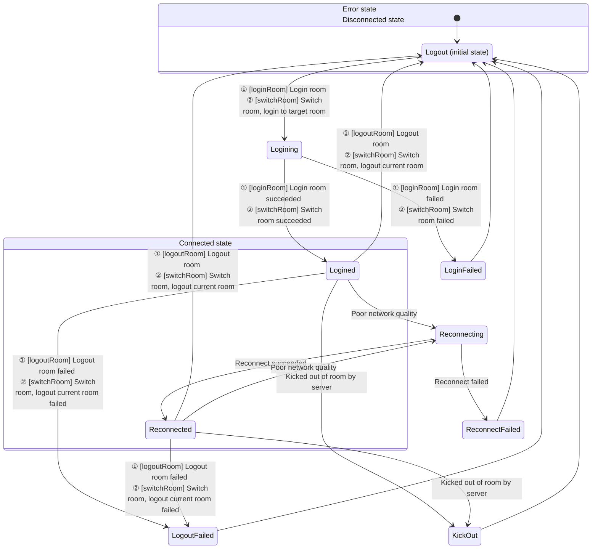

# Audio and Video Recording

- - -

## Overview

When conducting video calls, live streaming, or online teaching, users often need to record and save videos for subsequent on-demand viewing by other users. ZEGO provides multiple recording solutions to meet recording needs in different scenarios.

<table>

<tbody><tr>
<th>Recording Solution</th>
<th>Introduction</th>
<th>Applicable Scenarios</th>
</tr>
<tr>
<td><a href="#solution-1-client-local-recording" >Client Local Recording</a></td>
<td>Record your (local user's) audio and video through the client SDK and save it locally.</td>
<td>
<p>Need to record your (local user's) audio and video and save it to a local device (mobile phone, computer, or other terminal device). <b>Does not support recording audio and video of other users.</b></p>
<p>Calling method: Start recording by calling the client SDK interface.</p>
</td>
</tr>
<tr>
<td><a href="#solution-2-audio-raw-data-recording" >Audio Raw Data Recording</a></td>
<td>Save raw data locally by obtaining audio raw data to complete audio recording.</td>
<td>
- Only need to record audio.
- Only need to save locally.
- Need to record your or someone else's audio.
</td>
</tr>
<tr>
<td><a href="#solution-3-cloud-recording" >Cloud Recording</a></td>
<td>Record through ZEGO cloud services and save audio and video to your activated cloud storage.</td>
<td>
- You have already activated third-party cloud storage services, currently supporting Amazon S3, Alibaba Cloud OSS, Tencent Cloud COS, etc.
- Need to record your or someone else's audio and video.
- Need to distinguish each user in the recording Room and obtain separate audio and video files for each user in the Room.
- Need to mix and record multiple audio, video, or audio and video and whiteboard, mixing all users' audio streams, video streams, and whiteboard in the Room into one video file.
- Need to use preset mix layout templates.
<p>Calling method: Start recording by calling ZEGO server API interface.</p>
</td>
</tr>
<tr>
<td><a href="#solution-4-cdn-recording" >CDN Recording</a></td>
<td>Record live audio and video and save them to ZEGO CDN.</td>
<td>
- Need to record live audio and video and save them to ZEGO's CDN.
- Need to record your or someone else's audio and video. &nbsp; &nbsp;&nbsp;
<p>Calling method: After you enable CDN recording in the <a href="https://console.zegocloud.com" target="_blank">ZEGOCLOUD Console</a>, it is global recording by default, and no need to call the server API interface; if you need selective recording, please call the ZEGO server API interface to start recording.</p>
</td>
</tr>
<tr>
<td><a href="#solution-5-local-server-recording" >Local Server Recording</a></td>
<td>Record through a server deployed by the developer themselves.</td>
<td>
- You want to record through your own server to save costs.
- Need to record your or someone else's audio and video.
- Need to distinguish each user in the recording Room and obtain separate audio and video files for each user in the Room.
- Need to mix and record multiple audio, video, or audio and video and whiteboard, mixing all users' audio streams, video streams, and whiteboard in the Room into one video file.

<p>Calling method: Start recording by calling the server interface set up by the developer themselves.</p>
</td>
</tr>
</tbody></table>

## Solution 1: Client Local Recording

During a call or live streaming, record and store your (local user's) previewed audio and video data to a local device, saving it as an mp4 or other format file. **Does not support recording audio and video of other users.**

### Applicable Scenarios

- Pure local recording: Record local preview without publishing stream.
- Record while live streaming: Record while publishing stream, saving the entire live streaming process to a local file.
- Record short videos during live streaming: During live streaming, you can record a short video segment at any time and save it locally.
- Only record what you (local user) preview.

### Supported Formats

- Audio and video: FLV, MP4
- Audio only: AAC

### Example Source Code

Please refer to [Download Example Source Code](/real-time-video-android-java/client-sdk/download-demo) to get the source code.

For related source code, please check files in the "/ZegoExpressExample/Others/src/main/java/im/zego/others/recording" directory.


### Prerequisites

Before implementing the recording function, please ensure:

- You have created a project in the [ZEGOCLOUD Console](https://console.zegocloud.com) and applied for a valid AppID and AppSign. For details, please refer to [Console - Project Information](/console/project-info).
- You have integrated ZEGO Express SDK in the project and implemented basic audio/video publishing and playing functions. For details, please refer to [Quick Start - Integration](/real-time-video-android-java/quick-start/integrating-sdk) and [Quick Start - Implementation Process](/real-time-video-android-java/quick-start/implementing-video-call).


### Usage Steps

The recording function interface call flow is shown in the following figure:


{/*
<Frame width="512" height="auto" caption="">
  
</Frame>
*/}

#### Set Recording Callback

Developers need to call [setDataRecordEventHandler](https://www.zegocloud.com/article/api?doc=Express_Video_SDK_API~Java~class~im-zego-zegoexpress-zego-express-engine#set-data-record-event-handler) to set the recording function callback to receive recording information during the recording process.

Developers can use this callback [onCapturedDataRecordStateUpdate](@onCapturedDataRecordStateUpdate) to determine the file recording status or perform UI prompts, etc.

Developers can use this callback [onCapturedDataRecordProgressUpdate](@onCapturedDataRecordProgressUpdate) to determine file recording process progress or perform UI prompts on the user interface, etc.


<Warning title="Warning">


The set recording callback information will only be received after calling [startRecordingCapturedData](https://www.zegocloud.com/article/api?doc=Express_Video_SDK_API~Java~class~im-zego-zegoexpress-zego-express-engine#start-recording-captured-data) to start recording.
</Warning>

```java
// Set recording callback
engine.setDataRecordEventHandler(new IZegoDataRecordEventHandler(){

    public void onCapturedDataRecordStateUpdate (ZegoDataRecordState state, int errorCode, ZegoDataRecordConfig config, ZegoPublishChannel channel){
        // Developers can handle the logic of recording process status changes based on error codes or recording status here, such as UI prompts on the interface, etc.
        ...
    }

    public void onCapturedDataRecordProgressUpdate (ZegoDataRecordProgress progress, ZegoDataRecordConfig config, ZegoPublishChannel channel){
        // Developers can handle the logic of recording process progress changes based on recording progress here, such as UI prompts on the interface, etc.
        ...
    }

});
```

#### Start Recording

Developers need to call [startRecordingCapturedData](https://www.zegocloud.com/article/api?doc=Express_Video_SDK_API~Java~class~im-zego-zegoexpress-zego-express-engine#start-recording-captured-data) to start recording.

- [ZegoPublishChannel](@-ZegoPublishChannel) specifies the media channel for recording. If only publishing one stream or only doing local preview, use [MAIN](@ZegoPublishChannelMain).

- [ZegoDataRecordConfig](https://www.zegocloud.com/article/api?doc=Express_Video_SDK_API~Java~class~im-zego-zegoexpress-entity-zego-data-record-config) specifies the recording configuration, and you can specify the recording path and recording type [ZegoDataRecordType](@-ZegoDataRecordType).

If you want to record audio and video, specify it as "ZegoDataRecordType.DEFAULT" or "ZegoDataRecordType.AUDIO_AND_VIDEO". If you only want to record audio, select "ZegoDataRecordType.ONLY_AUDIO". If you only record pure video, select "ZegoDataRecordType.ONLY_VIDEO".

<Warning title="Warning">


- In the recording configuration specified in [ZegoDataRecordConfig ](https://www.zegocloud.com/article/api?doc=Express_Video_SDK_API~Java~class~im-zego-zegoexpress-entity-zego-data-record-config), the file path suffix must end with ".mp4", ".flv", or ".aac" to specify the recording file format.
- The recording type [ZegoDataRecordType](https://www.zegocloud.com/article/api?doc=Express_Video_SDK_API~Java~enum~im-zego-zegoexpress-constants-zego-data-record-type) is unrelated to the file suffix.
</Warning>

```java
// Login to Room, start publishing stream, start preview, and other interface calls
...

// Create recording configuration
ZegoDataRecordConfig config = new ZegoDataRecordConfig();
// For example, need to record in mp4 format
config.filePath = "path.mp4";
// For example, use default recording method
config.recordType = ZegoDataRecordType.DEFAULT;

// Start recording, use main channel recording
engine.startRecordingCapturedData(config, ZegoPublishChannel.MAIN);

```

#### Stop Recording

Developers need to call [stopRecordingCapturedData](https://www.zegocloud.com/article/api?doc=Express_Video_SDK_API~Java~class~im-zego-zegoexpress-zego-express-engine#stop-recording-captured-data) to end recording.

<Warning title="Warning">


During the recording process, if exiting the Room [logoutRoom](https://www.zegocloud.com/article/api?doc=Express_Video_SDK_API~Java~class~im-zego-zegoexpress-zego-express-engine#logout-room), the SDK will actively stop recording internally.
</Warning>


```java
engine.stopRecordingCapturedData(ZegoPublishChannel.MAIN);
```

#### Play Recording Files

For playing recording files, you can choose two methods.

* Call the system default player to play.

* Use the ZegoMediaPlayer component in ZegoExpressEngine to play. For details, please refer to [Media Player](/real-time-video-android-java/other/media-player).


### FAQ

1. **What formats of packaged files are supported for local audio and video recording?**

  Currently, audio and video support FLV and MP4, and pure audio supports AAC. Specify the format through the file path suffix. FLV format only supports H.264 encoding, and MP4 format supports H.264 and H.265 encoding. Failure to meet this will result in no picture or no audio.

2. **What are the requirements for storage paths?**

  The storage path can be any file path that the application has permission to read and write. If a directory path is passed, the callback will return a file write failure.

3. **How to get the size of the recording file during the recording process?**

  The recording progress callback [onCapturedDataRecordProgressUpdate](https://www.zegocloud.com/article/api?doc=Express_Video_SDK_API~Java~class~im-zego-zegoexpress-callback-i-zego-data-record-event-handler#on-captured-data-record-progress-update) can obtain the recording duration and recording file size.

4. **How does the SDK handle passing a file path that already exists?**

  It will not cause an error, but the original file content will be cleared before writing.

5. **What should I pay attention to when recording with custom capture?**

  When using custom capture, you also need to call the SDK's [startPreview](https://www.zegocloud.com/article/api?doc=Express_Video_SDK_API~Java~class~im-zego-zegoexpress-zego-express-engine#start-preview) method to start before recording.

6. **Why does the recorded video have green edges?**

  Users need to pay attention not to modify the video encoding resolution during the recording process, and enable traffic control (when enabled, the encoding resolution will be dynamically adjusted according to the network environment).

7. **Why does the recorded video stutter momentarily when stopping publishing stream during recording?**

  This is due to the SDK's internal processing method and currently cannot be resolved. Users need to try their best to avoid this operation.

8. **Does local media recording support recording sounds from "ZegoMediaPlayer/ZegoAudioPlayer/Mixing feature"?**

  It can record sounds from the above input sources, but only sounds mixed into the published stream will be recorded. If only played locally, they will not be recorded into the file.


## Solution 2: Audio Raw Data Recording

Save raw data locally by obtaining audio raw data to complete audio recording.

### Applicable Scenarios

- Only need to record audio.
- Only need to save locally.
- Need to record your or someone else's audio.

### Usage Steps

Please refer to [Get the Raw Audio Data](/real-time-video-android-java/audio/get-audio-raw-data).

## Solution 3: Cloud Recording

Cloud recording means recording audio and video by calling ZEGO server API and saving them to your specified CDN, supporting recording audio and video streams of any user in video calls or live streaming, and providing various disaster recovery and security mechanisms.

### Applicable Scenarios

Applicable to various scenarios that require recording functions, including but not limited to audio/video calls, live streaming, online classes, online meetings, etc.

### Usage Steps

Please refer to [Cloud Recording](/cloud-recording/quick-start/integration).

## Solution 4: CDN Recording

CDN recording means saving content being live streamed through CDN to the corresponding CDN. You need to publish audio and video to CDN for live streaming before you can use this method for recording.

### Applicable Scenarios

Developers need to publish audio and video to CDN for live streaming before they can use this method for recording. If developers are only conducting video calls or co-hosting and have not published audio and video to CDN, they cannot use this function.

After you enable CDN recording in the [ZEGOCLOUD Console](https://console.zegocloud.com), it is global recording by default, and no need to call the server API interface; if you need selective recording, please call the ZEGO server API interface to start recording.


### Usage Steps

Please refer to [Start CDN Recording](/real-time-video-server/api-reference/cdn/start-cdn-record).


## Solution 5: Local Server Recording

Developers integrate ZEGO's server recording plugin themselves and deploy it on their own servers, and then developers start recording by accessing their own server interface. For specific instructions, please refer to [Local Server Recording](/local-recording-linux-cpp/overview).

### Applicable Scenarios

This solution is suitable if you have your own server development team and are capable of deploying dedicated servers for audio and video recording and can handle large-scale concurrency issues.

### Usage Steps

Please refer to [Local Server Recording](/live-streaming-uniapp/quick-start/integrating-sdk).
