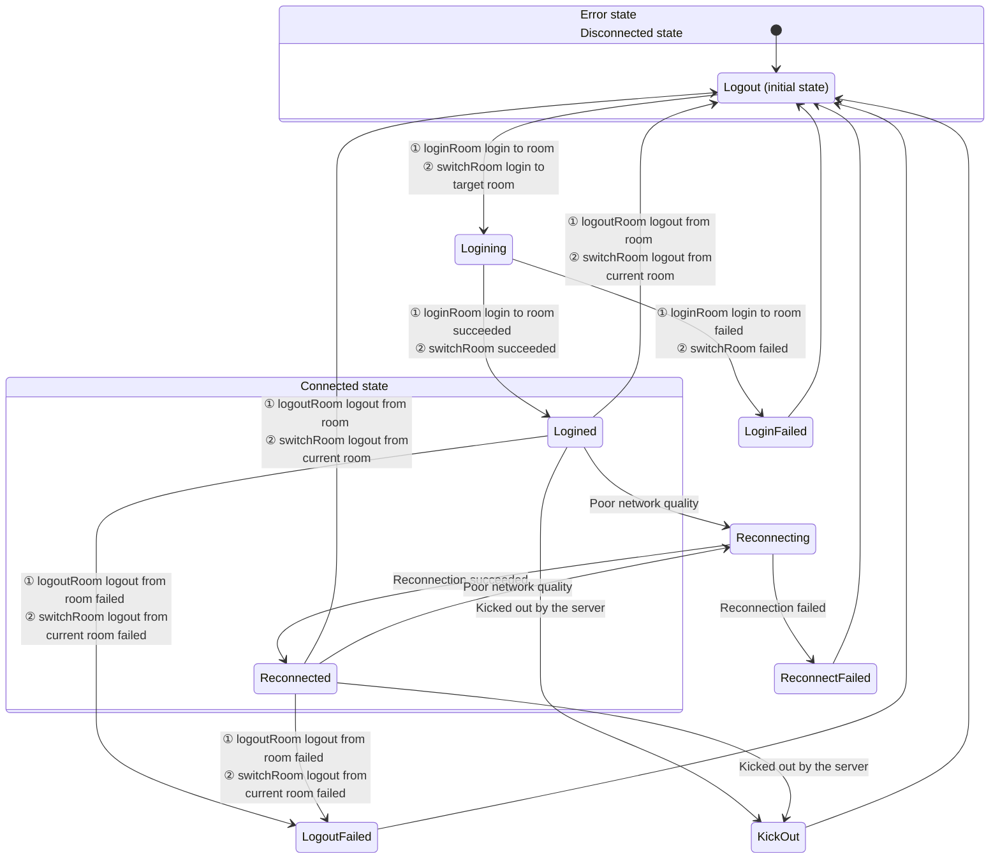

# Room Connection Status

- - -

When using the ZEGO Express SDK for audio/video calls or live streaming, users need to join a Room to receive callback notifications about stream additions/deletions and user entries/exits from other users in the same Room. Therefore, the user's connection status in the Room determines whether they can normally use audio/video services.

This document mainly introduces how to determine the user's connection status in the Room, and the transition process of each connection status.

## Monitoring Room Connection Status

Users can monitor their connection status changes in the Room in real time through the [onRoomStateChanged](@onRoomStateChanged) callback. When the user's Room connection status changes, the SDK triggers this callback and provides the reason for the Room connection status change (i.e., Room connection status) and related error codes in the callback.

For Room connection interruptions caused by poor network quality, the SDK will automatically retry internally. For details, please refer to the [Room Reconnection](/real-time-video-android-java/room/room-connection-status) section.

#### Room Status Description


{/*
<Frame width="512" height="auto" caption=""></Frame>
*/}

Room connection status can transform between each other due to various situations. Developers can combine the reason [ZegoRoomStateChangedReason](@-ZegoRoomStateChangedReason) (i.e., Room connection status) for the Room connection status change with errorCode to perform corresponding business logic processing.

<table>

  <tbody><tr>
    <th>Status and Reason Enum Value</th>
    <th>Meaning</th>
    <th>Common Events Triggering Entry to This Status</th>
  </tr>
  <tr>
    <td>Logining(LOGINING)</td>
    <td>Logging in to the Room. When calling [loginRoom] to log in to the Room or [switchRoom] to switch to the target Room, enter this status, indicating that a request is being made to connect to the server. Usually, this status is used for application interface display.</td>
    <td><ul><li>Call [loginRoom] to log in to the Room, and enter this status at this time, with errorCode being 0.</li><li>Call [switchRoom] to switch to the target Room, and the SDK internally requests to log in to the target Room, with errorCode being 0.</li></ul></td>
  </tr>
  <tr>
    <td>Logined(LOGINED)</td>
    <td>Successfully logged in to the Room. After successfully logging in to or switching to the Room, enter this status, indicating that logging in to the Room has been successful, and users can normally receive callback notifications for additions and deletions of other users and all stream information in the Room.</td>
    <td><ul><li>Call [loginRoom] to successfully log in to the Room, with errorCode being 0.</li><li>Call [switchRoom] to switch to the target Room, and the SDK internally successfully logs in to the target Room, with errorCode being 0.</li></ul></td>
  </tr>
  <tr>
    <td>LoginFailed(LOGIN_FAILED)</td>
    <td>Failed to log in to the Room. After failing to log in to or switch to the Room, enter this status, indicating that logging in to or switching to the Room has failed, for example, incorrect AppID, AppSign, or Token, etc.</td>
    <td><ul><li>When using the Token authentication function, the passed Token is incorrect, with errorCode being 1002033.</li><li>When logging in to the Room times out due to network issues, with errorCode being 1002053.</li><li>When switching to the target Room, the SDK internally fails to log in to the target Room, with errorCode referring to the above login error description.</li></ul></td>
  </tr>
  <tr>
    <td>Reconnecting(RECONNECTING)</td>
    <td>Room connection temporarily interrupted. If the interruption is caused by poor network quality, the SDK will retry internally.</td>
    <td>When the Room connection is temporarily interrupted due to poor network quality and reconnection is in progress, with errorCode being 1002051.</td>
  </tr>
  <tr>
    <td>Reconnected(RECONNECTED)</td>
    <td>Room reconnection successful. If the interruption is caused by poor network quality, the SDK will retry internally, and after successful reconnection, enter this status.</td>
    <td>When the Room connection is temporarily interrupted due to poor network quality and reconnection succeeds, with errorCode being 0.</td>
  </tr>
  <tr>
    <td>ReconnectFailed(RECONNECT_FAILED)</td>
    <td>Room reconnection failed. If the interruption is caused by poor network quality, the SDK will retry internally, and after failed reconnection, enter this status.</td>
    <td>When the Room connection is temporarily interrupted due to poor network quality and reconnection fails, with errorCode being 1002053.</td>
  </tr>
  <tr>
    <td>KickOut(KICK_OUT)</td>
    <td>Kicked out of the Room by the server. For example, when a user with the same username logs in to the Room elsewhere, causing the local end to be kicked out of the Room, enter this status.</td>
    <td><ul><li>User is kicked out of the Room (due to a user with the same userID logging in elsewhere), with errorCode being 1002050.</li><li>User is kicked out of the Room (developer actively calls the backend's <a target="_blank" href="/real-time-video-server/api-reference/room/kick-out-user">Kick User Out of Room</a> interface), with errorCode being 1002055.</li></ul></td>
  </tr>
  <tr>
    <td>Logout(LOGOUT)</td>
    <td>Successfully logged out of the Room. Before logging in to the Room, the default status is this. After calling [logoutRoom] to successfully log out of the Room or [switchRoom] internally successfully logs out of the current Room, enter this status.</td>
    <td><ul><li>When calling [logoutRoom] to successfully log out of the Room, with errorCode being 0.</li><li>When calling [switchRoom] to switch Rooms, the SDK internally successfully logs out of the current Room.</li></ul></td>
  </tr>
  <tr>
    <td>LogoutFailed(LOGOUT_FAILED)</td>
    <td>Failed to log out of the Room. After calling [logoutRoom] to fail to log out of the Room or [switchRoom] internally fails to log out of the current Room, enter this status.</td>
    <td><ul><li>In multi-room scenarios, when calling [logoutRoom] to log out of a Room, the Room ID does not exist, with errorCode being 1002002.</li><li>Engine not created or already destroyed and then calling [logoutRoom], with errorCode being 1000001.</li></ul>After failing to log out of the Room, please try to log out again according to the actual failure reason, otherwise other users can see this user before the heartbeat times out.</td>
  </tr>
</tbody></table>


Developers can refer to the following code to handle common business events:

```java
// The following code sets variables according to business requirements. Specific applications need to be arranged according to developer customization and are for reference only.
public static boolean isFirstLogin = true;
// Need to apply in ZEGOCLOUD Console
long appID = 1234567890L;
// Need to apply in ZEGOCLOUD Console
String appSign = "xxxxxx";
// The developer's current Application. If in activity, you can call getApplication() to obtain it, or customize it according to actual business requirements
Application application =  getApplication();
ZegoEngineProfile profile = new ZegoEngineProfile();
// Reference for common business events
public void init(){
    // Configure engine related parameters
    profile.appID = appID;
    profile.appSign = appSign;
    // Scenario settings
    profile.scenario = ZegoScenario.GENERAL;
    profile.application = application;
    ZegoExpressEngine engine = ZegoExpressEngine.createEngine(profile,null);
    engine.setEventHandler(new IZegoEventHandler() {
        @Override
        public void onRoomStateChanged(String roomID, ZegoRoomStateChangedReason reason, int errorCode, JSONObject extendedData) {
            if(reason == ZegoRoomStateChangedReason.LOGINING)
            {
                // Logging in
                // When calling loginRoom to log in to the Room or switchRoom to switch to the target Room, enter this status, indicating that a request is being made to connect to the server.
            }
            else if(reason == ZegoRoomStateChangedReason.LOGINED)
            {
                // Login successful
                // This is currently a callback triggered by the developer's active call to loginRoom for successful login, or call to switchRoom for successful Room switching. Here, business logic for successful first login to the Room can be handled, such as pulling chat room and live room basic information.
            }
            else if(reason == ZegoRoomStateChangedReason.LOGIN_FAILED)
            {
                // Login failed
                if (errorCode == 1002033) {
                    //When using the login Room authentication function, the passed token is incorrect or expired
                }
            }
            else if(reason == ZegoRoomStateChangedReason.RECONNECTING)
            {
                // Reconnecting
                // This is currently a callback triggered by the SDK's successful disconnection reconnection. Here, it is recommended to display some reconnection UI
            }
            else if(reason == ZegoRoomStateChangedReason.RECONNECTED)
            {
                // Reconnection successful
            }
            else if(reason == ZegoRoomStateChangedReason.RECONNECT_FAILED)
            {
                // Reconnection failed
                // When the Room connection is completely disconnected, the SDK will not retry to reconnect anymore. If developers need to log in to the Room again, they can actively call the loginRoom interface
                // At this time, you can exit the Room/live room/classroom in the business, or manually call the interface to log in again
            }
            else if(reason == ZegoRoomStateChangedReason.KICK_OUT)
            {
                // Kicked out of the Room
                if (errorCode == 1002050) {
                    // User is kicked out of the Room (due to a user with the same userID logging in elsewhere)
                }
                else if (errorCode == 1002055) {
                    // User is kicked out of the Room (developer actively calls the backend's kick user interface
                }
            }
            else if(reason == ZegoRoomStateChangedReason.LOGOUT)
            {
                // Logout successful
                // Developer actively calls logoutRoom to log out of the Room
                // Or calls switchRoom to switch Rooms, and the SDK internally successfully logs out of the current Room
                // Developers can handle the logic of active logout Room callbacks here
            }
            else if(reason == ZegoRoomStateChangedReason.LOGOUT_FAILED)
            {
               // Logout failed
               // Developer actively calls logoutRoom to log out of the Room failed
               // Or calls switchRoom to switch Rooms, and the SDK internally fails to log out of the current Room
               // Logout Room ID is incorrect or does not exist
            }
        }
    });
}
```


## Room Disconnection and Reconnection

After users log in to the Room, if they are disconnected from the Room due to network signal issues/network type switching issues, the SDK will automatically reconnect internally. There are three situations for users to reconnect after being disconnected from the Room:

- Reconnection succeeds before the ZEGO server determines that user A's heartbeat has timed out
- Reconnection succeeds after the ZEGO server determines that user A's heartbeat has timed out
- User A fails to reconnect

<Note title="Note">


- Heartbeat timeout time is 90s
- Retry timeout time is 20min
</Note>


The following diagram takes the situation where user A and user B have logged in to the same Room, and user A is disconnected from the Room and then reconnects:

#### Case 1: Reconnection succeeds before the ZEGO server determines that user A's heartbeat has timed out

<Frame width="512" height="auto" caption=""></Frame>

If user A is briefly disconnected but reconnects successfully within 90s, then user B will not receive the [onRoomUserUpdate](@onRoomUserUpdate) callback notification.

- T0 = 0s: User A's SDK receives the [loginRoom](https://www.zegocloud.com/article/api?doc=express-video-sdk_API~objectivec_ios~class~ZegoExpressEngine#login-room-user-config) request initiated by the client.
- T1 ≈ T0 + 120 ms: Usually 120 ms after calling [loginRoom](https://www.zegocloud.com/article/api?doc=express-video-sdk_API~objectivec_ios~class~ZegoExpressEngine#login-room-user-config), the client can join the Room. During the Room joining process, user A's client will receive 2 [onRoomStateChanged](@onRoomStateChanged) callbacks, notifying the client that it is connecting to the Room (Logining) and that the Room connection is successful (Logined), respectively.
- T2 ≈ T1 + 100 ms: Due to network transmission delay, user B receives the [onRoomUserUpdate](@onRoomUserUpdate) callback about 100 ms later to notify the client that user A has joined the Room.
- T3: At a certain time point, user A's uplink network deteriorates due to network disconnection or other reasons. The SDK will try to rejoin the Room, and the client will receive the [onRoomStateChanged](@onRoomStateChanged) callback to notify the client that user A is disconnecting and reconnecting.
- T5 = T3 + time (less than 90s): User A restores the network within the reconnection time and reconnects successfully. Will receive the [onRoomStateChanged](@onRoomStateChanged) callback to notify the client that user A has reconnected successfully.

#### Case 2: Reconnection succeeds after the ZEGO server determines that user A's heartbeat has timed out

<Frame width="512" height="auto" caption=""></Frame>


- The situations at T0, T1, T2, and T3 are the same as T0, T1, T2, and T3 in [Case 1: Reconnection succeeds before the ZEGO server determines that user A's heartbeat has timed out](/real-time-video-android-java/room/room-connection-status).

- T4' ≈ T3 + 90s: User B receives the [onRoomUserUpdate](@onRoomUserUpdate) callback at this time to notify that user A has been disconnected.

- T5' = T3 + time (greater than 90s, less than 20 min): User A restores the network within the reconnection time and reconnects successfully. Will receive the [onRoomStateChanged](@onRoomStateChanged) callback to notify the client that user A has reconnected successfully.

- T6' ≈ T5' + 100 ms: Due to network transmission delay, user B receives the [onRoomUserUpdate](@onRoomUserUpdate) callback about 100 ms later to notify the client that user A has joined the Room.

#### Case 3: User A fails to reconnect

<Frame width="512" height="auto" caption=""></Frame>

- The situations at T0, T1, T2, and T3 are the same as T0, T1, T2, and T3 in [Case 1: Reconnection succeeds before the ZEGO server determines that user A's heartbeat has timed out](/real-time-video-android-java/room/room-connection-status).

- T4'' ≈ T3 + 90s: User B receives the [onRoomUserUpdate](@onRoomUserUpdate) callback at this time to notify that user A has been disconnected.

- T5'' = T3 + 20 min: If user A cannot rejoin the Room within 20 consecutive minutes, the SDK will no longer continue to attempt to reconnect. User A will receive the [onRoomStateChanged](@onRoomStateChanged) callback to notify the client that reconnection has failed.


## Related Documentation

[Does Express SDK support disconnection and reconnection mechanism?](https://www.zegocloud.com/docs/faq/express-reconnect)
