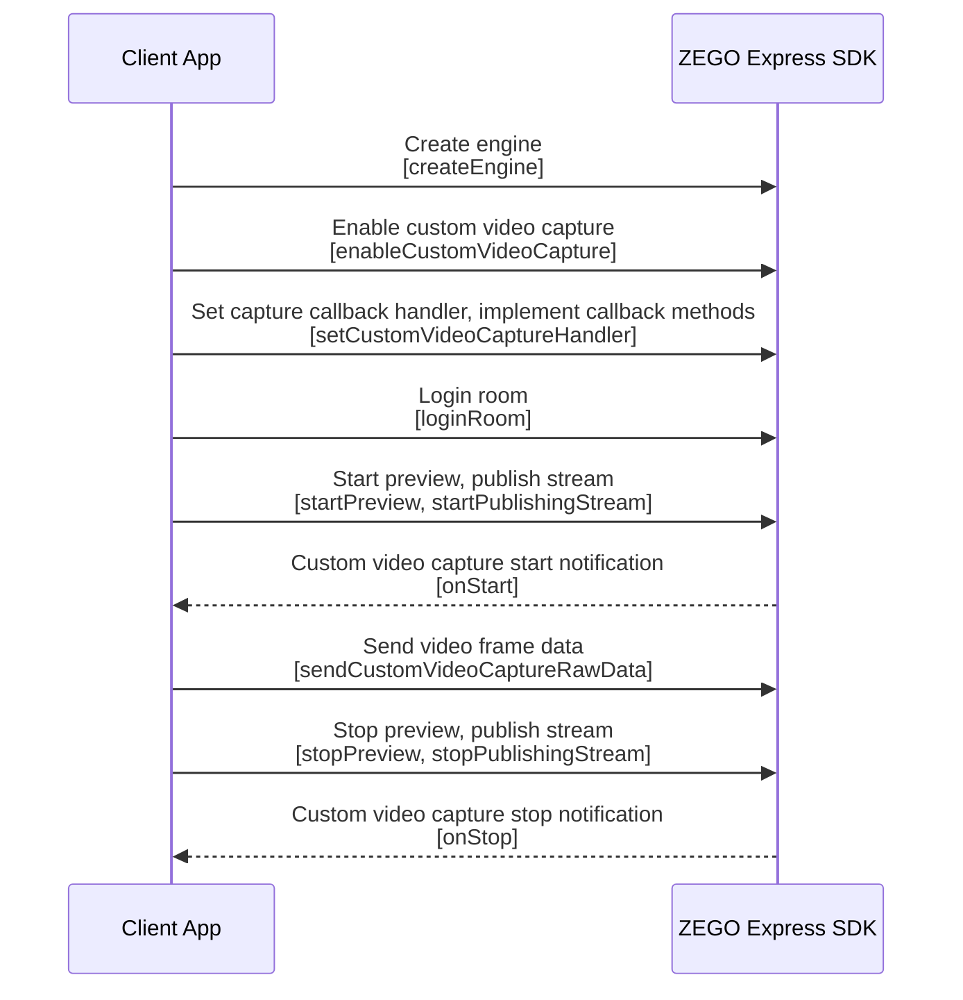

# Custom Video Capture

- - -

## Feature Overview

Custom video capture means that developers capture video themselves, provide video data to ZEGO Express SDK, and ZEGO Express SDK performs encoding and publishing. When users enable the custom video capture feature, by default, ZEGO Express SDK will render the local preview image inside the publishing end, and users do not need to render it themselves.

When the following situations occur in developers' business, it is recommended to use the SDK's custom video capture feature:

- The developer's App uses a third-party beauty vendor's beauty SDK, which can directly interface with ZEGO Express SDK's custom video capture feature. That is, the third-party beauty vendor's beauty SDK is responsible for video data capture and preprocessing, and ZEGO Express SDK is responsible for video data encoding and publishing audio and video streams to ZEGO audio and video cloud.
- During live streaming, the developer needs to use additional functions completed by the camera, which conflicts with ZEGO Express SDK's default video capture logic, causing the camera to be unable to be used normally. For example, in the middle of live streaming, you need to record short videos.
- Live streaming non-camera captured data. For example, local video file playback, screen sharing, game live streaming, etc.

## Example Source Code Download

Please refer to [Download Example Source Code](/real-time-video-android-java/quick-start/run-example-code) to get the source code.

For related source code, please check the files in the "/ZegoExpressExample/AdvancedVideoProcessing/src/main/java/im/zego/advancedvideoprocessing/CustomerVideoCapture" directory.

## Prerequisites

Before performing custom video capture, please ensure:

- You have created a project in the [ZEGOCLOUD Console](https://console.zegocloud.com) and applied for a valid AppID and AppSign. For details, please refer to [Console - Project Information](/console/project-info).
- You have integrated ZEGO Express SDK in your project and implemented basic audio and video streaming functionality. For details, please refer to [Quick Start - Integration](/real-time-video-android-java/quick-start/integrating-sdk) and [Quick Start - Implementation](/real-time-video-android-java/quick-start/implementing-video-call).


## Usage Steps

The API interface call sequence diagram is as follows:


{/*
<Frame width="512" height="auto" caption=""></Frame>
*/}

1. Create ZegoExpressEngine engine.
2. Call the [enableCustomVideoCapture](@enableCustomVideoCapture) interface to enable the custom video capture feature.
3. Call the [setCustomVideoCaptureHandler](@setCustomVideoCaptureHandler) interface to set the custom video capture callback object; and implement the corresponding [onStart](@onStart-IZegoCustomVideoCaptureHandler) and [onStop](@onStop-IZegoCustomVideoCaptureHandler) callback methods to receive notifications of custom video capture start and end respectively.
4. After logging in to Room, starting preview and publishing stream, the [onStart](@onStart-IZegoCustomVideoCaptureHandler) custom video capture start callback notification will be triggered.
5. Start capturing video. Developers need to implement video capture related business logic themselves, such as turning on the camera, etc.
6. Call interfaces such as [sendCustomVideoCaptureRawData](@sendCustomVideoCaptureRawData) to send video frame data to the SDK.
7. Finally, after stopping preview and publishing stream, the [onStop](@onStop-IZegoCustomVideoCaptureHandler) custom video capture end callback notification will be triggered.
8. Stop capturing video.

<Warning title="Warning">


When enabling the custom video capture feature, you need to keep the [enableCamera](@enableCamera) interface at the default configuration "True", otherwise there will be no video data for publishing stream.
</Warning>

### 1 Enable custom video capture

1. After initializing the SDK, create a custom video capture object [ZegoCustomVideoCaptureConfig](@-ZegoCustomVideoCaptureConfig) and set the property [bufferType](@bufferType-ZegoCustomVideoCaptureConfig) to provide the video frame data type to the SDK.
2. Call the [enableCustomVideoCapture](@enableCustomVideoCapture) interface to enable the custom video capture feature.

<Note title="Note">


Due to the diversity of Android capture, the SDK supports multiple video frame data types [bufferType](@bufferType-ZegoCustomVideoCaptureConfig). Developers need to inform the SDK of the data type used. Currently Android SDK supports the following video frame data types:

- RAW_DATA: Raw data type.
- GL_TEXTURE_2D: OpenGL Texture 2D type.
- GL_TEXTURE_EXTERNAL_OES: GL_TEXTURE_EXTERNAL_OES type.
- ENCODED_DATA: Encoded type.

Setting to other enumeration values will not be able to provide video frame data to the SDK.
</Note>

```java
ZegoCustomVideoCaptureConfig videoCaptureConfig = new ZegoCustomVideoCaptureConfig();
// Select RAW_DATA type video frame data
videoCaptureConfig.bufferType = ZegoVideoBufferType.RAW_DATA;

engine.enableCustomVideoCapture(true, videoCaptureConfig, ZegoPublishChannel.MAIN);
```

### 2 Set custom video capture callback

Call [setCustomVideoCaptureHandler](@setCustomVideoCaptureHandler) to set the custom video capture notification callback and implement [onStart](@onStart-IZegoCustomVideoCaptureHandler) and [onStop](@onStop-IZegoCustomVideoCaptureHandler) custom capture callback methods.

<Note title="Note">
When custom capturing multiple streams, you need to specify the publish channel in the [onStart](@onStart-IZegoCustomVideoCaptureHandler) and [onStop](@onStop-IZegoCustomVideoCaptureHandler) callbacks, otherwise only the main channel notification will be called back by default.
</Note>

```java
// Set itself as the custom video capture callback object
sdk.setCustomVideoCaptureHandler(new IZegoCustomVideoCaptureHandler() {
    @Override
    public void onStart(ZegoPublishChannel channel) {
        // After receiving the callback, developers need to execute business logic related to starting video capture, such as turning on the camera, etc.
        ...
    }
    @Override
    public void onStop(ZegoPublishChannel channel) {
        // After receiving the callback, developers need to execute business logic related to stopping video capture, such as turning off the camera, etc.
        ...
    }
});
```

### 3 Send video frame data to SDK

After calling the start preview interface [startPreview](@startPreview) or start publishing stream interface [startPublishingStream](@startPublishingStream), the [onStart](@onStart-IZegoCustomVideoCaptureHandler) callback will be triggered; after developers start capture related business logic, call the send custom captured video frame data interface to send video frame data to the SDK. The custom captured video frame data interface corresponds one-to-one with the video frame data type [bufferType](@bufferType-ZegoCustomVideoCaptureConfig) provided to the SDK in [1 Enable custom video capture](#1-enable-custom-video-capture):

|Video Frame Type|bufferType|Send video frame data interface|
|-|-|-|
|Raw data type|RAW_DATA|[sendCustomVideoCaptureRawData ](@sendCustomVideoCaptureRawData)|
|GLTexture2D type|GL_TEXTURE_2D|[sendCustomVideoCaptureTextureData ](@sendCustomVideoCaptureTextureData) |
|GL_TEXTURE_EXTERNAL_OES type|GL_TEXTURE_EXTERNAL_OES|[sendCustomVideoCaptureTextureData](@sendCustomVideoCaptureTextureData)|
|Encoded type| ENCODED_DATA|[sendCustomVideoCaptureEncodedData ](@sendCustomVideoCaptureEncodedData) |

<Warning title="Warning">
When performing external capture, if you send video frame encoded data to the SDK through the [sendCustomVideoCaptureEncodedData](@sendCustomVideoCaptureEncodedData) interface, the SDK is only responsible for transmitting data and cannot preview. Developers need to preview themselves, and preprocessing effects such as watermarks will not take effect.
</Warning>

Taking calling the [sendCustomVideoCaptureRawData ](@sendCustomVideoCaptureRawData) interface to send video frame data to the SDK after receiving the camera video frame callback as an example:

```java
// Pass the captured data to ZEGO SDK
if (byteBuffer == null) {
    byteBuffer = ByteBuffer.allocateDirect(data.length);
}
byteBuffer.put(data);
byteBuffer.flip();

mSDKEngine.sendCustomVideoCaptureRawData(byteBuffer, data.length, param, now);
```

After stopping publishing stream/preview, when logging out of Room or destroying the engine, the [onStop](@onStop-IZegoCustomVideoCaptureHandler) callback will be triggered, and developers can stop capture related business logic, such as turning off the camera, etc.


### 4 (Optional) Set custom capture image transform matrix

<Warning title="Warning">


- This feature is only effective when the custom capture type [bufferType](@bufferType-ZegoCustomVideoCaptureConfig) set in [Enable custom video capture](#1-enable-custom-video-capture) is `GL_TEXTURE_2D`.
- This feature requires the use of [OpenGL](https://www.opengl.org//) related technologies. It is recommended that you master the relevant principles before using this feature.
</Warning>

After receiving the [onStart](@onStart-IZegoCustomVideoCaptureHandler) callback, you can call the [setCustomVideoCaptureTransformMatrix](@setCustomVideoCaptureTransformMatrix) interface as needed to set the custom capture image transform matrix for the specified channel, including rotation, flip, and scaling.

The matrix parameter can refer to the method [SurfaceTexture.getTransformMatrix](https://developer.android.google.cn/reference/kotlin/android/graphics/SurfaceTexture) to obtain.

### 5 (Optional) Set custom capture device state

1. After receiving the [onStart](@onStart-IZegoCustomVideoCaptureHandler) callback, you can call the [setCustomVideoCaptureDeviceState](@setCustomVideoCaptureDeviceState) interface as needed to set the custom capture device state for the specified publish channel.

2. The play stream end can get the publish stream end device state by listening to the [onRemoteCameraStateUpdate](@onRemoteCameraStateUpdate) callback.

<Warning title="Warning">


- When the publish stream end sets the device state to `ZegoRemoteDeviceState.DISABLE` or `ZegoRemoteDeviceState.MUTE` through the [setCustomVideoCaptureDeviceState](@setCustomVideoCaptureDeviceState) interface, it is invalid, that is, the play stream end cannot receive the [onRemoteCameraStateUpdate](@onRemoteCameraStateUpdate) callback.
- When the publish stream end turns off the camera through [enableCamera](@enableCamera), the play stream end will receive the `ZegoRemoteDeviceState.DISABLE` state through the [onRemoteCameraStateUpdate](@onRemoteCameraStateUpdate) callback, and there is no video data for publishing at this time.
- When the publish stream end stops sending video stream through the [mutePublishStreamVideo](@mutePublishStreamVideo) interface, the play stream end will receive the `ZegoRemoteDeviceState.MUTE` state through the [onRemoteCameraStateUpdate](@onRemoteCameraStateUpdate) callback.
</Warning>


## FAQ

1. **How to use "OpenGL Texture 2D type" method to pass capture data?**

    1. Set the [bufferType](https://www.zegocloud.com/article/api?doc=Express_Video_SDK_API~Java_android~class~im-zego-zegoexpress-entity-zego-custom-video-capture-config#buffer-type) of [ZegoCustomVideoCaptureConfig ](https://www.zegocloud.com/article/api?doc=Express_Video_SDK_API~Java_android~class~im-zego-zegoexpress-entity-zego-custom-video-capture-config) to `GL_TEXTURE_2D`.
    2. Call the [sendCustomVideoCaptureTextureData](https://www.zegocloud.com/article/api?doc=Express_Video_SDK_API~Java_android~class~im-zego-zegoexpress-zego-express-engine#send-custom-video-capture-texture-data) interface to send video frame data to the SDK.

2. **Using custom video capture, the local preview image is normal, but the image seen by the audience after publishing stream is deformed. How should I handle this?**

    This problem is caused by the inconsistency between the image proportion captured by custom video and the default resolution proportion of the SDK. For example, the video frame image proportion captured by custom video is 4:3, and the default publishing stream image resolution proportion of the SDK is 16:9.

    There are the following solutions:

    - Solution 1: Developers manually modify the video resolution proportion of custom video capture to 16:9.

    - Solution 2: Developers call the [setVideoConfig](@setVideoConfig) interface to customize the SDK's publishing stream resolution proportion to 4:3.

    - Solution 3: Developers call the [setCustomVideoCaptureFillMode](@setCustomVideoCaptureFillMode) interface to set the video capture image scaling fill mode to "ASPECT_FIT" (proportional scaling, there may be black borders) or "ASPECT_FILL" (proportional filling, some parts of the image may be cropped).

3. **After enabling custom video capture, the captured frame rate and the play stream playback frame rate are inconsistent?**

    It can be handled in the following ways:

    - When providing "RAW_DATA" type video frame data to the SDK, the frame rate set by the [setVideoConfig](https://www.zegocloud.com/article/api?doc=Express_Video_SDK_API~Java_android~class~im-zego-zegoexpress-zego-express-engine#set-video-config) interface and the frame rate of the video data provided by calling the custom capture [sendCustomVideoCaptureRawData](https://www.zegocloud.com/article/api?doc=Express_Video_SDK_API~Java_android~class~im-zego-zegoexpress-zego-express-engine#send-custom-video-capture-raw-data) interface need to be consistent.
    - When providing "TEXTURE" type video frame data to the SDK, the frame rate set by the [setVideoConfig](https://www.zegocloud.com/article/api?doc=Express_Video_SDK_API~Java_android~class~im-zego-zegoexpress-zego-express-engine#set-video-config) interface and the frame rate of the video data provided by calling the custom capture [sendCustomVideoCaptureTextureData](https://www.zegocloud.com/article/api?doc=Express_Video_SDK_API~Java_android~class~im-zego-zegoexpress-zego-express-engine#send-custom-video-capture-texture-data) interface need to be consistent.

4. **Does the SDK process the incoming data synchronously or asynchronously in the method of receiving video frame data?**

    After receiving video frame data, the SDK will first synchronously copy the data, and then asynchronously perform operations such as encoding, so the data can be released immediately after being passed to the SDK.


5. **How to implement video rotation during custom video capture?**

    You can refer to the following two ways to implement landscape and portrait switching:

    - Process video frame data yourself: In the callback of device direction change, perform rotation processing on the captured video frame data, and then pass the processed data to the SDK through the [sendCustomVideoCaptureTextureData](@sendCustomVideoCaptureTextureData) interface.
    - Process video frame data through SDK: In the callback of device direction change, before passing the captured video frame data to the SDK, set the "rotation" in [ZegoVideoEncodedFrameParam](@-ZegoVideoEncodedFrameParam) according to the actual orientation, call the [sendCustomVideoCaptureEncodedData](@sendCustomVideoCaptureEncodedData) interface to pass in the video frame data and set orientation parameters, and pass the data to the SDK.


## Related Documentation

- [How to handle video pixelation or green screen issues?](/faq/video-artifacts)
- [How to handle audio and video out of sync issues?](/faq/av-sync-issue)
