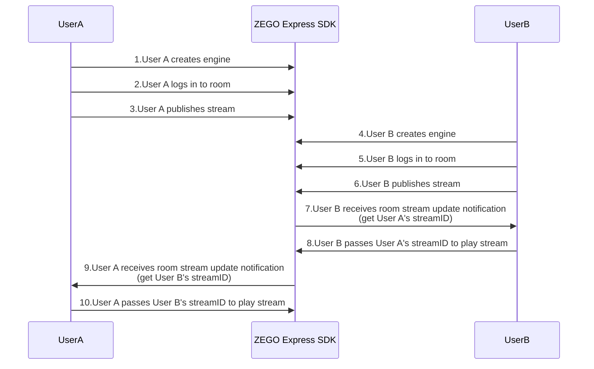

# Implement Video Call (Native Platforms)

---

## Feature Overview

This article will introduce how to quickly implement a simple real-time audio/video call.

Related concept explanations:

- ZEGO Express SDK: Real-time audio/video SDK provided by ZEGO, providing developers with convenient integration, HD smooth, multi-platform interoperability, low latency, and high concurrency audio/video services.
- Stream: Refers to a group of audio/video data encapsulated in a specified encoding format and continuously being sent. A user can publish multiple streams at the same time (for example, one for camera data and one for screen sharing data) and can also play multiple streams at the same time. Each stream is identified by a stream ID.
- Publish stream: The process of pushing packaged audio/video data streams to the ZEGO real-time audio/video cloud.
- Play stream: The process of pulling and playing existing audio/video data streams from the ZEGO real-time audio/video cloud.
- Room: Audio/video space service provided by ZEGO, used to organize user groups. Users in the same room can send and receive real-time audio/video and messages to each other.
    1. Users need to log into a room first before they can publish and play streams.
    2. Users can only receive relevant messages in their own room (user enter/exit, audio/video stream changes, etc.).
    3. Each room is identified by a unique roomID within an AppID. All users who log into the room using the same roomID belong to the same room.


<Note title="Note">


If you need to use Cocos Creator to quickly implement a simple real-time audio/video call Web project, please refer to [Implement Video Call (Web) documentation](/real-time-video-cocos-creator/quick-start/quick-access-websdk).

</Note>


## Prerequisites

Before implementing basic real-time audio/video functionality, please ensure:

- You have integrated ZEGO Express SDK in the project and implemented basic real-time audio/video functionality. For details, please refer to [Quick Start - Integration](/real-time-video-cocos-creator/quick-start/integrating-sdk).
- You have created a project in the [ZEGO Console](https://console.zegocloud.com) and applied for a valid AppID and AppSign. 

<Warning title="Warning">

The SDK also supports Token authentication. If you have higher security requirements for the project, it is recommended to upgrade the authentication method. For details, please refer to [How to upgrade from AppSign authentication to Token authentication](/faq/express-token-upgrade).
</Warning>

## Implementation Process

The basic process for users to conduct video calls through ZEGO Express SDK is:

Users A and B join the room. User B previews and pushes the audio/video stream to the ZEGO cloud service (publish stream). After user A receives the notification of user B's published audio/video stream, user A plays user B's audio/video stream in the notification (play stream).


{/*
<Frame width="512" height="auto" caption="">
  
</Frame>
*/}

### Create Engine

**1. Create Interface (Optional)**

<Accordion title="Add Interface Elements" defaultOpen="false">
Before starting, it is recommended for developers to add the following interface elements to facilitate the implementation of basic real-time audio/video functionality.

- Local preview window
- Remote video window
- End button

<Frame width="512" height="auto" caption=""></Frame>
</Accordion>

**2. Create Engine**

Call the [createEngine](@createEngine) interface and pass the applied AppID and AppSign to the parameters **appId** and **appSign**.

Select an appropriate scenario based on the actual audio/video business of the App. For details, please refer to [Scenario-based Audio/Video Configuration](/real-time-video-cocos-creator/quick-start/scenario-based-audio-video-configuration) documentation, and pass the selected scenario enumeration to the parameter **scenario**.

<Warning title="Warning">


The SDK also supports Token authentication. If you have higher security requirements for the project, it is recommended to upgrade the authentication method. For details, please refer to [How to upgrade from AppSign authentication to Token authentication](/faq/express-token-upgrade).

</Warning>


<Warning title="Warning">If it is a voice scenario, please be sure to call `enableCamera(false)` to turn off the camera to avoid starting video capture and publishing, which generates additional video traffic.</Warning>

```ts
// Define SDK engine object
public engine: ZegoExpressEngine | null = null
let profile = new ZegoEngineProfile()
profile.appID = appID // Please obtain through official website registration, format is 123456789
profile.appSign = appSign // Please obtain through official website registration, format is "0123456789012345678901234567890123456789012345678901234567890123", 64 characters
profile.scenario = ZegoScenario.HighQualityVideoCall // High-quality audio/video call scenario access (please select an appropriate scenario based on actual situation)

// Initialize SDK
this.engine = ZegoExpressEngine.createEngine(profile, this)
```

**3. Register SDK Event Callbacks**

You can listen to and handle event callbacks of interest by implementing a class that implements the [ZegoEventHandler](@-ZegoEventHandler) interface and implementing the required callback methods. Then pass the instantiated object as the `eventHandler` parameter to the [createEngine](@createEngine) method or pass it to [setEventHandler](https://www.zegocloud.com/article/api?doc=Express_Video_SDK_API~typescript_cocos-creator~class~ZegoExpressEngine#set-event-handler) to register callbacks.

<Warning title="Warning">


It is recommended to register callbacks immediately after creating the engine to avoid delaying registration and missing event notifications.

</Warning>


First, you need a class that implements the [ZegoEventHandler](@-ZegoEventHandler) interface.

```ts
export class NewComponent extends Component implements ZegoEventHandler {

  public engine: ZegoExpressEngine | null = null

  start() {}
}
```

At this point, the compiler will report a warning indicating "NewComponent has not yet implemented the function [onDebugError](@onDebugError)"

```txt
Class 'NewComponent' incorrectly implements interface 'ZegoEventHandler'.
  Property 'onDebugError' is missing in type 'NewComponent' but required in type 'ZegoEventHandler'.ts(2420)
```

Therefore, you need to implement the [onDebugError](@onDebugError) function.

<Warning title="Warning">


Other functions of [ZegoEventHandler](@-ZegoEventHandler) are all optional functions, only [onDebugError](@onDebugError) is a required function.

</Warning>


```ts
export class NewComponent extends Component implements ZegoEventHandler {

  public engine: ZegoExpressEngine | null = null

  start() {}

  onDebugError(errorCode: number, funcName: string, info: string): void {
    console.log('[ZEGO] onDebugError:', errorCode, funcName, info)
  }

}
```

Then, you can implement other SDK event callback functions as needed.


### Login Room

**1. Login**

Create a ZegoUser user object, set user information userID and userName, then call [loginRoom](@loginRoom) with the room ID parameter roomID and user parameter user to log into the room. If the room does not exist, calling this interface will automatically create and log into this room.

- Within the same AppID, ensure that roomID is globally unique.
- Within the same AppID, ensure that userID is globally unique. It is recommended that developers set it to a meaningful value and associate userID with their own business account system.
- userID cannot be empty, otherwise it will cause login room failure.

```ts
// Create user object
let user = new ZegoUser()
user.userID = 'your_user_id'
user.userName = 'your_user_name'

// Only by passing in ZegoRoomConfig with isUserStatusNotify parameter set to true can you receive the onRoomUserUpdate callback.
let roomConfig = new ZegoRoomConfig()
roomConfig.isUserStatusNotify = true
// If you use AppSign authentication, you do not need to fill in the token parameter; if you need to use more secure token authentication.
// roomConfig.token = 'xxxx'

// Login room
this.engine.loginRoom('your_room_id', user, roomConfig)
```

**2. Listen to Event Callbacks After Login Room**

According to actual needs, listen to the event notifications you care about after logging into the room, such as room status updates, user status updates, stream status updates, etc.

- [onRoomStateChanged](@onRoomStateChanged) Room status change notification callback. After logging into the room, when the room connection status changes (such as room disconnection, login authentication failure, etc.), the SDK will notify through this callback.
- [onRoomUserUpdate](@onRoomUserUpdate) Callback notification for other users increasing or decreasing in the room. After logging into the room, when users are added or removed in the room, the SDK will notify through this callback.

- [onRoomStreamUpdate](@onRoomStreamUpdate) Stream status update callback. After logging into the room, when users in the room add or remove audio/video streams, the SDK will notify through this callback.

<Warning title="Warning">


- Only when calling the [loginRoom](@loginRoom) interface to log into the room and passing in [ZegoRoomConfig](@-ZegoRoomConfig) configuration with the `isUserStatusNotify` parameter set to `true` can users receive the [onRoomUserUpdate](@onRoomUserUpdate) callback.

- Normally, if a user wants to play videos published by other users, they can call the [startPlayingStream](@startPlayingStream) interface in the callback of stream status update (addition) to play remote published audio/video streams.


</Warning>


```ts
// Room status update callback
onRoomStateChanged(roomID: string, reason: ZegoRoomStateChangedReason, errorCode: number, extendedData: string): void {
  // Implement event callback as needed
}

// User status update callback
onRoomUserUpdate(roomID: string, updateType: ZegoUpdateType, userList: ZegoUser[]): void {
  // Implement event callback as needed
}

// Stream status update callback
onRoomStreamUpdate(roomID: string, updateType: ZegoUpdateType, streamList: ZegoStream[], extendedData: string): void {
  // Implement event callback as needed
}
```

### Publish Stream

**1. Start Publishing**

Call the [startPublishingStream](@startPublishingStream) interface and pass the stream ID parameter `streamID` to send the local audio/video stream to remote users.

<Warning title="Warning">


Within the same AppID, ensure that streamID is globally unique. If within the same AppID, different users each publish a stream with the same streamID, the user who publishes later will fail to publish.


</Warning>


```ts
// Start publishing
this.engine.startPublishingStream('your_stream_id')
```

**2. Enable Local Preview (Optional)**

<Accordion title="Set Preview View and Start Local Preview" defaultOpen="false">
If developers want to see their local screen, they can call the [startPreview](@startPreview) interface to start local preview.

<Note title="Note">


Since Android devices and iOS devices have four screen orientations: Portrait/PortraitUpsideDown/LandscapeLeft/LandscapeRight, to ensure that the publishing preview and playing display interface is always in the correct direction, you need to first add code for adaptive landscape/portrait display for publishing preview and playing display interface. For details, please refer to [Video Capture Rotation](/real-time-video-cocos-creator/video/video-capture-rotation) documentation.


</Note>


The SDK supports rendering previews through Cocos Creator's [Sprite](https://docs.cocos.com/creator/manual/en/ui-system/components/editor/sprite.html?h=sprite) component.

First, define a `Sprite` variable in the script, add a `Sprite` component under the `Canvas` node in the editor, and then in the property inspector of the script node, point the defined variable to the `Sprite` component in `Canvas`.

```ts
@property(Sprite)
localPreviewView: Sprite
```

<Frame width="512" height="auto" caption=""></Frame>

```ts
// Call start preview interface
this.engine.startPreview({ view: this.localPreviewView })
```

You can also dynamically create a `Sprite` with a script and add it to the canvas without adding the `Sprite*` component in the editor in advance. This works well in multi-person video call scenarios. You can refer to the multi-person video call section in [Run Demo Source Code](/real-time-video-cocos-creator/quick-start/run-example-code).

```ts
// Instantiate a pre-made template node
let node = instantiate(this.spriteNodePrototype)
// Call start preview interface
this.engine.startPreview({ view: node.getComponentInChildren(Sprite) })
```
</Accordion>

**3. Listen to Event Callbacks After Publishing**

According to actual application needs, listen to the event notifications you care about after publishing, such as publishing status updates, publishing quality, etc.

- [onPublisherStateUpdate](@onPublisherStateUpdate) Publishing status update callback. After successfully calling the publishing interface, when the publishing status changes (such as network interruption causing publishing exceptions, etc.), the SDK will notify through this callback while retrying publishing.

- [onPublisherQualityUpdate](@onPublisherQualityUpdate) Publishing quality callback. After successfully calling the publishing interface, the audio/video stream quality data (such as resolution, frame rate, bitrate, etc.) is periodically callback.

```ts
// Publishing status update callback
onPublisherStateUpdate(streamID: string, state: ZegoPublisherState, errorCode: number, extendedData: string): void {
  // Implement event callback as needed
}

// Publishing quality callback
onPublisherQualityUpdate(streamID: string, quality: ZegoPublishStreamQuality): void {
  // Implement event callback as needed
}
```

<Note title="Note">If you need to know about camera/video/microphone/audio/speaker related interfaces of ZEGO Express SDK, please refer to [FAQ - How to implement switching camera/video screen/microphone/audio/speaker?](/faq/device-switching).</Note>

### Play Stream

**1. Start Playing**

Call the [startPlayingStream](@startPlayingStream) interface and play the remote published audio/video stream based on the passed stream ID parameter streamID.

```ts
this.engine.startPlayingStream('stream_id')
```

<Note title="Note">


The streamID published by remote users can be obtained from the [onRoomStreamUpdate](@onRoomStreamUpdate) callback.


</Note>


If developers want to see the remote playing screen, they can pass the `view` parameter.

<Note title="Note">


Since Android devices and iOS devices have four screen orientations: Portrait/PortraitUpsideDown/LandscapeLeft/LandscapeRight, to ensure that the publishing preview and playing display interface is always in the correct direction, you need to first add code for adaptive landscape/portrait display for publishing preview and playing display interface. Please refer to [Video Capture Rotation](/real-time-video-cocos-creator/video/video-capture-rotation) documentation.


</Note>


The SDK supports rendering remote playing screens through Cocos Creator's [Sprite](https://docs.cocos.com/creator/manual/en/ui-system/components/editor/sprite.html?h=sprite) component.

First, define a `Sprite` variable in the script, add a `Sprite` component under the `Canvas` node in the editor, and then in the property inspector of the script node, point the defined variable to the `Sprite` component in `Canvas`.

```ts
@property(Sprite)
remotePlayView: Sprite
```

<Frame width="512" height="auto" caption=""></Frame>

```ts
// Call start playing interface
this.engine.startPlayingStream('stream_id', { view: this.remotePlayView })
```

You can also dynamically create a `Sprite` with a script and add it to the canvas without adding the `Sprite` component in the editor in advance. This is very useful in multi-person video call scenarios. You can refer to the multi-person video call topic in [Run Demo Source Code](/real-time-video-cocos-creator/quick-start/run-example-code).

```ts
// Instantiate a pre-made template node
let node = instantiate(this.spriteNodePrototype)
// Call start preview interface
this.engine.startPlayingStream('stream_id', { view: node.getComponentInChildren(Sprite) })
```

**2. Listen to Event Callbacks After Playing**

According to actual application needs, listen to the event notifications you care about after playing, such as playing status updates, playing quality, streaming media events, etc.

- [onPlayerStateUpdate](@onPlayerStateUpdate) Playing status update callback. After successfully calling the playing interface, when the playing status changes (such as network interruption causing publishing exceptions, etc.), the SDK will notify through this callback while retrying playing.

- [onPlayerQualityUpdate](@onPlayerQualityUpdate) Playing quality callback. After successful playing, this callback will be received every 3 seconds. Through this callback, you can obtain quality data such as frame rate, bitrate, RTT, packet loss rate of the played audio/video stream, and monitor the health of the played stream in real time.

- [onPlayerMediaEvent](@onPlayerMediaEvent) Streaming media event callback. This callback will be triggered when audio/video stutter and recovery events occur during playing.

```ts
// Playing status update callback
onPlayerStateUpdate(streamID: string, state: ZegoPlayerState, errorCode: number, extendedData: string): void {
  // Implement event callback as needed
}

// Playing quality callback
onPlayerQualityUpdate(streamID: string, quality: ZegoPlayStreamQuality): void {
  // Implement event callback as needed
}

// Streaming media event callback
onPlayerMediaEvent(streamID: string, event: ZegoPlayerMediaEvent): void {
  // Implement event callback as needed
}
```

### Test Publishing and Playing Functions Online

Run the project on a real device. After successful running, you can see the local video screen.

For convenience, ZEGO provides a [Web platform for debugging](https://zegoim.github.io/express-demo-web/src/Examples/QuickStart/VideoTalk/index.html?lang=en). On this page, enter the same AppID and RoomID, enter different UserID, and the corresponding [Token](/console/development-assistance/temporary-token), to join the same room and interoperate with the real device. When the audio/video call starts successfully, you can hear the remote audio and see the remote video screen.


### Stop Publishing and Playing

**1. Stop Publishing/Preview**

Call the [stopPublishingStream](@stopPublishingStream) interface to stop sending the local audio/video stream to remote users.

```ts
// Stop publishing
this.engine.stopPublishingStream()
```

If local preview is enabled, call the [stopPreview](@stopPreview) interface to stop preview.

```ts
// Stop local preview
this.engine.stopPreview()
```

**2. Stop Playing**

Call the [stopPlayingStream](@stopPlayingStream) interface to stop playing remote published audio/video streams.

<Warning title="Warning">
If developers receive a "decrease" notification for audio/video streams through the [onRoomStreamUpdate](@onRoomStreamUpdate) callback, please call the [stopPlayingStream](@stopPlayingStream) interface in time to stop playing to avoid playing empty streams and generating additional costs; or, developers can choose an appropriate time according to their own business needs and actively call the [stopPlayingStream](@stopPlayingStream) interface to stop playing.
</Warning>

```ts
// Stop playing
this.engine.stopPlayingStream('stream_id')
```

### Logout Room

Call the [logoutRoom](@logoutRoom) interface to log out of the room.

```ts
// Logout room
this.engine.logoutRoom()
```

### Destroy Engine

Call the [destroyEngine](@destroyEngine) interface to destroy the engine, used to release resources used by the SDK.

```ts
// Destroy engine instance
ZegoExpressEngine.destroyEngine()
```

You can also pass a `callback` parameter. When the engine destruction is completed, the passed lambda closure will be callback.

```ts
ZegoExpressEngine.destroyEngine(() => {
  console.log('[ZEGO] engine destroyed')
})
```
