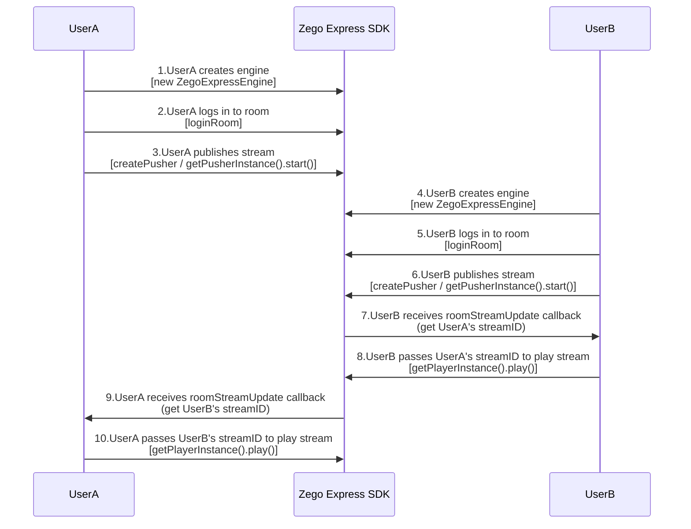
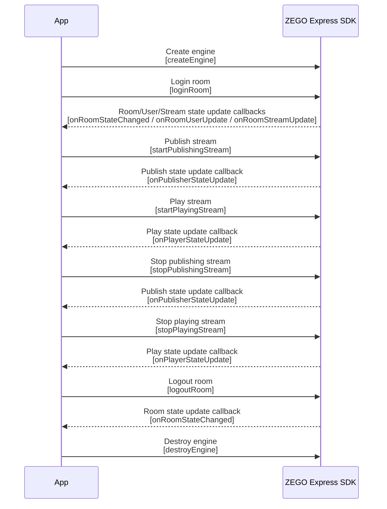

# Implementing Video Call (Web)

---

This article will introduce how to quickly implement a simple real-time audio/video call Web project using Cocos Creator.

## Feature Overview


Before starting, you can first understand some basic concepts of audio and video:

- Stream: A set of audio and video data content encapsulated in a specified encoding format. A stream can contain several tracks, such as video and audio tracks.
- Publish stream: The process of pushing packaged audio and video data streams to ZEGO real-time audio/video cloud.
- Play stream: The process of pulling and playing existing audio and video data streams from ZEGO real-time audio/video cloud.
- Room: An audio and video space service provided by ZEGO, used to organize user groups. Users in the same room can send and receive real-time audio, video, and messages to each other.
    1. Users need to log in to a room first before they can publish and play streams.
    2. Users can only receive relevant messages in the room they are in (user entry/exit, audio/video stream changes, etc.).


## Prerequisites

Before implementing basic real-time audio and video functions, please ensure:
- ZEGO Express SDK has been integrated in the project. For details, please refer to [Quick Start - Integration](/real-time-video-web/quick-start/integrating-sdk).
- A project has been created in [ZEGO Console](https://console.zegocloud.com) and a valid AppID and Server address have been applied for. 


## Implementation Process

Taking user A and user B pushing and pulling each other's streams as an example, the main process of a simple real-time audio and video call is as follows:

1. User A creates an instance and logs in to the room. (After successful login, you can preview your own screen and publish stream.)
2. User B creates an instance and logs in to the same room. After successful login, user B starts publishing stream. At this time, the SDK will trigger the [roomStreamUpdate ](https://www.zegocloud.com/article/api?doc=Express_Video_SDK_API~javascript_web~interface~ZegoRTCEvent#room-stream-update) callback, indicating that there is a stream change in the room.
3. User A can listen to the [roomStreamUpdate ](/real-time-video-web/client-sdk/api-reference/interface#roomstreamupdate) callback. When the callback notifies that a stream is added, user A can obtain user B's stream ID to play the stream just published by user B.


{/*
<Frame width="512" height="auto" caption=""></Frame>
*/}


### Create Interface

To facilitate the implementation of basic real-time audio and video functions, you can refer to the sample code and the figure below to implement a simple page.

<Frame width="512" height="auto" caption="">
  
</Frame>

<a id="CreateEngine"></a>

### Create Engine and Listen to Callbacks

1. Create and initialize an instance of [ZegoExpressEngine ](/real-time-video-web/client-sdk/api-reference/class#zegoexpressengine), and pass your project's AppID to the "appID" parameter and Server to the "server" parameter.

<Warning title="Warning">


  The instance of ZegoExpressEngine cannot be processed by the framework in a reactive manner, otherwise unpredictable problems will occur.

</Warning>


2. The SDK provides notification callbacks such as room connection status, audio/video stream changes, user entry/exit, etc.

<Warning title="Warning">


  To avoid missing any notifications, it is recommended to listen to callbacks immediately after creating the engine.

</Warning>


  ```ts
  // Get ZegoExpressEngine instance from SDK package downloaded from npm
  import { ZegoExpressEngine as ZegoExpressEngineType } from 'zego-express-engine-webrtc';
  // @ts-ignore
  import ZegoPack from 'zego-express-engine-webrtc';
  const { ZegoExpressEngine } = ZegoPack

  // Project unique identifier AppID, Number type, please get it from ZEGO Console
  let appID = ;
  // Access server address Server, String type, please get it from ZEGO Console (for how to get it, please refer to "Prerequisites" above)
  let server = "";

  // Initialize instance
  const zg: ZegoExpressEngineType = new ZegoExpressEngine(appID, server);

  // Room state update callback
  zg.on('roomStateChanged', (roomID, reason, errorCode, extendData) => {
    if (reason == 'LOGINING') {
        // Logging in
    } else if (reason == 'LOGINED') {
        // Login successful
        //Only when the room state is login successful or reconnection successful, publishing stream (startPublishingStream) and playing stream (startPlayingStream) can normally send and receive audio and video
        //Push your own audio and video stream to ZEGO audio and video cloud
    } else if (reason == 'LOGIN_FAILED') {
        // Login failed
    } else if (reason == 'RECONNECTING') {
        // Reconnecting
    } else if (reason == 'RECONNECTED') {
        // Reconnection successful
    } else if (reason == 'RECONNECT_FAILED') {
        // Reconnection failed
    } else if (reason == 'KICKOUT') {
        // Kicked out of the room
    } else if (reason == 'LOGOUT') {
        // Logout successful
    } else if (reason == 'LOGOUT_FAILED') {
        // Logout failed
    }
  });

  //Notification of other users entering or leaving the room
  //Only when logging in to the room by calling loginRoom and passing in ZegoRoomConfig, and the userUpdate parameter of ZegoRoomConfig is "true", users can receive the roomUserUpdate callback.
  zg.on('roomUserUpdate', (roomID, updateType, userList) => {
    if (updateType == 'ADD') {
        for (var i = 0; i < userList.length; i++) {
            console.log(userList[i]['userID'], 'joined room:', roomID)
        }
    } else if (updateType == 'DELETE') {
        for (var i = 0; i < userList.length; i++) {
            console.log(userList[i]['userID'], 'left room:', roomID)
        }
    }
  });

  zg.on('roomStreamUpdate', async (roomID, updateType, streamList, extendedData) => {
    // Notification of changes in audio and video streams of other users in the room
  });
  ```

<Accordion title="Common Notification Callbacks" defaultOpen="false">
```javascript
// Room connection status update callback
// When you locally call loginRoom to join a room, you can monitor your connection status in the room by listening to the roomStateChanged callback.
zg.on('roomStateChanged', (roomID, reason, errorCode, extendData) => {
    if (reason == 'LOGINING') {
        // Logging in
    } else if (reason == 'LOGINED') {
        // Login successful
        //Only when the room state is login successful or reconnection successful, publishing stream (startPublishingStream) and playing stream (startPlayingStream) can normally send and receive audio and video
        //Push your own audio and video stream to ZEGO audio and video cloud
    } else if (reason == 'LOGIN_FAILED') {
        // Login failed
    } else if (reason == 'RECONNECTING') {
        // Reconnecting
    } else if (reason == 'RECONNECTED') {
        // Reconnection successful
    } else if (reason == 'RECONNECT_FAILED') {
        // Reconnection failed
    } else if (reason == 'KICKOUT') {
        // Kicked out of the room
    } else if (reason == 'LOGOUT') {
        // Logout successful
    } else if (reason == 'LOGOUT_FAILED') {
        // Logout failed
    }
});

//Notification of addition/deletion of audio and video streams published by other users in the room
//You cannot receive notifications for streams published by yourself here
zg.on('roomStreamUpdate', async (roomID, updateType, streamList, extendedData) => {
    if (updateType == 'ADD') {
        // Stream added
        for (var i = 0; i < streamList.length; i++) {
            console.log('Stream', streamList[i]['streamID'], 'added to room', roomID)
        }
        const message = "Other user's video stream streamID: " + streamID.toString();
    } else if (updateType == 'DELETE') {
        // Stream deleted
        for (var i = 0; i < streamList.length; i++) {
            console.log('Stream', streamList[i]['streamID'], 'removed from room', roomID)
        }
    }
});

//Notification of other users entering or leaving the room
//Only when logging in to the room by calling loginRoom and passing in ZegoRoomConfig, and the userUpdate parameter of ZegoRoomConfig is "true", users can receive the roomUserUpdate callback.
zg.on('roomUserUpdate', (roomID, updateType, userList) => {
    if (updateType == 'ADD') {
        for (var i = 0; i < userList.length; i++) {
            console.log(userList[i]['userID'], 'joined room:', roomID)
        }
    } else if (updateType == 'DELETE') {
        for (var i = 0; i < userList.length; i++) {
            console.log(userList[i]['userID'], 'left room:', roomID)
        }
    }
});

//Status notification of users publishing audio and video streams
//When the status of users publishing audio and video streams changes, this callback will be received. If the network interruption causes publishing stream exception, the SDK will also notify the status change while retrying to publish stream.
zg.on('publisherStateUpdate', result => {
    // Publish stream state update callback
    var state = result['state']
    var streamID = result['streamID']
    var errorCode = result['errorCode']
    var extendedData = result['extendedData']
    if (state == 'PUBLISHING') {
        console.log('Successfully published audio and video stream:', streamID);
    } else if (state == 'NO_PUBLISH') {
        console.log('Not publishing audio and video stream');
    } else if (state == 'PUBLISH_REQUESTING') {
        console.log('Requesting to publish audio and video stream:', streamID);
    }
    console.log('Error code:', errorCode, 'Extended info:', extendedData)
})

//Publish stream quality callback.
//After successful publishing, you will periodically receive callback audio and video stream quality data (such as resolution, frame rate, bitrate, etc.).
zg.on('publishQualityUpdate', (streamID, stats) => {
    // Publish stream quality callback
    console.log('Stream quality callback')
})

//Status notification of users playing audio and video streams
//When the status of users playing audio and video streams changes, this callback will be received. If the network interruption causes playing stream exception, the SDK will automatically retry.
zg.on('playerStateUpdate', result => {
    // Play stream state update callback
    var state = result['state']
    var streamID = result['streamID']
    var errorCode = result['errorCode']
    var extendedData = result['extendedData']
    if (state == 'PLAYING') {
        console.log('Successfully played audio and video stream:', streamID);
    } else if (state == 'NO_PLAY') {
        console.log('Not playing audio and video stream');
    } else if (state == 'PLAY_REQUESTING') {
        console.log('Requesting to play audio and video stream:', streamID);
    }
    console.log('Error code:', errorCode, 'Extended info:', extendedData)
})

//Quality callback when playing audio and video streams.
//After successful playing, you will periodically receive quality data notifications when playing audio and video streams (such as resolution, frame rate, bitrate, etc.).
zg.on('playQualityUpdate', (streamID,stats) => {
    // Play stream quality callback
})

//Notification of receiving broadcast messages
zg.on('IMRecvBroadcastMessage', (roomID, chatData) => {
    console.log('Broadcast message IMRecvBroadcastMessage', roomID, chatData[0].message);
    alert(chatData[0].message)
});

//Notification of receiving barrage messages
zg.on('IMRecvBarrageMessage', (roomID, chatData) => {
    console.log('Barrage message IMRecvBroadcastMessage', roomID, chatData[0].message);
    alert(chatData[0].message)
});

//Notification of receiving custom signaling messages
zg.on('IMRecvCustomCommand', (roomID, fromUser, command) => {
    console.log('Custom message IMRecvCustomCommand', roomID, fromUser, command);
    alert(command)
});
```
</Accordion>

### Check Compatibility

Considering that different browsers have different compatibility with WebRTC, before implementing the publishing and playing functions, you need to check whether the browser can normally run WebRTC.

You can call the [checkSystemRequirements](/real-time-video-web/client-sdk/api-reference/class#checksystemrequirements) interface to check the compatibility of the browser. For the meaning of the check result, please refer to the parameter description under the [ZegoCapabilityDetection](/real-time-video-web/client-sdk/api-reference/interface#zegocapabilitydetection) interface.

```js
const result = await zg.checkSystemRequirements();
// The returned result is the compatibility check result. When webRTC is true, it means supporting webRTC. For the meaning of other attributes, please refer to the interface API documentation.
console.log(result);
// {
//   webRTC: true,
//   customCapture: true,
//   camera: true,
//   microphone: true,
//   videoCodec: { H264: true, H265: false, VP8: true, VP9: true },
//   screenSharing: true,
//   errInfo: {}
// }
```

You can also use the [Online Check Tool](https://zegodev.github.io/zego-express-webrtc-sample/webrtcCheck/index.html) provided by ZEGO, open it in the browser to be checked, and directly check the compatibility of the browser. Please refer to [Browser Compatibility and Known Issues](/real-time-video-web/introduction/browser-restrictions) for the browser compatibility versions supported by the SDK.

<a id="createroom"></a>

### Login Room

**1. Generate Token**

Logging in to a room requires a Token for identity verification. Developers can directly obtain a temporary Token (valid for 24 hours) from [ZEGO Console](https://console.zegocloud.com/dashboard) for use. 

<Note title="Note">


The temporary Token is only for debugging. Before official launch, please generate the Token from the developer's business server. For details, please refer to [Using Token Authentication](/real-time-video-web/communication/using-token-authentication).


</Note>


**2. Login Room**

Call the [loginRoom ](/real-time-video-web/client-sdk/api-reference/class#loginroom) interface, pass in the room ID parameter "roomID", "token" and user parameter "user", pass in the parameter "config" according to the actual situation, and log in to the room. If the room does not exist, calling this interface will create and log in to this room.

<Warning title="Warning">


- The values of the "roomID", "userID" and "userName" parameters are all customizable, among which "userName" is not required.
- Both "roomID" and "userID" must be unique. It is recommended that developers set "userID" to a meaningful value and associate it with their own business account system.
- "userID" must be consistent with the userID passed in when generating the token, otherwise the login will fail.
- Only when calling the [loginRoom](/real-time-video-web/client-sdk/api-reference/class#loginroom) interface to log in to the room and passing in [ZegoRoomConfig](/real-time-video-web/client-sdk/api-reference/interface#zegoroomconfig) configuration, and the value of the "userUpdate" parameter is "true", users can receive the [roomUserUpdate](https://www.zegocloud.com/article/api?doc=Express_Video_SDK_API~javascript_web~interface~ZegoRTMEvent#room-user-update) callback.

</Warning>


```javascript
// Login to the room, return true if successful
// Set userUpdate to true to receive the roomUserUpdate callback.

let userID = Util.getBrow() + '_' + new Date().getTime();
let userName = "user0001";
let roomID = "0001";
let token = ;
// To avoid missing any notifications, you need to listen to callbacks for users joining/leaving the room, room connection status changes, publishing stream status changes, etc. before logging in to the room.
zg.on('roomStateChanged', async (roomID, reason, errorCode, extendedData) => {

})
zg.loginRoom(roomID, token, { userID, userName: userID }, { userUpdate: true }).then(result => {
     if (result == true) {
        console.log("login success")
     }
});
```

You can listen to the [roomStateChanged](/real-time-video-web/client-sdk/api-reference/interface#roomstatechanged) callback to monitor your connection status with the room in real time. Only when the room status is connected can you perform operations such as publishing and playing streams. If the login to the room fails, please refer to [Error Codes](/real-time-video-cocos-creator/client-sdk/error-code) for operations.

<a id="publishingStream"></a>

### Preview Your Own Screen and Publish to ZEGO Audio and Video Cloud

**1. Create Stream and Preview Your Own Screen**

<Note title="Note">


Whether or not you call preview, you can publish your own audio and video stream to ZEGO audio and video cloud.

</Note>


Before starting to publish stream, you need to create the local audio and video stream. Call the [createZegoStream](/real-time-video-web/client-sdk/api-reference/class#createzegostream) interface to obtain the [ZegoLocalStream](/real-time-video-web/client-sdk/api-reference/class#zegolocalstream) instance object `localStream`. By default, it will collect camera screen and microphone sound.


<Accordion title="Render Preview Screen in Cocos Creator (Optional)" defaultOpen="false">
The following will introduce how to render preview through Cocos Creator's [Sprite](https://docs.cocos.com/creator/manual/en/ui-system/components/editor/sprite.html?h=sprite) component.

First define the `Sprite` variable in the script, add a `Sprite` component under the `Canvas` node in the editor, and then point the variable defined in the property inspector of the script node to the `Sprite` component in `Canvas`.

```ts
@property(Sprite)
localPreviewView: Sprite
```

<Frame width="512" height="auto" caption=""></Frame>

Example code for rendering preview screen
```ts
import {
  Sprite,
  SpriteFrame,
  Texture2D,
  ImageAsset,
  game
} from 'cc'

// Create local preview stream object.
const localStream = this._localStream = await this.engine.createZegoStream()

// Create an invisible div to mount the ZegoStreamView component, and then use Sprite to render the video frame screen.
const view = document.createElement('div')
view.setAttribute("style", 'width:0;height:0;overflow:hidden;position:absolute;top:0;left:0;visibility:hidden;')
game.container.appendChild(view)
localStream.playVideo(view)

// Set a loop timer based on the video frame rate to render the video screen on Sprite. Note: When stopping preview, also remove the div object view and close the timer timer
const frameRate = 15
const timer = window.setInterval(() => {
    // Create new ImageAsset object
    let img = new Image();
    // Get the data frame screen of the preview stream and assign it to the Image object.
    img.src = localStream.takeStreamSnapshot();
    img.onload = () => {
    let imageAsset = new ImageAsset()
    imageAsset.reset(img)
    // Apply Image object to Texture2D
    let texture = new Texture2D()
    texture.image = imageAsset;
    // Apply Texture2D object to SpriteFrame
    let spriteFrame = new SpriteFrame()
    spriteFrame.texture = texture
    // this.localPreviewView is the Sprite component mounted on Canvas
    this.localPreviewView.spriteFrame = spriteFrame;
    };
}, 1e3 / frameRate)
```
</Accordion>

**2. Publish Audio and Video Stream to ZEGO Audio and Video Cloud**

You need to wait for the [createZegoStream](/real-time-video-web/client-sdk/api-reference/class#createzegostream) interface to return the [ZegoLocalStream](/real-time-video-web/client-sdk/api-reference/class#zegolocalstream) instance object `localStream`, and then publish your own audio and video stream to ZEGO audio and video cloud.

Call the [startPublishingStream](/real-time-video-web/client-sdk/api-reference/class#startpublishingstream) interface, pass in "streamID" and the stream object "localStream" obtained from creating the stream, and send the local audio and video stream to remote users.

<Note title="Note">


- "streamID" is generated locally by you, but you need to ensure that "streamID" is globally unique under the same AppID. If under the same AppID, different users each publish a stream with the same "streamID", the user who publishes later will fail to publish the stream.
- If you need to interoperate with other platforms or use the [Relay to CDN Function](/real-time-video-web/live-streaming/using-cdn-for-live-streaming), please set the video encoding format to H.264. For details, please refer to [Set Video Encoding Attributes](/real-time-video-web/video/set-video-encoding-attributes).

</Note>


```ts
// Here, immediately after successful login to the room, start publishing stream. When implementing specific business, you can choose other timing to publish stream, as long as the current room connection status is connected.

zg.loginRoom(roomID, token, { userID, userName: userID }, { userUpdate: true }).then(async result => {
     if (result == true) {
        console.log("login success")
        // Create stream and preview
        // After calling the createZegoStream interface, you need to wait for ZEGO server to return the ZegoLocalStream instance object before performing subsequent operations
        const localStream = await zg.createZegoStream();

        // Here, the example code for rendering preview screen is omitted

        // Start publishing stream and push your own audio and video stream to ZEGO audio and video cloud
        let streamID = new Date().getTime().toString();
        zg.startPublishingStream(streamID, localStream)
     }
});
```

<Accordion title="(Optional) Set Audio and Video Capture Parameters" defaultOpen="false">
You can set audio and video related capture parameters through the following attributes in the [createZegoStream](/real-time-video-web/client-sdk/api-reference/class#createzegostream) interface as needed. For details, please refer to [Custom Video Capture](/real-time-video-web/video/custom-video-capture):

- [camera](/real-time-video-web/client-sdk/api-reference/interface#zegostreamoptions#camera): Configuration for camera and microphone capture stream
- [screen](/real-time-video-web/client-sdk/api-reference/interface#zegostreamoptions#screen): Configuration for screen capture stream
- [custom](/real-time-video-web/client-sdk/api-reference/interface#zegostreamoptions#custom): Configuration for third-party stream capture
</Accordion>

### Play Other Users' Audio and Video

When making a video call, we need to play other users' audio and video.

When other users join the room, the SDK will trigger the [roomStreamUpdate](/real-time-video-web/client-sdk/api-reference/interface#roomstreamupdate) callback to notify that there is a new stream in the room. Based on this, you can obtain other users' "streamID". At this time, call the [startPlayingStream](/real-time-video-web/client-sdk/api-reference/class#startplayingstream) interface according to the "streamID" of other users passed in, to play the audio and video screen that has been published to the ZEGO server by remote users. If you need to play stream from CDN, please refer to [Using CDN Live Streaming](/real-time-video-web/live-streaming/using-cdn-for-live-streaming).

First define the `Sprite` variable in the script, add a `Sprite` component under the `Canvas` node in the editor, and then point the variable defined in the property inspector of the script node to the `Sprite` component in `Canvas`.

```ts
@property(Sprite)
remotePlayView: Sprite
```

<Frame width="512" height="auto" caption=""></Frame>

```javascript
// Stream state update callback
zg.on('roomStreamUpdate', async (roomID, updateType, streamList, extendedData) => {
    // When updateType is ADD, it means there is a new audio and video stream, you can call the startPlayingStream interface to play the audio and video stream
    if (updateType == 'ADD') {
        // Stream added, start playing stream
        // Here, to make the sample code more concise, we only play the first stream in the newly added audio and video stream list. In actual business, it is recommended that developers loop through streamList and play each audio and video stream
        const streamID = streamList[0].streamID;
        // streamList has the corresponding stream's streamID
        const remoteStream = await zg.startPlayingStream(streamID);

        // Create media stream playback component object for playing remote media stream.
        const remoteView = zg.createRemoteStreamView(remoteStream);
        // Create an invisible div to mount the ZegoStreamView component, and then use Sprite to render the video frame screen.
        const view = document.createElement('div')
        view.setAttribute("style", 'width:0;height:0;overflow:hidden;position:absolute;top:0;left:0;visibility:hidden;')
        game.container.appendChild(view)
        remoteView.play(view)

        // Set a loop timer based on the video frame rate to render the video screen on Sprite. Note: When stopping playing stream, also remove the div object view and close the timer timer
        const frameRate = 15
        const timer = window.setInterval(() => {
            // Create new ImageAsset object
            let img = new Image();
            // Get the data frame screen of the preview stream and assign it to the Image object.
            img.src = remoteView.takeStreamSnapshot();
            img.onload = () => {
            let imageAsset = new ImageAsset()
            imageAsset.reset(img)
            // Apply Image object to Texture2D
            let texture = new Texture2D()
            texture.image = imageAsset;
            // Apply Texture2D object to SpriteFrame
            let spriteFrame = new SpriteFrame()
            spriteFrame.texture = texture
            // this.remotePlayView is the Sprite component mounted on Canvas
            this.remotePlayView.spriteFrame = spriteFrame;
            };
        }, 1e3 / frameRate)

    } else if (updateType == 'DELETE') {
        // Stream deleted, stop playing stream
    }
});
```

<Warning title="Warning">


- Due to the autoplay restriction policy of some browsers, using the [ZegoStreamView](/real-time-video-web/client-sdk/api-reference/class#zegostreamview) media stream playback component to play media streams may be blocked. By default, the SDK will pop up a prompt on the interface to resume playback.
- You can set the second parameter `options.enableAutoplayDialog` of the `ZegoStreamView.play()` method to `false` to turn off the automatic pop-up, and guide the user to click to resume playback by displaying a button on the page in the [autoplayFailed](/real-time-video-web/client-sdk/api-reference/interface#streamviewevent#autoplay-failed) event callback.

</Warning>


So far, you have successfully implemented a simple real-time audio and video call. You can open "index.html" in a browser to experience the real-time audio and video functions.


### Test Publishing and Playing Stream Functions Online

Run the project on a real device. After successful running, you can see the local video screen.

For convenience, ZEGO provides a [Web platform for debugging](https://zegoim.github.io/express-demo-web/src/Examples/QuickStart/VideoTalk/index.html?lang=en). On this page, enter the same AppID and RoomID, enter different UserIDs, and the corresponding **Token**, to join the same room and interoperate with the real device. When the audio and video call starts successfully, you can hear the remote audio and see the remote video screen.


### Stop Audio and Video Call

**1. Stop Publishing Stream and Destroy Stream**

Call the [stopPublishingStream](/real-time-video-web/client-sdk/api-reference/class#stoppublishingstream) interface to stop sending the local audio and video stream to remote users. Call the [destroyStream](/real-time-video-web/client-sdk/api-reference/class#destroystream) interface to destroy the created stream data. After destroying the stream, developers need to destroy the video (stop capture) themselves.


```javascript
// Stop publishing stream according to local streamID
zg.stopPublishingStream(streamID)
// localStream is the ZegoLocalStream instance object obtained by calling the createZegoStream interface
zg.destroyStream(localStream)
```

**2. Stop Playing Stream**

Call the [stopPlayingStream](/real-time-video-web/client-sdk/api-reference/class#stopplayingstream) interface to stop playing the audio and video stream published by remote users.

<Warning title="Warning">


If the developer receives the "decrease" notification of audio and video stream through the [roomStreamUpdate](/real-time-video-web/client-sdk/api-reference/interface#roomstreamupdate) callback, please call the [stopPlayingStream](/real-time-video-web/client-sdk/api-reference/class#stopplayingstream) interface in time to stop playing stream, to avoid playing empty streams and generating additional costs; or, developers can choose the appropriate timing according to their own business needs and actively call the [stopPlayingStream ](/real-time-video-web/client-sdk/api-reference/class#stopplayingstream) interface to stop playing stream.

</Warning>


```javascript
// Stream state update callback
zg.on('roomStreamUpdate', async (roomID, updateType, streamList, extendedData) => {
    if (updateType == 'ADD') {
        // Stream added, start playing stream
    } else if (updateType == 'DELETE') {
        // Stream deleted, stop playing stream by the streamID of each stream in the stream deletion list streamList.
        const streamID = streamList[0].streamID;
        zg.stopPlayingStream(streamID)
    }
});
```

**3. Logout Room**

Call the [logoutRoom](/real-time-video-web/client-sdk/api-reference/class#logoutroom) interface to log out of the room.

```javascript
zg.logoutRoom(roomID)
```

**4. Destroy Engine**

If users completely do not use audio and video functions, they can call the [destroyEngine ](/real-time-video-web/client-sdk/api-reference/class#destroyengine) interface to destroy the engine and release resources such as microphone, camera, memory, CPU, etc.

```javascript
zg.destroyEngine();
zg = null;
```

The API call sequence of the entire publishing and playing stream process above can be referred to the following figure:


{/*
<Frame width="512" height="auto" caption=""></Frame>
*/}

## FAQ

**What is the reason for the frequent warning "Error: Failed to execute put on IDBObjectStore': \<Object> could not be cloned." printed in the console window of the browser debug mode after publishing stream?**

The `ZegoExpressEngine` instance cannot be processed by the framework in a reactive manner, otherwise an error will be reported.

## Related Documentation
- [Error Code Documentation](/real-time-video-cocos-creator/client-sdk/error-code)
- [How to set and obtain SDK logs and stack information?](/faq/express-logs-stacktrace)
- [How to use ZEGO Express Web SDK on mobile?](/faq/mobile-web-sdk-usage)
- [How to handle black screen or no sound during live streaming on the Web platform?](/faq/web-live-failure)
