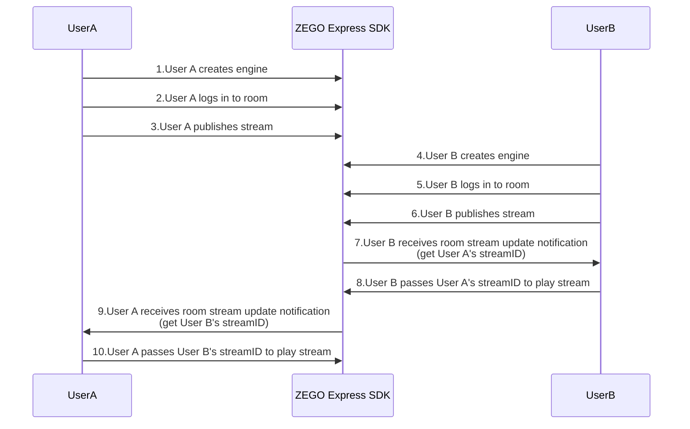
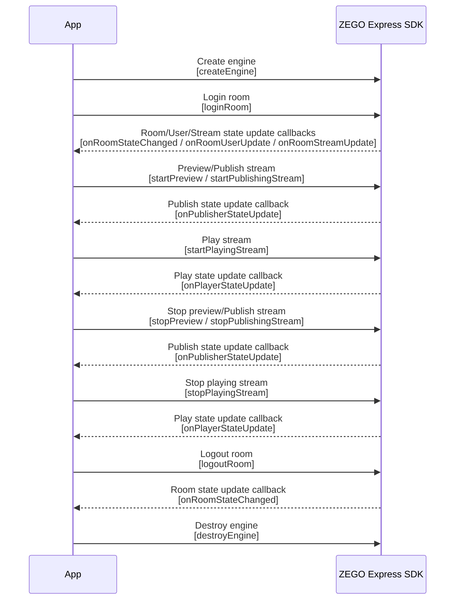

# Implement Video Call

---


## Feature Introduction

This document introduces how to quickly implement a simple real-time audio and video call.

Explanation of related concepts:

- ZEGO Express SDK: A real-time audio and video SDK provided by ZEGO, offering developers easy integration, high definition and smoothness, multi-platform interoperability, low latency, and high concurrency audio and video services.
- Stream: A set of audio and video data encapsulated in a specified encoding format and continuously being sent. A user can publish multiple streams simultaneously (for example, one for camera data and one for screen sharing data) and can also play multiple streams simultaneously. Each stream is identified by a stream ID (streamID).
- Publish stream: The process of pushing encapsulated audio and video data streams to the ZEGOCLOUD.
- Play stream: The process of pulling and playing existing audio and video data streams from the ZEGOCLOUD.
- Room: An audio and video space service provided by ZEGO for organizing user groups. Users in the same room can send and receive real-time audio and video and messages to each other.
    1. Users need to login to a room first before they can publish and play streams.
    2. Users can only receive related messages in the room they are in (user entry/exit, audio and video stream changes, etc.).
    3. Each room is identified by a unique roomID within an AppID. All users who login to the room using the same roomID belong to the same room.


## Prerequisites

Before implementing basic real-time audio and video functionality, please ensure:

- ZEGO Express SDK has been integrated into the project to implement basic real-time audio and video functionality. For details, please refer to [Quick Start - Integration](/real-time-video-electron-js/quick-start/integrating-sdk).
- A project has been created in the [ZEGOCLOUD Console](https://console.zegocloud.com), and valid AppID and AppSign have been applied for. 

<Warning title="Warning">

The SDK also supports Token authentication. If you have higher security requirements for your project, it is recommended to upgrade the authentication method. For details, please refer to [How to upgrade from AppSign authentication to Token authentication](https://www.zegocloud.com/docs/faq/express-token-upgrade).
</Warning>


## Usage Steps

The basic process for users to make video calls through ZEGO Express SDK is:

Users A and B join the room. User B previews and pushes the audio and video stream to ZEGO cloud service (publish stream). After user A receives the notification of the audio and video stream pushed by user B, user A plays user B's audio and video stream in the notification (play stream).


{/*
<Frame width="512" height="auto" caption="">
  
</Frame>
*/}

The API call sequence of the entire publish and play process is shown in the following figure:


{/*
<Frame width="512" height="auto" caption=""></Frame>
*/}


<a id="createEngine"></a>

### Create Engine

**1. Create Interface (Optional)**

<Accordion title="Add Interface Elements" defaultOpen="false">
Before starting, it is recommended that developers add the following interface elements to facilitate the implementation of basic real-time audio and video functionality.

- Local preview window
- Remote video window
- End button

<Frame width="512" height="auto" caption=""></Frame>
</Accordion>

**2. Initialize Engine**

Use the [createEngine](@createEngine) method to pass the applied AppID and AppSign to the parameters "appID" and "appSign".

<Warning title="Warning">


The SDK also supports Token authentication. If you have higher security requirements for your project, it is recommended to upgrade the authentication method. For details, please refer to [How to upgrade from AppSign authentication to Token authentication](https://www.zegocloud.com/docs/faq/express-token-upgrade).

</Warning>

<Warning title="Warning">If it is an audio scenario, be sure to call `enableCamera(false)` to turn off the camera to avoid starting video capture and publishing streams that generate additional video traffic.</Warning>

```js
// Import ZegoExpressEngine
const zgEngine = window.require('zego-express-engine-electron/ZegoExpressEngine');
const zgDefines = window.require('zego-express-engine-electron/ZegoExpressDefines');

// Use general scenario
const profile = {
appID : xxx,
appSign : "xxx",
scenario : zgDefines.ZegoScenario.Default
};

zgEngine.createEngine(profile)
.then(() => {
    console.log("init succeed")
}).catch((e) => {
    console.log("init failed", e)
});
```

**3. Set Callbacks**


For callback registration and unregistration, please refer to [Set Callbacks](/real-time-video-electron-js/quick-start/setting-callback)

<Warning title="Warning">


To avoid missing event notifications, it is recommended to register callbacks immediately after creating the engine

</Warning>


<a id="loginRoom"></a>

### Login Room

**1. Login**

Call the [loginRoom ](@loginRoom) interface, pass in the room ID parameter "roomID" and user parameter "user", to login to the room. If the room does not exist, the interface will create and login to this room when called.

- Within the same AppID, "roomID" information must be globally unique.
- Within the same AppID, "userID" must be globally unique. It is recommended that developers set it to a meaningful value and associate "userID" with their business account system.
- "userID" cannot be "null", otherwise it will cause the login to the room to fail.


```js
zgEngine.loginRoom("TheRoomID",  { userID: "TheUserID", userName: "TheUserName"});
```


**2. Listen to Event Callbacks After Logging In to the Room**

According to actual application needs, listen to event notifications of interest after logging in to the room, such as room state updates, user state updates, stream state updates, etc.

- [onRoomStateUpdate](/real-time-video-electron-js/quick-start/setting-callback#onRoomStateUpdate): Room state update callback. After logging in to the room, when the room connection state changes (such as room disconnection, login authentication failure, etc.), the SDK will notify through this callback.
- [onRoomUserUpdate](/real-time-video-electron-js/quick-start/setting-callback#onRoomUserUpdate): User state update callback. After logging in to the room, when users are added to or deleted from the room, the SDK will notify through this callback.

    Only when the [loginRoom](@loginRoom) interface is called to login to the room with the [ZegoRoomConfig](@-ZegoRoomConfig) configuration, and the "isUserStatusNotify" parameter value is "true", users can receive the [onRoomUserUpdate](/real-time-video-electron-js/quick-start/setting-callback) callback.


- [onRoomStreamUpdate](/real-time-video-electron-js/quick-start/setting-callback#onRoomStreamUpdate): Stream state update callback. After logging in to the room, when users in the room add or delete audio and video streams, the SDK will notify through this callback.

<Warning title="Warning">


- Only when the [loginRoom](@loginRoom) interface is called to login to the room with the [ZegoRoomConfig](@-ZegoRoomConfig) configuration, and the "isUserStatusNotify" parameter value is "true", users can receive the [onRoomUserUpdate](/real-time-video-electron-js/quick-start/setting-callback) callback.
- Normally, if a user wants to play videos pushed by other users, they can call the [startPlayingStream](https://www.zegocloud.com/article/api?doc=express-video-sdk_API~javascript_electron~class~ZegoExpressEngine#start-playing-stream) interface in the callback of stream state update (addition) to pull the remote audio and video stream.

</Warning>


```js
// The following are common room-related callbacks
// Room state update callback
zgEngine.on("onRoomStateUpdate", (param)=>{
    // Implement event callback as needed
});

// User state update callback
zgEngine.on("onRoomUserUpdate", (param)=>{
    // Implement event callback as needed
});

// Stream state update callback
zgEngine.on("onRoomStreamUpdate", (param)=>{
    // Implement event callback as needed
});
```

<a id="startPublishingStream"></a>

### Publish Stream

**1. Start Publishing Stream**

Call the [startPublishingStream](@startPublishingStream) interface, pass in the stream ID parameter "streamID", to send the local audio and video stream to remote users.

<Warning title="Warning">


Within the same AppID, "streamID" must be globally unique. If within the same AppID, different users each publish a stream with the same "streamID", it will cause the later publishing user to fail to publish the stream.
</Warning>


```js
// Start publishing stream
zgEngine.startPublishingStream("streamID");
```

**2. Enable Local Preview (Optional)**

<Accordion title="Set Preview View and Start Local Preview" defaultOpen="false">
If you want to see the local image, you can call the [startPreview](https://www.zegocloud.com/article/api?doc=express-video-sdk_API~javascript_electron~class~ZegoExpressEngine#start-preview) interface to set the preview view and start local preview.

```js
// Get a canvas element
let localCanvas = document.getElementById("localCanvas");

// Start local preview
zgEngine.startPreview({
    canvas: localCanvas,
});
```
</Accordion>

**3. Listen to Event Callbacks After Publishing Stream**

According to actual application needs, listen to event notifications of interest after publishing the stream, such as publishing state updates, etc.

[onPublisherStateUpdate](/real-time-video-electron-js/quick-start/setting-callback#onPublisherStateUpdate): Publishing state update callback. After the publishing interface is called successfully, when the publishing state changes (such as network interruption causing publishing exceptions, etc.), the SDK will notify through this callback while retrying publishing.

```js
// Common publishing-related callbacks
// Publishing state update callback
zgEngine.on("onPublisherStateUpdate", (param)=>{
    // Implement event callback as needed
});
```

<Note title="Note">If you need to know about ZEGO Express SDK camera/video/microphone/audio/speaker related interfaces, please refer to [FAQ - How to implement switching camera/video image/microphone/audio/speaker?](https://www.zegocloud.com/docs/faq/device-switching).</Note>

### Play Stream

**1. Start Playing Stream**

Call the [startPlayingStream](@startPlayingStream) interface to pull the remote audio and video stream according to the passed stream ID parameter "streamID".

```js
// Get a canvas element
let remoteCanvas = document.getElementById("remoteCanvas");
// Start playing stream
zgEngine.startPlayingStream("streamID", {
    canvas: remoteCanvas,
});
```

**2. Listen to Event Callbacks After Playing Stream**


According to actual application needs, listen to event notifications of interest after playing the stream, such as playing state updates, etc.

[onPlayerStateUpdate](/real-time-video-electron-js/quick-start/setting-callback#onPlayerStateUpdate): Playing state update callback. After the playing interface is called successfully, when the playing state changes (such as network interruption causing playing exceptions, etc.), the SDK will notify through this callback while retrying playing.

```js
// Common playing-related callbacks
// Playing state related callback
zgEngine.on("onPlayerStateUpdate", (param)=>{
    // Implement event callback as needed
});
```

### Test Publishing and Playing Functionality Online

Run the project on a real device. After running successfully, you can see the local video image.

To facilitate the experience, ZEGO provides a [Web platform for debugging](https://zegoim.github.io/express-demo-web/src/Examples/QuickStart/VideoTalk/index.html?lang=en). On this page, enter the same AppID and RoomID, enter different UserIDs and corresponding **Tokens**, and you can join the same room to interoperate with real devices. When the audio and video call starts successfully, you can hear the remote audio and see the remote video image.


<a id="stopPublishingStream"></a>

### Stop Publishing and Playing

**1. Stop Publishing/Preview**

Call the [stopPublishingStream](@stopPublishingStream) interface to stop sending local audio and video streams to remote users.

```js
// Stop publishing stream
zgEngine.stopPublishingStream();
```

If local preview is enabled, call the `stopPreview` interface to stop preview.

```js
// Stop local preview
zgEngine.stopPreview();
```

**2. Stop Playing Stream**

Call the [stopPlayingStream](@stopPlayingStream) interface to stop pulling the remote audio and video stream.

<Warning title="Warning">
If the developer receives a notification of "decrease" in audio and video streams through the [onRoomStreamUpdate](@onRoomStreamUpdate) callback, please call the [stopPlayingStream](@stopPlayingStream) interface in time to stop playing to avoid pulling empty streams and generating additional costs; or, the developer can choose the appropriate timing according to their business needs and actively call the [stopPlayingStream](@stopPlayingStream) interface to stop playing.
</Warning>

```js
// Stop playing stream
zgEngine.stopPlayingStream("streamID");
```

### Logout Room

Call the [logoutRoom](@logoutRoom) interface to logout from the room.

```js
// Logout from room
zgEngine.logoutRoom("TheRoomID");
```

### Destroy Engine
Call the [destroyEngine](@destroyEngine) interface to destroy the engine, which is used to release resources used by the SDK.

```js
// Destroy engine
zgEngine.destroyEngine();
```

## FAQ

1. **The latest version of the Google kernel graphics rendering acceleration integrated with Electron causes the inability to see local preview and playing stream images, but the CDN playing stream image is normal. How to solve this?**

    There are currently two main solutions to this problem:

    - Disable graphics acceleration: By disabling graphics acceleration, not using the Google kernel graphics rendering acceleration function, you can normally view local preview and playing stream images.
    - Replace with an old version of Electron: Upgrade the Electron version to adapt to the latest version of the Google kernel graphics rendering acceleration function.

2. **When integrating the SDK and using Electron9-13 series versions to package the application, problems occur such as interface crash when using DevTools reload or inability to receive SDK callbacks. How to solve this?**

    Because higher versions of Electron (Electron9 or above) allow pages to load Node modules multiple times, which may lead to unpredictable problems caused by multiple applications of the underlying context of the Node Addon module. Therefore, in versions between Electron9 ~ Electron14, it can be handled in the following way:

    In the main process js, set the following page attributes: `app.allowRendererProcessReuse = false`. (Note: This attribute is deprecated in Electron14 or above, so this problem still exists in Electron14 or above and cannot be solved temporarily.)

3. **macOS Monterey(12.2.1) and above versions running electron applications cause cameras, microphones and other devices to be unusable or crash?**

    For details on how to solve this problem, please refer to [FAQ](https://www.zegocloud.com/docs/faq/macos-monterey-device-access-issue).

4. **Integrating the SDK on the Linux operating system, and applications packaged using electron-builder or other packaging tools report an error `sand-box`. How to solve this?**

    <Warning title="Warning">
    If you need to use the Linux platform, please contact ZEGOCLOUD Technical Support.
    </Warning>

    Due to security restrictions of the Google Chrome browser on Linux systems, this problem needs to be handled in the following ways:

    - **Method 1**: Execute in the project root directory: `sudo chown root ./node_modules/electron/dist/chrome-sandbox && sudo chmod 4755 ./node_modules/electron/dist/chrome-sandbox`.
    - **Method 2**: When starting the Electron program on the Linux command line, add the command line parameter `--no-sandbox`.
    - **Method 3**: If it is under the Debian system, handle it in the following way `sudo sysctl -w kernel.unprivileged_userns_clone=1`.

5. **Why is the playing stream image enlarged even though the canvas has been set with width and height?**

    Due to differences in different device models, after setting the width and height of the canvas, the playing stream image effect has certain differences. At this time, you also need to set the width and height in the style to ensure the playing stream image is normal.
