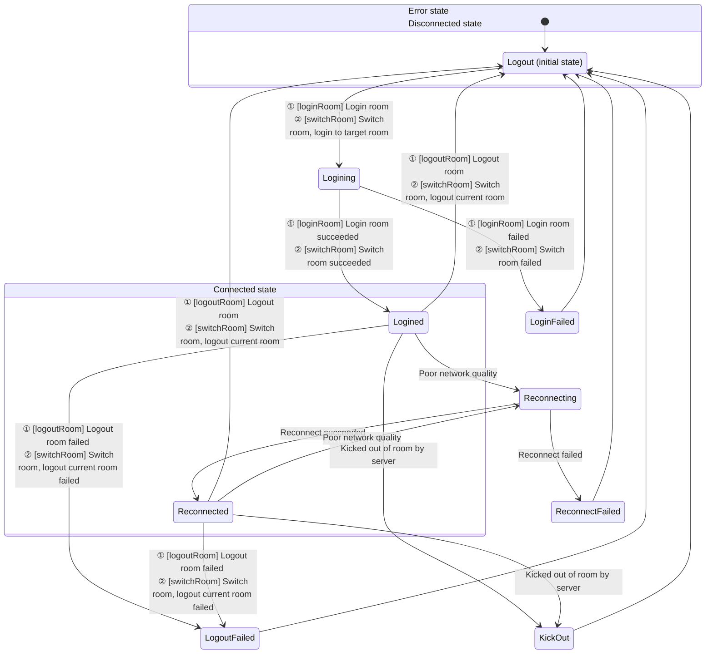

# Media Recording

- - -

## Overview

During video calls, live streaming, and online teaching, users often need to record and save videos for later on-demand viewing. ZEGOCLOUD provides multiple recording solutions to meet recording needs in different scenarios.

<table>

<tbody><tr>
<th>Recording Solution</th>
<th>Overview</th>
<th>Applicable Scenarios</th>
</tr>
<tr>
<td>
[Client-side Local Recording](/real-time-video-flutter/other/local-media-recording)
</td>
<td>
Record your (local user's) audio and video through the client SDK and save them locally.
</td>
<td>
<p>Need to record your (local user's) audio and video and save them to a local device (mobile phone, computer, or other terminal devices). <b>Does not support recording other users' audio and video.</b></p>

<p>Calling method: Start recording by calling the client SDK interface.</p>
</td>
</tr>
<tr>
<td>
[Cloud Recording](/real-time-video-flutter/other/local-media-recording)
</td>
<td>
Record through ZEGO cloud service and save audio and video to your activated cloud storage.
</td>
<td>
- You have already activated third-party cloud storage services, currently supporting Amazon S3, Alibaba Cloud OSS, Tencent Cloud COS, etc.
- Need to record your or others' audio and video.
- Need to distinguish each user in the recording room and obtain separate audio and video files for each user in the room.
- Need to mix and record multiple audio, video, or audio, video and whiteboard streams, mixing all users' audio streams, video streams, and whiteboard in the room into one video file.
- Need to use preset mixing layout templates.

<p>Calling method: Start recording by calling ZEGO server-side API interface.</p>
</td>
</tr>
<tr>
<td>
[CDN Recording](/real-time-video-flutter/other/local-media-recording)
</td>
<td>
Record the live streaming audio and video and save them to ZEGO CDN.
</td>
<td>
- Need to record live streaming audio and video and save them to ZEGO's CDN.
- Need to record your or others' audio and video.

<p>Calling method: After you enable CDN recording in the <a href="https://console.zego.im" target="_blank">ZEGO Console</a>, it is global recording by default and does not require calling server-side API interfaces; if you need selective recording, please call ZEGO server-side API interfaces to start recording.</p>
</td>
</tr>
</tbody></table>

## Solution 1: Client-side Local Recording

<Warning title="Warning">
This document is not currently applicable to the Web platform.
</Warning>

The local media recording component provides the capability of local media recording, recording and storing audio and video data during live streaming to local files.

### Application Scenarios
- Pure local recording: Record local preview without streaming.
- Record while streaming: Record while streaming to save the entire live streaming process to a local file.
- Record short videos during live streaming: During live streaming, record short video segments at any time and save them locally.

### Supported Formats

- Audio and Video: FLV, MP4
- Audio Only: AAC

### Example Source Code Download

Please refer to [Download Example Source Code](/real-time-video-flutter/quick-start/run-example-code) to get the source code.

For related source code, please check the files in the "lib\topics\OtherFunctions\recording" directory.


### Prerequisites

Before implementing the media player function, please ensure:

- You have created a project in the [ZEGOCLOUD Console](https://console.zegocloud.com) and applied for a valid AppID and AppSign. For details, please refer to [Console - Project Information](/console/project-info).
- You have integrated ZEGO Express SDK in your project and implemented basic audio and video streaming functionality. For details, please refer to [Quick Start - Integration](/real-time-video-flutter/quick-start/integrating-sdk) and [Quick Start - Implementation](/real-time-video-flutter/quick-start/implementing-video-call).


### Usage Steps

The recording function interface call flow is shown in the following figure:


{/*
<Frame width="512" height="auto" caption=""></Frame>
*/}

**Set Recording Callback**

Developers need to set [onCapturedDataRecordStateUpdate](https://www.zegocloud.com/unique-api/express-video-sdk/en/dart_flutter/zego_express_engine/ZegoExpressEngine/onCapturedDataRecordStateUpdate.html) and [onCapturedDataRecordProgressUpdate](https://www.zegocloud.com/unique-api/express-video-sdk/en/dart_flutter/zego_express_engine/ZegoExpressEngine/onCapturedDataRecordProgressUpdate.html) callbacks to receive recording information during the recording process.

<Warning title="Warning">
You will receive the set recording callback information only after calling [startRecordingCapturedData](https://www.zegocloud.com/unique-api/express-video-sdk/en/dart_flutter/zego_express_engine/ZegoExpressEngineRecord/startRecordingCapturedData.html) to start recording.
</Warning>


```dart
// Set recording callback
ZegoExpressEngine.onCapturedDataRecordStateUpdate = (ZegoDataRecordState state, int errorCode, ZegoDataRecordConfig config, ZegoPublishChannel channel){
        // Developers can handle recording process state changes based on error codes or recording status here, such as displaying UI prompts on the interface
        ...
};

ZegoExpressEngine.onCapturedDataRecordProgressUpdate = (ZegoDataRecordProgress progress, ZegoDataRecordConfig config, ZegoPublishChannel channel){
        // Developers can handle recording process progress changes based on recording progress here, such as displaying UI prompts on the interface
        ...
};
```

**Start Recording**

Developers need to call [startRecordingCapturedData](https://www.zegocloud.com/unique-api/express-video-sdk/en/dart_flutter/zego_express_engine/ZegoExpressEngineRecord/startRecordingCapturedData.html) to start recording.

- [ZegoPublishChannel](https://www.zegocloud.com/unique-api/express-video-sdk/en/dart_flutter/zego_express_engine/ZegoPublishChannel.html) specifies the media channel for recording. If you are only streaming one stream or only doing local preview, you should use [ZegoPublishChannel.Main](https://www.zegocloud.com/unique-api/express-video-sdk/en/dart_flutter/zego_express_engine/ZegoPublishChannel.html).

- [ZegoDataRecordConfig](https://www.zegocloud.com/unique-api/express-video-sdk/en/dart_flutter/zego_express_engine/ZegoDataRecordConfig-class.html) specifies the recording configuration. You can specify the recording path and the recording type [ZegoDataRecordType](https://www.zegocloud.com/unique-api/express-video-sdk/en/dart_flutter/zego_express_engine/ZegoDataRecordType.html).

If you want to record audio and video, specify it as `ZegoDataRecordType.Default` or `ZegoDataRecordType.AudioAndVideo`. If you only want to record audio, select `ZegoDataRecordType.OnlyAudio`. If you only want to record pure video, select `ZegoDataRecordType.OnlyVideo`.

<Warning title="Warning">

- In the recording configuration specified in [ZegoDataRecordConfig](https://www.zegocloud.com/unique-api/express-video-sdk/en/dart_flutter/zego_express_engine/ZegoDataRecordConfig-class.html), the file path extension must end with ".mp4", ".flv", or ".aac" to specify the recording file format.
- The recording type [ZegoDataRecordType](https://www.zegocloud.com/unique-api/express-video-sdk/en/dart_flutter/zego_express_engine/ZegoDataRecordType.html) is independent of the file extension.

</Warning>


```dart
// Call interfaces such as login room, start streaming, start preview, etc.
...

// Create recording configuration
// For example, if you need to record in mp4 format
var filePath = "path.mp4";
// For example, use the default recording method
var recordType = ZegoDataRecordType.Default;
var config = ZegoDataRecordConfig(filePath, recordType);

// Start recording, use the main channel for recording
ZegoExpressEngine.instance.startRecordingCapturedData(config, channel: ZegoPublishChannel.Main);

```

**Stop Recording**

Developers need to call [stopRecordingCapturedData](https://www.zegocloud.com/unique-api/express-video-sdk/en/dart_flutter/zego_express_engine/ZegoExpressEngineRecord/stopRecordingCapturedData.html) to end recording.

<Warning title="Warning">
During recording, if you exit the room [logoutRoom](https://www.zegocloud.com/unique-api/express-video-sdk/en/dart_flutter/zego_express_engine/ZegoExpressEngineRoom/logoutRoom.html), the SDK will automatically stop recording internally.
</Warning>


```java
ZegoExpressEngine.instance.stopRecordingCapturedData(channel: ZegoPublishChannel.Main);
```

**Play Recording Files**

Recorded files can be played in two ways.

1. Call the system default player to play.

2. Call the [ZegoMediaPlayer](https://www.zegocloud.com/unique-api/express-video-sdk/en/dart_flutter/zego_express_engine/ZegoMediaPlayer-class.html) component in [ZegoExpressEngine](https://www.zegocloud.com/unique-api/express-video-sdk/en/dart_flutter/zego_express_engine/ZegoExpressEngine-class.html) to play. For details, please refer to [Media Player](/real-time-video-flutter/other/media-player).


### FAQ

1. **What packaged file formats are supported for local audio and video recording?**

  Currently, audio and video support FLV and MP4, and pure audio supports AAC. Specify the format through the file path extension. FLV format only supports H.264 encoding, MP4 format supports H.264 and H.265 encoding. Failure to meet these requirements will result in no video or no audio.

2. **What are the requirements for the storage path?**

  The storage path can be any file path that the application has permission to read and write. If a directory path is passed, the callback will return a file write failure.

3. **How to get the size of the recording file during the recording process?**

  The recording progress callback [onCapturedDataRecordProgressUpdate](https://www.zegocloud.com/unique-api/express-video-sdk/en/dart_flutter/zego_express_engine/ZegoExpressEngine/onCapturedDataRecordProgressUpdate.html) can get the recording duration and recording file size.

4. **What happens when passing a file path that already exists?**

  No error will occur, but the original file content will be cleared before writing.

5. **What should I pay attention to when recording with external capture?**

  When using external capture, you also need to call the SDK's [startPreview](https://www.zegocloud.com/unique-api/express-video-sdk/en/dart_flutter/zego_express_engine/ZegoExpressEnginePublisher/startPreview.html) method to start before recording.

6. **Why does the recorded video have green edges?**

  Users need to pay attention not to modify the video encoding resolution during recording and enable traffic control (which dynamically adjusts the encoding resolution based on the network environment when enabled).

7. **Why is there a momentary stutter in the recorded video when stopping streaming during recording?**

  This is due to the internal processing method of the SDK and currently cannot be resolved. Users need to try to avoid this operation.

8. **Does local media recording support recording sounds from "ZegoMediaPlayer/ZegoAudioPlayer/Mixing Function"?**

  You can record sounds from the above input sources, but only sounds mixed into the stream will be recorded. If only played locally, they will not be recorded into the file.


## Solution 2: Cloud Recording

Cloud recording means recording audio and video by calling ZEGO server-side APIs and saving them to your specified CDN. It supports recording audio and video streams of any user during video calls or live streaming, and provides various disaster recovery and security mechanisms.

### Applicable Scenarios

It is applicable to various scenarios that require recording functionality, including but not limited to audio and video calls, live streaming, online classrooms, online meetings, etc.

### Usage Steps

Please refer to [Cloud Recording](/cloud-recording/quick-start/integration).

## Solution 3: CDN Recording

CDN recording refers to saving content being live-streamed via CDN to the corresponding CDN. You need to push audio and video to CDN for live streaming before using this method for recording.

### Applicable Scenarios

Developers need to push audio and video to CDN for live streaming before using this method for recording. If developers are only doing video calls or co-hosting and have not pushed audio and video to CDN, they cannot use this function.

After you enable CDN recording in the [ZEGOCLOUD Console](https://console.zegocloud.com), it is global recording by default and does not require calling server-side API interfaces; if you need selective recording, please call ZEGO server-side API interfaces to start recording.


### Usage Steps

Please refer to [Start CDN Recording](/real-time-video-server/api-reference/cdn/start-cdn-record).
