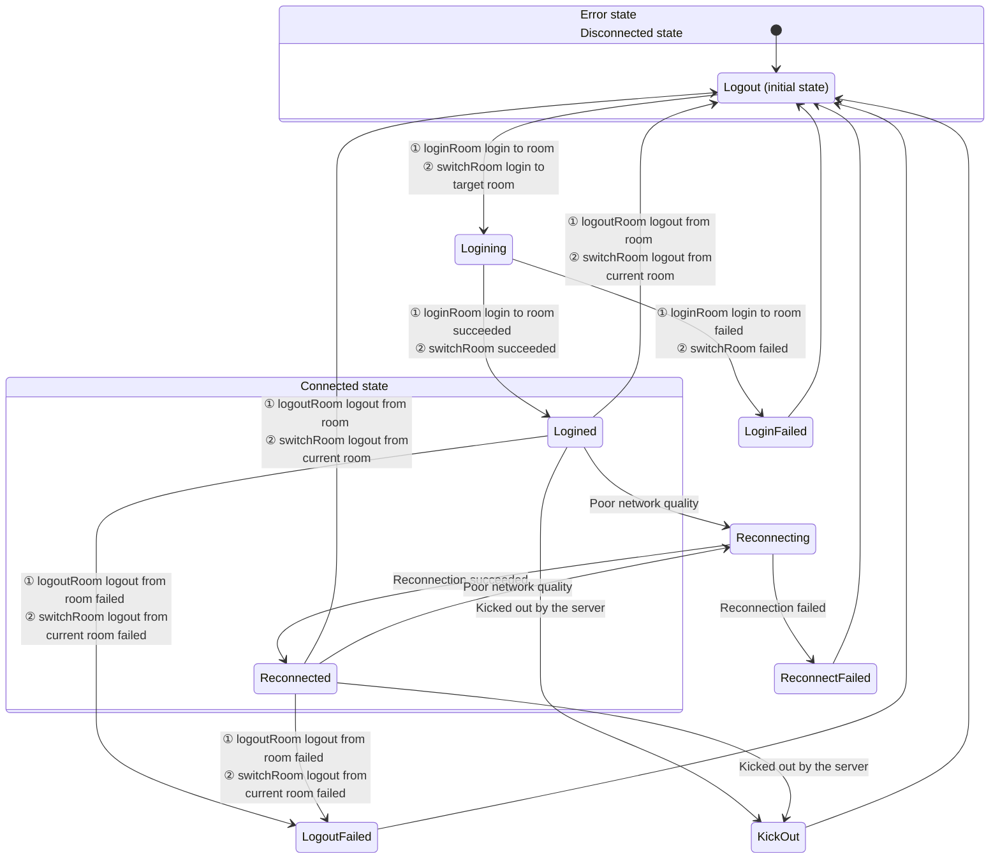

# Room Connection Status Description

- - -

When users use ZEGO Express SDK for audio and video calls or live streaming, they need to join a room first to receive callback notifications about stream additions/deletions, user joins/leaves, etc. from other users in the same room. Therefore, the user's connection status in the room determines whether they can use audio and video services normally.

This document mainly introduces how to determine the user's connection status in the room and the conversion process of each connection status.


## Monitor Room Connection Status

Users can monitor their connection status in the room in real time by listening to the [onRoomStateChanged](https://www.zegocloud.com/unique-api/express-video-sdk/en/dart_flutter/zego_express_engine/ZegoExpressEngine/onRoomStateChanged.html) callback. When the user's connection status changes, the SDK will trigger this callback and provide the reason for the room connection status change (i.e., room connection status) and related error codes in the callback.

If the room connection is interrupted due to poor network quality, the SDK will automatically retry internally. For details, please refer to the [Room Reconnection](/real-time-video-flutter/room/room-connection-status) section.

**Room Status Description**


{/*
<Frame width="512" height="auto" caption=""></Frame>
*/}

Room connection states will convert to each other. Developers can judge various situations through reason and combine errorCode to handle corresponding logic when necessary. reason is [ZegoRoomStateChangedReason](https://www.zegocloud.com/unique-api/express-video-sdk/en/dart_flutter/zego_express_engine/ZegoRoomStateChangedReason.html) data (i.e., room connection state). The specific description is as follows:

<table>

  <tbody><tr>
    <th>State and Reason Enum Value</th>
    <th>Meaning</th>
    <th>Common Events Triggering Entry to This State</th>
  </tr>
  <tr>
    <td>Logining（Logining）</td>
    <td>Logging in to the room. When calling [loginRoom] to login to the room or [switchRoom] to switch to the target room, enter this state, indicating that the connection to the server is being requested. Usually, this state is used to display the application interface.</td>
    <td><ol><li>Call [loginRoom] to login to the room, will enter this state first, at this time errorCode is 0.</li><li>Call [switchRoom] to switch to the target room, the SDK internally requests to login to the target room, at this time errorCode is 0.</li></ol></td>
  </tr>
  <tr>
    <td>Logined（Logined）</td>
    <td>Successfully logged in to the room. After successfully logging in or switching to the room, enter this state, indicating that the login to the room has been successful, and users can normally receive callback notifications about additions and deletions of other users and all streams in the room.</td>
    <td><ol><li>Successfully called [loginRoom] to login to the room, at this time errorCode is 0.</li><li>When calling [switchRoom] to switch to the target room, the SDK internally successfully logs in to the target room, at this time errorCode is 0.</li></ol></td>
  </tr>
  <tr>
    <td>LoginFailed（LoginFailed）</td>
    <td>Failed to login to the room. After failing to login or switch to the room, enter this state, indicating that the login or switch to the room has failed, such as incorrect AppID or Token.</td>
    <td><ol><li>When using Token authentication, the passed Token is incorrect, at this time errorCode is 1002033.</li><li>When the login to the room times out due to network problems, at this time errorCode is 1002053.</li><li>When switching to the target room, the SDK internally fails to login to the target room, at this time errorCode please refer to the above login error description.</li></ol></td>
  </tr>
  <tr>
    <td>Reconnecting（Reconnecting）</td>
    <td>Room connection temporarily interrupted. If the interruption is caused by poor network quality, the SDK will retry internally.</td>
    <td>When the room connection is temporarily interrupted due to poor network quality and reconnection is in progress, at this time errorCode is 1002051.</td>
  </tr>
  <tr>
    <td>Reconnected（Reconnected）</td>
    <td>Room reconnection successful. If the interruption is caused by poor network quality, the SDK will retry internally, and enter this state after successful reconnection.</td>
    <td>When the room connection is temporarily interrupted due to poor network quality and then successfully reconnected, at this time errorCode is 0.</td>
  </tr>
  <tr>
    <td>ReconnectFailed（ReconnectFailed）</td>
    <td>Room reconnection failed. If the interruption is caused by poor network quality, the SDK will retry internally, and enter this state after failed reconnection.</td>
    <td>When the room connection is temporarily interrupted due to poor network quality and then reconnection fails, at this time errorCode is 1002053.</td>
  </tr>
  <tr>
    <td>KickOut（KickOut）</td>
    <td>Kicked out of the room by the server. For example, if the same username logs in to the room elsewhere, causing the local end to be kicked out of the room, will enter this state.</td>
    <td><ol><li>User is kicked out of the room (due to the same userID logging in elsewhere), at this time errorCode is 1002050.</li><li>User is kicked out of the room (developer actively calls the backend's <a target="_blank" href="/real-time-video-server/api-reference/room/kick-out-user">Kick User Out of Room</a> interface), at this time errorCode is 1002055.</li></ol></td>
  </tr>
  <tr>
    <td>Logout（Logout）</td>
    <td>Successfully logged out of the room. Before logging in to the room, it defaults to this state. After successfully calling [logoutRoom] to logout of the room or [switchRoom] internally successfully logging out of the current room, enter this state.</td>
    <td><ol><li>After successfully calling [logoutRoom] to logout of the room, at this time errorCode is 0.</li><li>When calling [switchRoom] to switch rooms, the SDK internally successfully logs out of the current room.</li></ol></td>
  </tr>
  <tr>
    <td>LogoutFailed（LogoutFailed）</td>
    <td>Failed to logout of the room. After failing to call [logoutRoom] to logout of the room or [switchRoom] internally failing to logout of the current room, enter this state.</td>
    <td>In multi-room scenarios, when calling [logoutRoom] to logout of a room, the room ID does not exist, at this time errorCode is 1002002.</td>
  </tr>
</tbody></table>


Developers can refer to the following code to handle common business events:

```dart
ZegoExpressEngine.onRoomStateChanged = (String roomID, ZegoRoomStateChangedReason reason, int errorCode, Map<String, dynamic> extendedData) {
    if(reason == ZegoRoomStateChangedReason.Logining)
    {
        // Logging in
        // Represents the callback during connection triggered by the developer actively calling loginRoom or switchRoom
    }
    else if(reason == ZegoRoomStateChangedReason.Logined)
    {
        // Login successful
        // Currently the callback triggered by the developer actively calling loginRoom successfully or calling switchRoom to successfully switch rooms. Here you can handle the business logic of the first successful login to the room, such as pulling chat room and live room basic information.
    }
    else if(reason == ZegoRoomStateChangedReason.LoginFailed)
    {
        // Login failed
        if (errorCode == 1002033) {
            //When using the login room authentication function, the passed token is wrong
        }
    }
    else if(reason == ZegoRoomStateChangedReason.Reconnecting)
    {
        // Reconnecting
        // Currently the callback triggered by the SDK's successful reconnection after disconnection. It is recommended to display some reconnection UI here
    }
    else if(reason == ZegoRoomStateChangedReason.Reconnected)
    {
        // Reconnection successful
    }
    else if(reason == ZegoRoomStateChangedReason.ReconnectFailed)
    {
        // Reconnection failed
        // When the room connection is completely disconnected, the SDK will no longer retry to reconnect. If developers need to login to the room again, they can actively call the loginRoom interface
        // At this time, you can exit the room/live room/classroom in the business, or manually call the interface to login again
    }
    else if(reason == ZegoRoomStateChangedReason.KickOut)
    {
        // Kicked out of the room
        if (errorCode == 1002050) {
            // User is kicked out of the room (due to the same userID logging in elsewhere)
        }
        else if (errorCode == 1002055) {
            // User is kicked out of the room (developer actively calls the backend's kick user interface)
        }
    }
    else if(reason == ZegoRoomStateChangedReason.Logout)
    {
        // Logout successful
        // Developer actively calls logoutRoom to logout of the room
        // Or calls switchRoom to switch rooms, the SDK internally successfully logs out of the current room
        // Developers can handle the logic of actively logging out of the room callback here
    }
    else if(reason == ZegoRoomStateChangedReason.LogoutFailed)
    {
        // Logout failed
        // Or calls switchRoom to switch rooms, the SDK internally fails to logout of the current room
        // Logout room ID is wrong or does not exist
    }
};
```


## Room Reconnection

After users login to the room, the SDK will automatically reconnect internally when disconnected from the room due to network signal problems/network type switching problems. There are three situations for user reconnection after disconnection:

- Successful reconnection before ZEGO server judges user A's heartbeat timeout
- Successful reconnection after ZEGO server judges user A's heartbeat timeout
- User A reconnection fails

<Note title="Note">


- Heartbeat timeout time is 90s.
- Retry timeout time is 20min.

</Note>


The following figure takes the case where user A and user B have logged in to the same room, and user A is disconnected from the room and then reconnects:

**Case 1: Successful reconnection before ZEGO server judges user A's heartbeat timeout**

<Frame width="512" height="auto" caption=""></Frame>

If user A is briefly disconnected but successfully reconnects within 90s, then user B will not receive the callback notification of [onRoomUserUpdate](https://www.zegocloud.com/unique-api/express-video-sdk/en/dart_flutter/zego_express_engine/ZegoExpressEngine/onRoomUserUpdate.html).

- T0 = 0s: User A's SDK receives the [loginRoom](https://www.zegocloud.com/unique-api/express-video-sdk/en/dart_flutter/zego_express_engine/ZegoExpressEngineRoom/loginRoom.html) request initiated by the client.
- T1 ≈ T0 + 120 ms: Usually 120 ms after calling [loginRoom](https://www.zegocloud.com/unique-api/express-video-sdk/en/dart_flutter/zego_express_engine/ZegoExpressEngineRoom/loginRoom.html), the client can join the room. During the room joining process, user A's client will receive 2 [onRoomStateChanged](https://www.zegocloud.com/unique-api/express-video-sdk/en/dart_flutter/zego_express_engine/ZegoExpressEngine/onRoomStateChanged.html) callbacks, notifying the client that it is connecting to the room (Logining) and that the connection to the room is successful (Logined) respectively.
- T2 ≈ T1 + 100 ms: Due to network transmission delay, user B receives the [onRoomUserUpdate](https://www.zegocloud.com/unique-api/express-video-sdk/en/dart_flutter/zego_express_engine/ZegoExpressEngine/onRoomUserUpdate.html) callback approximately 100 ms later to notify the client that user A has joined the room.
- T3: At a certain time point, user A's uplink network becomes worse due to network disconnection or other reasons. The SDK will try to rejoin the room, and the client will receive the [onRoomStateChanged](https://www.zegocloud.com/unique-api/express-video-sdk/en/dart_flutter/zego_express_engine/ZegoExpressEngine/onRoomStateChanged.html) callback to notify the client that user A is reconnecting after disconnection.
- T5 = T3 + time (less than 90s): User A restores the network within the reconnection time and successfully reconnects. Will receive the [onRoomStateChanged](https://www.zegocloud.com/unique-api/express-video-sdk/en/dart_flutter/zego_express_engine/ZegoExpressEngine/onRoomStateChanged.html) callback to notify the client that user A has successfully reconnected.

**Case 2: Successful reconnection after ZEGO server judges user A's heartbeat timeout**

<Frame width="512" height="auto" caption=""></Frame>

- T0, T1, T2, T3 are the same as [Case 1: Successful reconnection before ZEGO server judges user A's heartbeat timeout](/real-time-video-flutter/room/room-connection-status) in T0, T1, T2, T3.

- T4' ≈ T3 + 90s: User B receives the [onRoomUserUpdate](https://www.zegocloud.com/unique-api/express-video-sdk/en/dart_flutter/zego_express_engine/ZegoExpressEngine/onRoomUserUpdate.html) callback to notify that user A has been disconnected.

- T5' = T3 + time (greater than 90s, less than 20 min): User A restores the network within the reconnection time and successfully reconnects. Will receive the [onRoomStateChanged](https://www.zegocloud.com/unique-api/express-video-sdk/en/dart_flutter/zego_express_engine/ZegoExpressEngine/onRoomStateChanged.html) callback to notify the client that user A has successfully reconnected.

- T6' ≈ T5' + 100ms: Due to network transmission delay, user B receives the [onRoomUserUpdate](https://www.zegocloud.com/unique-api/express-video-sdk/en/dart_flutter/zego_express_engine/ZegoExpressEngine/onRoomUserUpdate.html) callback approximately 100 ms later to notify the client that user A has joined the room.

**Case 3: User A reconnection fails**

<Frame width="512" height="auto" caption=""></Frame>

- T0, T1, T2, T3 are the same as [Case 1: Successful reconnection before ZEGO server judges user A's heartbeat timeout](/real-time-video-flutter/room/room-connection-status) in T0, T1, T2, T3.

- T4'' ≈ T3 + 90s: User B receives the [onRoomUserUpdate](https://www.zegocloud.com/unique-api/express-video-sdk/en/dart_flutter/zego_express_engine/ZegoExpressEngine/onRoomUserUpdate.html) callback to notify that user A has been disconnected.

- T5'' = T3 + 20 min: If user A cannot rejoin the room within 20 consecutive minutes, the SDK will no longer continue to try to reconnect. User A will receive the [onRoomStateChanged](https://www.zegocloud.com/unique-api/express-video-sdk/en/dart_flutter/zego_express_engine/ZegoExpressEngine/onRoomStateChanged.html) callback to notify the client that reconnection has failed.


## Related Documentation

[Does the SDK support reconnection mechanism?](https://www.zegocloud.com/docs/faq/express-reconnect)
