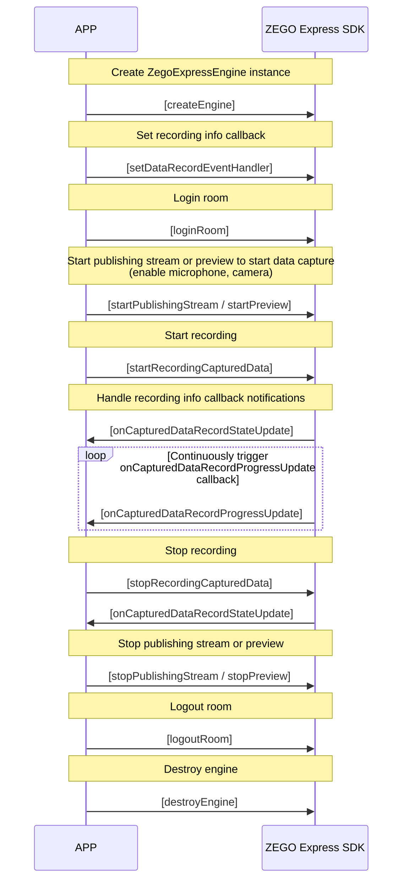

# Audio and Video Recording

- - -

## Introduction

During video calls, live streaming, and online teaching, users often need to record and save videos for subsequent on-demand viewing by other users. ZEGO provides various recording solutions to meet recording needs in different scenarios.

<table>

<tbody><tr>
<th>Recording Solution</th>
<th>Introduction</th>
<th>Applicable Scenarios</th>
</tr>
<tr>
<td><a href="#solution-1-client-side-local-recording" >Client-side Local Recording</a></td>
<td>Record your (local user's) audio and video through the client SDK and save it locally.</td>
<td>
<p>Need to record your (local user's) audio and video and save it to a local device (mobile phone, computer, or other terminal devices). <b>Does not support recording audio and video of other users.</b></p>
<p>Calling method: Start recording by calling the client SDK interface.</p>
</td>
</tr>
<tr>
<td><a href="#solution-2-audio-raw-data-recording" >Audio Raw Data Recording</a></td>
<td>Complete audio recording by obtaining the raw data of audio and saving the raw data locally.</td>
<td>
- Only need to record audio.
- Only need to save locally.
- Need to record your or others' audio.
</td>
</tr>
<tr>
<td><a href="#solution-3-cloud-recording" >Cloud Recording</a></td>
<td>Record through ZEGO cloud services and save the audio and video to your activated cloud storage.</td>
<td>
- You have already activated third-party cloud storage services, currently supporting Amazon S3, Alibaba Cloud OSS, Tencent Cloud COS, etc.
- Need to record your or others' audio and video.
- Need to distinguish each user in the recorded Room and obtain separate audio and video files for each user in the Room.
- Need to mix and record multiple audio, video, or audio, video and whiteboard, and mix all users' audio streams, video streams, and whiteboards in the Room into one video file for recording.
- Need to use preset stream mixing layout templates.

<p>Calling method: Start recording by calling ZEGO server-side API interface.</p>
</td>
</tr>
<tr>
<td><a href="#solution-4-cdn-recording" >CDN Recording</a></td>
<td>Record the live streamed audio and video and save it to ZEGO CDN.</td>
<td>
- Need to record the audio and video of live streaming and save it to ZEGO's CDN.
- Need to record your or others' audio and video.

<p>Calling method: After you enable CDN recording in the <a href="https://console.zego.im" target="_blank">ZEGOCLOUD Console</a>, global recording is enabled by default without calling the server-side API interface; if you need selective recording, please call the ZEGO server-side API interface to start recording.</p>
</td>
</tr>
<tr>
<td><a href="#solution-5-local-server-side-recording" >Local Server-side Recording</a></td>
<td>Record through a server deployed by the developer.</td>
<td>
- You hope to record through your own server to save costs.
- Need to record your or others' audio and video.
- Need to distinguish each user in the recorded Room and obtain separate audio and video files for each user in the Room.
- Need to mix and record multiple audio, video, or audio, video and whiteboard, and mix all users' audio streams, video streams, and whiteboards in the Room into one video file for recording.

<p>Calling method: Start recording by calling the server interface built by the developer.</p>
</td>
</tr>
</tbody></table>

## Solution 1: Client-side Local Recording

During a call or live streaming, record and store the audio and video data you (local user) preview to a local device, saving it as an mp4 or other format file. **Does not support recording audio and video of other users.**

### Applicable Scenarios

- Pure local recording: Record local preview without stream publishing.
- Record while live streaming: Record while stream publishing, saving the entire live streaming process to a local file.
- Record short videos during live streaming: During live streaming, you can record a short video segment at any time and save it locally.
- Only record what you (local user) preview.

### Supported Formats

- Audio and video: FLV, MP4
- Audio only: AAC

### Sample Source Code

Please refer to [Download Sample Source Code](/real-time-video-ios-oc/quick-start/run-example-code) to get the source code.

For related source code, please check the files in the "/ZegoExpressExample/Examples/Others/RecordCapture" directory.

### Prerequisites

Before implementing the recording feature, please ensure:

- You have created a project in the [ZEGOCLOUD Console](https://console.zegocloud.com) and applied for a valid AppID and AppSign. For details, please refer to [Console - Project Information](/console/project-info).
- You have integrated ZEGO Express SDK in the project and implemented basic audio and video publishing and playing functions. For details, please refer to [Quick Start - Integration](/real-time-video-ios-oc/quick-start/integrating-sdk) and [Quick Start - Implementation Flow](/real-time-video-ios-oc/quick-start/implementing-video-call).


### Usage Steps

The calling flow of the recording feature interface is shown in the following figure:


{/*
<Frame width="512" height="auto" caption=""></Frame>
*/}

#### Set recording callback

Developers need to call [setDataRecordEventHandler](https://www.zegocloud.com/article/api?doc=Express_Video_SDK_API~ObjectiveC~class~zego-express-engine#set-data-record-event-handler) to set the callback for the recording feature to receive recording information during the recording process.

<Warning title="Warning">
You will receive the set recording callback information only after calling [startRecordingCapturedData](https://www.zegocloud.com/article/api?doc=Express_Video_SDK_API~ObjectiveC~class~zego-express-engine#start-recording-captured-data-channel) to start recording.
</Warning>

```objc
// Set recording callback
[[ZegoExpressEngine sharedEngine] setDataRecordEventHandler:self];
```

Developers can use this callback [onCapturedDataRecordStateUpdate](@onCapturedDataRecordStateUpdate) to determine the status of file recording or provide UI prompts on the user interface, etc.

Developers can use this callback [onCapturedDataRecordProgressUpdate](@onCapturedDataRecordProgressUpdate) to determine the progress of file recording or provide UI prompts on the user interface, etc.

```objc
// Developers can handle logic for recording process status changes based on error codes or recording status here, such as providing UI prompts on the interface
- (void)onCapturedDataRecordStateUpdate:(ZegoDataRecordState)state errorCode:(int)errorCode config:(ZegoDataRecordConfig *)config channel:(ZegoPublishChannel)channel {
    NSLog(@" Record state update, state: %d, errorCode: %d, file path: %@, record type: %d", (int)state, errorCode, config.filePath, (int)config.recordType);
}

// Developers can handle logic for recording process progress changes based on recording progress here, such as providing UI prompts on the interface
- (void)onCapturedDataRecordProgressUpdate:(ZegoDataRecordProgress *)progress config:(ZegoDataRecordConfig *)config channel:(ZegoPublishChannel)channel {
    NSLog(@" Record progress update, duration: %llu, file size: %llu", progress.duration, progress.currentFileSize);
}
```

#### Start recording

Developers need to call [startRecordingCapturedData](https://www.zegocloud.com/article/api?doc=Express_Video_SDK_API~ObjectiveC~class~zego-express-engine#start-recording-captured-data-channel) to start recording.

- [ZegoPublishChannel](@-ZegoPublishChannel) specifies the media channel for recording. If only publishing one stream or only doing local preview, "ZegoPublishChannelMain" should be used.
- [ZegoDataRecordConfig](@-ZegoDataRecordConfig) specifies the recording configuration. You can specify the recording path and the recording type [ZegoDataRecordType ](@-ZegoDataRecordType).


If you wish to record audio and video, you should specify it as "ZegoDataRecordTypeDefault" or "ZegoDataRecordTypeAudioAndVideo". If you wish to record audio only, select "ZegoDataRecordTypeOnlyAudio". If you only record pure video, select "ZegoDataRecordTypeOnlyVideo".

<Warning title="Warning">

- In the recording configuration specified in [ZegoDataRecordConfig](@-ZegoDataRecordConfig), the file extension of the file path must end with ".mp4", ".flv", or ".aac" to specify the format of the recording file.
- The recording type [ZegoDataRecordType](@-ZegoDataRecordType) is unrelated to the file extension.
</Warning>

```objc
// Interface calls such as login room, start publishing stream, start preview, etc.
...

// This example looks for the Document path
NSArray *docsPathArray = NSSearchPathForDirectoriesInDomains(NSDocumentDirectory,NSUserDomainMask, YES);
NSString *docsPath = [docsPathArray objectAtIndex:0];

// Create recording configuration
ZegoDataRecordConfig *config = [[ZegoDataRecordConfig alloc] init];

// Set recording file path, specify mp4 format
config.filePath = [docsPath stringByAppendingPathComponent:@"ZGRecordCapture.mp4"];

// Set to record audio and video
config.recordType = ZegoDataRecordTypeAudioAndVideo;

// Start recording, use main channel for recording
[[ZegoExpressEngine sharedEngine] startRecordingCapturedData:config channel:ZegoPublishChannelMain];
```


#### Stop recording

Developers need to call [stopRecordingCapturedData](https://www.zegocloud.com/article/api?doc=Express_Video_SDK_API~ObjectiveC~class~zego-express-engine#stop-recording-captured-data) to end recording.

<Warning title="Warning">

During recording, if you leave the Room [logoutRoom](https://www.zegocloud.com/article/api?doc=Express_Video_SDK_API~ObjectiveC~class~zego-express-engine#logout-room), the SDK will actively stop recording internally.
</Warning>


```objc
[[ZegoExpressEngine sharedEngine] stopRecordingCapturedData:ZegoPublishChannelMain];
```

#### Play recording files

For playing recording files, there are two optional methods.

* Call the system's default player for playback.

* Call the ZegoMediaPlayer component in ZegoExpressEngine for playback. For details, please refer to [Media Player](/real-time-video-ios-oc/other/media-player).

### FAQ

1. **What formats of packaged files are supported for local audio and video recording?**

  Currently audio and video support FLV and MP4, and audio only supports AAC. The format is specified by the file extension. FLV format only supports H.264 encoding, MP4 format supports H.264 and H.265 encoding. If not met, there will be no picture or no audio.

2. **What are the requirements for storage path?**

  The storage path can be any file path that the application has permission to read and write. If a directory path is passed, the callback will return file write failure.

3. **How to get the size of the recording file during the recording process?**

  The recording duration and recording file size can be obtained in the recording progress callback [onCapturedDataRecordProgressUpdate](https://www.zegocloud.com/article/api?doc=Express_Video_SDK_API~ObjectiveC~protocol~zego-data-record-event-handler#on-captured-data-record-progress-update-config-channel).

4. **How does the SDK handle passing a file path that already exists?**

  It will not cause an error, but the original file content will be cleared before writing.

5. **What should I pay attention to when recording with external capture?**

  When using external capture, you also need to call the SDK's [startPreview](https://www.zegocloud.com/article/api?doc=Express_Video_SDK_API~ObjectiveC~class~zego-express-engine#start-preview) method to start before recording.

6. **Why does the recorded video have green edges?**

  Users need to pay attention not to modify the video encoding resolution during the recording process. Enable flow control (when enabled, the encoding resolution will be dynamically adjusted according to the network environment).

7. **Why is there a momentary stutter in the recorded video when stopping stream publishing during the recording process?**

  This is due to the SDK's internal processing method and currently cannot be resolved. Users need to try to avoid this operation as much as possible.

8. **Does local media recording support recording sounds from "ZegoMediaPlayer/ZegoAudioPlayer/Mixing functionality"?**

  You can record sounds from the above input sources, but only sounds mixed into the stream publishing will be recorded. If played locally only, they will not be recorded into the file.

9. **Why can't the file generated by local recording be opened (cannot play normally)?**

  You need to first confirm whether the end recording interface was called to properly end the recording. If the recording is not properly ended, the generated recording file cannot be opened.

## Solution 2: Audio Raw Data Recording

Complete audio recording by obtaining the raw data of audio and saving the raw data locally.

### Applicable Scenarios

- Only need to record audio.
- Only need to save locally.
- Need to record your or others' audio.

### Usage Steps

Please refer to [Get the Raw Audio Data](/real-time-video-ios-oc/audio/get-audio-raw-data).

## Solution 3: Cloud Recording

Cloud recording records audio and video by calling ZEGO server-side API and saves them to your specified CDN. It supports recording audio and video streams of any user in video calls or live streaming, and provides various disaster recovery and security mechanisms.

### Applicable Scenarios

Suitable for various scenarios requiring recording functionality, including but not limited to audio and video calls, live streaming, online classrooms, online meetings, etc.

### Usage Steps

Please refer to [Cloud Recording](/cloud-recording/quick-start/integration).

## Solution 4: CDN Recording

CDN recording refers to saving content being live streamed through CDN to the corresponding CDN. You need to publish audio and video to CDN for live streaming before you can use this method for recording.

### Applicable Scenarios

Developers need to publish audio and video to CDN for live streaming before they can use this method for recording. If developers are only conducting video calls or co-hosting and have not published audio and video to CDN, they cannot use this feature.

After you enable CDN recording in the [ZEGOCLOUD Console](https://console.zego.im), global recording is enabled by default without calling the server-side API interface; if you need selective recording, please call the ZEGO server-side API interface to start recording.


### Usage Steps

Please refer to [Start CDN Recording](/real-time-video-server/api-reference/cdn/start-cdn-record).


## Solution 5: Local Server-side Recording

Developers integrate ZEGO's server-side recording plugin themselves and deploy it on their own servers. Then developers start recording by accessing their own server interfaces. For details, please refer to [Local Server-side Recording](/local-recording-linux-cpp/overview).

### Applicable Scenarios

This solution is suitable if you have your own server-side development team and are capable of deploying dedicated servers for audio and video recording and can handle large-scale concurrency issues.

### Usage Steps

Please refer to [Local Server-side Recording](/live-streaming-uniapp/quick-start/integrating-sdk).
