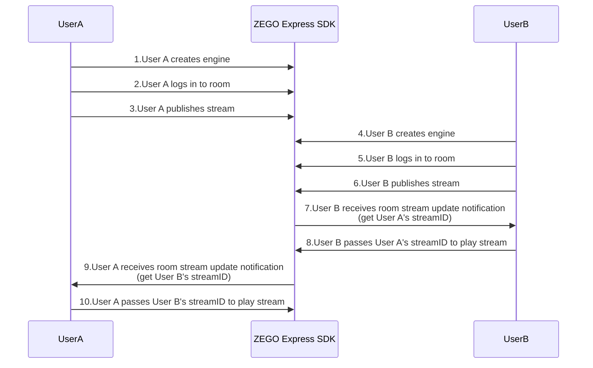
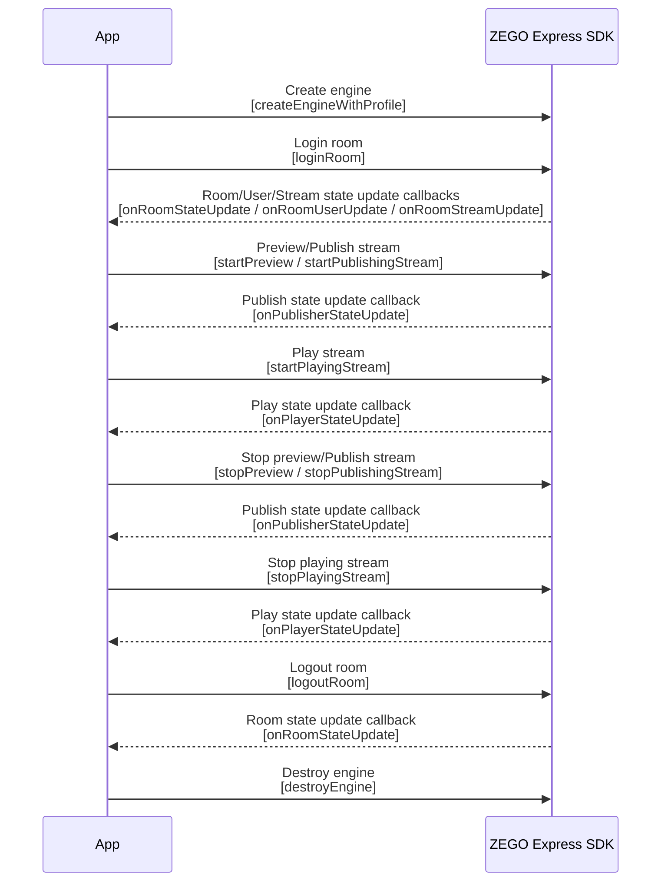

# Implement Video Call

---


## Feature Introduction

This article will introduce how to quickly implement a simple real-time audio and video call.

Related concept explanations:

- ZEGO Express SDK: Real-time audio and video SDK provided by ZEGO, which can provide developers with convenient access, high definition and smoothness, multi-platform interoperability, low latency, and high concurrency audio and video services.
- Stream: Refers to a group of audio and video data that is continuously being sent, encapsulated in a specified encoding format. A user can publish multiple streams at the same time (for example, one for camera data and one for screen sharing data) and can also play multiple streams at the same time. Each stream is identified by a stream ID (streamID).
- Publish stream: The process of pushing packaged audio and video data streams to the ZEGOCLOUD.
- Play stream: The process of pulling and playing existing audio and video data streams from the ZEGOCLOUD.
- Room: An audio and video space service provided by ZEGO, used to organize user groups. Users in the same room can send and receive real-time audio, video, and messages to each other.
    1. Users need to login to a room first before they can publish and play streams.
    2. Users can only receive relevant messages in the room they are in (user entry/exit, audio and video stream changes, etc.).
    3. Each room is identified by a unique roomID within an AppID. All users who login to the room using the same roomID belong to the same room.


## Prerequisites

Before implementing basic real-time audio and video functions, please ensure:

- You have integrated ZEGO Express SDK in the project and implemented basic real-time audio and video functions. For details, please refer to [Quick Start - Integration](/real-time-video-ios-oc/quick-start/integrating-sdk).
- You have created a project in the [ZEGOCLOUD Console](https://console.zegocloud.com) and applied for a valid AppID and AppSign. 

<Warning title="Warning">

The SDK also supports Token authentication. If you have higher security requirements for your project, it is recommended to upgrade the authentication method. For details, please refer to [How to upgrade from AppSign authentication to Token authentication](https://www.zegocloud.com/docs/faq/express-token-upgrade).
</Warning>

## Sample Code
We provide sample code that implements the basic flow of video calls, which can be used as a reference during development.
<Accordion title="Implement Video Call Code" defaultOpen="false">

```objc
//
//  ViewController.m
//  ZegoExpressExample
//
//  Copyright © 2022 Zego. All rights reserved.
//

#import "ViewController.h"
#import <ZegoExpressEngine/ZegoExpressEngine.h>

@interface ViewController ()<ZegoEventHandler>
//View for playing other users' audio and video streams
@property (strong, nonatomic) UIView *remoteUserView;
//Button to start video call
@property (strong, nonatomic) UIButton *startVideoTalkButton;
//Button to stop video call
@property (strong, nonatomic) UIButton *stopVideoTalkButton;


@end

@implementation ViewController

- (void)viewDidLoad {
    [super viewDidLoad];
    [self setupUI];
}

- (void)setupUI {
    self.remoteUserView = [[UIView alloc] initWithFrame:CGRectMake(100, 100, 180, 250)];
    self.remoteUserView.backgroundColor = [UIColor lightGrayColor];
    [self.view addSubview:self.remoteUserView];

    self.startVideoTalkButton = [UIButton buttonWithType:UIButtonTypeSystem];
    [self.view addSubview:self.startVideoTalkButton];
    self.startVideoTalkButton.frame = CGRectMake(100, self.view.bounds.size.height - 280, 150, 50);
    [self.startVideoTalkButton.titleLabel setFont:[UIFont systemFontOfSize:32]];
    [self.startVideoTalkButton setTitle:@"Start Call" forState:UIControlStateNormal];
    [self.startVideoTalkButton addTarget:self action:@selector(startVideoTalk:) forControlEvents:UIControlEventTouchUpInside];

    self.stopVideoTalkButton = [UIButton buttonWithType:UIButtonTypeSystem];
    [self.view addSubview:self.stopVideoTalkButton];
    self.stopVideoTalkButton.frame = CGRectMake(100, self.view.bounds.size.height - 200, 150, 50);
    [self.stopVideoTalkButton.titleLabel setFont:[UIFont systemFontOfSize:32]];
    [self.stopVideoTalkButton setTitle:@"Stop Call" forState:UIControlStateNormal];
    [self.stopVideoTalkButton setTitleColor:[UIColor redColor] forState:UIControlStateNormal];
    [self.stopVideoTalkButton addTarget:self action:@selector(stopVideoTalk:) forControlEvents:UIControlEventTouchUpInside];
}

- (void)startVideoTalk:(UIButton *)button {
    [self createEngine];
    [self loginRoom];
    [self startPublish];
}

- (void)stopVideoTalk:(UIButton *)button {
    [[ZegoExpressEngine sharedEngine] logoutRoom];
    [ZegoExpressEngine destroyEngine:^{

    }];
}

- (void)createEngine {
    ZegoEngineProfile *profile = [[ZegoEngineProfile alloc] init];
    // Please obtain through official website registration, format: 1234567890
    profile.appID = <#appID#>;
    // Please obtain through official website registration, format: @"0123456789012345678901234567890123456789012345678901234567890123" (64 characters in total)
    profile.appSign = @"<#appSign#>";
    // General scenario access, please select the appropriate scenario according to the actual situation
    profile.scenario = ZegoScenarioDefault;
    // Create engine and register self as eventHandler callback. If you don't need to register callback, eventHandler parameter can be nil, and you can call "-setEventHandler:" method later to set callback
    [ZegoExpressEngine createEngineWithProfile:profile eventHandler:self];
}

- (void)loginRoom {
    // roomID is generated locally, need to ensure "roomID" is globally unique. Different users need to login to the same room to make calls
    NSString *roomID = @"room1";

    // Create user object. ZegoUser's constructor method userWithUserID will set "userName" to be the same as the passed parameter "userID". "userID" and "userName" cannot be "nil", otherwise login room will fail.
    // userID is generated locally, need to ensure "userID" is globally unique.
    ZegoUser *user = [ZegoUser userWithUserID:@"user1"];

    // Only by passing in ZegoRoomConfig with "isUserStatusNotify" parameter value of "true" can you receive onRoomUserUpdate callback.
    ZegoRoomConfig *roomConfig = [[ZegoRoomConfig alloc] init];
    //If you use appsign for authentication, you don't need to fill in the token parameter; if you need to use a more secure authentication method: token authentication, please refer to [How to upgrade from AppSign authentication to Token authentication](https://www.zegocloud.com/docs/faq/express-token-upgrade)

    // roomConfig.token = @"<#token#>";

    roomConfig.isUserStatusNotify = YES;
    // Login room
    [[ZegoExpressEngine sharedEngine] loginRoom:roomID user:user config:roomConfig callback:^(int errorCode, NSDictionary * _Nullable extendedData) {
        // (Optional callback) Login room result. If you only care about login result, just pay attention to this callback
        if (errorCode == 0) {
            NSLog(@"Room login successful");
        } else {
            // Login failed, please refer to errorCode description /real-time-video-ios-oc/client-sdk/error-code
            NSLog(@"Room login failed");
        }
    }];
}

- (void)startPublish {
    // Set local preview view and start preview. View mode uses SDK's default mode, proportional scaling to fill the entire View
    [[ZegoExpressEngine sharedEngine] startPreview:[ZegoCanvas canvasWithView:self.view]];

    // After user calls loginRoom, call this interface to publish stream
    // Under the same AppID, developers need to ensure "streamID" is globally unique. If different users each publish a stream with the same "streamID", the user who publishes later will fail to publish.
    [[ZegoExpressEngine sharedEngine] startPublishingStream:@"stream1"];
}

//After locally calling loginRoom to join the room, you can monitor your connection status in this room in real time by listening to onRoomStateChanged callback.
//For more information, please refer to /real-time-video-ios-oc/room-capability/room-connection-status
-(void)onRoomStateChanged:(ZegoRoomStateChangedReason)reason errorCode:(int)errorCode extendedData:(NSDictionary *)extendedData roomID:(NSString *)roomID {
    if(reason == ZegoRoomStateChangedReasonLogining) {
        // Logging in to the room. When calling [loginRoom] to login to the room or [switchRoom] to switch to the target room, enter this status, indicating that a request to connect to the server is in progress. Usually this status is used to display the application interface.
    } else if(reason == ZegoRoomStateChangedReasonLogined) {
        //Login room successful. After successfully logging in to the room or switching rooms, enter this status, indicating that login to the room has been successful, and users can normally receive callback notifications for additions and deletions of other users and all stream information in the room.
        //Only when the room status is login successful or reconnection successful can publishing streams (startPublishingStream) and playing streams (startPlayingStream) normally send and receive audio and video
    } else if(reason == ZegoRoomStateChangedReasonLoginFailed) {
        //Login room failed. After failing to login to the room or switch rooms, enter this status, indicating that login to the room or switching rooms has failed, such as incorrect AppID or Token.
    } else if(reason == ZegoRoomStateChangedReasonReconnecting) {
        //Room connection temporarily interrupted. If the interruption is caused by poor network quality, the SDK will perform internal retries.
    } else if(reason == ZegoRoomStateChangedReasonReconnected) {
        //Room reconnection successful. If the interruption is caused by poor network quality, the SDK will perform internal retries, and enter this status after successful reconnection.
    } else if(reason == ZegoRoomStateChangedReasonReconnectFailed) {
        //Room reconnection failed. If the interruption is caused by poor network quality, the SDK will perform internal retries, and enter this status after failed reconnection.
    } else if(reason == ZegoRoomStateChangedReasonKickOut) {
        //Kicked out of the room by the server. For example, if a user with the same username logs in to the room elsewhere, causing the local end to be kicked out of the room, enter this status.
    } else if(reason == ZegoRoomStateChangedReasonLogout) {
        //Logout room successful. This is the default status before logging in to the room. After successfully calling [logoutRoom] to logout of the room or [switchRoom] successfully logging out of the current room internally, enter this status.
    } else if(reason == ZegoRoomStateChangedReasonLogoutFailed) {
        //Logout room failed. After failing to call [logoutRoom] to logout of the room or [switchRoom] failing to logout of the current room internally, enter this status.
    }
}

//When other users in the room publish/stop publishing streams, we will receive notifications of corresponding stream additions and deletions here
- (void)onRoomStreamUpdate:(ZegoUpdateType)updateType streamList:(NSArray<ZegoStream *> *)streamList extendedData:(NSDictionary *)extendedData roomID:(NSString *)roomID {
    //When updateType is ZegoUpdateTypeAdd, it represents that there is a new audio and video stream. At this time, we can call startPlayingStream interface to play this audio and video stream
    if (updateType == ZegoUpdateTypeAdd) {
        // Start playing stream, set remote playing rendering view, view mode uses SDK's default mode, proportional scaling to fill the entire View
        // The following remoteUserView is a View on the UI interface. Here, to make the sample code more concise, we only play the first stream in the newly added audio and video stream list. In actual business, it is recommended that developers loop through streamList and play each audio and video stream
        NSString *streamID = streamList[0].streamID;
        [[ZegoExpressEngine sharedEngine] startPlayingStream:streamID canvas:[ZegoCanvas canvasWithView:self.remoteUserView]];
    }
}

//When other users in the same room enter/leave the room, you can receive notifications through this callback. When the parameter ZegoUpdateType in the callback is ZegoUpdateTypeAdd, it means a user has entered the room; when ZegoUpdateType is ZegoUpdateTypeDelete, it means a user has left the room.
// Only when the isUserStatusNotify parameter in ZegoRoomConfig passed when logging in to the room loginRoom is YES can users receive callbacks of other users in the room.
// The onRoomUserUpdate callback is not guaranteed to be effective when the number of people in the room exceeds 500. If your business scenario has more than 500 people in the room, please contact ZEGOCLOUD Technical Support.
- (void)onRoomUserUpdate:(ZegoUpdateType)updateType userList:(NSArray<ZegoUser *> *)userList roomID:(NSString *)roomID {
    if (updateType == ZegoUpdateTypeAdd) {
        for (ZegoUser *user in userList) {
            NSLog(@"User %@ entered room %@", user.userName, roomID);
        }
    } else if (updateType == ZegoUpdateTypeDelete) {
        for (ZegoUser *user in userList) {
            NSLog(@"User %@ left room %@", user.userName, roomID);
        }
    }
}

//Status notification of user publishing audio and video stream
//When the status of user publishing audio and video stream changes, this callback will be received. If the network interruption causes publishing stream exception, the SDK will also notify the status change while retrying to publish stream.
- (void)onPublisherStateUpdate:(ZegoPublisherState)state errorCode:(int)errorCode extendedData:(NSDictionary *)extendedData streamID:(NSString *)streamID {
    if (errorCode != 0) {
        NSLog(@"Publishing stream status error errorCode: %d", errorCode);
    } else {
        switch (state) {
            case ZegoPublisherStatePublishing:
                NSLog(@"Publishing stream");
                break;
            case ZegoPublisherStatePublishRequesting:
                NSLog(@"Requesting to publish stream");
                break;
            case ZegoPublisherStateNoPublish:
                NSLog(@"Not publishing stream");
                break;
        }
    }
}

//Status notification of user playing audio and video stream
//When the status of user playing audio and video stream changes, this callback will be received. If the network interruption causes playing stream exception, the SDK will automatically retry.
- (void)onPlayerStateUpdate:(ZegoPlayerState)state errorCode:(int)errorCode extendedData:(NSDictionary *)extendedData streamID:(NSString *)streamID {
    if (errorCode != 0) {
        NSLog(@"Playing stream status error streamID: %@, errorCode:%d", streamID, errorCode);
    } else {
        switch (state) {
            case ZegoPlayerStatePlaying:
                NSLog(@"Playing stream");
                break;
            case ZegoPlayerStatePlayRequesting:
                NSLog(@"Requesting to play stream");
                break;
            case ZegoPlayerStateNoPlay:
                NSLog(@"Not playing stream");
                break;
        }
    }
}

// You can receive the uplink and downlink network quality of users in the room (including yourself) by listening to the onNetworkQuality callback. This callback will be received every two seconds. For network quality levels, please refer to ZegoStreamQualityLevel.
- (void)onNetworkQuality:(NSString *)userID upstreamQuality:(ZegoStreamQualityLevel)upstreamQuality downstreamQuality:(ZegoStreamQualityLevel)downstreamQuality {
    if (userID == nil) {
        // Represents the network quality of the local user (me)
//        NSLog(@"My uplink network quality is %lu", (unsigned long)upstreamQuality);
//        NSLog(@"My downlink network quality is %lu", (unsigned long)downstreamQuality);
    } else {
        //Represents the network quality of other users in the room
//        NSLog(@"User %@'s uplink network quality is %lu", userID, (unsigned long)upstreamQuality);
//        NSLog(@"User %@'s downlink network quality is %lu", userID, (unsigned long)downstreamQuality);
    }

    /*
     ZegoStreamQualityLevelExcellent Network quality excellent
     ZegoStreamQualityLevelGood Network quality good
     ZegoStreamQualityLevelMedium Network quality normal
     ZegoStreamQualityLevelBad Network quality poor
     ZegoStreamQualityLevelDie Network abnormal
     ZegoStreamQualityLevelUnknown Network quality unknown
     */
}


@end

```
</Accordion>

<a id="process"></a>

## Implementation Flow


The basic flow for users to make video calls through ZEGO Express SDK is:

User A and User B push and pull each other's streams: both users create engines, log in to rooms, publish streams, and then receive room stream update notifications to play each other's streams.


{/*
<Frame width="512" height="auto" caption="">
  
</Frame>
*/}


<a id="initialization"> </a>

### 1 Initialization

**1. Create user interface**

Create a user interface for video calls in your project according to scenario needs. We recommend that you add the following elements to your project:

- Local video window
- Remote video window
- Call button

<Frame width="512" height="auto" caption=""></Frame>


**2. Import header files and prepare basic work**

<Accordion title="Sample Code" defaultOpen="false">
```objc
// Import ZegoExpressEngine.h header file
#import <ZegoExpressEngine/ZegoExpressEngine.h>

@interface ViewController ()<ZegoEventHandler>
//View for playing other users' audio and video streams
@property (strong, nonatomic) UIView *remoteUserView;
//Button to start video call
@property (strong, nonatomic) UIButton *startVideoTalkButton;
//Button to stop video call
@property (strong, nonatomic) UIButton *stopVideoTalkButton;

@end
```


```objc
- (void)viewDidLoad {
    [super viewDidLoad];
    [self setupUI];
}

- (void)setupUI {
    self.remoteUserView = [[UIView alloc] initWithFrame:CGRectMake(100, 100, 180, 250)];
    self.remoteUserView.backgroundColor = [UIColor lightGrayColor];
    [self.view addSubview:self.remoteUserView];

    self.startVideoTalkButton = [UIButton buttonWithType:UIButtonTypeSystem];
    [self.view addSubview:self.startVideoTalkButton];
    self.startVideoTalkButton.frame = CGRectMake(100, self.view.bounds.size.height - 280, 150, 50);
    [self.startVideoTalkButton.titleLabel setFont:[UIFont systemFontOfSize:32]];
    [self.startVideoTalkButton setTitle:@"Start Call" forState:UIControlStateNormal];
    [self.startVideoTalkButton addTarget:self action:@selector(startVideoTalk:) forControlEvents:UIControlEventTouchUpInside];

    self.stopVideoTalkButton = [UIButton buttonWithType:UIButtonTypeSystem];
    [self.view addSubview:self.stopVideoTalkButton];
    self.stopVideoTalkButton.frame = CGRectMake(100, self.view.bounds.size.height - 200, 150, 50);
    [self.stopVideoTalkButton.titleLabel setFont:[UIFont systemFontOfSize:32]];
    [self.stopVideoTalkButton setTitle:@"Stop Call" forState:UIControlStateNormal];
    [self.stopVideoTalkButton setTitleColor:[UIColor redColor] forState:UIControlStateNormal];
    [self.stopVideoTalkButton addTarget:self action:@selector(stopVideoTalk:) forControlEvents:UIControlEventTouchUpInside];
}

- (void)startVideoTalk:(UIButton *)button {
    [self createEngine];
    [self loginRoom];
    [self startPublish];
}

```
</Accordion>

<h1 id="CreateEngine"> </h1>

**3. Create engine**

Call the [createEngineWithProfile](@createEngineWithProfile) interface and pass the obtained AppID and AppSign to the parameters "appID" and "appSign".

Select an appropriate scenario according to the actual audio and video business of the App. Please refer to the [Scenario-based Audio and Video Configuration](/real-time-video-ios-oc/quick-start/scenario-based-audio-video-configuration) document and pass the selected scenario enumeration to the parameter "scenario".


<Warning title="Warning">
The SDK also supports Token authentication. If you have higher security requirements for your project, it is recommended to upgrade the authentication method. For details, please refer to [How to upgrade from AppSign authentication to Token authentication](https://www.zegocloud.com/docs/faq/express-token-upgrade).
</Warning>
<Warning title="Warning">If it is a voice scenario, please be sure to call `enableCamera(false)` to turn off the camera to avoid starting video capture and publishing stream, which generates additional video traffic.</Warning>

```objc
- (void)createEngine {
    ZegoEngineProfile *profile = [[ZegoEngineProfile alloc] init];
    // Please obtain through official website registration, format: 1234567890
    profile.appID = <#appID#>;
    // Please obtain through official website registration, format: @"0123456789012345678901234567890123456789012345678901234567890123" (64 characters in total)
    profile.appSign = <#appSign#>;
    // Specify using live streaming scenario (please fill in the scenario suitable for your business according to the actual situation)
    profile.scenario = ZegoScenarioBroadcast;
    // Create engine and register self as eventHandler callback. If you don't need to register callback, eventHandler parameter can be nil, and you can call "-setEventHandler:" method later to set callback
    [ZegoExpressEngine createEngineWithProfile:profile eventHandler:self];
}
```

**4. Set callback**

You can instantiate a class that implements the [ZegoEventHandler](@-ZegoEventHandler) interface (such as `self`) and implement the required callback methods to listen to and handle the event callbacks you care about. Then pass the instantiated object as the `eventHandler` parameter to [createEngineWithProfile](@createEngineWithProfile) or pass it to [setEventHandler](@setEventHandler-ZegoExpressEngine) to register the callback

<Warning title="Warning">


It is recommended to register the callback immediately when creating the engine or after creating the engine, to avoid missing event notifications due to delayed registration.
</Warning>


<Accordion title="Common Notification Callbacks" defaultOpen="false">
```objc
//After locally calling loginRoom to join the room, you can monitor your connection status in this room in real time by listening to onRoomStateChanged callback.
//For more information, please refer to /real-time-video-ios-oc/room-capability/room-connection-status
-(void)onRoomStateChanged:(ZegoRoomStateChangedReason)reason errorCode:(int)errorCode extendedData:(NSDictionary *)extendedData roomID:(NSString *)roomID {
    if(reason == ZegoRoomStateChangedReasonLogining) {
        // Logging in to the room. When calling [loginRoom] to login to the room or [switchRoom] to switch to the target room, enter this status, indicating that a request to connect to the server is in progress. Usually this status is used to display the application interface.
    } else if(reason == ZegoRoomStateChangedReasonLogined) {
        //Login room successful. After successfully logging in to the room or switching rooms, enter this status, indicating that login to the room has been successful, and users can normally receive callback notifications for additions and deletions of other users and all stream information in the room.
        //Only when the room status is login successful or reconnection successful can publishing streams (startPublishingStream) and playing streams (startPlayingStream) normally send and receive audio and video
    } else if(reason == ZegoRoomStateChangedReasonLoginFailed) {
        //Login room failed. After failing to login to the room or switch rooms, enter this status, indicating that login to the room or switching rooms has failed, such as incorrect AppID or AppSign.
    } else if(reason == ZegoRoomStateChangedReasonReconnecting) {
        //Room connection temporarily interrupted. If the interruption is caused by poor network quality, the SDK will perform internal retries.
    } else if(reason == ZegoRoomStateChangedReasonReconnected) {
        //Room reconnection successful. If the interruption is caused by poor network quality, the SDK will perform internal retries, and enter this status after successful reconnection.
    } else if(reason == ZegoRoomStateChangedReasonReconnectFailed) {
        //Room reconnection failed. If the interruption is caused by poor network quality, the SDK will perform internal retries, and enter this status after failed reconnection.
    } else if(reason == ZegoRoomStateChangedReasonKickOut) {
        //Kicked out of the room by the server. For example, if a user with the same username logs in to the room elsewhere, causing the local end to be kicked out of the room, enter this status.
    } else if(reason == ZegoRoomStateChangedReasonLogout) {
        //Logout room successful. This is the default status before logging in to the room. After successfully calling [logoutRoom] to logout of the room or [switchRoom] successfully logging out of the current room internally, enter this status.
    } else if(reason == ZegoRoomStateChangedReasonLogoutFailed) {
        //Logout room failed. After failing to call [logoutRoom] to logout of the room or [switchRoom] failing to logout of the current room internally, enter this status.
    }
}

//When other users in the room publish/stop publishing streams, we will receive notifications of corresponding stream additions and deletions here
- (void)onRoomStreamUpdate:(ZegoUpdateType)updateType streamList:(NSArray<ZegoStream *> *)streamList extendedData:(NSDictionary *)extendedData roomID:(NSString *)roomID {
    //When updateType is ZegoUpdateTypeAdd, it represents that there is a new audio and video stream. At this time, we can call startPlayingStream interface to play this audio and video stream
    if (updateType == ZegoUpdateTypeAdd) {
        NSString *streamID = streamList[0].streamID;
        //[[ZegoExpressEngine sharedEngine] startPlayingStream:streamID canvas:[ZegoCanvas canvasWithView:self.remoteUserView]];
    }
}

//When other users in the same room enter/leave the room, you can receive notifications through this callback. When the parameter ZegoUpdateType in the callback is ZegoUpdateTypeAdd, it means a user has entered the room; when ZegoUpdateType is ZegoUpdateTypeDelete, it means a user has left the room.
// Only when the isUserStatusNotify parameter in ZegoRoomConfig passed when logging in to the room loginRoom is YES can users receive callbacks of other users in the room.
// The onRoomUserUpdate callback is not guaranteed to be effective when the number of people in the room exceeds 500. If your business scenario has more than 500 people in the room, please contact ZEGOCLOUD Technical Support.
- (void)onRoomUserUpdate:(ZegoUpdateType)updateType userList:(NSArray<ZegoUser *> *)userList roomID:(NSString *)roomID {
    if (updateType == ZegoUpdateTypeAdd) {
        for (ZegoUser *user in userList) {
            NSLog(@"User %@ entered room %@", user.userName, roomID);
        }
    } else if (updateType == ZegoUpdateTypeDelete) {
        for (ZegoUser *user in userList) {
            NSLog(@"User %@ left room %@", user.userName, roomID);
        }
    }
}

//Status notification of user publishing audio and video stream
//When the status of user publishing audio and video stream changes, this callback will be received. If the network interruption causes publishing stream exception, the SDK will also notify the status change while retrying to publish stream.
- (void)onPublisherStateUpdate:(ZegoPublisherState)state errorCode:(int)errorCode extendedData:(NSDictionary *)extendedData streamID:(NSString *)streamID {
    if (errorCode != 0) {
        NSLog(@"Publishing stream status error errorCode: %d", errorCode);
    } else {
        switch (state) {
            case ZegoPublisherStatePublishing:
                NSLog(@"Publishing stream");
                break;
            case ZegoPublisherStatePublishRequesting:
                NSLog(@"Requesting to publish stream");
                break;
            case ZegoPublisherStateNoPublish:
                NSLog(@"Not publishing stream");
                break;
        }
    }
}

//Status notification of user playing audio and video stream
//When the status of user playing audio and video stream changes, this callback will be received. If the network interruption causes playing stream exception, the SDK will automatically retry.
- (void)onPlayerStateUpdate:(ZegoPlayerState)state errorCode:(int)errorCode extendedData:(NSDictionary *)extendedData streamID:(NSString *)streamID {
    if (errorCode != 0) {
        NSLog(@"Playing stream status error streamID: %@, errorCode:%d", streamID, errorCode);
    } else {
        switch (state) {
            case ZegoPlayerStatePlaying:
                NSLog(@"Playing stream");
                break;
            case ZegoPlayerStatePlayRequesting:
                NSLog(@"Requesting to play stream");
                break;
            case ZegoPlayerStateNoPlay:
                NSLog(@"Not playing stream");
                break;
        }
    }
}

// You can receive the uplink and downlink network quality of users in the room (including yourself) by listening to the onNetworkQuality callback. This callback will be received every two seconds. For network quality levels, please refer to ZegoStreamQualityLevel.
- (void)onNetworkQuality:(NSString *)userID upstreamQuality:(ZegoStreamQualityLevel)upstreamQuality downstreamQuality:(ZegoStreamQualityLevel)downstreamQuality {
    if (userID == nil) {
        // Represents the network quality of the local user (me)
//        NSLog(@"My uplink network quality is %lu", (unsigned long)upstreamQuality);
//        NSLog(@"My downlink network quality is %lu", (unsigned long)downstreamQuality);
    } else {
        //Represents the network quality of other users in the room
//        NSLog(@"User %@'s uplink network quality is %lu", userID, (unsigned long)upstreamQuality);
//        NSLog(@"User %@'s downlink network quality is %lu", userID, (unsigned long)downstreamQuality);
    }

    /*
     ZegoStreamQualityLevelExcellent Network quality excellent
     ZegoStreamQualityLevelGood Network quality good
     ZegoStreamQualityLevelMedium Network quality normal
     ZegoStreamQualityLevelBad Network quality poor
     ZegoStreamQualityLevelDie Network abnormal
     ZegoStreamQualityLevelUnknown Network quality unknown
     */
}
```
</Accordion>

<a id="createroom"></a>

### 2 Login Room

Call the [loginRoom](@loginRoom) interface to login to the room. If the room does not exist, calling this interface will create and login to this room. The parameters roomID and user are generated locally by you, but need to meet the following conditions:

- Within the same AppID, need to ensure "roomID" is globally unique.
- Within the same AppID, need to ensure "userID" is globally unique. It is recommended that developers associate "userID" with their own business's account system.

```objc
- (void)loginRoom {
    // roomID is generated locally, need to ensure "roomID" is globally unique. Different users need to login to the same room to make calls
    NSString *roomID = @"room1";

    // Create user object. ZegoUser's constructor method userWithUserID will set "userName" to be the same as the passed parameter "userID". "userID" cannot be "nil", otherwise login room will fail.
    // userID is generated locally, need to ensure "userID" is globally unique.
    ZegoUser *user = [ZegoUser userWithUserID:@"user1"];

    // Only by passing in ZegoRoomConfig with "isUserStatusNotify" parameter value of "true" can you receive onRoomUserUpdate callback.
    ZegoRoomConfig *roomConfig = [[ZegoRoomConfig alloc] init];
    //If you use appsign for authentication, you don't need to fill in the token parameter; if you need to use a more secure authentication method: token authentication, please refer to [How to upgrade from AppSign authentication to Token authentication](https://www.zegocloud.com/docs/faq/express-token-upgrade)

    // roomConfig.token = @"<#token#>";

    roomConfig.isUserStatusNotify = YES;
    // Login room
    [[ZegoExpressEngine sharedEngine] loginRoom:roomID user:user config:roomConfig callback:^(int errorCode, NSDictionary * _Nullable extendedData) {
        // (Optional callback) Login room result. If you only care about login result, just pay attention to this callback
        if (errorCode == 0) {
            NSLog(@"Room login successful");
        } else {
            // Login failed, please refer to errorCode description /real-time-video-ios-oc/client-sdk/error-code
            NSLog(@"Room login failed");
        }
    }];
}
```

#### Login Status (Room Connection Status) Callback

After calling the login room interface, you can monitor your connection status in this room in real time by listening to the [onRoomStateChanged](@onRoomStateChanged) callback.

<a id="publishingStream"></a>

### 3 Preview your video and push to ZEGO audio and video cloud

**1. (Optional) Preview your video**


If you want to see the local video, you can call the [startPreview](@startPreview) interface to set the preview view and start local preview.

**2. Push your audio and video stream to ZEGO audio and video cloud**

After the user calls the [loginRoom](@loginRoom) interface, you can directly call the [startPublishingStream](@startPublishingStream) interface and pass in "streamID" to push your audio and video stream to the ZEGO audio and video cloud. You can know whether the publishing is successful by listening to the [onPublisherStateUpdate](@onPublisherStateUpdate) callback.

"streamID" is generated locally by you, but needs to ensure:

Under the same AppID, "streamID" is globally unique. If under the same AppID, different users each publish a stream with the same "streamID", the user who publishes later will fail to publish.

```objc
- (void)startPublish {
    // Set local preview view and start preview. View mode uses SDK's default mode, proportional scaling to fill the entire View
    [[ZegoExpressEngine sharedEngine] startPreview:[ZegoCanvas canvasWithView:self.view]];

    // After user calls loginRoom, call this interface to publish stream
    // Under the same AppID, developers need to ensure "streamID" is globally unique. If different users each publish a stream with the same "streamID", the user who publishes later will fail to publish.
    [[ZegoExpressEngine sharedEngine] startPublishingStream:@"stream1"];
}
```

<Note title="Note">If you need to know about camera/video/microphone/audio/speaker related interfaces of ZEGO Express SDK, please refer to [FAQ - How to implement switching camera/video screen/microphone/audio/speaker?](https://www.zegocloud.com/docs/faq/device-switching).</Note>

<a id="PlayingStream"></a>

### 4 Play other users' audio and video

When making video calls, we need to play other users' audio and video.

When other users in the same room push audio and video streams to the ZEGO audio and video cloud, we will receive notifications of new audio and video streams in the [onRoomStreamUpdate](@onRoomStreamUpdate) callback, and can obtain the "streamID" of a certain stream through ZegoStream.

We can call [startPlayingStream](@startPlayingStream) in this callback and pass in "streamID" to play this user's audio and video. You can know whether the playing is successful by listening to the [onPlayerStateUpdate](@onPlayerStateUpdate) callback.

```objc
// When other users in the room publish/stop publishing streams, we will receive notifications of corresponding stream additions and deletions here
- (void)onRoomStreamUpdate:(ZegoUpdateType)updateType streamList:(NSArray<ZegoStream *> *)streamList extendedData:(NSDictionary *)extendedData roomID:(NSString *)roomID {
    //When updateType is ZegoUpdateTypeAdd, it represents that there is a new audio and video stream. At this time, we can call startPlayingStream interface to play this audio and video stream
    if (updateType == ZegoUpdateTypeAdd) {
        // Start playing stream, set remote playing rendering view, view mode uses SDK's default mode, proportional scaling to fill the entire View
        // The following remoteUserView is a View on the UI interface. Here, to make the sample code more concise, we only play the first stream in the newly added audio and video stream list. In actual business, it is recommended that developers loop through streamList and play each audio and video stream
        NSString *streamID = streamList[0].streamID;
        [[ZegoExpressEngine sharedEngine] startPlayingStream:streamID canvas:[ZegoCanvas canvasWithView:self.remoteUserView]];
    }
}

```

### 5 Test publishing and playing functions online

Run the project on a real device. After successful running, you can see the local video screen.

For convenience, ZEGO provides a [Web platform for debugging](https://zegoim.github.io/express-demo-web/src/Examples/QuickStart/VideoTalk/index.html?lang=en). On this page, enter the same AppID and RoomID, enter different UserIDs and corresponding **Tokens**, then you can join the same room and communicate with the real device. When the audio and video call starts successfully, you can hear the remote audio and see the remote video screen.


### 6 Stop audio and video call

<a id="stopPublishingStream"></a>

#### Stop publishing and playing audio and video streams

**1. Stop publishing stream, stop preview**

Call the [stopPublishingStream](@stopPublishingStream) interface to stop sending local audio and video streams to remote users.

```objc
// Stop publishing stream
[[ZegoExpressEngine sharedEngine] stopPublishingStream];
```

If local preview is enabled, call the [stopPreview](@stopPreview) interface to stop preview.

```objc
// Stop local preview
[[ZegoExpressEngine sharedEngine] stopPreview];
```

<a id="stopPlaying"></a>

**2. Stop playing stream**

Call the [stopPlayingStream](@stopPlayingStream) interface to stop playing remote audio and video streams.


<Warning title="Warning">
If developers receive a notification of "decrease" in audio and video streams through the [onRoomStreamUpdate](@onRoomStreamUpdate) callback, please call the [stopPlayingStream](@stopPlayingStream) interface in time to stop playing streams, to avoid playing empty streams and generating additional costs; or, developers can choose the appropriate timing according to their own business needs and actively call the [stopPlayingStream](@stopPlayingStream) interface to stop playing streams.
</Warning>


```objc
// Stop playing stream
[[ZegoExpressEngine sharedEngine] stopPlayingStream:@"stream1"];
```

<a id="logoutRoom"></a>

#### Logout Room

Call the [logoutRoom](@logoutRoom) interface to logout of the room.

```objc
// Logout room
[[ZegoExpressEngine sharedEngine] logoutRoom];
```

#### Destroy Engine

If users will no longer use audio and video functions, they can call the [destroyEngine](@destroyEngine) interface to destroy the engine and release resources such as microphone, camera, memory, and CPU.

- If you need to listen to the callback to ensure that device hardware resources are released, you can pass in "callback" when destroying the engine. This callback is only used for sending notifications. Developers cannot release engine-related resources in the callback.
- If you don't need to listen to the callback, you can pass in "nil".

```objc
[ZegoExpressEngine destroyEngine:nil];
```

## Video Call API Call Sequence


{/*
<Frame width="512" height="auto" caption=""></Frame>
*/}

## FAQ

1. **Can I kill the process directly when calling logoutRoom to logout of the room**

After calling [logoutRoom](@logoutRoom), killing the process directly has a certain probability that the [logoutRoom](@logoutRoom) signal will not be sent out. In this case, the ZEGO server can only consider that this user has left the room after the heartbeat times out. To ensure that the [logoutRoom](@logoutRoom) signal is sent out, it is recommended to call [destroyEngine](@destroyEngine) again and wait for the callback before killing the process.

##### How to troubleshoot errors in video calls?
If users encounter related errors during audio and video calls, please refer to [Error Codes](/real-time-video-ios-oc/client-sdk/error-code).


## Related Documentation
- [Common Error Codes](/real-time-video-ios-oc/client-sdk/error-code)
- [How to handle room and user related issues?](https://www.zegocloud.com/docs/faq/express-room-maintenance)
- [How to set and get SDK logs and stack information?](https://www.zegocloud.com/docs/faq/express-logs-stacktrace)
- [Does the SDK support disconnection and reconnection?](https://www.zegocloud.com/docs/faq/express-reconnect)
- [In live streaming scenarios, how to listen to events of remote audience role users logging in/logging out of the room?](https://www.zegocloud.com/docs/faq/audience-room-events)
- [How to adjust the camera focal length (zoom function)?](https://www.zegocloud.com/docs/faq/camera-focal-length-adjustment)
- [Why can't I turn on the camera?](https://www.zegocloud.com/docs/faq/camera-access-failure)
- [How to ensure smooth audio and video in poor network environments (traffic control function)?](https://www.zegocloud.com/docs/faq/flow-control-in-weak-network)

