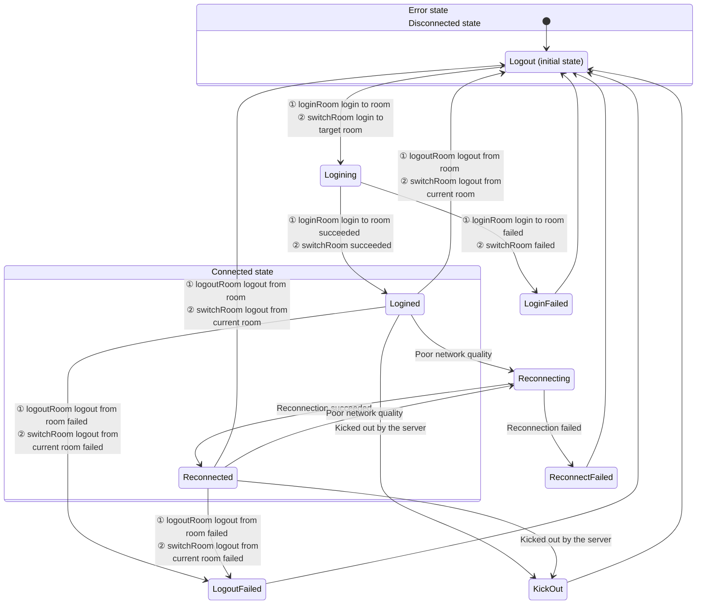

# Room Connection Status

- - -

When users use ZEGO Express SDK for audio and video calls or live streaming, they need to join a room first to receive callback notifications for stream additions/deletions, user entries/exits, etc. from other users in the same room. Therefore, the user's connection status in the room determines whether the user can normally use audio and video services.

This article mainly introduces how to determine the user's connection status in the room, as well as the transition process of each connection status.

## Monitor room connection status

Users can monitor changes in their connection status in the room in real time through the [onRoomStateChanged](@onRoomStateChanged) callback. When the user's room connection status changes, the SDK will trigger this callback and provide the reason for the room connection status change (i.e., room connection status) and related error codes in the callback.

For room connection interruptions caused by poor network quality, the SDK will automatically retry internally. For details, please refer to the [Room Disconnection and Reconnection](/real-time-video-ios-oc/room/room-connection-status) section.

#### Room status description


{/*
<Frame width="512" height="auto" caption=""></Frame>
*/}

Room connection status will transform into each other due to various situations. Developers can perform corresponding business logic processing based on the reason [ZegoRoomStateChangedReason](@-ZegoRoomStateChangedReason) for the room connection status change (i.e., room connection status) combined with errorCode.

<table>

  <tbody><tr>
    <th>Status and Reason Enumeration</th>
    <th>Meaning</th>
    <th>Common Events Triggering Entry to This Status</th>
  </tr>
  <tr>
    <td>Logining（ZegoRoomStateChangedReasonLogining）</td>
    <td>Logging in to the room. When calling [loginRoom] to log in to the room or [switchRoom] to switch to the target room, enter this status, indicating that a request to connect to the server is in progress. Usually, this status is used to display the application interface.</td>
    <td><ul><li>Call [loginRoom] to log in to the room. At this time, it will first enter this status, and errorCode is 0.</li><li>When calling [switchRoom] to switch to the target room, the SDK internally requests to log in to the target room. At this time, errorCode is 0.</li></ul></td>
  </tr>
  <tr>
    <td>Logined（ZegoRoomStateChangedReasonLogined）</td>
    <td>Successfully logged in to the room. After successfully logging in to the room or switching rooms, enter this status, indicating that logging in to the room has been successful, and users can normally receive callback notifications for additions and deletions of other users and all stream information in the room.</td>
    <td><ul><li>Successfully call [loginRoom] to log in to the room. At this time, errorCode is 0.</li><li>When calling [switchRoom] to switch to the target room, the SDK successfully logs in to the target room internally. At this time, errorCode is 0.</li></ul></td>
  </tr>
  <tr>
    <td>LoginFailed（ZegoRoomStateChangedReasonLoginFailed）</td>
    <td>Failed to log in to the room. After failing to log in to the room or switch rooms, enter this status, indicating that logging in to the room or switching rooms has failed, for example, incorrect AppID or Token.</td>
    <td><ul><li>When using the Token authentication feature, the passed-in Token is incorrect. At this time, errorCode is 1002033.</li><li>When logging in to the room times out due to network problems. At this time, errorCode is 1002053.</li><li>When switching to the target room, the SDK fails to log in to the target room internally. For errorCode at this time, please refer to the above login error description.</li></ul></td>
  </tr>
  <tr>
    <td>Reconnecting（ZegoRoomStateChangedReasonReconnecting）</td>
    <td>Room connection temporarily interrupted. If the interruption is caused by poor network quality, the SDK will perform internal retries.</td>
    <td>When the room connection is temporarily interrupted due to poor network quality and reconnection is in progress. At this time, errorCode is 1002051.</td>
  </tr>
  <tr>
    <td>Reconnected（ZegoRoomStateChangedReasonReconnected）</td>
    <td>Room reconnected successfully. If the interruption is caused by poor network quality, the SDK will perform internal retries, and enter this status after successful reconnection.</td>
    <td>When the room connection is temporarily interrupted due to poor network quality and then reconnected successfully. At this time, errorCode is 0.</td>
  </tr>
  <tr>
    <td>ReconnectFailed（ZegoRoomStateChangedReasonReconnectFailed）</td>
    <td>Room reconnection failed. If the interruption is caused by poor network quality, the SDK will perform internal retries, and enter this status after failed reconnection.</td>
    <td>When the room connection is temporarily interrupted due to poor network quality and then reconnection fails. At this time, errorCode is 1002053.</td>
  </tr>
  <tr>
    <td>KickOut（ZegoRoomStateChangedReasonKickOut）</td>
    <td>Kicked out of the room by the server. For example, if a user with the same username logs in to the room elsewhere, causing the local end to be kicked out of the room, enter this status.</td>
    <td><ul><li>User is kicked out of the room (because a user with the same userID logs in elsewhere). At this time, errorCode is 1002050.</li><li>User is kicked out of the room (developer actively calls the backend's <a target="_blank" href="/real-time-video-server/api-reference/room/kick-out-user">Kick user out of room</a> interface). At this time, errorCode is 1002055.</li></ul></td>
  </tr>
  <tr>
    <td>Logout（ZegoRoomStateChangedReasonLogout）</td>
    <td>Successfully logged out of the room. This is the default status before logging in to the room. After successfully calling [logoutRoom] to log out of the room or [switchRoom] successfully logging out of the current room internally, enter this status.</td>
    <td><ul><li>After successfully calling [logoutRoom] to log out of the room. At this time, errorCode is 0.</li><li>When calling [switchRoom] to switch rooms, the SDK successfully logs out of the current room internally.</li></ul></td>
  </tr>
  <tr>
    <td>LogoutFailed（ZegoRoomStateChangedReasonLogoutFailed）</td>
    <td>Failed to log out of the room. After failing to call [logoutRoom] to log out of the room or [switchRoom] failing to log out of the current room internally, enter this status.</td>
    <td>In multi-room scenarios, when calling [logoutRoom] to log out of a room, the room ID does not exist. At this time, errorCode is 1002002.<br />After failing to log out of the room, please try to log out again according to the actual failure reason. Otherwise, other users can see this user before the heartbeat times out.</td>
  </tr>
</tbody></table>

Developers can refer to the following code to handle common business events:

```objc
-(void)onRoomStateChanged:(ZegoRoomStateChangedReason)reason errorCode:(int)errorCode extendedData:(NSDictionary *)extendedData roomID:(NSString *)roomID {
    if(reason == ZegoRoomStateChangedReasonLogining)
    {
        // Logging in
        // When calling loginRoom to log in to the room or switchRoom to switch to the target room, enter this status, indicating that a request to connect to the server is in progress.
    }
    else if(reason == ZegoRoomStateChangedReasonLogined)
    {
        // Login successful
        // Currently triggered by the developer actively calling loginRoom successfully or calling switchRoom successfully to switch rooms. Here you can handle business logic for successful first login to the room, such as pulling basic information for chat rooms and live rooms.
    }
    else if(reason == ZegoRoomStateChangedReasonLoginFailed)
    {
        // Login failed
        if (errorCode == 1002033) {
            //When using the login room authentication feature, the passed-in Token is incorrect or expired
        }
    }
    else if(reason == ZegoRoomStateChangedReasonReconnecting)
    {
        // Reconnecting
        // Currently triggered by the SDK's successful disconnection and reconnection. Here it is recommended to display some reconnection UI
    }
    else if(reason == ZegoRoomStateChangedReasonReconnected)
    {
        // Reconnection successful
    }
    else if(reason == ZegoRoomStateChangedReasonReconnectFailed)
    {
        // Reconnection failed
        // When the room connection is completely disconnected, the SDK will not retry anymore. If developers need to log in to the room again, they can actively call the loginRoom interface
        // At this time, you can exit the room/live room/classroom in the business, or manually call the interface to log in again
    }
    else if(reason == ZegoRoomStateChangedReasonKickOut)
    {
        // Kicked out of the room
        if (errorCode == 1002050) {
            // User is kicked out of the room (because a user with the same userID logs in elsewhere)
        }
        else if (errorCode == 1002055) {
            // User is kicked out of the room (developer actively calls the backend's kick user interface)
        }
    }
    else if(reason == ZegoRoomStateChangedReasonLogout)
    {
        // Logout successful
        // Developer actively calls logoutRoom to successfully log out of the room
        // Or calls switchRoom to switch rooms, and the SDK successfully logs out of the current room internally
        // Developers can handle the logic of active logout room callback here
    }
    else if(reason == ZegoRoomStateChangedReasonLogoutFailed)
    {
        // Logout failed
        // Developer actively calls logoutRoom to fail to log out of the room
        // Or calls switchRoom to switch rooms, and the SDK fails to log out of the current room internally
        // The reason for the error may be that the logout room ID is incorrect or does not exist
    }
}
```


## Room disconnection and reconnection

After users log in to the room, if they disconnect from the room due to network signal problems/network type switching problems, the SDK will automatically reconnect internally. There are three situations for users to reconnect after disconnecting from the room:

- Successfully reconnect before the ZEGO server determines that user A's heartbeat has timed out
- Successfully reconnect after the ZEGO server determines that user A's heartbeat has timed out
- User A fails to reconnect

<Note title="Note">


- Heartbeat timeout is 90s.
- Retry timeout is 20min.
</Note>


The following diagram takes the situation where user A and user B have logged in to the same room, and user A disconnects from the room and then reconnects:

#### Situation 1: Successfully reconnect before the ZEGO server determines that user A's heartbeat has timed out

<Frame width="512" height="auto" caption=""></Frame>

If user A briefly disconnects, but successfully reconnects within 90s, then user B will not receive the [onRoomUserUpdate](@onRoomUserUpdate) callback notification.

- T0 = 0s: User A's SDK receives the [loginRoom](https://www.zegocloud.com/article/api?doc=express-video-sdk_API~objectivec_ios~class~ZegoExpressEngine#login-room-user-config) request initiated by the client.
- T1 ≈ T0 + 120 ms: Usually 120 ms after calling [loginRoom](https://www.zegocloud.com/article/api?doc=express-video-sdk_API~objectivec_ios~class~ZegoExpressEngine#login-room-user-config), the client can join the room. During the room joining process, user A's client will receive 2 [onRoomStateChanged](@onRoomStateChanged) callbacks, notifying the client that it is connecting to the room (Logining) and that the connection to the room is successful (Logined) respectively.
- T2 ≈ T1 + 100 ms: Due to network transmission delay, user B receives the [onRoomUserUpdate](@onRoomUserUpdate) callback about 100 ms later to notify the client that user A has joined the room.
- T3: At a certain time point, user A's uplink network becomes poor due to network disconnection or other reasons. The SDK will try to rejoin the room. At the same time, the client will receive the [onRoomStateChanged](@onRoomStateChanged) callback to notify the client that user A is reconnecting due to disconnection.
- T5 = T3 + time (less than 90s): User A restores the network within the reconnection time and reconnects successfully. Will receive the [onRoomStateChanged](@onRoomStateChanged) callback to notify the client that user A has reconnected successfully.

#### Situation 2: Successfully reconnect after the ZEGO server determines that user A's heartbeat has timed out

<Frame width="512" height="auto" caption=""></Frame>


- The situations at T0, T1, T2, T3 are the same as T0, T1, T2, T3 in [Situation 1: Successfully reconnect before the ZEGO server determines that user A's heartbeat has timed out](/real-time-video-ios-oc/room/room-connection-status).

- T4' ≈ T3 + 90s: User B receives the [onRoomUserUpdate](@onRoomUserUpdate) callback at this time to notify that user A has disconnected.

- T5' = T3 + time (greater than 90s, less than 20 min): User A restores the network within the reconnection time and reconnects successfully. Will receive the [onRoomStateChanged](@onRoomStateChanged) callback to notify the client that user A has reconnected successfully.

- T6' ≈ T5' + 100 ms: Due to network transmission delay, user B receives the [onRoomUserUpdate](@onRoomUserUpdate) callback about 100ms later to notify the client that user A has joined the room.

#### Situation 3: User A fails to reconnect

<Frame width="512" height="auto" caption=""></Frame>

- The situations at T0, T1, T2, T3 are the same as T0, T1, T2, T3 in [Situation 1: Successfully reconnect before the ZEGO server determines that user A's heartbeat has timed out](/real-time-video-ios-oc/room/room-connection-status).

- T4'' ≈ T3 + 90s: User B receives the [onRoomUserUpdate](@onRoomUserUpdate) callback at this time to notify that user A has disconnected.

- T5'' = T3 + 20 min: If user A cannot rejoin the room within 20 consecutive minutes, the SDK will no longer continue trying to reconnect. User A will receive the [onRoomStateChanged](@onRoomStateChanged) callback to notify the client that reconnection has failed.


## Related Documentation

[Does Express SDK support disconnection and reconnection mechanism?](https://www.zegocloud.com/docs/faq/express-reconnect)
