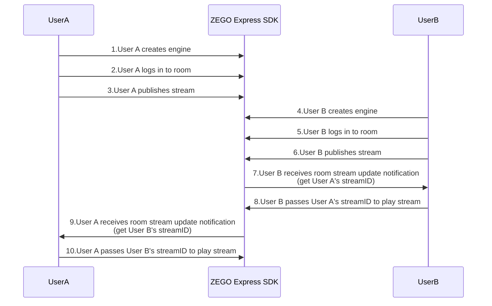
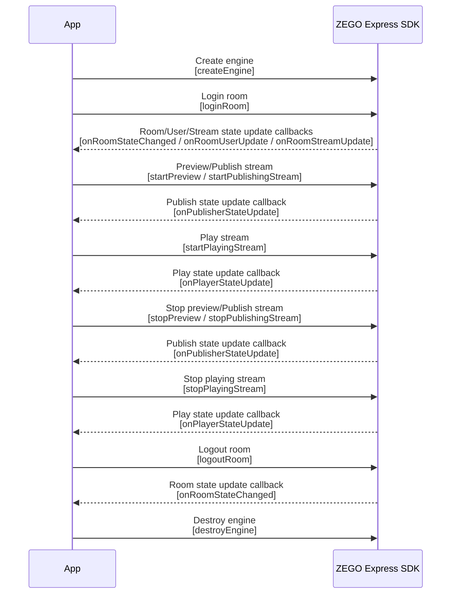

# Implementing Video Call

---


## Feature Overview

This article will introduce how to quickly implement a simple real-time audio/video call.

Explanation of related concepts:

- ZEGO Express SDK: Real-time audio/video SDK provided by ZEGO, which can provide developers with convenient access, HD and smooth, multi-platform interoperability, low latency, and high concurrency audio/video services.
- Stream: Refers to a group of audio/video data that is continuously being sent, encapsulated in a specified encoding format. A user can publish multiple streams simultaneously (for example, one for camera data, one for screen sharing data) and can also play multiple streams simultaneously. Each stream is identified by a stream ID (streamID).
- Publish stream: The process of pushing packaged audio/video data streams to ZEGO real-time audio/video cloud.
- Play stream: The process of pulling and playing existing audio/video data streams from ZEGO real-time audio/video cloud.
- Room: Is the audio/video space service provided by ZEGO, used to organize user groups. Users in the same room can send and receive real-time audio/video and messages to each other.
    1. Users need to login to a room first before they can publish and play streams.
    2. Users can only receive relevant messages in their own room (user entry/exit, audio/video stream changes, etc.).
    3. Each room is identified by a unique roomID within an AppID. All users who login to the room using the same roomID belong to the same room.


## Prerequisites

Before implementing basic real-time audio/video functions, please ensure:

- ZEGO Express SDK has been integrated in the project and basic real-time audio/video functions have been implemented. For details, please refer to [Quick Start - Integration](/real-time-video-linux-cpp/quick-start/integrating-sdk).
- A project has been created in the [ZEGOCLOUD Console](https://console.zegocloud.com) and valid AppID and AppSign have been applied for. 

<Warning title="Warning">


The SDK also supports Token authentication. If you need to upgrade the authentication method, please refer to [How to upgrade from AppSign authentication to Token authentication](/faq/express-token-upgrade).

</Warning>


## Usage Steps


The basic process for users to make video calls through ZEGO Express SDK is as follows:

Users A and B join the room. User B previews and pushes audio/video streams to ZEGO cloud service (publish stream). After user A receives the notification of user B's published audio/video streams, user A plays user B's audio/video streams in the notification (play stream).


{/*
<Frame width="512" height="auto" caption="">
  
</Frame>
*/}

The API call sequence of the entire publish/play stream process is shown in the following figure:


{/*
<Frame width="512" height="auto" caption=""></Frame>
*/}

<a id="CreateEngine"> </a>

### Create Engine

**1. Create UI (optional)**

<Accordion title="Add UI elements" defaultOpen="false">
Before starting, it is recommended that developers add the following UI elements to facilitate the implementation of basic real-time audio/video functions.

- Local preview window
- Remote video window
- End button

<Frame width="512" height="auto" caption=""></Frame>
</Accordion>

**2. Include header files**

Include ZegoExpressEngine header files in the project.

```cpp
#include "ZegoExpressSDK.h"
using namespace ZEGO::EXPRESS;
```

**3. Create engine**

Call the [createEngine](@createEngine) interface and pass the applied AppID and AppSign to the parameters "appID" and "appSign".

Select an appropriate scenario according to the actual audio/video business of the App. Please refer to the [Scenario-based Audio/Video Configuration](/real-time-video-linux-cpp/quick-start/scenario-based-audio-video-configuration) document and pass the selected scenario enumeration to the parameter "scenario".

<Warning title="Warning">
The SDK also supports Token authentication. If you have higher security requirements for the project, it is recommended to upgrade the authentication method. Please refer to [How to upgrade from AppSign authentication to Token authentication](/faq/express-token-upgrade).
</Warning>

<Warning title="Warning">If it is a voice scenario, please be sure to call `enableCamera(false)` to turn off the camera to avoid starting video capture and publishing stream, which will generate additional video traffic.</Warning>

```cpp
ZegoEngineProfile profile;
// AppID and AppSign are assigned to each App by ZEGO; for security reasons, it is recommended to store AppSign in the App's business backend and obtain it from the backend when needed
profile.appID = appID;
profile.appSign = appSign;
// Specify using live streaming scenario (please fill in the scenario suitable for your business according to the actual situation)
profile.scenario = ZegoScenario::ZEGO_SCENARIO_BROADCAST;
// Create engine instance
auto engine = ZegoExpressSDK::createEngine(profile, nullptr);
```

**4. Set callback**

You can listen to and handle concerned event callbacks by instantiating a class that implements the [IZegoEventHandler](@-IZegoEventHandler) interface and implementing required callback methods. Then pass the instantiated object as the `eventHandler` parameter to [createEngine](@createEngine) or pass it to [setEventHandler](@setEventHandler) to register the callback.

<Warning title="Warning">


It is recommended to register the callback when creating the engine or immediately after creating the engine to avoid delaying registration and missing event notifications.

</Warning>


<a id="loginRoom"></a>

### Login Room

**1. Login**

After creating a ZegoUser user object by passing in the user ID parameters "userID" and "userName", call [loginRoom](@loginRoom) and pass in the room ID parameter "roomID" and user parameter "user" to login to the room. If the room does not exist, calling this interface will create and login to this room.

- Within the same AppID, ensure that "roomID" is globally unique.
- Within the same AppID, ensure that "userID" is globally unique. It is recommended that developers set it to a meaningful value and associate "userID" with their own business account system.
- "userID" cannot be empty, otherwise the login to the room will fail.


```cpp
// Create user object
ZegoUser user("user1", "user1");
// Only by passing in ZegoRoomConfig with the "isUserStatusNotify" parameter set to "true" can you receive the onRoomUserUpdate callback.
ZegoRoomConfig roomConfig;
// If you use appsign for authentication, you do not need to fill in the token parameter; if you need to use a more secure authentication method: token authentication.
// roomConfig.token = "xxxx";
roomConfig.isUserStatusNotify = true;
// Login room
engine->loginRoom(roomID, user, roomConfig, [=](){
    // (Optional callback) Login room result, if you only care about the login result, just pay attention to this callback
});
```


**2. Listen to event callbacks after logging in to the room**

According to actual needs, listen to the event notifications you care about after logging in to the room, such as room status updates, user status updates, stream status updates, etc.
- [onRoomStateChanged](@onRoomStateChanged): Room status update callback. After logging in to the room, when the room connection status changes (such as room disconnection, login authentication failure, etc.), the SDK will notify through this callback.
- [onRoomUserUpdate](@onRoomUserUpdate): User status update callback. After logging in to the room, when users are added to or deleted from the room, the SDK will notify through this callback.

    Only when calling the [loginRoom](@loginRoom) interface to login to the room and passing in [ZegoRoomConfig](@-ZegoRoomConfig) configuration, and the "isUserStatusNotify" parameter is set to "true", can users receive the [onRoomUserUpdate](@onRoomUserUpdate) callback.

- [onRoomStreamUpdate](@onRoomStreamUpdate): Stream status update callback. After logging in to the room, when users in the room newly publish or delete audio/video streams, the SDK will notify through this callback.

<Warning title="Warning">


- Only when calling the [loginRoom](@loginRoom) interface to login to the room and passing in [ZegoRoomConfig](@-ZegoRoomConfig) configuration, and the "isUserStatusNotify" parameter is set to "true", can users receive the [onRoomUserUpdate](@onRoomUserUpdate) callback.
- Normally, if a user wants to play videos published by other users, they can call the [startPlayingStream](@startPlayingStream) interface in the callback of stream status update (addition) to pull remote published audio/video streams.
- Please note, do not call any SDK interfaces in the SDK callback thread. You need to manually switch to another thread, otherwise a deadlock will occur.

</Warning>


```cpp
// Room status update callback
void onRoomStateChanged(const std::string &roomID, ZegoRoomStateChangedReason reason, int errorCode, const std::string &extendedData) {
    if(reason == ZEGO_ROOM_STATE_CHANGED_REASON_LOGINING)
    {
        // Logging in
    }
    else if(reason == ZEGO_ROOM_STATE_CHANGED_REASON_LOGINED)
    {
        // Login successful
        // Please note, do not call any SDK interfaces in the SDK callback thread, you need to manually switch to another thread, otherwise a deadlock will occur
        // Only when the room status is login successful or reconnection successful can publishing stream (startPublishingStream) and playing stream (startPlayingStream) normally send and receive audio/video
        // Publish your audio/video stream to ZEGO audio/video cloud
    }
    else if(reason == ZEGO_ROOM_STATE_CHANGED_REASON_LOGIN_FAILED)
    {
        // Login failed
    }
    else if(reason == ZEGO_ROOM_STATE_CHANGED_REASON_RECONNECTING)
    {
        // Reconnecting
    }
    else if(reason == ZEGO_ROOM_STATE_CHANGED_REASON_RECONNECTED)
    {
        // Reconnection successful
    }
    else if(reason == ZEGO_ROOM_STATE_CHANGED_REASON_RECONNECT_FAILED)
    {
        // Reconnection failed
    }
    else if(reason == ZEGO_ROOM_STATE_CHANGED_REASON_KICK_OUT)
    {
        // Kicked out of the room
    }
    else if(reason == ZEGO_ROOM_STATE_CHANGED_REASON_LOGOUT)
    {
        // Logout successful
    }
    else if(reason == ZEGO_ROOM_STATE_CHANGED_REASON_LOGOUT_FAILED)
    {
        // Logout failed
    }
}

// User status update callback
void onRoomUserUpdate(const std::string& roomID, ZegoUpdateType updateType, const std::vector<ZegoUser>& userList) override {
    // Implement event callback as needed
}

// Stream status update callback
void onRoomStreamUpdate(const std::string& roomID, ZegoUpdateType updateType, const std::vector<ZegoStream>& streamList, const std::string& extendedData) override {
    // Implement event callback as needed
}
```

<a id="publishingStream"></a>

### Publish Stream

**1. Start publishing stream**

Call [startPublishingStream](@startPublishingStream) and pass in the stream ID parameter "streamID" to send the local audio/video stream to remote users.

<Warning title="Warning">


- Within the same AppID, ensure that "streamID" is globally unique. If within the same AppID, different users each publish a stream with the same "streamID", the user who publishes later will fail to publish.
- Before starting to publish stream, it is recommended that developers configure the publishing parameters first. If not configured, the SDK will use default configuration. The SDK supports rich publishing parameter configuration, mainly including: video frame rate, bitrate, resolution, audio bitrate, etc.

</Warning>


```cpp
// Start publishing stream
engine->startPublishingStream("streamID");
```

**2. Listen to event callbacks after publishing stream**

According to actual application needs, listen to the event notifications you care about after publishing stream, such as publishing status updates, etc.

[onPublisherStateUpdate](@onPublisherStateUpdate): Publishing status update callback. After successfully calling the publishing interface, when the publishing status changes (such as network interruption causing publishing abnormalities, etc.), the SDK will notify through this callback while retrying publishing.


```cpp
// Publishing status update callback
virtual void onPublisherStateUpdate(const std::string& streamID, ZegoPublisherState state, int errorCode, const std::string& extendedData) {
    // Implement event callback as needed
}
```

<a id="PlayingStream"></a>

### Play Stream

**1. Start playing stream**

Call the [startPlayingStream](@startPlayingStream) interface and pull the remote published audio/video stream according to the passed in stream ID parameter "streamID".

<Note title="Note">

- The "streamID" published by remote users can be obtained from the [onRoomStreamUpdate](@onRoomStreamUpdate) callback in [IZegoEventHandler](@-IZegoEventHandler).
- The Linux SDK downloaded from the official website does not include internal video rendering functionality. Developers need to implement custom video rendering through the [enableCustomVideoRender](@enableCustomVideoRender) interface when playing streams. If you need to support internal rendering functionality, please contact ZEGO Technical Support.

</Note> 

```cpp
// Start playing stream
engine->startPlayingStream("streamID", nullptr);
```

**2. Listen to event callbacks after playing stream**

According to actual application needs, listen to the event notifications you care about after playing stream, such as playing status updates, etc.

[onPlayerStateUpdate](@onPlayerStateUpdate): Playing status update callback. After successfully calling the playing interface, when the playing status changes (such as network interruption causing publishing abnormalities, etc.), the SDK will notify through this callback while retrying playing.

```cpp
// Playing status change callback
virtual void onPlayerStateUpdate(const std::string& streamID, ZegoPlayerState state, int errorCode, const std::string& extendedData) {
    // Implement event callback as needed
}
```

### Test publishing and playing functions online

Run the project on a real device. After successful operation, you can see the local video screen.

For convenience, ZEGO provides a [Web platform for debugging](https://zegoim.github.io/express-demo-web/src/Examples/QuickStart/VideoTalk/index.html?lang=en). On this page, enter the same AppID and RoomID, enter different UserIDs and corresponding [Token](/console/development-assistance/temporary-token), and you can join the same room to communicate with real devices. When the audio/video call starts successfully, you can hear remote audio and see remote video screen.

<a id="stopPublishingStream"></a>

### Stop Publishing/Playing Stream

**1. Stop publishing stream**

Call [stopPublishingStream](@stopPublishingStream) to stop sending local audio/video streams to remote users.

```cpp
// Stop publishing stream
engine->stopPublishingStream();
```

**2. Stop playing stream**

Call [stopPlayingStream](@stopPlayingStream) to stop pulling remote published audio/video streams.

<Warning title="Warning">
If developers receive a notification of "decrease" in audio/video streams through the [onRoomStreamUpdate](@onRoomStreamUpdate) callback, please call the [stopPlayingStream](@stopPlayingStream) interface to stop playing streams in time to avoid pulling empty streams and generating additional costs; or, developers can choose an appropriate time according to their own business needs and actively call the [stopPlayingStream](@stopPlayingStream) interface to stop playing streams.
</Warning>

```cpp
// Stop playing stream
engine->stopPlayingStream("streamID");
```


### Leave Room

Call the [logoutRoom](@logoutRoom) interface to leave the room.

```cpp
// Leave room
engine->logoutRoom("roomID");
```

### Destroy Engine

Call the [destroyEngine](@destroyEngine) interface to destroy the engine, which is used to release resources used by the SDK.

- If you need to listen to the callback to ensure that device hardware resources are released, you can pass in "callback" when destroying the engine. This callback is only used for sending notifications, and developers cannot release engine-related resources in the callback.

- If you don't need to listen to the callback, you can pass in "nullptr".

```cpp
// Destroy engine instance
ZegoExpressSDK::destroyEngine(engine, nullptr);
```

## Related Documentation

- [How to set and get SDK logs and stack information?](/faq/express-logs-stacktrace)
- [Does the SDK support automatic reconnection after disconnection?](/faq/express-reconnect)
- [How to handle room-related issues?](/faq/express-room-maintenance)
- [In live streaming scenarios, how to listen to events of remote audience role users logging in/out of the room?](/faq/audience-room-events)

- [Why can't I open the camera?](/faq/camera-access-failure)

- [How to ensure smooth audio/video in poor network environments?](/faq/flow-control-in-weak-network)
