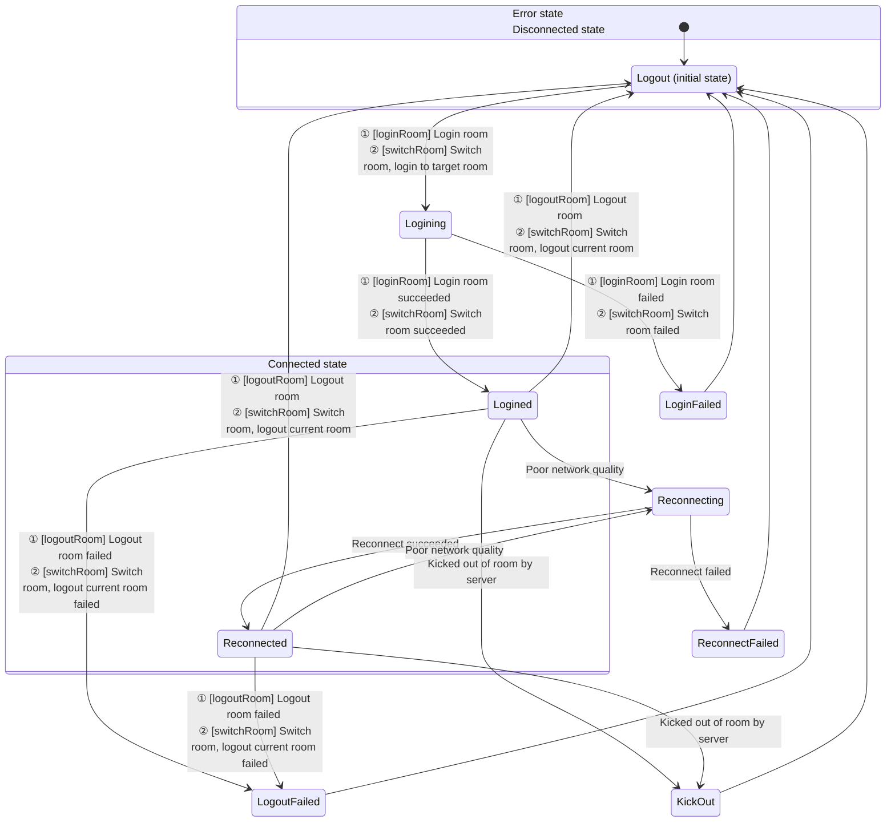

# Audio and Video Recording

- - -

## Overview

During video calls, live streaming, and online teaching, users often need to record and save videos for other users to watch on demand later. ZEGO provides various recording solutions to meet recording needs in different scenarios.

<table>

<tbody><tr>
<th>Recording Solution</th>
<th>Introduction</th>
<th>Applicable Scenarios</th>
</tr>
<tr>
<td>
[Client Local Recording](/real-time-video-rn/other/local-media-recording)
</td>
<td>
Record your (local user) audio and video through the client SDK and save them locally.
</td>
<td>
<p>Need to record your (local user) audio and video and save them to local devices (mobile phones, computers and other terminal devices). <b>Does not support recording other users' audio and video.</b></p>
<p>Call method: Start recording by calling the client SDK interface.</p>
</td>
</tr>
<tr>
<td>
[Cloud Recording](/real-time-video-rn/other/local-media-recording)
</td>
<td>
Record through ZEGO cloud service and save audio and video to your opened cloud storage.
</td>
<td>
- You have opened a third-party cloud storage service, currently supporting Amazon S3, Alibaba Cloud OSS, Tencent Cloud COS, etc.
- Need to record your or others' audio and video.
- Need to distinguish each user in the recording room and obtain separate audio and video files for each user in the room.
- Need to mix multiple audio, video, or audio, video and whiteboard recordings, and mix all users' audio streams, video streams and whiteboards in the room into one video file.
- Need to use preset mixing layout templates.

<p>Call method: Start recording by calling ZEGO server API interface.</p>
</td>
</tr>
<tr>
<td>
[CDN Recording](/real-time-video-rn/other/local-media-recording)
</td>
<td>
Record the audio and video of the live stream and save them to ZEGO CDN.
</td>
<td>
- Need to record the audio and video of the live stream and save them to ZEGO's CDN.
- Need to record your or others' audio and video. &nbsp; &nbsp;&nbsp;

<p>Call method: After you enable CDN recording in the <a href="https://console.zegocloud.com" target="_blank">ZEGO Console</a>, it is global recording by default and no need to call the server API interface; if you need selective recording, please call the ZEGO server API interface to start recording.</p>
</td>
</tr>
<tr>
<td>[Local Server Recording](/real-time-video-rn/other/local-media-recording)</td>
<td>Record through a server deployed by the developer.</td>
<td>
- You hope to record through your own server to save costs.
- Need to record your or others' audio and video.
- Need to distinguish each user in the recording room and obtain separate audio and video files for each user in the room.
- Need to mix multiple audio, video, or audio, video and whiteboard recordings, and mix all users' audio streams, video streams and whiteboards in the room into one video file.

<p>Call method: Start recording by calling the server interface set up by the developer.</p>
</td>
</tr>
</tbody></table>


## Solution 1: Client Local Recording

During a call or live streaming, record the audio and video data you (local user) preview and store them on the local device, saving them as mp4 or other format files. **Does not support recording other users' audio and video.**

### Applicable Scenarios

- Pure local recording: Record local preview without publishing stream.
- Record while live streaming: Record while publishing stream, saving the entire live stream to a local file.
- Record short videos during live streaming: During live streaming, you can record a short video segment at any time and save it locally.
- Only record the content you (local user) preview.

### Supported Formats

- Audio and video: FLV, MP4
- Audio only: AAC

### Prerequisites

Before implementing recording functionality, please ensure:

- You have created a project in the [ZEGO Console](https://console.zegocloud.com) and applied for a valid AppID and AppSign. For details, please refer to [Console - Project Information](/console/project-info).
- You have integrated ZEGO Express SDK into the project and implemented basic audio and video streaming functionality. For details, please refer to [Quick Start - Integration](/real-time-video-rn/quick-start/integrating-sdk) and [Quick Start - Implementation](/real-time-video-rn/quick-start/implementing-video-call).


### Usage Steps

The recording function interface call flow is shown in the following figure:


{/*
<Frame width="512" height="auto" caption=""></Frame>
*/}


#### Set Recording Callback

Developers can use this callback [capturedDataRecordStateUpdate](https://www.zegocloud.com/unique-api/express-video-sdk/en/javascript_react-native/interfaces/_zegoexpresseventhandler_.zegoeventlistener.html#captureddatarecordstateupdate) to determine the status of file recording or provide UI hints, etc.

Developers can use this callback [capturedDataRecordProgressUpdate](https://www.zegocloud.com/unique-api/express-video-sdk/en/javascript_react-native/interfaces/_zegoexpresseventhandler_.zegoeventlistener.html#captureddatarecordprogressupdate) to determine the progress of file recording process or provide UI hints for the user interface, etc.

<Warning title="Warning">
You will receive the set recording callback information only after calling [startRecordingCapturedData](https://www.zegocloud.com/unique-api/express-video-sdk/en/javascript_react-native/classes/_zegoexpressengine_.zegoexpressengine.html#startrecordingcaptureddata) to start recording.
</Warning>


```javascript
// Set recording callback
this.engine.on(
    "capturedDataRecordStateUpdate",
    (state, errorCode, config, channel) => {
        this.appendCallbackInfo(
            `capturedDataRecordStateUpdate:state:${state}, errorCode:${errorCode}, config:${JSON.stringify(config)}, channel:${channel}`
        );
    }
);
this.engine.on(
    "capturedDataRecordProgressUpdate",
    (progress, config, channel) => {
        this.appendCallbackInfo(
            `capturedDataRecordProgressUpdate:progress:${JSON.stringify(progress)}, config:${JSON.stringify(config)}, channel:${channel}`
        );
    }
);
```

#### Start Recording

Developers need to call [startRecordingCapturedData](https://www.zegocloud.com/unique-api/express-video-sdk/en/javascript_react-native/classes/_zegoexpressengine_.zegoexpressengine.html#startrecordingcaptureddata) to start recording.

- [ZegoPublishChannel](https://www.zegocloud.com/unique-api/express-video-sdk/en/javascript_react-native/enums/_zegoexpressdefines_.zegopublishchannel.html) specifies the media channel for recording. If only publishing one stream or only doing local preview, use [Main](https://www.zegocloud.com/unique-api/express-video-sdk/en/javascript_react-native/enums/_zegoexpressdefines_.zegopublishchannel.html#main).

- [ZegoDataRecordConfig](https://www.zegocloud.com/unique-api/express-video-sdk/en/javascript_react-native/classes/_zegoexpressdefines_.zegodatarecordconfig.html) specifies the recording configuration, which can specify the recording path and recording type [ZegoDataRecordType](https://www.zegocloud.com/unique-api/express-video-sdk/en/javascript_react-native/enums/_zegoexpressdefines_.zegodatarecordtype.html).

If you want to record audio and video, you should specify it as "ZegoDataRecordType.Default or "ZegoDataRecordType.AudioAndVideo". If you only want to record audio, select "ZegoDataRecordType.OnlyAudio". If you only record pure video, select "ZegoDataRecordType.OnlyVideo".

<Warning title="Warning">


- In the recording configuration specified in [ZegoDataRecordConfig](https://www.zegocloud.com/unique-api/express-video-sdk/en/javascript_react-native/classes/_zegoexpressdefines_.zegodatarecordconfig.html), the file path suffix must end with ".mp4", ".flv" or ".aac" to specify the format of the recording file.
- The recording type [ZegoDataRecordType](https://www.zegocloud.com/unique-api/express-video-sdk/en/javascript_react-native/enums/_zegoexpressdefines_.zegodatarecordtype.html) is independent of the file suffix.

</Warning>


```javascript
// Interface calls such as login room, start publishing stream, start preview, etc.
...
// Create recording configuration, record in mp4 format, use default recording method
var RNFS = require('react-native-fs'); // The package.json file needs to depend on the `react-native-fs` plugin
var recordPath = RNFS.DocumentDirectoryPath + '/test.mp4';
var config = new zego.ZegoDataRecordConfig(recordPath, zego.ZegoDataRecordType.Default);
// Start recording, use main channel recording
this.engine.startRecordingCapturedData(config);
```

#### Stop Recording

Developers need to call [stopRecordingCapturedData](https://www.zegocloud.com/unique-api/express-video-sdk/en/javascript_react-native/classes/_zegoexpressengine_.zegoexpressengine.html#stoprecordingcaptureddata) to end recording.

<Warning title="Warning">
During recording, if you leave the room [logoutRoom](https://www.zegocloud.com/unique-api/express-video-sdk/en/javascript_react-native/classes/_zegoexpressengine_.zegoexpressengine.html#logoutroom), the SDK will actively stop recording internally.
</Warning>


```javascript
this.engine.stopRecordingCapturedData();
```

#### Play Recorded Files

There are two ways to play recorded files.

* Call the system default player to play.

* Call the ZegoMediaPlayer component in ZegoExpressEngine to play. For details, please refer to [Media Player](/real-time-video-rn/other/media-player).


### FAQ

1. **What formats of packaged files are supported for local audio and video recording?**

  Currently, audio and video support FLV and MP4, and audio only supports AAC. The format is specified by the suffix of the file path. FLV format only supports H.264 encoding, MP4 format supports H.264 and H.265 encoding. Failure to meet this will result in no picture or no audio.

2. **What are the requirements for storage paths?**

  The storage path can be any file path that the application has permission to read and write. If a directory path is passed, the callback will return a file write failure.

3. **How to get the size of the recording file during recording?**

  The recording progress callback [capturedDataRecordProgressUpdate](https://www.zegocloud.com/unique-api/express-video-sdk/en/javascript_react-native/interfaces/_zegoexpresseventhandler_.zegoeventlistener.html#captureddatarecordprogressupdate) can obtain the recording duration and recording file size.

4. **How does the SDK handle passing an existing file path?**

  No error will occur, but the original file content will be cleared before writing.

5. **What should I pay attention to when recording with external capture?**

  When using external capture, you also need to call the SDK's [startPreview](https://www.zegocloud.com/unique-api/express-video-sdk/en/javascript_react-native/classes/_zegoexpressengine_.zegoexpressengine.html#startpreview) method to start before recording.

6. **Why does the recorded video have green edges?**

  Users need to pay attention not to modify the video encoding resolution during recording. Enable flow control (when enabled, the encoding resolution will be dynamically adjusted according to the network environment).

7. **Why does the recorded video freeze for a moment when stream publishing ends during recording?**

  This is due to the SDK's internal processing method. It cannot be solved at present. Users need to try their best to avoid this operation.

8. **Does local media recording support recording sounds from "ZegoMediaPlayer/ZegoAudioPlayer/Mixing Function"?**

  You can record sounds from the above input sources, but only sounds mixed into the published stream will be recorded. If only played locally, they will not be recorded into the file.


## Solution 2: Cloud Recording

Cloud recording means recording audio and video by calling ZEGO server API and saving them to your specified CDN. It supports recording any user's audio and video stream in video calls or live streaming, and provides various disaster tolerance and security mechanisms.

### Applicable Scenarios

It is applicable to various scenarios that require recording functionality, including but not limited to audio and video calls, live streaming, online classrooms, online meetings, etc.

### Usage Steps

Please refer to [Cloud Recording](/cloud-recording/quick-start/integration).

## Solution 3: CDN Recording

CDN recording refers to saving the content being live streamed through CDN to the corresponding CDN. You need to publish audio and video to CDN for live streaming before you can use this method for recording.

### Applicable Scenarios

Developers need to publish audio and video to CDN for live streaming before they can use this method for recording. If developers only conduct video calls or co-hosting and do not publish audio and video to CDN, this function cannot be used.

After you enable CDN recording in the [ZEGO Console](https://console.zegocloud.com), it is global recording by default and no need to call the server API interface; if you need selective recording, please call the ZEGO server API interface to start recording.


### Usage Steps

Please refer to [Start CDN Recording](/real-time-video-server/api-reference/cdn/start-cdn-record).


## Solution 4: Local Server Recording

Developers integrate ZEGO's server recording plugin by themselves and deploy it on their own servers. Then developers start recording by accessing their own server interfaces. For details, please refer to [Local Server Recording](/local-recording-linux-cpp/overview).

### Applicable Scenarios

This solution is suitable for you who have your own server development team, are capable of deploying dedicated servers for audio and video recording, and can handle large-scale concurrency issues.

### Usage Steps

Please refer to [Local Server Recording](/live-streaming-uniapp/quick-start/integrating-sdk).

