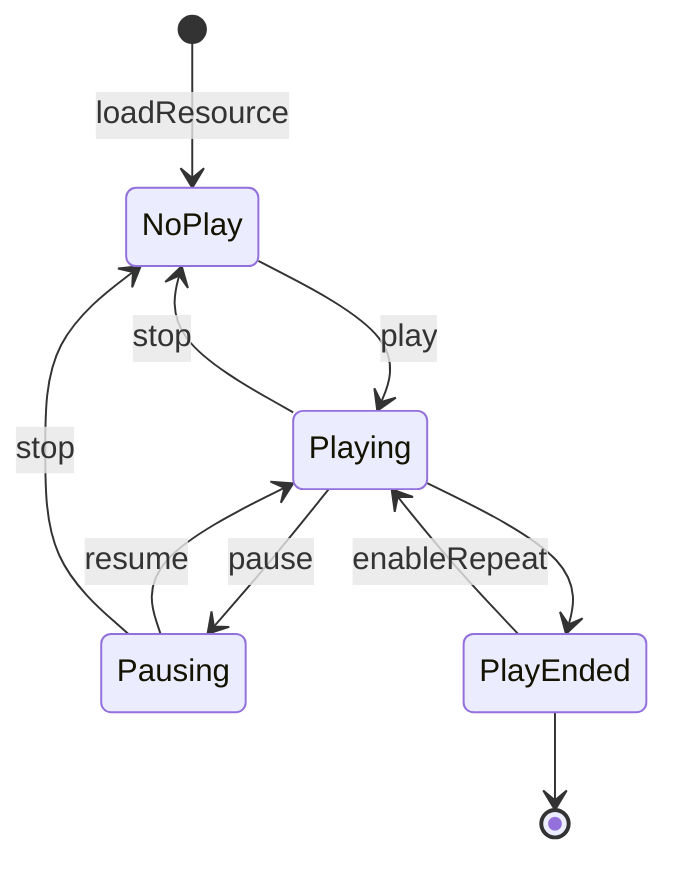

# Media Player

- - -

import Content from '/core_products/real-time-voice-video/en/snippets/media-player-pre.mdx'

<Content />

## Download Sample Source Code

Please refer to [Download Sample Source Code](/real-time-video-rn/quick-start/run-example-code).

For related source code, please check the "App.js" file.

## Prerequisites

Before using the media player, please ensure:

- You have created a project in the [ZEGO Console](https://console.zegocloud.com) and applied for a valid AppID and AppSign. For details, please refer to [Console - Project Information](/console/project-info).
- You have integrated ZEGO Express SDK into the project and implemented basic audio and video streaming functionality. For details, please refer to [Quick Start - Integration](/real-time-video-rn/quick-start/integrating-sdk) and [Quick Start - Implementation](/real-time-video-rn/quick-start/implementing-video-call).


## Usage Steps

### 1 Create Media Player

Call the [createMediaPlayer ](https://www.zegocloud.com/unique-api/express-video-sdk/en/javascript_react-native/classes/_zegoexpressengine_.zegoexpressengine.html#createmediaplayer) interface of ZegoExpressEngine to create a media player instance. A media player instance can only play one audio or video. The engine supports creating up to 10 player instances at the same time to achieve the effect of playing multiple media resources simultaneously. If there are already 10 player instances, calling the create player interface again will return `null`.

- Call example:

    ```javascript
    ZegoExpressEngine.instance().createMediaPlayer().then((player) => {
      this.mediaPlayer = player;
    });
    ```

### 2 (Optional) Set Event Callbacks for Player

<Accordion title="Player Event Callback Settings" defaultOpen="false">
Call the [on ](https://www.zegocloud.com/unique-api/express-video-sdk/en/javascript_react-native/classes/_zegoexpressdefines_.zegomediaplayer.html#on) interface of the media player to set event callbacks for the player to receive notifications such as "player playback state changes", "player network status updates", "player playback progress changes", etc.

- Interface prototype:

    ```javascript
    export abstract class ZegoMediaPlayer {

    /**
     * Listen to player event notifications
     *
     * @param event Event type
     * @param callback Method triggered after event is sent
     */
    abstract on<MediaPlayerEventType extends keyof ZegoMediaPlayerListener>(event: MediaPlayerEventType, callback: ZegoMediaPlayerListener[MediaPlayerEventType]): void;
    ......
    }
    ```

    ```javascript
    export interface ZegoMediaPlayerListener {
    /**
     * @event ZegoMediaPlayer#onMediaPlayerStateUpdate
     * @desc Player playback state callback
     *
     * @property {ZegoMediaPlayer} mediaPlayer - Callback player instance
     * @property {ZegoMediaPlayerState} state - Player state
     * @property {number} errorCode - Error code, please refer to common error code document /real-time-video-rn/error-code.html for details
     */
    mediaPlayerStateUpdate: (mediaPlayer: ZegoMediaPlayer, state: ZegoMediaPlayerState, errorCode: number) => void;

    /**
     * @event ZegoMediaPlayer#onMediaPlayerNetworkEvent
     * @desc Player network status event callback
     *
     * @property {ZegoMediaPlayer} mediaPlayer - Callback player instance
     * @property {ZegoMediaPlayerNetworkEvent} networkEvent - Network status event
     */
    mediaPlayerNetworkEvent: (mediaPlayer: ZegoMediaPlayer, networkEvent: ZegoMediaPlayerNetworkEvent) => void;

    /**
     * @event ZegoMediaPlayer#onMediaPlayerPlayingProgress
     * @desc Player playback progress callback
     *
     * @property {ZegoMediaPlayer} mediaPlayer - Callback player instance
     * @property {number} millisecond - Progress in milliseconds
     */
    mediaPlayerPlayingProgress: (mediaPlayer: ZegoMediaPlayer, millisecond: number) => void;
    }
    ```

- Call example:

    ```javascript
    this.mediaPlayer.on("mediaPlayerStateUpdate", (player, state, errorCode) => {
        switch (state) {
            case ZegoMediaPlayerState.NoPlay:
                // Playback stopped state
                break;
            case ZegoMediaPlayerState.Playing:
                // Playing state
                break;
            case ZegoMediaPlayerState.Pausing:
                // Paused state
                break;
            case ZegoMediaPlayerState.PlayEnded:
                // Current track playback completed, can perform operations such as playing next track
                break;
        }
      });
    ```
</Accordion>


### 3 Load Media Resources

Call the media player's [loadResource ](https://www.zegocloud.com/unique-api/express-video-sdk/en/javascript_react-native/classes/_zegoexpressdefines_.zegomediaplayer.html#loadresource) to specify the media resource to play, which can be the absolute path of a local resource or the URL of a network resource, such as `http://your.domain.com/your-movie.mp4`. Users can get the result of loading files by passing in callback parameters.

<Warning title="Warning">


If the media resource has already been loaded by [loadResource](https://www.zegocloud.com/unique-api/express-video-sdk/en/javascript_react-native/classes/_zegoexpressdefines_.zegomediaplayer.html#loadresource) or is playing, please call the [stop](https://www.zegocloud.com/unique-api/express-video-sdk/en/javascript_react-native/classes/_zegoexpressdefines_.zegomediaplayer.html#stop) interface to stop playback first, and then call the [loadResource](https://www.zegocloud.com/unique-api/express-video-sdk/en/javascript_react-native/classes/_zegoexpressdefines_.zegomediaplayer.html#loadresource) interface to load media resources, otherwise it cannot be loaded successfully.

</Warning>


- Interface prototype:

    ```javascript
    // Load resource, can pass absolute path of local resource or URL of network resource
    abstract loadResource(path: string): Promise<ZegoMediaPlayerLoadResourceResult>;
    ```

- Call example:

    ```javascript
    // This example shows getting the absolute path of the sample.mp4 file in the App package
    this.mediaPlayer.loadResource("sample.mp4").then((ret) => {
        console.log("load resource error: " + ret.errorCode);
      });
    ```

### 4 Playback Control

#### Playback State Control


{/*
<Frame width="512" height="auto" caption=""></Frame>
*/}

After successfully loading the file by calling [loadResource](https://www.zegocloud.com/unique-api/express-video-sdk/en/javascript_react-native/classes/_zegoexpressdefines_.zegomediaplayer.html#loadresource), you can call [start ](https://www.zegocloud.com/unique-api/express-video-sdk/en/javascript_react-native/classes/_zegoexpressdefines_.zegomediaplayer.html#start), [pause ](https://www.zegocloud.com/unique-api/express-video-sdk/en/javascript_react-native/classes/_zegoexpressdefines_.zegomediaplayer.html#pause), [resume ](https://www.zegocloud.com/unique-api/express-video-sdk/en/javascript_react-native/classes/_zegoexpressdefines_.zegomediaplayer.html#resume), [stop ](https://www.zegocloud.com/unique-api/express-video-sdk/en/javascript_react-native/classes/_zegoexpressdefines_.zegomediaplayer.html#stop) to start and stop playback. Once the internal state of the player changes, the [mediaPlayerStateUpdate ](https://www.zegocloud.com/unique-api/express-video-sdk/en/javascript_react-native/interfaces/_zegoexpresseventhandler_.zegomediaplayerlistener.html#mediaplayerstateupdate) callback will be triggered.

Developers can also call [getCurrentState ](https://www.zegocloud.com/unique-api/express-video-sdk/en/javascript_react-native/classes/_zegoexpressdefines_.zegomediaplayer.html#getcurrentstate) at any time to get the current state of the player.

If [enableRepeat ](https://www.zegocloud.com/unique-api/express-video-sdk/en/javascript_react-native/classes/_zegoexpressdefines_.zegomediaplayer.html#enablerepeat) is set to "YES", the player will automatically replay after finishing playing the file.


- Call example:

    ```javascript
    export abstract class ZegoMediaPlayer {

        // Load media resource
        abstract loadResource(path: string): Promise<ZegoMediaPlayerLoadResourceResult>;

        // Start playing (need to load resource before playing)
        abstract start(): Promise<void>;

       // Stop playing
        abstract stop(): Promise<void>;

        // Pause playing
        abstract pause(): Promise<void>;

       // Resume playing
        abstract resume(): Promise<void>;

        ......
       }
      ```

#### Playback Progress Control

The progress of playing the file will be called back through the [mediaPlayerPlayingProgress ](https://www.zegocloud.com/unique-api/express-video-sdk/en/javascript_react-native/interfaces/_zegoexpresseventhandler_.zegomediaplayerlistener.html#mediaplayerplayingprogress) interface. The default interval for triggering the callback is 1000 ms. You can change this interval through [setProgressInterval ](https://www.zegocloud.com/unique-api/express-video-sdk/en/javascript_react-native/classes/_zegoexpressdefines_.zegomediaplayer.html#setprogressinterval).

Developers can also use [getCurrentProgress ](https://www.zegocloud.com/unique-api/express-video-sdk/en/javascript_react-native/classes/_zegoexpressdefines_.zegomediaplayer.html#getcurrentprogress) to get the current playback progress.

The playback progress can be adjusted through the [seekTo ](https://www.zegocloud.com/unique-api/express-video-sdk/en/javascript_react-native/classes/_zegoexpressdefines_.zegomediaplayer.html#seekto) interface.

- Interface prototype:

    ```javascript
    export abstract class ZegoMediaPlayer {

    }
    @interface ZegoMediaPlayer : NSObject

    /// Total playback duration of the entire file in milliseconds
    abstract getTotalDuration(): Promise<number>;

    /// Current playback progress in milliseconds
    abstract getCurrentProgress(): Promise<number>;

    ......

    /// Set specified playback progress in milliseconds
    abstract seekTo(millisecond: number): Promise<ZegoMediaPlayerSeekToResult>;

    ......

    /// Set playback progress callback interval
    abstract setProgressInterval(millisecond: number): Promise<void>;

    ......

    @end
    ```

- Call example:

    ```javascript
    this.mediaPlayer.setProgressInterval(1000)

    var totalDuration = await this.mediaPlayer.getTotalDuration()

    await this.mediaPlayer.seekTo(totalDuration/2);
    var progress = await this.mediaPlayer.getCurrentProgress()

    NSLog(@"process: %llu", progress);
    ```

#### Playback Speed Control

After loading the resource, users can set the current playback speed through [setPlaySpeed](https://www.zegocloud.com/unique-api/express-video-sdk/en/javascript_react-native/classes/_zegoexpressdefines_.zegomediaplayer.html#setplayspeed).

- Call example

    ```javascript
    // Set 2x playback speed, playback speed range is 0.5 ~ 4.0, default is 1.0
    await this.mediaPlayer.setPlaySpeed(2.0);
    ```

#### Player Audio Control

Get and control playback volume through [getPlayVolume ](https://www.zegocloud.com/unique-api/express-video-sdk/en/javascript_react-native/classes/_zegoexpressdefines_.zegomediaplayer.html#getplayvolume) and [setPlayVolume ](https://www.zegocloud.com/unique-api/express-video-sdk/en/javascript_react-native/classes/_zegoexpressdefines_.zegomediaplayer.html#setplayvolume) interfaces.

Get and control publishing stream volume through [getPublishVolume ](https://www.zegocloud.com/unique-api/express-video-sdk/en/javascript_react-native/classes/_zegoexpressdefines_.zegomediaplayer.html#getpublishvolume) and [setPublishVolume ](https://www.zegocloud.com/unique-api/express-video-sdk/en/javascript_react-native/classes/_zegoexpressdefines_.zegomediaplayer.html#setpublishvolume) interfaces.

Call the [enableAux ](https://www.zegocloud.com/unique-api/express-video-sdk/en/javascript_react-native/classes/_zegoexpressdefines_.zegomediaplayer.html#enableaux) interface to mix the sound of the file into the stream being published.

<Note title="Note">
If you want to use the sound mixing capability, you must [set microphone permissions](/real-time-video-rn/quick-start/integrating-sdk). If you do not want to record microphone sound, you can mute the microphone through [muteMicrophone](https://www.zegocloud.com/unique-api/express-video-sdk/en/javascript_react-native/classes/_zegoexpressengine_.zegoexpressengine.html#mutemicrophone).
</Note>


Call the [muteLocal ](https://www.zegocloud.com/unique-api/express-video-sdk/en/javascript_react-native/classes/_zegoexpressdefines_.zegomediaplayer.html#mutelocal) interface to enable local silent playback but still be able to mix sound into the stream normally.

- Call example:

    ```javascript
    // Get player's current playback volume
    var playVolume = await this.mediaPlayer.getPlayVolume;

    // Set player volume to half of original
    this.mediaPlayer.setPlayVolume(playVolume/2);

    // Get player's current publishing stream volume
    var publishVolume = await  this.mediaPlayer.getPublishVolume();

    // Set player publishing stream volume
    this.mediaPlayer.setPublishVolume(80.0);

    // Enable mixing resource sound into the stream being published
    this.mediaPlayer.enableAux(true);

    // Enable local silent playback
    this.mediaPlayer.muteLocal(true);
    ```


#### Player Video Control

<Note title="Note">
Operations in this section only apply to audio and video scenarios. No setting is required for pure audio scenarios.
</Note>


When playing video resources, use the [setPlayerView ](https://www.zegocloud.com/unique-api/express-video-sdk/en/javascript_react-native/classes/_zegoexpressdefines_.zegomediaplayer.html#setplayerview) interface to set the video display view.

- Interface prototype:

    ```javascript
    // Set player view
    abstract setPlayerView(view: ZegoView): Promise<void>;
    ```

- Call example:

    ```javascript
    this.mediaPlayer.setPlayerView({"reactTag": findNodeHandle(this.refs.zego_media_view), "viewMode": 0, "backgroundColor": 0});

    render() {
    return (
      <>
        <StatusBar barStyle="dark-content" />
        <SafeAreaView>
              <View style={{height: 200}}>
                  <ZegoTextureView ref='zego_media_view' style={{height: 200}}/>
              </View>
        </SafeAreaView>
      </>
    );
    }
    }
    ```


### 5 Destroy Media Player

After using the media player, you need to call the [destroyMediaPlayer ](https://www.zegocloud.com/unique-api/express-video-sdk/en/javascript_react-native/classes/_impl_zegoexpressengineimpl_.zegoexpressengineimpl.html#destroymediaplayer) interface in time to destroy the player instance variable and release occupied resources.

- Call example:

    ```javascript
    ZegoExpressEngine.instance().destroyMediaPlayer(this.mediaPlayer)
    ```

## FAQ

**How to switch playback resources during playback?**

First call the player's [stop ](https://www.zegocloud.com/unique-api/express-video-sdk/en/javascript_react-native/classes/_zegoexpressdefines_.zegomediaplayer.html#stop) interface, then call the [loadResource ](https://www.zegocloud.com/unique-api/express-video-sdk/en/javascript_react-native/classes/_zegoexpressdefines_.zegomediaplayer.html#loadresource) interface again to load the new resource.
