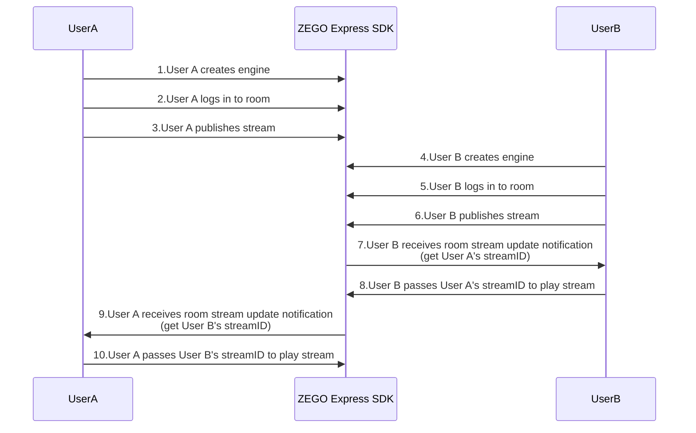
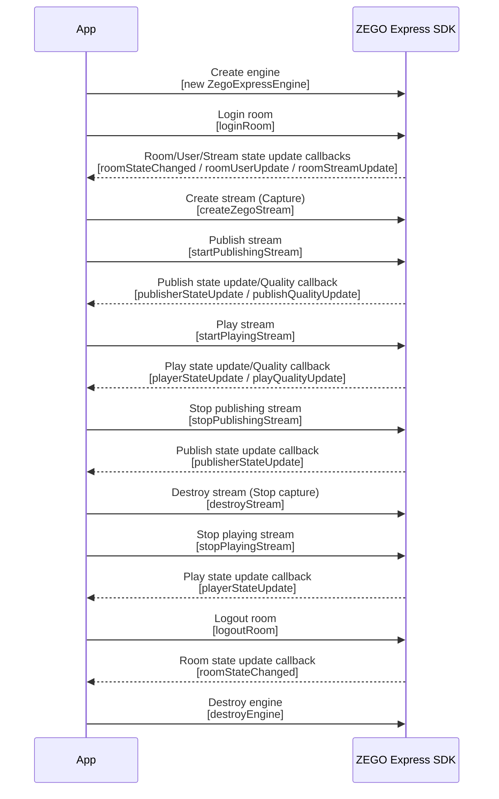

# Implementing Video Call

---

## Function Overview

This article will introduce how to quickly implement a simple real-time audio/video call.

Related concept explanations:

- ZEGO Express SDK: A real-time audio/video SDK provided by ZEGO that can provide developers with convenient access, high definition and smoothness, multi-platform interoperability, low latency, and high concurrency audio/video services.
- Stream: Refers to a group of audio/video data that is continuously sent in a specified encoding format. A user can publish multiple streams at the same time (for example, one for camera data, one for screen sharing data) and can also play multiple streams at the same time. Each stream is identified by a stream ID (streamID).
- Publishing stream: The process of pushing packaged audio/video data streams to ZEGO real-time audio/video cloud.
- Playing stream: The process of pulling and playing existing audio/video data streams from ZEGO real-time audio/video cloud.
- Room: An audio/video space service provided by ZEGO, used to organize user groups. Users in the same room can send and receive real-time audio/video and messages to each other.
    1. Users need to login to a room first before they can publish and play streams.
    2. Users can only receive relevant messages in the room they are in (user enter/leave, audio/video stream changes, etc.).
    3. Each room is identified by a unique roomID within an AppID. All users who login to the room using the same roomID belong to the same room.


## Prerequisites

Before implementing basic real-time audio/video functionality, please ensure:

- You have integrated ZEGO Express SDK in the project and implemented basic real-time audio/video functionality. For details, please refer to [Quick Start - Integration](/real-time-video-u3d-cs/quick-start/integrating-sdk).
- You have created a project in [ZEGOCLOUD Console](https://console.zegocloud.com) and applied for valid AppID and AppSign. 

<Warning title="Warning">

The SDK also supports Token authentication. If you have higher security requirements for the project, it is recommended that you upgrade the authentication method. For details, please refer to [How to upgrade from AppSign authentication to Token authentication](https://www.zegocloud.com/docs/faq/express-token-upgrade).
</Warning>

## Usage Steps

The basic process for users to make video calls through ZEGO Express SDK is:

User A and User B push and pull each other's streams: both users create engines, log in to rooms, publish streams, and then receive room stream update notifications to play each other's streams.


{/*
<Frame width="512" height="auto" caption="">
  
</Frame>
*/}

The API call sequence for the entire publishing and playing stream process is shown below:


{/*
<Frame width="512" height="auto" caption=""></Frame>
*/}

<a id="CreateEngine"> </a>

### Create Engine

**1. Create Interface (Optional)**

<Accordion title="Add Interface Elements" defaultOpen="false">
Before starting, it is recommended that developers add the following interface elements to facilitate the implementation of basic real-time audio/video functionality.

- Local preview window
- Remote video window
- End button

<Frame width="512" height="auto" caption=""></Frame>
</Accordion>

**2. Create Engine and Listen to Callbacks**

Call the CreateEngine interface, pass the applied AppID and AppSign into the parameters "appId" and "appSign", and create an engine singleton object.


Developers can choose to use anonymous functions to implement callback functions as needed, and assign them to the corresponding callback delegates of the engine instance to register callbacks.

<Warning title="Warning">


To avoid missing any notifications, it is recommended to listen to callbacks immediately after creating the engine.

</Warning>

<Warning title="Warning">If it is an audio scenario, be sure to call `enableCamera(false)` to turn off the camera to avoid starting video capture and publishing stream, which generates additional video traffic.</Warning>


```cs
// Define SDK engine object
ZegoExpressEngine engine;

ZegoEngineProfile profile = new ZegoEngineProfile();
profile.appID = appID; // Please obtain through official website registration, format is 123456789
profile.appSign = appSign; // Please obtain through official website registration, format is "0123456789012345678901234567890123456789012345678901234567890123", 64 characters
profile.scenario = ZegoScenario.HighQualityVideoCall; // High-quality audio/video call scenario access (please choose the appropriate scenario according to actual situation)
// Initialize SDK
engine = ZegoExpressEngine.CreateEngine(profile);

// Set SDK callback delegates
engine.OnRoomStateUpdate = (roomID, state, errorCode, extendedData) => {

};
```

<a id="createroom"></a>

### Login Room

**1. Login**

Create a ZegoUser user object, set user information "userID" and "userName", then call LoginRoom, pass in the room ID parameter "roomId" and user parameter "user", and login to the room. If the room does not exist, calling this interface will create and login to this room.

- Within the same AppID, ensure that "roomId" is globally unique.
- Within the same AppID, ensure that "userId" is globally unique. It is recommended that developers set it to a meaningful value and associate "userId" with their own business account system.
- "userId" cannot be empty, otherwise login to the room will fail.
- When running in WebGL environment, only Token authentication is supported. Token cannot be empty. Please refer to [Use Token Authentication](/real-time-video-u3d-cs/communication/using-token-authentication).

```cs
// Create user
ZegoUser user = new ZegoUser();
user.userId="xxx";
user.userName="xxxx";
// Only by passing in ZegoRoomConfig with the "isUserStatusNotify" parameter set to "true" can you receive the onRoomUserUpdate callback.
ZegoRoomConfig roomConfig = new ZegoRoomConfig();
// If you use AppSign for authentication, the Token parameter does not need to be filled in (except for WebGL platform); if you need to use a more secure authentication method: Token authentication, please refer to [How to upgrade from AppSign authentication to Token authentication](https://www.zegocloud.com/docs/faq/express-token-upgrade)
// On WebGL platform, "token" cannot be empty
roomConfig.token = "xxxx";
roomConfig.isUserStatusNotify = true;
// Login room
engine.LoginRoom("123666", user, roomConfig);
```

**2. Listen to Event Callbacks After Login Room


According to actual needs, listen to event notifications you want to pay attention to after login to the room, such as room status updates, user status updates, stream status updates, etc.

- OnRoomStateUpdate: Room status update callback. After login to the room, when the room connection status changes (such as room disconnection, login authentication failure, etc.), the SDK will notify through this callback.
- OnRoomUserUpdate: User status update callback. After login to the room, when users are added to or deleted from the room, the SDK will notify through this callback.

    Only when calling the loginRoom interface to login to the room and passing in ZegoRoomConfig configuration, and the "isUserStatusNotify" parameter is set to "true", can users receive the onRoomUserUpdate callback.

- OnRoomStreamUpdate: Stream status update callback. After login to the room, when users in the room add or delete audio/video streams, the SDK will notify through this callback.

Event callbacks are delegates of ZegoExpressEngine. Developers can directly assign their implemented callback handling functions to the corresponding delegates of ZegoExpressEngine to receive callbacks and handle them.

<Warning title="Warning">


- Only when calling the loginRoom interface to login to the room and passing in ZegoRoomConfig configuration, and the "isUserStatusNotify" parameter is set to "true", can users receive the onRoomUserUpdate callback.
- Normally, if a user wants to play videos published by other users, they can call the startPlayingStream interface in the stream status update (addition) callback to play remote published audio/video streams.

</Warning>


```cs
// Room status update callback
public void OnRoomStateUpdate(string roomId, ZegoRoomState state, int errorCode, string extendedData) {
    // Implement event callback as needed
}

// User status update callback
private void OnRoomUserUpdate(string roomId, ZegoUpdateType updateType, List<ZegoUser> userList, uint userCount) {
    // Implement event callback as needed
}

// Stream status update callback
private void OnRoomStreamUpdate(string roomId, ZegoUpdateType updateType, List<ZegoStream> streamInfoList, uint streamInfoCount) {
    // Implement event callback as needed
}

// Assign to corresponding event delegates of ZegoExpressEngine
engine.onRoomStateUpdate = OnRoomStateUpdate;
engine.onRoomUserUpdate = OnRoomUserUpdate;
engine.onRoomStreamUpdate = OnRoomStreamUpdate;
```

<a id="publishingStream"></a>

### Publishing Stream

**1. Start Publishing Stream**

Call the StartPublishingStream interface, pass in the stream ID parameter "streamId", and send the local audio/video stream to remote users.

<Warning title="Warning">


Within the same AppID, ensure that "streamId" is globally unique. If different users within the same AppID publish streams with the same "streamId", the user who publishes later will fail to publish stream.


</Warning>


```cs
// Start publishing stream
engine.StartPublishingStream("stream1");
```


**2. Enable Local Preview (Optional)**

<Accordion title="Set Preview View and Start Local Preview" defaultOpen="false">
If developers want to see their local video, they can call the StartPreview interface to start local preview.

Since Android devices and iOS devices have four screen orientations: Portrait, PortraitUpsideDown, LandscapeLeft, and LandscapeRight, to ensure that the publishing stream preview and playing stream display interface are always in the correct direction, you need to first add adaptive horizontal and vertical screen code for the publishing stream preview and playing stream display interface. Please refer to "4 Interface Adaptation" in [Quick Start - Integration](/real-time-video-u3d-cs/quick-start/integrating-sdk).

Unity supports preview through two renderers: RawImage and Renderer.

- Method 1: RawImage

Create RawImage.

<Frame width="512" height="auto" caption=""></Frame>


Preview displayed on RawImage.

```cs
RawImageVideoSurface localVideoSurface = null;
GameObject mainLocalVideoPlane = null;

mainLocalVideoPlane = GameObject.Find("MainPreViewRawImage");

if (mainLocalVideoPlane != null && localVideoSurface == null)
{
    // Add a RawImageVideoSurface component, renderer is RawImage
    localVideoSurface = mainLocalVideoPlane.AddComponent<RawImageVideoSurface>();
    // Set as local preview video
    localVideoSurface.SetCaptureVideoInfo();
    // Set video source to engine
    localVideoSurface.SetVideoSource(engine);
}

// Call start preview interface
engine.StartPreview();
```

- Method 2: Renderer

Create a Plane with Renderer.

<Frame width="512" height="auto" caption=""></Frame>


Preview to Plane's Renderer.

```cs
GameObject go = GameObject.CreatePrimitive(PrimitiveType.Plane);//Plane created by code

if (go == null)
{
    return;
}
go.name = "preview-render";
// Ensure the video can be displayed on the screen
go.transform.Rotate(90.0f, -180.0f, 0.0f);
go.transform.position = new Vector3(0.0f, 0.0f, 0.0f);
go.transform.localScale = new Vector3(0.36f, 1f, 0.64f);

// Add a RendererVideoSurface component, renderer is Renderer
RendererVideoSurface renderer = go.AddComponent<RendererVideoSurface>();
// Set as local preview video
renderer.SetCaptureVideoInfo();
// Set video source to engine
renderer.SetVideoSource(engine);

// Call start preview interface
engine.StartPreview();
```
</Accordion>


**3. Listen to Event Callbacks After Publishing Stream


According to actual application needs, listen to event notifications you want to pay attention to after publishing stream, such as publishing stream status updates, publishing stream quality, etc.

- OnPublisherStateUpdate: Publishing stream status update callback. After successfully calling the publishing stream interface, when the publishing stream status changes (such as network interruption causing publishing stream exceptions, etc.), while the SDK retries publishing stream, it will notify through this callback.
- OnPublisherQualityUpdate: Publishing stream quality callback. After successfully calling the publishing stream interface, it periodically calls back audio/video stream quality data (such as resolution, frame rate, bitrate, etc.).

Event callbacks are delegates of ZegoExpressEngine. Developers can directly assign their implemented callback handling functions to the corresponding delegates of ZegoExpressEngine to receive callbacks and handle them.

```cs
// Publishing stream status update callback
public void OnPublisherStateUpdate(string streamId, ZegoPublisherState state, int errorCode, string extendedData)
{
    // Implement event callback as needed
}

// Publishing stream quality callback
private void OnPublisherQualityUpdate(string streamId, ZegoPublishStreamQuality quality)
{
    // Implement event callback as needed
}


// Assign to corresponding event delegates of ZegoExpressEngine
engine.onPublisherStateUpdate = OnPublisherStateUpdate;
engine.onPublisherQualityUpdate = OnPublisherQualityUpdate;
engine.StartPublishingStream("stream1");
```

<Note title="Note">If you need to understand ZEGO Express SDK's camera/video/microphone/audio/speaker related interfaces, please refer to [FAQ - How to implement switching camera/video/microphone/audio/speaker?](https://www.zegocloud.com/docs/faq/device-switching).</Note>


<a id="PlayingStream"></a>

### Playing Stream

**1. Start Playing Stream**

Call the StartPlayingStream interface, and play the remote published audio/video stream according to the passed stream ID parameter "streamID".

<Note title="Note">


The "streamID" published by remote users can be obtained from the OnRoomStreamUpdate callback in ZegoExpressEngine delegates.

</Note>


Since Android devices and iOS devices have four screen orientations: Portrait, PortraitUpsideDown, LandscapeLeft, and LandscapeRight, to ensure that the publishing stream preview and playing stream display interface are always in the correct direction, you need to first add adaptive horizontal and vertical screen code for the publishing stream preview and playing stream display interface. Please refer to "4 Interface Adaptation" in [Quick Start - Integrating SDK](/real-time-video-u3d-cs/quick-start/integrating-sdk).

Unity3D supports playing stream rendering through two renderers: RawImage and Renderer.

- Method 1: RawImage

Create RawImage.

<Frame width="512" height="auto" caption=""></Frame>


Preview displayed on RawImage.

```cs
private const float Offset = 100;

GameObject go = new GameObject();

if (go == null)
{
    return;
}

go.name = "play-rawimage";
// Dynamically create RawImage
go.AddComponent<RawImage>();
GameObject canvas = GameObject.Find("Canvas");
if (canvas != null)
{
    go.transform.parent = canvas.transform;
}
float xPos = UnityEngine.Random.Range(Offset - Screen.width / 2f, Screen.width / 2f - Offset);
float yPos = UnityEngine.Random.Range(Offset, Screen.height / 2f - Offset);
go.transform.localPosition = new Vector3(xPos, yPos, 0f);
go.transform.localScale = new Vector3(3f, 4f, 1f);

// Add a RawImageVideoSurface component, renderer is RawImage
RawImageVideoSurface videoSurface = go.AddComponent<RawImageVideoSurface>();
// Set the video stream id you want to display
videoSurface.SetPlayVideoInfo("123");
// Set video source to engine
videoSurface.SetVideoSource(engine);

// Call playing stream interface
engine.StartPlayingStream("123");
```

- Method 2: Renderer

Create a Plane with Renderer.

<Frame width="512" height="auto" caption=""></Frame>


Preview to Plane's Renderer.

```cs
remoteVideoPlane = GameObject.Find("PlayRender");
if (remoteVideoPlane != null)
{
    if (remoteVideoSurface == null)
    {
        // Add a RendererVideoSurface component, renderer is Renderer
        remoteVideoSurface = remoteVideoPlane.AddComponent<RendererVideoSurface>();
        // Ensure the video can be displayed on the screen
        remoteVideoSurface.transform.Rotate(90.0f, -180.0f, 0.0f);
        remoteVideoSurface.transform.position = new Vector3(0.0f, 0.0f, 0.0f);
        remoteVideoSurface.transform.localScale = new Vector3(0.36f, 1f, 0.64f);
    }
    if (remoteVideoSurface != null)
    {
        // Set the video stream id you want to display
        remoteVideoSurface.SetPlayVideoInfo("123");
        // Set video source to engine
        remoteVideoSurface.SetVideoSource(engine);
    }
}

// Call playing stream interface
engine.StartPlayingStream("123");
```


**2. Listen to Event Callbacks After Playing Stream


According to actual application needs, listen to event notifications you want to pay attention to after playing stream, such as playing stream status updates, playing stream quality, streaming media events, etc.

- OnPlayerStateUpdate: Playing stream status update callback. After successfully calling the playing stream interface, when the playing stream status changes (such as network interruption causing publishing stream exceptions, etc.), while the SDK retries playing stream, it will notify through this callback.
- OnPlayerQualityUpdate: Playing stream quality callback. After playing stream is successful, this callback will be received every 3 seconds. Through this callback, you can obtain quality data such as frame rate, bitrate, RTT, packet loss rate of the played audio/video stream, and monitor the health status of the played stream in real time.
- OnPlayerMediaEvent: Streaming media event callback. This callback is triggered when events such as audio/video freezing and recovery occur during playing stream.

Event callbacks are delegates of ZegoExpressEngine. Developers can directly assign their implemented callback handling functions to the corresponding delegates of ZegoExpressEngine to receive callbacks and handle them.

```cs
// Playing stream status update callback
public void OnPlayerStateUpdate(string streamId, ZegoPlayerState state, int errorCode, string extendedData)
{
    // Implement event callback as needed
}

// Playing stream quality callback
private void OnPlayerQualityUpdate(string streamId, ZegoPlayStreamQuality quality)
{
    // Implement event callback as needed
}

// Streaming media event callback; please note, this callback is not supported on WebGL platform
private void OnPlayerMediaEvent(string streamId, ZegoPlayerMediaEvent mediaEvent)
{
    // Implement event callback as needed
}

// Assign to corresponding event delegates of ZegoExpressEngine
engine.onPlayerStateUpdate = OnPlayerStateUpdate;

// Please note, onPlayerMediaEvent event callback is not supported on WebGL platform
engine.onPlayerMediaEvent = OnPlayerMediaEvent;
engine.onPlayerQualityUpdate = OnPlayerQualityUpdate;
engine.StartPlayingStream("123");
```

### Test Publishing and Playing Stream Functionality Online

Run the project on a real device. After running successfully, you can see the local video.

To facilitate the experience, ZEGO provides a [Web platform for debugging](https://zegoim.github.io/express-demo-web/src/Examples/QuickStart/VideoTalk/index.html?lang=en). On this page, enter the same AppID and RoomID, enter different UserIDs, and the corresponding [Token](/console/development-assistance/temporary-token), to join the same room and interoperate with the real device. When the audio/video call starts successfully, you can hear the remote audio and see the remote video.


<a id="StopPublishingStream"> </a>

### Stop Publishing and Playing Stream

**1. Stop Publishing Stream/Preview**

Call the StopPublishingStream interface to stop sending local audio/video streams to remote users.

```cs
// Stop publishing stream
engine.StopPublishingStream();
```

If local preview is enabled, call the StopPreview interface to stop preview.

```cs
// Stop local preview
engine.StopPreview();
```

**2. Stop Playing Stream**

Call the StopPlayingStream interface to stop playing remote published audio/video streams.

<Warning title="Warning">


If developers receive an audio/video stream "decrease" notification through the OnRoomStreamUpdate callback, please call the StopPlayingStream interface in time to stop playing stream to avoid playing empty streams and generating additional costs; or, developers can choose the appropriate timing according to their business needs and actively call the StopPlayingStream interface to stop playing stream.

</Warning>


```csharp
// Stop playing stream
engine.StopPlayingStream("123");
```


### Logout Room

Call the LogoutRoom interface to logout of the room.

```cs
// Logout room
engine.LogoutRoom("123666");
```

### Destroy Engine

Call the DestroyEngine interface to destroy the engine, which is used to release resources used by the SDK.

```cs
// Destroy engine instance
ZegoExpressEngine.DestroyEngine();
```
