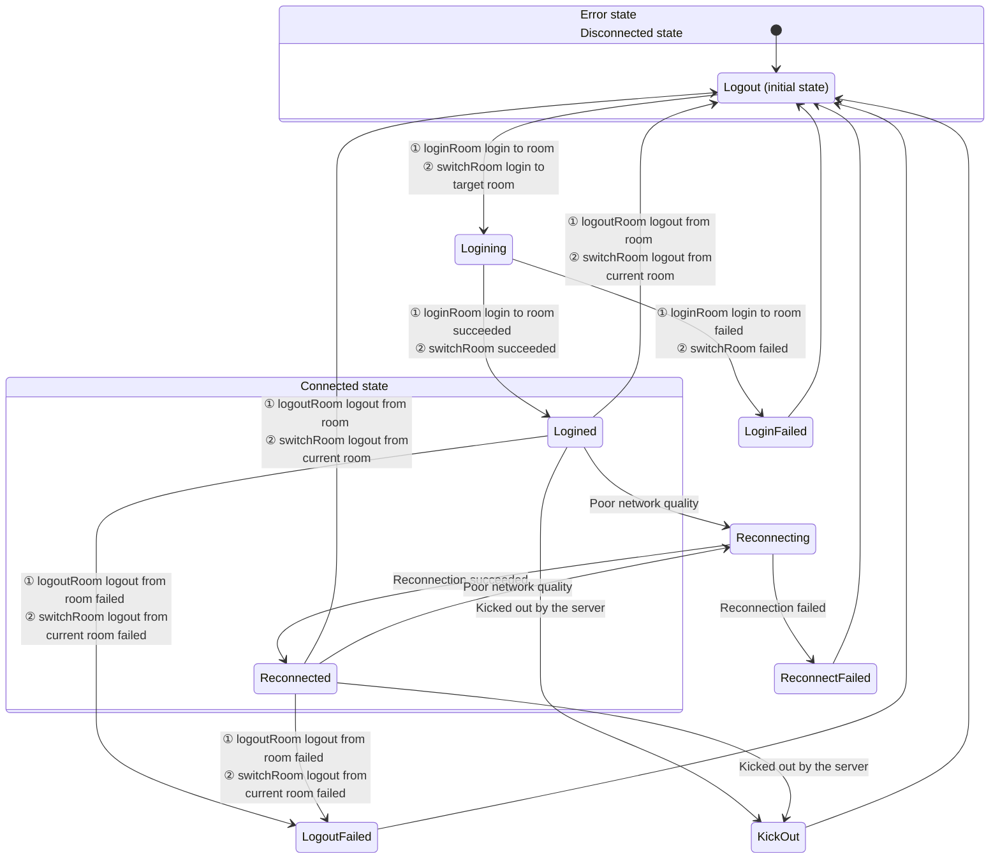

# Room Connection Status

- - -

When users use ZEGO Express SDK for audio and video calls, they need to join a room first to receive callback notifications for stream additions/deletions and user entry/exit from other users in the same room. Therefore, the user's connection status in the room determines whether the user can normally use audio and video services.

<Warning title="Warning">
When logging in to a room on the WebGL platform, the room status code is different from other platforms. For details, please refer to [Room Connection Status Description (Web)](/real-time-video-web/room/room-connection-status).
</Warning>


This article mainly introduces how to judge the user's connection status in the room, and the conversion process of each connection status.

## Listen to Room Connection Status

Users can monitor their own connection status in the current room in real time by listening to the [OnRoomStateChanged](@OnRoomStateChanged) callback. When the user's connection status changes, the SDK will trigger this callback and provide the reason for the room connection status change (i.e., room connection status) and related error codes in the callback.

If the room connection is interrupted due to poor network quality, the SDK will automatically retry internally. For details, please refer to the [Room Disconnection and Reconnection](/real-time-video-u3d-cs/room/room-connection-status) section.

#### Room Status Description


{/*
<Frame width="512" height="auto" caption=""></Frame>
*/}

Room connection statuses will transform into each other. Developers need to judge various situations and handle corresponding logic by combining reason (i.e., room connection status) and errorCode.

<table>

  <tbody><tr>
    <th>Status and Reason Enumeration Values</th>
    <th>Meaning</th>
    <th>Common Events Triggering Entry to This Status</th>
  </tr>
  <tr>
    <td>Logining (Logining)</td>
    <td>Logging in to the room. When calling [LoginRoom] to login to the room or [SwitchRoom] to switch to the target room, enter this status, indicating that a request is being made to connect to the server. Usually this status is used for application interface display.</td>
    <td><ol><li>Call [LoginRoom] to login to the room. At this time, it will first enter this status, and errorCode is 0.</li><li>When calling [SwitchRoom] to switch to the target room, the SDK internally requests to login to the target room. At this time, errorCode is 0.</li></ol></td>
  </tr>
  <tr>
    <td>Logined (Logined)</td>
    <td>Login to the room succeeded. After logging in to the room or switching rooms successfully, enter this status, indicating that the login to the room has been successful, and users can normally receive callback notifications for additions and deletions of all other users and all streams in the room.</td>
    <td><ol><li>Call [LoginRoom] to login to the room successfully. At this time, errorCode is 0.</li><li>When calling [SwitchRoom] to switch to the target room, the SDK internally logs in to the target room successfully. At this time, errorCode is 0.</li></ol></td>
  </tr>
  <tr>
    <td>LoginFailed (LoginFailed)</td>
    <td>Login to the room failed. After logging in to the room or switching rooms fails, enter this status, indicating that the login to the room or switching rooms has failed, such as incorrect AppID or Token, etc.</td>
    <td><ol><li>When using the Token authentication function, the passed Token is incorrect. At this time, errorCode is 1002033.</li><li>When the login to the room times out due to network problems. At this time, errorCode is 1002053.</li><li>When switching to the target room, the SDK internally fails to login to the target room. At this time, please refer to the above login error description for errorCode.</li></ol></td>
  </tr>
  <tr>
    <td>Reconnecting (Reconnecting)</td>
    <td>Room connection temporarily interrupted. If the interruption is caused by poor network quality, the SDK will perform internal retries.</td>
    <td>When the room connection is temporarily interrupted due to poor network quality and reconnection is in progress. At this time, errorCode is 1002051.</td>
  </tr>
  <tr>
    <td>Reconnected (Reconnected)</td>
    <td>Room reconnection succeeded. If the interruption is caused by poor network quality, the SDK will perform internal retries. After successful reconnection, enter this status.</td>
    <td>When the room connection is temporarily interrupted due to poor network quality and reconnection succeeds. At this time, errorCode is 0.</td>
  </tr>
  <tr>
    <td>ReconnectFailed (ReconnectFailed)</td>
    <td>Room reconnection failed. If the interruption is caused by poor network quality, the SDK will perform internal retries. After failed reconnection, enter this status.</td>
    <td>When the room connection is temporarily interrupted due to poor network quality and reconnection fails. At this time, errorCode is 1002053.</td>
  </tr>
  <tr>
    <td>KickOut (KickOut)</td>
    <td>Kicked out of the room by the server. For example, when a user with the same username logs in to the room elsewhere, causing the local end to be kicked out of the room, enter this status.</td>
    <td><ol><li>User is kicked out of the room (because a user with the same userID logs in elsewhere). At this time, errorCode is 1002050.</li><li>User is kicked out of the room (developer actively calls the backend's <a target="_blank" href="/real-time-video-server/api-reference/room/kick-out-user">Kick User Out of Room</a> interface). At this time, errorCode is 1002055.</li></ol></td>
  </tr>
  <tr>
    <td>Logout (Logout)</td>
    <td>Logout of the room succeeded. Before logging in to the room, it defaults to this status. After calling [LogoutRoom] to successfully logout of the room or [SwitchRoom] internally successfully logging out of the current room, enter this status.</td>
    <td><ol><li>When calling [LogoutRoom] to successfully logout of the room. At this time, errorCode is 0.</li><li>When calling [SwitchRoom] to switch rooms, the SDK internally successfully logs out of the current room.</li></ol></td>
  </tr>
  <tr>
    <td>LogoutFailed (LogoutFailed)</td>
    <td>Logout of the room failed. After calling [LogoutRoom] to logout of the room fails or [SwitchRoom] internally fails to logout of the current room, enter this status.</td>
    <td>In multi-room scenarios, when calling [LogoutRoom] to logout of a room, the room ID does not exist. At this time, errorCode is 1002002.<br />After failing to logout of the room, please try to logout again according to the actual failure reason, otherwise other users can see this user before the heartbeat times out.</td>
  </tr>
</tbody></table>


Developers can refer to the following code to handle common business events:

```cs
void OnRoomStateChanged(string roomID, ZegoRoomStateChangedReason reason, int errorCode, string extendedData){
    if(reason == Logining)
    {
        // Logging in
        // Represents the callback during connection triggered by the developer actively calling loginRoom or switchRoom
    }
    else if(reason == Logined)
    {
        // Login successful
        // Currently the developer actively called loginRoom to login successfully, or called switchRoom to switch rooms successfully triggering the callback. Here you can handle the business logic for the first successful login to the room, such as pulling chat room and live room basic information.
    }
    else if(reason == LoginFailed)
    {
        // Login failed
        if (errorCode == 1002033) {
            //When using the login room authentication function, the passed token is incorrect
        }
    }
    else if(reason == Reconnecting)
    {
        // Reconnecting
        // Currently the SDK disconnects and reconnects successfully triggering the callback. It is recommended to display some reconnection UI here
    }
    else if(reason == Reconnected)
    {
        // Reconnection successful
    }
    else if(reason == ReconnectFailed)
    {
        // Reconnection failed
        // When the room connection is completely disconnected, the SDK will no longer retry. If developers need to login to the room again, they can actively call the loginRoom interface
        // At this time, you can exit the room/live room/classroom in the business, or manually call the interface to login again
    }
    else if(reason == KickOut)
    {
        // Kicked out of the room
        if (errorCode == 1002050) {
            // User is kicked out of the room (because a user with the same userID logs in elsewhere)
        }
        else if (errorCode == 1002055) {
            // User is kicked out of the room (developer actively calls the backend kick user interface
        }
    }
    else if(reason == Logout)
    {
        // Logout successful
        // Developer actively calls logoutRoom to logout of the room
        // Or calls switchRoom to switch rooms, and the SDK internally successfully logs out of the current room
        // Developers can handle the logic of the active logout room callback here
    }
    else if(reason == LogoutFailed)
    {
        // Logout failed
        // Or calls switchRoom to switch rooms, and the SDK internally fails to logout of the current room
        // Logout room ID is incorrect or does not exist
    }
}
```


## Room Disconnection and Reconnection

After users login to the room, if they are disconnected from the room due to network signal problems/network type switching problems, the SDK will automatically reconnect internally. There are three situations for users to reconnect after being disconnected from the room:

- User A successfully reconnects before the ZEGO server determines that user A's heartbeat has timed out
- User A successfully reconnects after the ZEGO server determines that user A's heartbeat has timed out
- User A fails to reconnect

<Note title="Note">
- Heartbeat timeout time is 90s
- Retry timeout time is 20min
</Note>


The following figure takes the case where user A and user B have logged in to the same room, and user A is disconnected from the room and then reconnects as an example:


#### Case 1: Successfully reconnect before the ZEGO server determines that user A's heartbeat has timed out

<Frame width="512" height="auto" caption=""></Frame>

If user A is briefly disconnected but successfully reconnects within 90s, then user B will not receive the [OnRoomUserUpdate](@OnRoomUserUpdate) callback notification.

- T0 = 0s: User A's SDK receives the [LoginRoom](@LoginRoom) request initiated by the client.
- T1 ≈ T0 + 120ms: Usually about 120 ms after calling [LoginRoom](@LoginRoom), the client can join the room. During the room joining process, user A's client will receive 2 [OnRoomStateChanged](@OnRoomStateChanged) callbacks, notifying the client that it is connecting to the room (Logining) and that the connection to the room is successful (Logined) respectively.
- T2 ≈ T1 + 100 ms: Due to network transmission delay, user B receives the [OnRoomUserUpdate](@OnRoomUserUpdate) callback about 100 ms later to notify the client that user A has joined the room.
- T3: At a certain time point, user A's uplink network becomes worse due to network disconnection or other reasons. The SDK will try to rejoin the room. At the same time, the client will receive the [OnRoomStateChanged](@OnRoomStateChanged) callback to notify the client that user A is disconnecting and reconnecting.
- T5 = T3 + time (less than 90s): User A restores the network within the reconnection time and reconnects successfully. Will receive the [OnRoomStateChanged](@OnRoomStateChanged) callback to notify the client that user A has reconnected successfully.

#### Case 2: Successfully reconnect after the ZEGO server determines that user A's heartbeat has timed out

<Frame width="512" height="auto" caption=""></Frame>

- The situations at T0, T1, T2, T3 are the same as T0, T1, T2, T3 in [Case 1: Successfully reconnect before the ZEGO server determines that user A's heartbeat has timed out](/real-time-video-u3d-cs/room/room-connection-status).

- T4' ≈ T3 + 90s: User B receives the [OnRoomUserUpdate](@OnRoomUserUpdate) callback at this time to notify that user A has been disconnected.

- T5' = T3 + time (greater than 90s, less than 20 min): User A restores the network within the reconnection time and reconnects successfully. Will receive the [OnRoomStateChanged](@OnRoomStateChanged) callback to notify the client that user A has reconnected successfully.

- T6' ≈ T5' + 100ms: Due to network transmission delay, user B receives the [OnRoomUserUpdate](@OnRoomUserUpdate) callback about 100 ms later to notify the client that user A has joined the room.

#### Case 3: User A fails to reconnect

<Frame width="512" height="auto" caption=""></Frame>

- The situations at T0, T1, T2, T3 are the same as T0, T1, T2, T3 in [Case 1: Successfully reconnect before the ZEGO server determines that user A's heartbeat has timed out](/real-time-video-u3d-cs/room/room-connection-status).

- T4'' ≈ T3 + 90s: User B receives the [OnRoomUserUpdate](@OnRoomUserUpdate) callback at this time to notify that user A has been disconnected.

- T5'' = T3 + 20 min: If user A cannot rejoin the room within 20 consecutive minutes, the SDK will no longer continue to try to reconnect. User A will receive the [OnRoomStateChanged](@OnRoomStateChanged) callback to notify the client that the reconnection has failed.

## Related Documentation

[Does the SDK support disconnection and reconnection mechanism?](https://www.zegocloud.com/docs/faq/express-reconnect)
