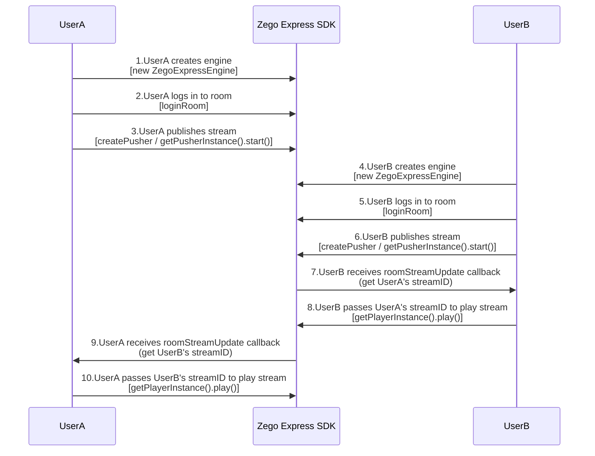
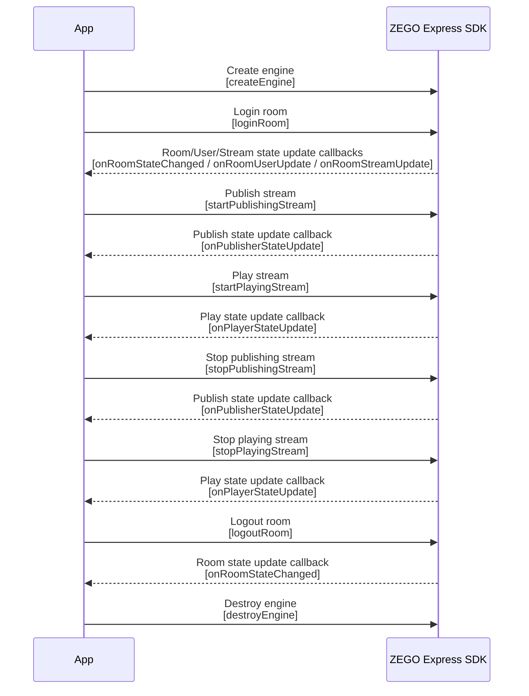

# Implementing Video Call with React (Web)

---
## Feature introduction

This article introduces how to quickly use React to implement a simple Video Call.

Explanation of related concepts:
- ZEGO Express SDK: Video Call SDK provided by ZEGO, which can provide developers with convenient access, high definition and smoothness, multi-platform interoperability, low latency, and high concurrency audio and video services.
- Publishing: The process of transmitting the packaged audio and video data stream from the capture stage to the ZEGO Video Call cloud.
- Playing: The process of pulling existing audio and video data streams from the ZEGO Video Call cloud.

## Prerequisites

Before implementing basic Video Call features, please ensure:

- A project has been created in the [ZEGOCLOUD Console](https://console.zego.im), and a valid AppID and Server address have been applied for. For details, please refer to [Console - Project Information](/console/project-info).
- ZEGO Express SDK has been integrated into the project, and basic audio and video publishing/playing features have been implemented. For details, please refer to [Quick Start - Integration](/real-time-video-web/quick-start/integrating-sdk) and [Quick Start - Implementation](/real-time-video-web/quick-start/implementing-video-call).

## Download example source code

Please refer to [Download example source code](/real-time-video-web/quick-start/run-example-code) to get the source code.

For related source code, please check the files in the "/express-demo-web/src/Examples/Framework/React" directory.

## Usage steps

<Note title="Note">


The Node version used in the current project is 14.17.3, and the React version is 16.7.0.

</Note>


Taking user A and user B pushing and pulling each other's streams as an example, the flow is as follows:


{/*
<Frame width="512" height="auto" caption=""></Frame>
*/}

The API call sequence of the entire publishing/playing process is as follows:


{/*
<Frame width="512" height="auto" caption=""></Frame>
*/}

### Create engine

#### (Optional) Create UI

<Accordion title="Add UI elements" defaultOpen="false">
Before creating the engine, it is recommended for developers to add the following UI elements to facilitate the implementation of basic Video Call features.

- Local preview window
- Remote video window
- End button

<Frame width="512" height="auto" caption=""></Frame>
</Accordion>

#### Create engine

Import react.js, react-dom.js, and babel.js in the "/express-demo-web/src/Examples/Framework/React/index.html" file.

```html
// Import react.js and react-dom.js
<script src="https://cdn.bootcdn.net/ajax/libs/react/16.7.0/cjs/react.development.js"></script>
<script src="https://cdn.bootcdn.net/ajax/libs/react-dom/16.7.0/cjs/react-dom-server.browser.development.js"></script>

// Import babel.min.js to compile ES6 syntax
<script src="https://unpkg.com/babel-standalone@6/babel.min.js"></script>
```

<Warning title="Warning">


If we need to use JSX, the "type" attribute of the \<script> tag needs to be set to "text/babel".

</Warning>


Create a [ZegoExpressEngine ](https://www.zegocloud.com/article/api?doc=Express_Video_SDK_API~javascript_web~class~ZegoExpressEngine) engine instance, pass the applied AppID to the parameter "appID", and pass the access server address to the parameter "server".

<Note title="Note">
- "server" is the access server address. For how to obtain it, please refer to
[Console - Project Information](/console/project-info#configuration-information).
- For SDK version 3.6.0 and above, server can be changed to an empty string, null, undefined, or any character, but cannot be left empty.
</Note>

```javascript
// Initialize instance
class CommonUsageReact extends React.Component {
    constructor(props) {
        super(props);
        this.state = {
            zg: null
        }
    }
    createZegoExpressEngineOption(){
        const zg = new ZegoExpressEngine(appID, server)
        this.setState({
            zg:zg
        },() => {
            // Listen for event callbacks
            this.initEvent();
        })
    }
}
```


#### (Optional) Listen for event callbacks

<Accordion title="Register callbacks" defaultOpen="false">
If you need to register callbacks, developers can implement certain methods in ZegoEvent (including [ZegoRTCEvent](https://www.zegocloud.com/article/api?doc=Express_Video_SDK_API~javascript_web~interface~ZegoRTCEvent) and [ZegoRTMEvent](https://www.zegocloud.com/article/api?doc=Express_Video_SDK_API~javascript_web~interface~ZegoRTMEvent)) according to actual needs. After creating the engine, you can set callbacks by calling the [on](https://www.zegocloud.com/article/api?doc=Express_Video_SDK_API~javascript_web~class~ZegoExpressEngine#on) interface.


```javascript
initEvent() {
  this.state.zg.on('roomStateChanged', (roomID, reason, errorCode, extendData) => {
        if (reason == ZegoRoomStateChangedReason.Logining) {
            // Logging in
        } else if (reason == ZegoRoomStateChangedReason.Logined) {
            // Login successful
            //Only when the room state is login successful or reconnection successful, publishing (startPublishingStream) and playing (startPlayingStream) can normally send and receive audio and video
            //Publish your audio and video stream to the ZEGO Video Call cloud
        } else if (reason == ZegoRoomStateChangedReason.LoginFailed) {
            // Login failed
        } else if (reason == ZegoRoomStateChangedReason.Reconnecting) {
            // Reconnecting
        } else if (reason == ZegoRoomStateChangedReason.Reconnected) {
            // Reconnection successful
        } else if (reason == ZegoRoomStateChangedReason.ReconnectFailed) {
            // Reconnection failed
        } else if (reason == ZegoRoomStateChangedReason.Kickout) {
            // Kicked out of the room
        } else if (reason == ZegoRoomStateChangedReason.Logout) {
            // Logout successful
        } else if (reason == ZegoRoomStateChangedReason.LogoutFailed) {
            // Logout failed
        }
});
}
```
</Accordion>

### (Optional) Check compatibility

<Accordion title="Check compatibility" defaultOpen="false">
Before implementing publishing/playing features, developers can call the [checkSystemRequirements](https://www.zegocloud.com/article/api?doc=Express_Video_SDK_API~javascript_web~class~ZegoExpressEngine#check-system-requirements) interface to detect browser compatibility.

For browser compatible versions supported by the SDK, please refer to "Prepare environment" in [Download example source code](/real-time-video-web/quick-start/run-example-code#prepare-environment).

```js
const result = await this.state.zg.checkSystemRequirements();
// The returned result is the compatibility detection result. When webRTC is true, it means WebRTC is supported. For the meaning of other attributes, please refer to the interface API documentation
console.log(result);
// {
//   webRTC: true,
//   customCapture: true,
//   camera: true,
//   microphone: true,
//   videoCodec: { H264: true, H265: false, VP8: true, VP9: true },
//   screenSharing: true,
//   errInfo: {}
// }
```

For the meaning of each parameter in the returned result, please refer to the parameter description under the [ZegoCapabilityDetection](https://www.zegocloud.com/article/api?doc=Express_Video_SDK_API~javascript_web~interface~ZegoCapabilityDetection) interface.
</Accordion>


### Login room

#### Generate Token

Logging into the room requires a Token for identity verification. For how to obtain it, please refer to [Using Token Authentication](/real-time-video-web/communication/using-token-authentication). For quick debugging, you can use the console to generate a temporary Token.

#### Login room

Call the [loginRoom ](https://www.zegocloud.com/article/api?doc=Express_Video_SDK_API~javascript_web~class~ZegoExpressEngine#login-room) interface, pass in the room ID parameter "roomID", "token", and user parameter "user", and pass in the parameter "config" according to the actual situation to log into the room.

<Warning title="Warning">


- Before logging into the room, please register all callbacks that need to be listened to after logging into the room. After successfully logging into the room, you can receive related callbacks.
- The values of "roomID", "userID", and "userName" parameters are all customized.
- Both "roomID" and "userID" must be unique. It is recommended that developers set "userID" to a meaningful value and associate it with the business account system.

</Warning>


```javascript
// Login room, returns true if successful
// Setting userUpdate to true will enable listening to the roomUserUpdate callback. By default, this listening is not enabled
const result = await this.state.zg.loginRoom(roomID, token, {userID, userName}, {userUpdate: true});
```

#### Listen for event callbacks after logging into the room

According to actual application needs, listen for event notifications you want to pay attention to before logging into the room, such as room state updates, user state updates, stream state updates, etc.

- [roomStateChanged](https://www.zegocloud.com/article/api?doc=Express_Video_SDK_API~javascript_web~interface~ZegoRTMEvent#room-state-changed): Room state update callback. After logging into the room, when the room connection state changes (such as room disconnection, login authentication failure, etc.), the SDK will notify through this callback.
- [roomUserUpdate](https://www.zegocloud.com/article/api?doc=Express_Video_SDK_API~javascript_web~interface~ZegoRTMEvent#room-user-update): User state update callback. After logging into the room, when users are added to or removed from the room, the SDK will notify through this callback.

    Only when calling the [loginRoom](https://www.zegocloud.com/article/api?doc=Express_Video_SDK_API~javascript_web~class~ZegoExpressEngine#login-room) interface to log into the room and passing in the [ZegoRoomConfig](https://www.zegocloud.com/article/api?doc=Express_Video_SDK_API~javascript_web~interface~ZegoRoomConfig) configuration, and the "userUpdate" parameter value is "true", users can receive the [roomUserUpdate](https://www.zegocloud.com/article/api?doc=Express_Video_SDK_API~javascript_web~interface~ZegoRTMEvent#room-user-update) callback.

- [roomStreamUpdate](https://www.zegocloud.com/article/api?doc=Express_Video_SDK_API~javascript_web~interface~ZegoRTCEvent#room-stream-update): Stream state update callback. After logging into the room, when users add or remove audio and video streams in the room, the SDK will notify through this callback.

<Warning title="Warning">

Usually, if a user wants to play videos published by other users, they can call the [startPlayingStream](https://www.zegocloud.com/article/api?doc=Express_Video_SDK_API~javascript_web~class~ZegoExpressEngine#start-playing-stream) interface in the callback of stream state update (ADD) to play the remote audio and video stream published by remote users.

</Warning>


```javascript
// Room state update callback
this.state.zg.on('roomStateChanged', (roomID, reason, errorCode, extendData) => {
        if (reason == ZegoRoomStateChangedReason.Logining) {
            // Logging in
        } else if (reason == ZegoRoomStateChangedReason.Logined) {
            // Login successful
            //Only when the room state is login successful or reconnection successful, publishing (startPublishingStream) and playing (startPlayingStream) can normally send and receive audio and video
            //Publish your audio and video stream to the ZEGO Video Call cloud
        } else if (reason == ZegoRoomStateChangedReason.LoginFailed) {
            // Login failed
        } else if (reason == ZegoRoomStateChangedReason.Reconnecting) {
            // Reconnecting
        } else if (reason == ZegoRoomStateChangedReason.Reconnected) {
            // Reconnection successful
        } else if (reason == ZegoRoomStateChangedReason.ReconnectFailed) {
            // Reconnection failed
        } else if (reason == ZegoRoomStateChangedReason.Kickout) {
            // Kicked out of the room
        } else if (reason == ZegoRoomStateChangedReason.Logout) {
            // Logout successful
        } else if (reason == ZegoRoomStateChangedReason.LogoutFailed) {
            // Logout failed
        }
});

// User state update callback
this.state.zg.on('roomUserUpdate', (roomID, updateType, userList) => {
    console.warn(
        `roomUserUpdate: room ${roomID}, user ${updateType === 'ADD' ? 'added' : 'left'} `,
        JSON.stringify(userList),
    );
});

// Stream state update callback
// For specific implementation of the callback method, please refer to the "Video Call" example source code file /src/Examples/QuickStart/VideoTalk/index.js
this.state.zg.on('roomStreamUpdate', async (roomID, updateType, streamList, extendedData) => {
    if (updateType == 'ADD') {
        // Stream added, start playing stream
    } else if (updateType == 'DELETE') {
        // Stream deleted, stop playing stream
    }
});
```


### Publish stream

#### Create stream

1. Before starting to publish, you need to create a local audio and video stream. Call the [createZegoStream](https://www.zegocloud.com/article/api?doc=Express_Video_SDK_API~javascript_web~class~ZegoExpressEngine#create-zego-stream) interface. By default, it will capture camera images and microphone sounds.

<Warning title="Warning">


After calling the [createZegoStream](https://www.zegocloud.com/article/api?doc=Express_Video_SDK_API~javascript_web~class~ZegoExpressEngine#create-zego-stream) interface, you need to wait for the ZEGO server to return the stream object before performing subsequent operations.

</Warning>


Create a container `<div>` for the media stream player component in HTML.
```html
<div id="local-video" style="width:320px;height:240px;"></div>
```

Play the media stream after creating the stream.

```javascript
// After calling the createZegoStream interface, you need to wait for the ZEGO server to return the stream object before performing subsequent operations
const localStream = await this.state.zg.createZegoStream();

// Play the video before or during publishing preview.
localStream.playVideo(document.querySelector("#local-video"), {enableAutoplayDialog:true});
```

2. (Optional) Set audio and video capture parameters

<Accordion title="Set related capture parameters through properties" defaultOpen="false">
You can set audio and video related capture parameters through the following properties in the [createZegoStream](https://www.zegocloud.com/article/api?doc=Express_Video_SDK_API~javascript_web~class~ZegoExpressEngine#create-zego-stream) interface as needed. For details, please refer to [Custom Video Capture](/real-time-video-web/video/custom-video-capture):

- [camera](https://www.zegocloud.com/article/api?doc=Express_Video_SDK_API~javascript_web~interface~ZegoStreamOptions#camera): Configuration for camera and microphone capture stream.

- [screen](https://www.zegocloud.com/article/api?doc=Express_Video_SDK_API~javascript_web~interface~ZegoStreamOptions#screen): Configuration for screen capture stream.

- [custom](https://www.zegocloud.com/article/api?doc=Express_Video_SDK_API~javascript_web~interface~ZegoStreamOptions#custom): Configuration for third-party stream capture.
</Accordion>


#### Start publishing

Call the [startPublishingStream](https://www.zegocloud.com/article/api?doc=Express_Video_SDK_API~javascript_web~class~ZegoExpressEngine#start-publishing-stream) interface, pass in the stream ID parameter "streamID" and the stream object "localStream" obtained from creating the stream, to send the local audio and video stream to remote users.

<Warning title="Warning">


- The value of the "streamID" parameter is customized and must be globally unique within the entire AppID.
- If you need to publish multiple streams, call the [startPublishingStream](https://www.zegocloud.com/article/api?doc=Express_Video_SDK_API~javascript_web~class~ZegoExpressEngine#start-publishing-stream) interface multiple times. Ensure that the "streamID" of each stream is different.

</Warning>


```javascript
// localStream is the MediaStream object obtained from creating the stream
this.state.zg.startPublishingStream(streamID, localStream)
```

#### Listen for event callbacks after publishing

According to actual application needs, listen for event notifications you want to pay attention to after publishing, such as publishing state updates, publishing quality, etc.

- [publisherStateUpdate](https://www.zegocloud.com/article/api?doc=Express_Video_SDK_API~javascript_web~interface~ZegoRTCEvent#publisher-state-update): Publishing state update callback. After successfully calling the publishing interface, when the publishing state changes (such as network interruption causing publishing exceptions, etc.), the SDK will notify through this callback while retrying publishing.
- [publishQualityUpdate](https://www.zegocloud.com/article/api?doc=Express_Video_SDK_API~javascript_web~interface~ZegoRTCEvent#publish-quality-update): Publishing quality callback. After successfully calling the publishing interface, the audio and video stream quality data (such as resolution, frame rate, bitrate, etc.) is called back periodically.

```javascript
// Register the publisherStateUpdate publishing state update event callback.
this.state.zg.on('publisherStateUpdate',({streamID, state}) => {
    // streamID is the stream ID of publishing, state is the publishing state. You can do some logical processing based on these states.
})
// Register the publishQualityUpdate publishing quality update event callback.
this.state.zg.on('publishQualityUpdate', (streamID, stats) => {
    // In the stats object, you can get stream quality related information such as resolution, frame rate, bitrate for data display.
})
```

### Play stream

#### Start playing

Call the [startPlayingStream](https://www.zegocloud.com/article/api?doc=Express_Video_SDK_API~javascript_web~class~ZegoExpressEngine#start-playing-stream) interface, and according to the passed stream ID parameter "streamID", play the audio and video images that have been published to the ZEGO server by remote users.

<Note title="Note">


The "streamID" published by remote users can be obtained from the [roomStreamUpdate](https://www.zegocloud.com/article/api?doc=Express_Video_SDK_API~javascript_web~interface~ZegoRTCEvent#room-stream-update) callback.

</Note>


Create a container `<div>` for the media stream player component in HTML.

```html
<div id="remote-video" style="width: 320px;height: 240px"></div>
```

Play the remote stream obtained on the interface.

```javascript
const remoteStream = await this.state.zg.startPlayingStream(streamID);

// Create a media stream player component
const remoteView = this.state.zg.createRemoteStreamView(remoteStream);
// "remote-video" is the container DOM element id.
remoteView.play("remote-video", {enableAutoplayDialog:true});
```

<Warning title="Warning">


"streamID" must be globally unique within the entire AppID.


</Warning>


#### Listen for event callbacks after playing

According to actual application needs, listen for event notifications you want to pay attention to after playing, such as playing state changes, playing quality, etc.

- [playerStateUpdate](https://www.zegocloud.com/article/api?doc=Express_Video_SDK_API~javascript_web~interface~ZegoRTCEvent#player-state-update): Playing state update callback. After successfully calling the playing interface, when the playing state changes (such as network interruption causing publishing exceptions, etc.), the SDK will notify through this callback while retrying publishing.
- [playQualityUpdate](https://www.zegocloud.com/article/api?doc=Express_Video_SDK_API~javascript_web~interface~ZegoRTCEvent#play-quality-update): Playing quality callback. After successfully calling the playing interface, the audio and video stream quality data (such as resolution, frame rate, bitrate, etc.) is called back periodically.

```javascript
// Register the playerStateUpdate playing state update event callback.
this.state.zg.on('playerStateUpdate',({streamID, state}) => {
    // streamID is the stream ID of playing, state is the playing state. You can do some logical processing based on these states.
})
// Register the playQualityUpdate playing quality update event callback.
this.state.zg.on('playQualityUpdate', (streamID, stats) => {
    // In the stats object, you can get stream quality related information such as resolution, frame rate, bitrate for data display.
})
```

### Experience Video Call features

Run the project on a real device. After running successfully, you can see the local video image.

To facilitate the experience, ZEGO provides a [Web platform for debugging](https://zegoim.github.io/express-demo-web/src/Examples/QuickStart/VideoTalk/index.html?lang=en). On this page, enter the same AppID and RoomID, enter different UserIDs and corresponding [Token](/console/development-assistance/temporary-token), and you can join the same room to communicate with real device devices. When the Video Call starts successfully, you can hear remote audio and see remote video images.


### Stop publishing/playing

#### Stop publishing

Call the [stopPublishingStream](https://www.zegocloud.com/article/api?doc=Express_Video_SDK_API~javascript_web~class~ZegoExpressEngine#stop-publishing-stream) interface to stop sending local audio and video streams to remote users.

```javascript
this.state.zg.stopPublishingStream(streamID)
```

#### Destroy stream

Call the [destroyStream](https://www.zegocloud.com/article/api?doc=Express_Video_SDK_API~javascript_web~class~ZegoExpressEngine#destroy-stream) interface to destroy the created stream data. After destroying the stream, developers need to destroy the video (stop capture) themselves.

```javascript
// localStream is the MediaStream object obtained by calling the createZegoStream interface
this.state.zg.destroyStream(localStream)
```

#### Stop playing

Call the [stopPlayingStream](https://www.zegocloud.com/article/api?doc=Express_Video_SDK_API~javascript_web~class~ZegoExpressEngine#stop-playing-stream) interface to stop playing the audio and video stream published by remote users.

```javascript
this.state.zg.stopPlayingStream(streamID)
```

### Logout room

Call the [logoutRoom](https://www.zegocloud.com/article/api?doc=Express_Video_SDK_API~javascript_web~class~ZegoExpressEngine#logout-room) interface to log out of the room.

```javascript
this.state.zg.logoutRoom(roomID)
```

