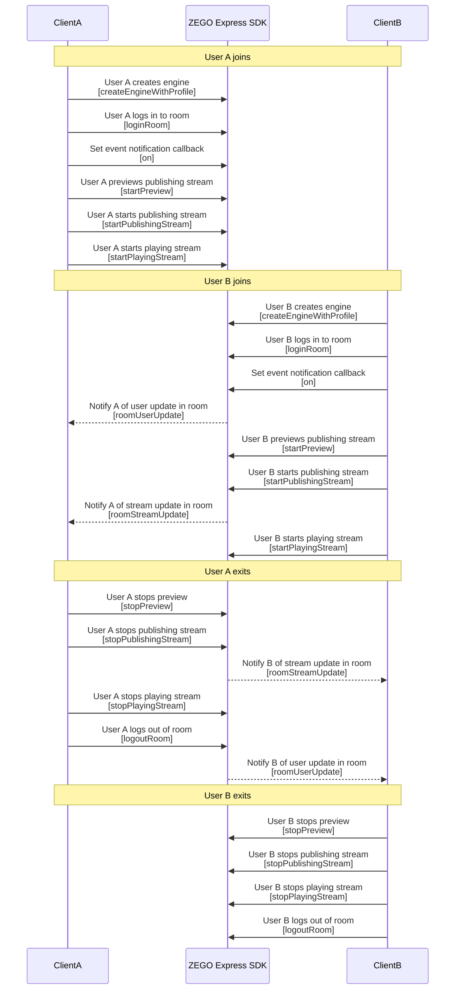
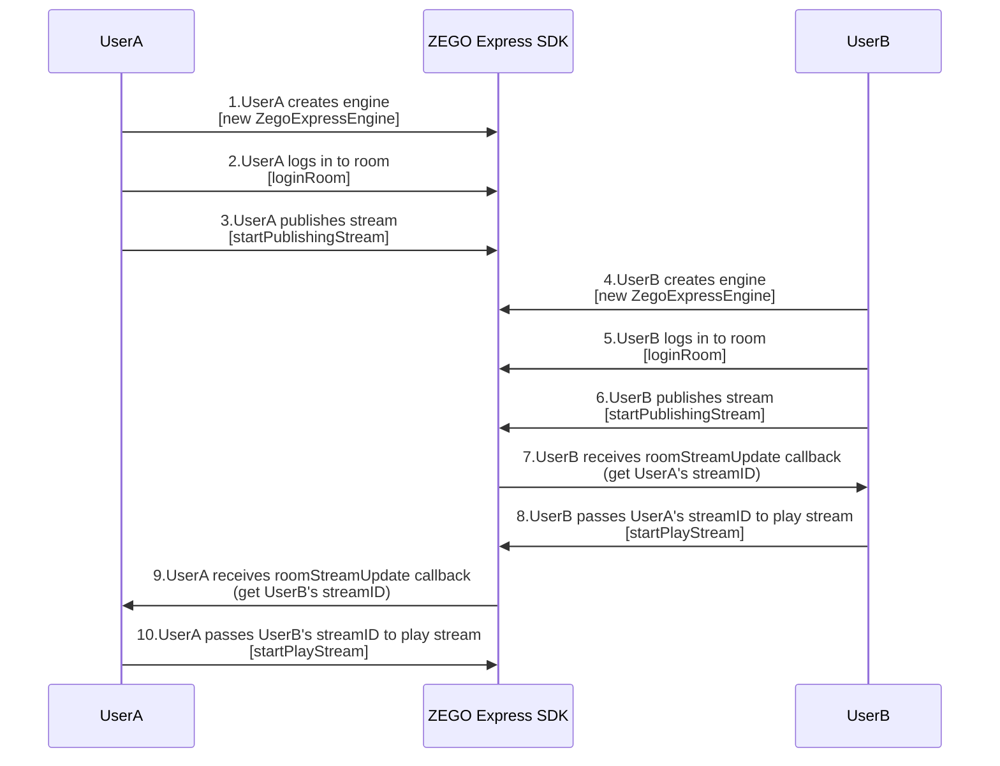

# Multiplayer Video Call

---

## Feature Overview

This document demonstrates how to use ZEGO Express SDK to build a multiplayer video call scenario, which implements multi-to-many real-time audio and video interactions. Users can conduct real-time video calls with other users in the Room, and publish and play streams with each other. This scenario can be used for multiplayer real-time video chat, video conferences, etc.


## Prerequisites

Before applying the multiplayer video call scenario, ensure that:

- You have created a project in the [ZEGOCLOUD Console](https://console.zego.im), and applied for a valid AppID and Server address. For details, please refer to [Console - Project Information](/console/project-info).
- You have integrated the ZEGO Express SDK into the project and implemented basic audio and video stream publishing and playing functions. For details, please refer to [Quick Start - Integration](/real-time-video-web/quick-start/integrating-sdk) and [Quick Start - Implementation](/real-time-video-web/quick-start/implementing-video-call).

## Example Source Code Download

Please refer to [Download Example Source Code](/real-time-video-web/quick-start/run-example-code) to get the source code.

For related source code, please check the files in the "src/Examples/Scenes/VideoForMultipleUsers" directory of ZEGO Express SDK.

## Usage Steps

This section will introduce how to use ZEGO Express SDK to implement multiplayer video calls.

- The process flow is as follows:


{/*
  <Frame width="512" height="auto" caption=""></Frame>
*/}


- The API call sequence diagram is as follows:


{/*
  <Frame width="512" height="auto" caption=""></Frame>
*/}

<Note title="Note">


   ZEGO Express SDK supports multiplayer video calls. The above sequence diagram takes real-time video calls between 2 room members as an example. It is recommended that developers refer to the above process to design their own multiplayer real-time video call scenarios.

</Note>


### 1 Create Engine

Create a [ZegoExpressEngine](@-ZegoExpressEngine) engine instance, pass the applied AppID to the parameter "appID", and pass the access server address to the parameter "server".

<Note title="Note">
- "server" is the access server address. For how to obtain it, please refer to [Console - Project Information](/console/project-info#configuration-information).
- For SDK version 3.6.0 and above, server can be changed to an empty string, null, undefined, or any character, but cannot be left empty.
</Note>


```javascript
const zg = new ZegoExpressEngine(appID, server);
```

### 2 Enable Room User Change Notification

When each user calls the [loginRoom](@loginRoom) interface to log in to the room, developers need to set "userUpdate" in [ZegoRoomConfig](@-ZegoRoomConfig) to "true" to receive callback notifications when other users enter or leave the room (i.e., [roomUserUpdate](@roomUserUpdate)).

```javascript
const isLogin = await zg.loginRoom(
    roomID,
    token,
    { userID },
    { userUpdate: true }
  );
```


### 3 Listen to Callback Events

To implement the multiplayer video call function, you need to listen to the addition and deletion of users and streams in the room and handle them accordingly. Developers can implement certain methods in ZegoEvent (including [ZegoRTCEvent](@-ZegoRTCEvent) and [ZegoRTMEvent](@-ZegoRTMEvent)) according to actual needs. After creating the engine, you can set callbacks by calling the [on](https://www.zegocloud.com/article/api?doc=Express_Video_SDK_API~javascript_web~class~ZegoExpressEngine#on) interface.


#### Listen to User Changes in the Room

<Warning title="Warning">


You can only listen to the [roomUserUpdate](@roomUserUpdate) callback when you set to focus on user changes when calling [loginRoom](@loginRoom) to log in to the room, that is, when "userUpdate" in [ZegoRoomConfig](@-ZegoRoomConfig) is set to "true" (the default value is "false").

</Warning>


To listen to user changes in the room, you need to register the [roomUserUpdate](@roomUserUpdate) callback. The addition and deletion of users who have logged in to the room will trigger this callback. Developers can implement their own business logic in the callback according to actual needs.

The "updateType" parameter in the callback indicates the type of user change in the room. The values of this parameter are as follows:

| User Change Type | Enum Value | Description|
|-|-|-|
| User Added | ADD | Users are added to the room (i.e., joining the room), and "userList" is the list of added users.|
| User Deleted | DELETE | Users are removed from the room (i.e., leaving the room), and "userList" is the list of removed users.|

When a user logs in to the room for the first time, if there are other users in the room, the newly logged-in user will receive the list of added users through this callback, that is, the callback with "updateType" as "ADD". The user list is the users who already exist in the room.


```javascript
zg.on('roomUserUpdate', (roomID, updateType, userList) => {
    console.log('roomUserUpdate roomID ', roomID, streamList);
    if (updateType === 'ADD') {
        // update view
    } else if(updateType == 'DELETE') {
        // update view
    }
});
```


#### Listen to Stream Changes in the Room

<Warning title="Warning">


When a stream is deleted, if you are calling the [startPlayingStream](@startPlayingStream) interface to play the stream, please call the [stopPlayingStream](@stopPlayingStream) interface to stop playing the stream. Otherwise, the SDK will report a stream playing error.

</Warning>


To listen to stream changes in the room, you need to register the [roomStreamUpdate](@roomStreamUpdate) callback. The addition and deletion of streams in the room that have been logged in will trigger this callback. Developers can implement their own business logic in the callback according to actual needs.

The "updateType" parameter in the callback indicates the type of stream change in the room. The values of this parameter are as follows:

| Stream Change Type | Enum Value | Description |
|-|-|-|
| Stream Added | ADD | Streams are added to the room, and "streamList" is the list of added streams.|
| Stream Deleted | DELETE | Streams are removed from the room, and "streamList" is the list of removed streams.|

When a user logs in to the room for the first time, if there are other users publishing streams in the room, a list of added streams will be received, that is, the callback with "updateType" as "ADD".


```javascript
zg.on('roomStreamUpdate', (roomID, updateType, streamList) => {
    console.log('roomStreamUpdate roomID ', roomID, streamList);
    if(updateType === 'ADD') {
    	// update view
    } else if(updateType == 'DELETE') {
    	// update view
    }
});
```


### 4 Other Operations

Please refer to [Quick Start - Implementation](/real-time-video-web/quick-start/implementing-video-call) to complete the operations of logging in to the room, publishing streams, and playing streams in sequence.
