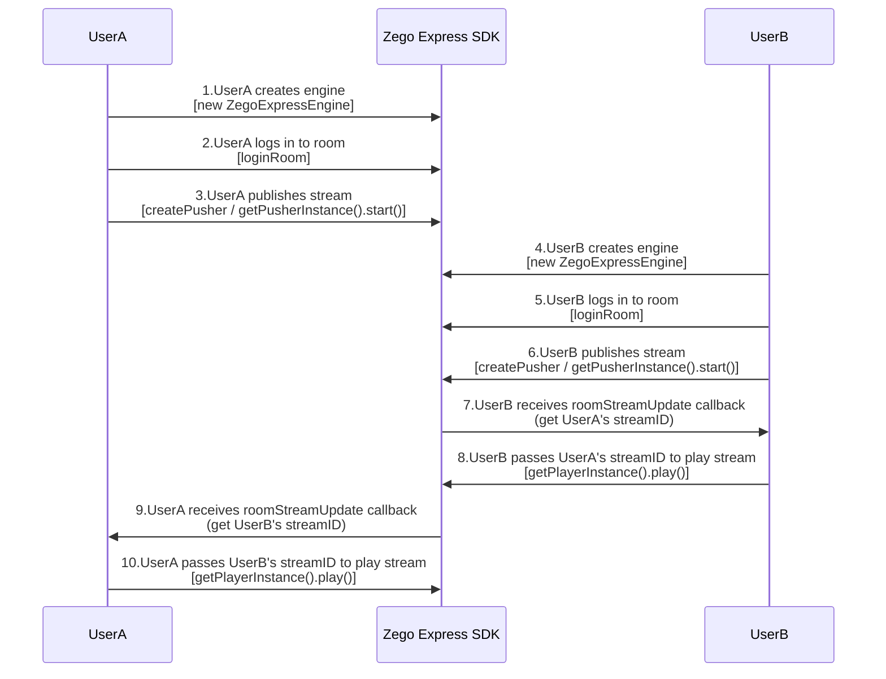
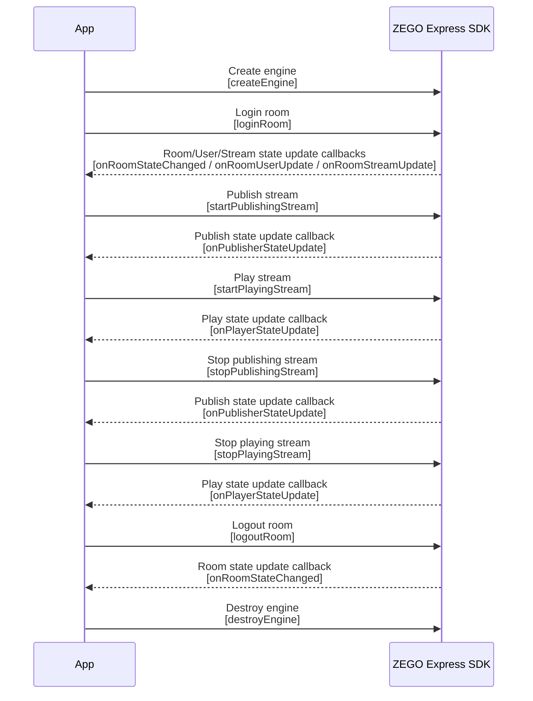

# Implementing Video Call

---

## Feature Introduction

This article introduces how to quickly implement a simple real-time audio and video call.

Before you start, you can understand some basic concepts of audio and video:

- Stream: A set of audio and video data content encapsulated in a specified encoding format. A stream can contain several tracks, such as video and audio tracks.
- Publish stream: The process of pushing the captured and packaged audio and video data stream to the ZEGOCLOUD.
- Play stream: The process of pulling and playing existing audio and video data streams from the ZEGOCLOUD.
- Room: An audio and video space service provided by ZEGO, used to organize user groups. Users in the same room can send and receive real-time audio, video, and messages to each other.
    1. Users need to log in to a room before they can publish and play streams.
    2. Users can only receive relevant messages in the room they are in (user entry/exit, audio and video stream changes, etc.).


## Prerequisites

Before implementing basic real-time audio and video functions, please ensure:
- The ZEGO Express SDK has been integrated into the project. For details, please refer to [Quick Start - Integration](/real-time-video-web/quick-start/integrating-sdk).
- A project has been created in the [ZEGOCLOUD Console](https://console.zegocloud.com), and a valid `AppID` and `Server address` have been obtained. 


## Example Code

We provide a complete example HTML file that implements the basic process, which can be used as a reference during development.

<Accordion title="Complete Example HTML" defaultOpen="false">
```html
<!DOCTYPE html>
<html>

<head>
    <meta charset="UTF-8">
    <title>Zego Express Video Call</title>
    <!-- Change this to the correct SDK version number -->
    <script src="ZegoExpressWebRTC-x.x.x.js"></script>

</head>

<body>
    <h1>
        Zego RTC Video Call
    </h1>
    <div class="video-wrapper">
        **Local video**
        **Remote video**
        <div id="local-video"></div>
        <div id="remote-video"></div>
    </div>
    <script>
        // Project unique identifier AppID, Number type, please obtain from ZEGO console
        let appID = 0
        // Access server address Server, String type, can be filled with an empty string directly
        let server = ""

        // Initialize instance
        const zg = new ZegoExpressEngine(appID, server);
        zg.setDebugVerbose(false)
        // Room state update callback
        // Here, after successfully logging into the room, immediately start publishing the stream. When implementing specific business logic, you can choose other timing to publish the stream, as long as the current room connection state is successful.
        // Room state update callback
        zg.on('roomStateChanged', async (roomID, reason, errorCode, extendedData) => {
            if (reason == 'LOGINED') {
                console.log("Connected to the room successfully. Only when the room state is successfully connected can you perform operations such as publishing and playing streams.")
            }
        })

        zg.on('roomUserUpdate', (roomID, updateType, userList) => {
            // Notification when other users join or leave the room
        });

        zg.on('roomStreamUpdate', async (roomID, updateType, streamList, extendedData) => {
            // Notification when audio and video streams of other users in the room change
            if (updateType == 'ADD') {
                // Stream added, start playing stream
                // Here we demonstrate playing the audio and video of the first stream in the newly added stream list
                const streamID = streamList[0].streamID;
                // streamList contains the corresponding streamID of the stream
                const remoteStream = await zg.startPlayingStream(streamID);
                // Create media stream player component
                const remoteView = zg.createRemoteStreamView(remoteStream);
                remoteView.play("remote-video", {enableAutoplayDialog:true});

            } else if (updateType == 'DELETE') {
                // Stream deleted, stop playing stream by using the streamID of each stream in the stream deletion list streamList
                const streamID = streamList[0].streamID;
                zg.stopPlayingStream(streamID)
            }
        });

        // Log in to the room, returns true if successful
        // userUpdate must be set to true to receive the roomUserUpdate callback.
        let userID = "user1"; // userID is set by the user, must be globally unique
        let userName = "user1";// userName is set by the user, no uniqueness requirement, not required
        let roomID = "123"; // roomID is set by the user, must be globally unique
        // token is generated by the user's own server. For faster process flow, you can get a temporary audio and video token through the ZEGO console https://console.zego.im/, token is a string
        let token = ``;

        zg.loginRoom(roomID, token, { userID, userName: userID }, { userUpdate: true }).then(async result => {
            if (result == true) {
                console.log("login success");
                // Connected to the room successfully. Only when the room state is successfully connected can you perform operations such as publishing and playing streams.
                // Create stream and preview
                // After calling the createZegoStream interface, you need to wait for the ZEGO server to return the streaming media object before performing subsequent operations
                const localStream = await zg.createZegoStream();
                // Preview screen
                localStream.playVideo(document.querySelector("#local-video"), {enableAutoplayDialog:true});
                // Start publishing stream, push your own audio and video stream to the ZEGO audio and video cloud. Here streamID is defined by the user and must be globally unique
                let streamID = new Date().getTime().toString();
                zg.startPublishingStream(streamID, localStream)
            }
        });
        // // Second way to log in to the room
        // (async function main(){
        //     await zg.loginRoom(roomID, token, { userID, userName: userID }, { userUpdate: true })
        // })()
    </script>
</body>

</html>
```
</Accordion>


## Implementation Process

Taking user A and user B pushing and pulling each other's streams as an example, the main process of a simple real-time audio and video call is as follows:

1. User A creates an instance and logs in to the room. (After successful login, they can preview their own screen and publish the stream.)
2. User B creates an instance and logs in to the same room. After successful login, user B starts publishing the stream. At this time, the SDK will trigger the [roomStreamUpdate ](@roomStreamUpdate) callback, indicating that there is a stream change in the room.
3. User A can monitor the [roomStreamUpdate ](@roomStreamUpdate) callback. When the callback notifies that a stream has been added, get user B's stream ID to play the stream just published by user B.


{/*
<Frame width="512" height="auto" caption=""></Frame>
*/}


### Create Interface

To facilitate the implementation of basic real-time audio and video functions, you can refer to the following figure to implement a simple page.

<Frame width="512" height="auto" caption="">
  
</Frame>


<a id="CreateEngine"> </a>

### Create Engine and Monitor Callbacks

1. Create and initialize an instance of [ZegoExpressEngine ](https://www.zegocloud.com/article/api?doc=Express_Video_SDK_API~javascript_web~class~ZegoExpressEngine), passing your project's `AppID` to the parameter "appID" and `Server address` to the parameter "server".

<Warning title="Warning">
- If using SDK version 3.7.0 or above, the `server` parameter can be filled with the `Server address` obtained from the console or directly with an empty string.
- The ZegoExpressEngine instance cannot be processed by frameworks in a reactive manner, otherwise unpredictable problems will occur. For example, in the Vue3 framework, you can mark the SDK instance through Vue3's markRaw interface to avoid being converted to a proxy.
</Warning>


2. The SDK provides notification callbacks such as room connection status, audio and video stream changes, and user entry/exit. After creating the engine, you can register callbacks through the engine instance's [on](https://www.zegocloud.com/article/api?doc=Express_Video_SDK_API~javascript_web~class~ZegoExpressEngine#on) method.

<Warning title="Warning">


  To avoid missing event notifications, it is recommended to register callbacks immediately after creating the engine

</Warning>


  ```javascript
  // Project unique identifier AppID, Number type, please obtain from ZEGO console
  let appID = ;
  // Access server address Server, String type, can be filled with an empty string directly
  let server = "";

  // Initialize instance
  const zg = new ZegoExpressEngine(appID, server);

  // Room state update callback
  zg.on('roomStateChanged', (roomID, reason, errorCode, extendData) => {
      if (reason == 'LOGINING') {
          // Logging in
      } else if (reason == 'LOGINED') {
          // Login successful
          //Only when the room state is login successful or reconnection successful can publishing streams (startPublishingStream) and playing streams (startPlayingStream) normally send and receive audio and video
          //Push your own audio and video stream to the ZEGO audio and video cloud
      } else if (reason == 'LOGIN_FAILED') {
          // Login failed
      } else if (reason == 'RECONNECTING') {
          // Reconnecting
      } else if (reason == 'RECONNECTED') {
          // Reconnection successful
      } else if (reason == 'RECONNECT_FAILED') {
          // Reconnection failed
      } else if (reason == 'KICKOUT') {
          // Kicked out of the room
      } else if (reason == 'LOGOUT') {
          // Logout successful
      } else if (reason == 'LOGOUT_FAILED') {
          // Logout failed
      }
  });

  //Notification when other users join or leave the room
  //Only when calling loginRoom to log in to the room and passing ZegoRoomConfig, and the userUpdate parameter of ZegoRoomConfig is "true", can users receive the roomUserUpdate callback.
  zg.on('roomUserUpdate', (roomID, updateType, userList) => {
      if (updateType == 'ADD') {
          for (var i = 0; i < userList.length; i++) {
              console.log(userList[i]['userID'], 'joined the room: ', roomID)
          }
      } else if (updateType == 'DELETE') {
          for (var i = 0; i < userList.length; i++) {
              console.log(userList[i]['userID'], 'left the room: ', roomID)
          }
      }
  });

  zg.on('roomStreamUpdate', async (roomID, updateType, streamList, extendedData) => {
      // Notification when audio and video streams of other users in the room change
  });
  ```


<Accordion title="Common Notification Callbacks" defaultOpen="false">
```javascript
// Room connection status update callback
// When the local user calls loginRoom to join a room, you can monitor your connection status in the room by listening to the roomStateChanged callback.
zg.on('roomStateChanged', (roomID, reason, errorCode, extendData) => {
    if (reason == 'LOGINING') {
        // Logging in
    } else if (reason == 'LOGINED') {
        // Login successful
        //Only when the room state is login successful or reconnection successful can publishing streams (startPublishingStream) and playing streams (startPlayingStream) normally send and receive audio and video
        //Push your own audio and video stream to the ZEGO audio and video cloud
    } else if (reason == 'LOGIN_FAILED') {
        // Login failed
    } else if (reason == 'RECONNECTING') {
        // Reconnecting
    } else if (reason == 'RECONNECTED') {
        // Reconnection successful
    } else if (reason == 'RECONNECT_FAILED') {
        // Reconnection failed
    } else if (reason == 'KICKOUT') {
        // Kicked out of the room
    } else if (reason == 'LOGOUT') {
        // Logout successful
    } else if (reason == 'LOGOUT_FAILED') {
        // Logout failed
    }
});

//Notification when audio and video streams published by other users in the room are added/reduced
//You cannot receive notifications for your own published streams here
zg.on('roomStreamUpdate', async (roomID, updateType, streamList, extendedData) => {
    if (updateType == 'ADD') {
        // Stream added
        for (var i = 0; i < streamList.length; i++) {
            console.log('Stream added in room ',roomID,': ', streamList[i]['streamID'])
        }
        const message = "Other user's video stream streamID: " + streamID.toString();
    } else if (updateType == 'DELETE') {
        // Stream deleted
        for (var i = 0; i < streamList.length; i++) {
            console.log('Stream removed in room ',roomID,': ', streamList[i]['streamID'])
        }
    }
});

//Notification when other users join or leave the room
//Only when calling loginRoom to log in to the room and passing ZegoRoomConfig, and the userUpdate parameter of ZegoRoomConfig is "true", can users receive the roomUserUpdate callback.
zg.on('roomUserUpdate', (roomID, updateType, userList) => {
    if (updateType == 'ADD') {
        for (var i = 0; i < userList.length; i++) {
            console.log(userList[i]['userID'], 'joined the room: ', roomID)
        }
    } else if (updateType == 'DELETE') {
        for (var i = 0; i < userList.length; i++) {
            console.log(userList[i]['userID'], 'left the room: ', roomID)
        }
    }
});

//Notification of the status of users publishing audio and video streams
//When the status of users publishing audio and video streams changes, this callback will be received. If the network interruption causes publishing stream exceptions, the SDK will notify the status change while retrying to publish the stream.
zg.on('publisherStateUpdate', result => {
    // Publishing stream status update callback
    var state = result['state']
    var streamID = result['streamID']
    var errorCode = result['errorCode']
    var extendedData = result['extendedData']
    if (state == 'PUBLISHING') {
        console.log('Successfully published audio and video stream: ', streamID);
    } else if (state == 'NO_PUBLISH') {
        console.log('Not publishing audio and video stream');
    } else if (state == 'PUBLISH_REQUESTING') {
        console.log('Requesting to publish audio and video stream: ', streamID);
    }
    console.log('Error code:', errorCode,' Additional information:', extendedData)
})

//Publishing stream quality callback.
//After successfully publishing the stream, you will periodically receive callback audio and video stream quality data (such as resolution, frame rate, bitrate, etc.).
zg.on('publishQualityUpdate', (streamID, stats) => {
    // Publishing stream quality callback
    console.log('Stream quality callback')
})

//Notification of the status of users playing audio and video streams
//When the status of users playing audio and video streams changes, this callback will be received. If the network interruption causes playing stream exceptions, the SDK will automatically retry.
zg.on('playerStateUpdate', result => {
    // Playing stream status update callback
    var state = result['state']
    var streamID = result['streamID']
    var errorCode = result['errorCode']
    var extendedData = result['extendedData']
    if (state == 'PLAYING') {
        console.log('Successfully played audio and video stream: ', streamID);
    } else if (state == 'NO_PLAY') {
        console.log('Not playing audio and video stream');
    } else if (state == 'PLAY_REQUESTING') {
        console.log('Requesting to play audio and video stream: ', streamID);
    }
    console.log('Error code:', errorCode,' Additional information:', extendedData)
})

//Quality callback when playing audio and video streams.
//After successfully playing the stream, you will periodically receive quality data notifications when playing audio and video streams (such as resolution, frame rate, bitrate, etc.).
zg.on('playQualityUpdate', (streamID,stats) => {
    // Playing stream quality callback
})

//Notification when receiving broadcast messages
zg.on('IMRecvBroadcastMessage', (roomID, chatData) => {
    console.log('Broadcast message IMRecvBroadcastMessage', roomID, chatData[0].message);
    alert(chatData[0].message)
});

//Notification when receiving barrage messages
zg.on('IMRecvBarrageMessage', (roomID, chatData) => {
    console.log('Barrage message IMRecvBroadcastMessage', roomID, chatData[0].message);
    alert(chatData[0].message)
});

//Notification when receiving custom signaling messages
zg.on('IMRecvCustomCommand', (roomID, fromUser, command) => {
    console.log('Custom message IMRecvCustomCommand', roomID, fromUser, command);
    alert(command)
});
```
</Accordion>

### Check Compatibility

Considering that different browsers have different compatibility with WebRTC, before implementing the publishing and playing functions, you need to check whether the browser can run WebRTC normally.

You can call the [checkSystemRequirements](https://www.zegocloud.com/article/api?doc=Express_Video_SDK_API~javascript_web~class~ZegoExpressEngine#check-system-requirements) interface to check the browser's compatibility. For the meaning of the check results, please refer to the parameter descriptions under the [ZegoCapabilityDetection](@-ZegoCapabilityDetection) interface.

```js
const result = await zg.checkSystemRequirements();
// The returned result is the compatibility check result. When webRTC is true, it means supporting webRTC. For the meaning of other attributes, please refer to the interface API documentation.
console.log(result);
// {
//   webRTC: true,
//   customCapture: true,
//   camera: true,
//   microphone: true,
//   videoCodec: { H264: true, H265: false, VP8: true, VP9: true },
//   screenSharing: true,
//   errInfo: {}
// }
```

You can also use the [online detection tool](https://zegodev.github.io/zego-express-webrtc-sample/webrtcCheck/index.html) provided by ZEGO, open it in the browser that needs to be detected, and directly check the browser's compatibility. Please refer to [Browser Compatibility and Known Issues](/real-time-video-web/introduction/browser-restrictions) for the browser compatibility versions supported by the SDK.

<a id="createroom"></a>

### Log In to Room

**1. Generate Token**

Logging in to a room requires a Token for identity verification. Developers can directly obtain a temporary Token (valid for 24 hours) from the [ZEGO console](https://console.zego.im/dashboard) to use. 

<Note title="Note">


Temporary Token is only for debugging. Before officially going online, please generate the Token from the developer's business server. For details, please refer to [Use Token for Authentication](/real-time-video-web/communication/using-token-authentication).

</Note>


**2. Log In to Room**

Call the [loginRoom ](https://www.zegocloud.com/article/api?doc=Express_Video_SDK_API~javascript_web~class~ZegoExpressEngine#login-room) interface, passing in the room ID parameter "roomID", "token" and user parameter "user", and pass in the parameter "config" according to the actual situation to log in to the room. If the room does not exist, calling this interface will create and log in to this room.

<Warning title="Warning">


- The values of the "roomID", "userID" and "userName" parameters are all customized, among which "userName" is not required.
- Both "roomID" and "userID" must be unique. It is recommended that developers set "userID" to a meaningful value and associate it with their own business account system.
- "userID" must be consistent with the userID passed in when generating the token, otherwise the login will fail.
- Only when calling the [loginRoom](@loginRoom) interface to log in to the room and passing [ZegoRoomConfig](@-ZegoRoomConfig) configuration, and the "userUpdate" parameter value is "true", can users receive the [roomUserUpdate](@roomUserUpdate) callback.

</Warning>


```javascript
// The values of "roomID", "userID" and "userName" parameters need to be filled in according to the actual situation.
// Log in to the room, returns true if successful.
// userUpdate must be set to true to receive the roomUserUpdate callback.
let userID = "0001";
let userName = "user0001";
let roomID = "0001";
let token = ;
// To avoid missing any notifications, you need to listen for callbacks such as user join/exit room, room connection status change, publishing stream status change, etc. before logging in to the room.
zg.on('roomStateChanged', async (roomID, reason, errorCode, extendedData) => {

})
zg.loginRoom(roomID, token, { userID: userID, userName: userName }, { userUpdate: true }).then(result => {
     if (result == true) {
        console.log("login success")
     }
});
```

You can monitor the [roomStateChanged](@roomStateChanged) callback to check your connection status with the room in real time. Only when the room status is successfully connected can you perform operations such as publishing and playing streams. If logging in to the room fails, please refer to [Error codes](/real-time-video-web/client-sdk/error-code) for operations.

<a id="publishingStream"></a>

### Preview Your Screen and Publish to ZEGO Audio and Video Cloud

1. Create a stream and preview your screen

<Note title="Note">


Regardless of whether you call preview or not, you can publish your audio and video stream to the ZEGO audio and video cloud.

</Note>


Before starting to publish the stream, you need to create the local audio and video stream. Call the [createZegoStream](@createZegoStream) interface to obtain the [ZegoLocalStream](@-ZegoLocalStream) instance object localStream, which will capture the camera screen and microphone sound by default.

Through localStream's [playVideo](@playVideo) and [playAudio](@playAudio) interfaces, create a local media stream player component to play the audio and video to be published or already successfully published.

2. Wait for the [createZegoStream](@createZegoStream) interface to return the [ZegoLocalStream](@-ZegoLocalStream) instance object localStream, then publish your audio and video stream to the ZEGO audio and video cloud.

Call the [startPublishingStream](@startPublishingStream) interface, passing in "streamID" and the stream object "localStream" obtained from creating the stream, to send the local audio and video stream to remote users. You can know whether the publishing is successful by monitoring the [PublisherStateUpdateCallBack](@PublisherStateUpdateCallBack) callback.

<Note title="Note">


- "streamID" is generated locally by you, but you need to ensure that "streamID" is globally unique under the same AppID. If under the same AppID, different users each publish a stream with the same "streamID", the user who publishes later will fail to publish the stream.
- If you need to interoperate with other platforms or use the [relay to CDN feature](/real-time-video-web/live-streaming/using-cdn-for-live-streaming), please set the video encoding format to H.264. For details, please refer to [Set Video Encoding Attributes](/real-time-video-web/video/set-video-encoding-attributes).

</Note>


```javascript
// Here, after successfully logging in to the room, immediately start publishing the stream. When implementing specific business logic, you can choose other timing to publish the stream, as long as the current room connection state is successfully connected.

zg.loginRoom(roomID, token, { userID, userName: userID }, { userUpdate: true }).then(async result => {
     if (result == true) {
        console.log("login success")
        // Create stream and preview
        // After calling the createZegoStream interface, you need to wait for the ZEGO server to return the ZegoLocalStream instance object before performing subsequent operations
        const localStream = await zg.createZegoStream();

        // Preview screen, mount the player component to the page, "local-video" is the id of the component container <div> element.
        localStream.playVideo(document.querySelector("#local-video"));

        // Start publishing stream, push your own audio and video stream to the ZEGO audio and video cloud
        let streamID = new Date().getTime().toString();
        zg.startPublishingStream(streamID, localStream)
     }
});
```

(Optional) Set audio and video capture parameters

<Accordion title="Set related capture parameters through attributes" defaultOpen="false">
You can set audio and video related capture parameters through the following attributes in the [createZegoStream](@createZegoStream) interface as needed. For details, please refer to [Custom Video Capture](/real-time-video-web/video/custom-video-capture):

- [camera](https://www.zegocloud.com/article/api?doc=Express_Video_SDK_API~javascript_web~interface~ZegoStreamOptions#camera): Configuration for camera and microphone capture stream

- [screen](https://www.zegocloud.com/article/api?doc=Express_Video_SDK_API~javascript_web~interface~ZegoStreamOptions#screen): Configuration for screen capture stream

- [custom](https://www.zegocloud.com/article/api?doc=Express_Video_SDK_API~javascript_web~interface~ZegoStreamOptions#custom): Configuration for third-party stream capture
</Accordion>


### Play Other Users' Audio and Video

When making a video call, we need to play other users' audio and video.

When other users join the room, the SDK will trigger the [roomStreamUpdate](@roomStreamUpdate) callback to notify that a stream has been added to the room. Based on this, you can obtain other users' "streamID". At this time, call the [startPlayingStream](@startPlayingStream) interface according to the passed-in other users' "streamID" to play the remote audio and video screen that has already been published to the ZEGO server. You can know whether the audio and video have been successfully played by monitoring the [PlayerStateUpdateCallBack](@PlayerStateUpdateCallBack) callback. If you need to play streams from CDN, please refer to [Use CDN for Live Streaming](/real-time-video-web/live-streaming/using-cdn-for-live-streaming).

<Warning title="Warning">


It is recommended to use [createRemoteStreamView](@createRemoteStreamView) to play media streams. Using audio or video tags to play media streams is not recommended.

</Warning>


```javascript
// Stream status update callback
zg.on('roomStreamUpdate', async (roomID, updateType, streamList, extendedData) => {
    // When updateType is ADD, it means that an audio and video stream has been added. At this time, you can call the startPlayingStream interface to play this audio and video stream
    if (updateType == 'ADD') {
        // Stream added, start playing stream
        // Here, to make the example code more concise, we only play the first stream in the newly added audio and video stream list. In actual business, it is recommended that developers loop through streamList and play each audio and video stream
        const streamID = streamList[0].streamID;
        // streamList contains the corresponding streamID of the stream
        const remoteStream = await zg.startPlayingStream(streamID);

        // Create a media stream player component object for playing remote media streams.
        const remoteView = zg.createRemoteStreamView(remoteStream);
        // Mount the player component to the page, "remote-video" is the id of the component container <div> element.
        remoteView.play("remote-video");

    } else if (updateType == 'DELETE') {
        // Stream deleted, stop playing stream
    }
});
```

<Warning title="Warning">


- Some browsers may block playing media streams using the [ZegoStreamView](@-ZegoStreamView) media stream player component due to autoplay restriction policies. The SDK will pop up a prompt on the interface by default to resume playback.
- You can set the second parameter options.enableAutoplayDialog of the ZegoStreamView.play() method to false to disable automatic pop-up, and guide the user to click to resume playback by displaying a button on the page in the [autoplayFailed](@autoplayFailed) event callback.

</Warning>


At this point, you have successfully implemented a simple real-time audio and video call. You can open "index.html" in a browser to experience the real-time audio and video function.

### Test Publishing and Playing Functions Online

Run the project on a real device. After successful running, you can see the local video screen.

For convenience, ZEGO provides a [Web platform for debugging](https://zegoim.github.io/express-demo-web/src/Examples/QuickStart/VideoTalk/index.html?lang=en). On this page, enter the same AppID and RoomID, enter different UserIDs and corresponding [Token](/console/development-assistance/temporary-token), and you can join the same room to communicate with the real device. When the audio and video call starts successfully, you can hear the remote audio and see the remote video screen.


### Stop Audio and Video Call

**1. Stop Publishing Stream and Destroy Stream**

Call the [stopPublishingStream](@stopPublishingStream) interface to stop sending the local audio and video stream to remote users. Call the [destroyStream](@destroyStream) interface to destroy the created stream data.


```javascript
// Stop publishing stream according to local streamID
zg.stopPublishingStream(streamID)
// localStream is the ZegoLocalStream instance object obtained by calling the createZegoStream interface
zg.destroyStream(localStream)
```

**2. Stop Playing Stream**

Call the [stopPlayingStream](@stopPlayingStream) interface to stop playing the remote audio and video stream.

<Warning title="Warning">


If the developer receives a notification of "reduction" of audio and video streams through the [roomStreamUpdate](@roomStreamUpdate) callback, please call the [stopPlayingStream ](@stopPlayingStream) interface in time to stop playing the stream to avoid playing empty streams and generating additional costs; or, the developer can choose the appropriate timing according to their own business needs and actively call the [stopPlayingStream ](@stopPlayingStream) interface to stop playing the stream.

</Warning>


```javascript
// Stream status update callback
zg.on('roomStreamUpdate', async (roomID, updateType, streamList, extendedData) => {
    if (updateType == 'ADD') {
        // Stream added, start playing stream
    } else if (updateType == 'DELETE') {
        // Stream deleted, stop playing stream by using the streamID of each stream in the stream deletion list streamList.
        const streamID = streamList[0].streamID;
        zg.stopPlayingStream(streamID)
    }
});
```

**3. Leave Room**

Call the [logoutRoom](@logoutRoom) interface to leave the room.

```javascript
zg.logoutRoom(roomID)
```

**4. Destroy Engine**

If the user will completely no longer use audio and video functions, you can call the [destroyEngine ](@destroyEngine) interface to destroy the engine and release resources such as microphone, camera, memory, CPU, etc.

```javascript
zg.destroyEngine()
zg = null
```

The API call sequence of the entire publishing and playing process can be found in the following figure:


{/*
<Frame width="512" height="auto" caption=""></Frame>
*/}


## FAQ

**After publishing the stream, the console window in browser debug mode frequently prints the following warning "Error: Failed to execute put on IDBObjectStore': #\<Object> could not be cloned." What is the reason?**

The ZegoExpressEngine instance cannot be processed by frameworks in a reactive manner, otherwise an error will occur.

## Related Documentation
- [Error Code Documentation](/real-time-video-web/client-sdk/error-code)
- [How to set and get SDK logs and stack information?](/faq/express-logs-stacktrace?product=ExpressVideo&platform=web)
- [How to use ZEGO Express Web SDK on mobile?](/faq/mobile-web-sdk-usage)
- [How to handle black screen or no sound during live streaming on the Web platform?](/faq/web-live-failure)
- [Why can't I open the camera?](/faq/camera-access-failure)
