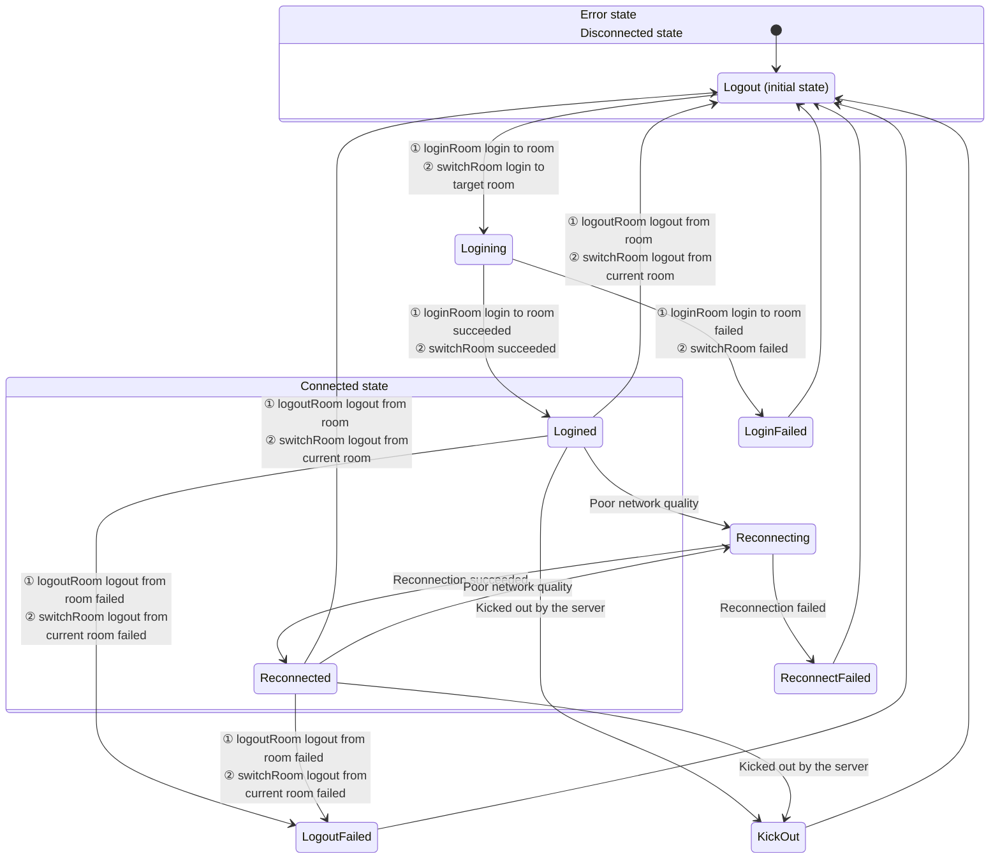

# Room Connection Status

- - -

When using ZEGO Express SDK for audio/video calls or live streaming, users need to join a room to receive callback notifications for stream additions/deletions and user entry/exit from other users in the same room. Therefore, the user's connection status in the room determines whether they can normally use audio and video services.

This article mainly introduces how to determine the user's connection status in the room, and the transition process of each connection status.

## Monitor Room Connection Status

Users can monitor their connection status in the room in real time by listening to the [roomStateChanged](@roomStateChanged) callback. When the user's connection status changes, the SDK will trigger this callback and provide the reason for the room connection status change (i.e., room connection status) and related error codes in the callback.

If the room connection is interrupted due to poor network quality, the SDK will automatically retry internally. For details, please refer to the [Room Disconnection and Reconnection](/real-time-video-web/room/room-connection-status) section.


#### Room Status Description

Users can monitor their connection status changes in the room in real time by listening to the [roomStateChanged](@roomStateChanged) callback. When the user's room connection status changes, the SDK will trigger this callback and provide the reason for the room connection status change (i.e., room connection status) and related error codes in the callback.

If the room connection is interrupted due to poor network quality, the SDK will automatically retry internally. For details, please refer to the [Room Disconnection and Reconnection](/real-time-video-web/room/room-connection-status) section.

#### Room Status Description


{/*
<Frame width="512" height="auto" caption=""></Frame>
*/}

Room connection status transitions between various states. Developers can handle corresponding business logic by combining the reason for the room connection status change [ZegoRoomStateChangedReason](@-ZegoRoomStateChangedReason) (i.e., room connection status) with the errorCode.

<table>

<tbody><tr>
<th>Status and Reason Enum Values</th>
<th>Meaning</th>
<th>Common Events Triggering Entry to This Status</th>
</tr>
<tr>
<td>Logining（Logining）</td>
<td>Logging in to the room. When calling [loginRoom] to log in to the room or [switchRoom] to switch to the target room, enter this status, indicating that a request to connect to the server is in progress. Usually this status is used for application interface display.</td>
<td><ul><li>Calling [loginRoom] to log in to the room, at this time it will first enter this status, and the errorCode is 0.</li><li>When calling [switchRoom] to switch to the target room, the SDK internally requests to log in to the target room, at this time the errorCode is 0.</li></ul></td>
</tr>
<tr>
<td>Logined（Logined）</td>
<td>Successfully logged in to the room. After successfully logging in or switching rooms, enter this status, indicating that the room login has been successful, and users can normally receive callback notifications for additions and deletions of other users and all streams in the room.</td>
<td><ul><li>Calling [loginRoom] to log in to the room successfully, at this time the errorCode is 0.</li><li>When calling [switchRoom] to switch to the target room, the SDK internally logs in to the target room successfully, at this time the errorCode is 0.</li></ul></td>
</tr>
<tr>
<td>LoginFailed（LoginFailed）</td>
<td>Failed to log in to the room. After failing to log in or switch rooms, enter this status, indicating that the room login or room switching has failed, such as incorrect AppID or Token.</td>
<td><ul><li>When using the Token authentication function, the passed-in Token is incorrect, at this time the errorCode is 1002033.</li><li>When the room login times out due to network issues, at this time the errorCode is 1002053.</li><li>When switching to the target room, the SDK internally fails to log in to the target room, at this time the errorCode please refer to the above login error description.</li></ul></td>
</tr>
<tr>
<td>Reconnecting（Reconnecting）</td>
<td>Room connection temporarily interrupted. If the interruption is caused by poor network quality, the SDK will perform internal retries.</td>
<td>When the room connection is temporarily interrupted and reconnection is in progress due to poor network quality, at this time the errorCode is 1000017.</td>
</tr>
<tr>
<td>Reconnected（Reconnected）</td>
<td>Room reconnection successful. If the interruption is caused by poor network quality, the SDK will perform internal retries. After successful reconnection, enter this status.</td>
<td>When the room connection is temporarily interrupted due to poor network quality and then reconnection is successful, at this time the errorCode is 0.</td>
</tr>
<tr>
<td>ReconnectFailed（ReconnectFailed）</td>
<td>Room reconnection failed. If the interruption is caused by poor network quality, the SDK will perform internal retries. After failed reconnection, enter this status.</td>
<td>When the room connection is temporarily interrupted due to poor network quality and then reconnection fails, at this time the errorCode is 1002053.</td>
</tr>
<tr>
<td>KickOut（Kickout）</td>
<td>Kicked out of the room by the server. For example, when the same username logs in to the room elsewhere, causing the local end to be kicked out of the room, this status will be entered.</td>
<td><ul><li>User is kicked out of the room (because a user with the same userID logs in elsewhere), at this time the errorCode is 1002050.</li><li>User is kicked out of the room (developer actively calls the backend <a target="_blank" href="/real-time-video-server/api-reference/room/kick-out-user">Kick User Out of Room</a> interface), at this time the errorCode is 1002055.</li></ul></td>
</tr>
<tr>
<td>Logout（Logout）</td>
<td>Successfully logged out of the room. Before logging in to the room, the default is this status. After successfully calling [logoutRoom] to log out of the room or [switchRoom] internally logs out of the current room successfully, enter this status.</td>
<td><ul><li>After successfully calling [logoutRoom] to log out of the room, at this time the errorCode is 0.</li><li>When calling [switchRoom] to switch rooms, the SDK internally logs out of the current room successfully.</li></ul></td>
</tr>
<tr>
<td>LogoutFailed（LogoutFailed）</td>
<td>Failed to log out of the room. After failing to call [logoutRoom] to log out of the room or [switchRoom] internally fails to log out of the current room, enter this status.</td>
<td>In a multi-room scenario, when calling [logoutRoom] to log out of a room, the room ID does not exist.<br />After failing to log out of the room, other users can still see this user before the heartbeat timeout.</td>
</tr>
</tbody></table>


Developers can refer to the following code to handle common business events:

```javascript
// Project unique identifier AppID, Number type, please obtain from ZEGOCLOUD Console
let appID = ;
// Access server address Server, String type, please obtain from ZEGOCLOUD Console
let server = "";

// Initialize instance
const zg = new ZegoExpressEngine(appID, server);

// Room status update callback
zg.on('roomStateChanged', (roomID, reason, errorCode, extendData) => {
    if (reason == ZegoRoomStateChangedReason.Logining) {
        // Logging in
        // When calling loginRoom to log in to the room or switchRoom to switch to the target room, enter this status, indicating that a request to connect to the server is in progress.
    } else if (reason == ZegoRoomStateChangedReason.Logined) {
        // Login successful
        // This is currently triggered by the developer actively calling loginRoom to log in successfully, or calling switchRoom to switch rooms successfully. Here you can handle the business logic of successful first login to the room, such as pulling the chat room and live room basic information.
        //Only when the room status is login successful or reconnection successful, stream publishing (startPublishingStream) and stream playing (startPlayingStream) can normally send and receive audio and video
        //Push your own audio and video stream to ZEGO audio and video cloud
    } else if (reason == ZegoRoomStateChangedReason.LoginFailed) {
        // Login failed
    } else if (reason == ZegoRoomStateChangedReason.Reconnecting) {
        // Reconnecting
    } else if (reason == ZegoRoomStateChangedReason.Reconnected) {
        // Reconnection successful
    } else if (reason == ZegoRoomStateChangedReason.ReconnectFailed) {
        // Reconnection failed
    } else if (reason == ZegoRoomStateChangedReason.Kickout) {
        // Kicked out of the room
    } else if (reason == ZegoRoomStateChangedReason.Logout) {
        // Logout successful
        // Developer actively calls logoutRoom to log out of the room or calls switchRoom to switch rooms, and the SDK internally logs out of the current room successfully
    } else if (reason == ZegoRoomStateChangedReason.LogoutFailed) {
        // Logout failed
    }
});
```


## Room Disconnection and Reconnection

After a user logs in to a room, due to network signal issues or network type switching issues, the connection with the room is disconnected. The SDK will automatically reconnect internally. There are three situations for user reconnection after disconnection:

- Successful reconnection before the ZEGO server determines user A's heartbeat timeout
- Successful reconnection after the ZEGO server determines user A's heartbeat timeout
- User A fails to reconnect

<Note title="Note">

- Heartbeat timeout is 90s.
- Retry timeout is 5min.

</Note>


The following diagram takes the situation where user A and user B have logged in to the same room, and user A disconnects from the room and then reconnects:

#### Case 1: Successful Reconnection Before ZEGO Server Determines User A's Heartbeat Timeout

<Frame width="512" height="auto" caption=""></Frame>

If user A briefly disconnects but reconnects successfully within 90s, user B will not receive the [roomUserUpdate](@roomUserUpdate) callback notification.

- T0 = 0s: User A's SDK receives the [loginRoom](@loginRoom) request initiated by the client.
- T1 ≈ T0 + 120 ms: Usually 120 ms after calling [loginRoom](@loginRoom), the client can join the room. During the room joining process, user A's client will receive 2 [roomStateChanged](@roomStateChanged) callbacks, notifying the client that it is connecting to the room (Logining) and that the room connection is successful (Logined) respectively.
- T2 ≈ T1 + 100 ms: Due to network transmission delay, user B receives the [roomUserUpdate](@roomUserUpdate) callback about 100 ms later to notify the client that user A has joined the room.
- T3: At a certain point, user A's uplink network deteriorates due to network disconnection or other reasons. The SDK will try to rejoin the room, and the client will receive the [roomStateChanged](@roomStateChanged) callback to notify the client that user A is disconnecting and reconnecting.
- T5 = T3 + time (less than 90s): User A restores the network within the reconnection time and reconnects successfully. Will receive the [roomStateChanged](@roomStateChanged) callback to notify the client that user A's reconnection is successful.


#### Case 2: Successful Reconnection After ZEGO Server Determines User A's Heartbeat Timeout

<Frame width="512" height="auto" caption=""></Frame>

- T0, T1, T2, T3 moments are the same as T0, T1, T2, T3 in [Case 1: Successful Reconnection Before ZEGO Server Determines User A's Heartbeat Timeout](/real-time-video-web/room/room-connection-status).
- T4' ≈ T3 + 90s: User B receives the [roomUserUpdate](@roomUserUpdate) callback at this time to notify that user A has disconnected.
- T5' = T3 + time (greater than 90s, less than 5 min): User A restores the network within the reconnection time and reconnects successfully. At this time, the client will receive the [roomStateChanged](@roomStateChanged) callback to notify the client that user A's reconnection is successful.
- T6' ≈ T5'  + 100 ms: Due to network transmission delay, user B receives the [roomUserUpdate](@roomUserUpdate) callback about 100 ms later to notify the client that user A's reconnection is successful.

#### Case 3: User A Fails to Reconnect

<Frame width="512" height="auto" caption=""></Frame>


- T0, T1, T2, T3 moments are the same as T0, T1, T2, T3 in [Case 1: Successful Reconnection Before ZEGO Server Determines User A's Heartbeat Timeout](/real-time-video-web/room/room-connection-status).
- T4'' ≈ T3 + 90s: User B receives the [roomUserUpdate](@roomUserUpdate) callback at this time to notify that user A has disconnected.
- T5'' = T3 + 5 min: If user A cannot rejoin the room for 5 consecutive minutes, the SDK will no longer continue to attempt to reconnect. User A will receive the [roomStateChanged](@roomStateChanged) callback to notify the client that the connection has been disconnected.


## Related Documents

[Does Express SDK on the Web platform support the disconnection and reconnection mechanism?](https://www.zegocloud.com/docs/faq/web-reconnect)
