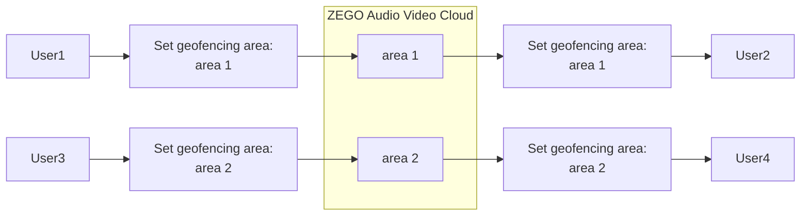

# Geofencing

- - -

## Introduction

Geofencing refers to limiting the transmission of audio, video, and signaling data to a certain region to meet regional data privacy and security regulations, that is, limiting access to audio and video services in a specific region. For example, when the specified geofencing region is Europe, regardless of where the App user is located, the region actually accessed by the SDK will be Europe.


<table>
  <colgroup>
    <col/>
    <col/>
  </colgroup>
<tbody><tr>
<th>Specified Geofencing Region</th>
<th>App User Location</th>
<th>SDK Actually Accessed Region</th>
<th>User Experience After Connection</th>
</tr>
<tr>
<td>Europe</td>
<td>Europe</td>
<td>Europe</td>
<td>Normal</td>
</tr>
<tr>
<td>Europe</td>
<td>China</td>
<td>Europe</td>
<td>May be significantly affected</td>
</tr>
</tbody></table>

<Warning title="Warning">

- If all servers in the specified geofencing region are unavailable, the SDK will directly report an error.
- Since there is a cross-region public Internet between the specified geofencing region and the App user's location, poor public Internet network quality will affect the audio and video experience.
</Warning>


{/*
<Frame width="auto" height="auto" >
  
</Frame>
*/}

Currently, the SDK supports the following configured regions:

<Note title="Note">

If you need to support more regions, please contact ZEGO Technical Support.
</Note>


|Region|Enumeration|
|-|-|
|Mainland China, excluding Hong Kong, Macao, and Taiwan|CN|
|North America|NA|
|India|IN|
|Europe|EU|
|Asia, excluding Mainland China and India|AS|

## Prerequisites

Before using the geofencing feature, ensure that:
- A project has been created in the [ZEGOCLOUD Console](https://console.zego.im), and valid AppID and AppSign have been obtained. For details, please refer to [Console - Project Information](/console/project-info).
- ZEGO Express SDK has been integrated into the project, and basic audio and video streaming functionality has been implemented. For details, please refer to [Quick Start - Integration](../quick-start/integrating-sdk.mdx) and [Quick Start - Implementation Process](/real-time-video-windows-cpp/quick-start/implementing-video-call).


## Implementation Process

### 1 Open geofencing permission

Geofencing capability may require charges in some cases. Please contact ZEGO business to confirm and open geofencing permission.


### 2 Set geofencing

- Geofencing information: Includes geofencing type and geofencing region list.
- Geofencing type: Includes two types: Include and Exclude. The geofencing type will act on the geofencing region list.
    - Include: Indicates that all regions in the region list are included within the geofencing.
    - Exclude: Indicates that all regions in the region list are excluded from the geofencing.

Before creating the SDK, call the [setGeoFence](@setGeoFence) interface to set geofencing information.

<Warning title="Warning">


Please configure geofencing information before calling [createEngine](@createEngine), otherwise it will be invalid.
</Warning>


```cpp
// Example of setting Include mode
//Set Include mode
ZegoGeoFenceType  type = ZegoGeoFenceType::ZEGO_GEO_FENCE_TYPE_INCLUDE;
// Set region list information, at least 1, at most not more than the number supported by the SDK
std::vector<int> areaList;
areaList.push_back((int)ZegoGeoFenceAreaCode::ZEGO_GEO_FENCE_AREA_CODE_CN);
areaList.push_back((int)ZegoGeoFenceAreaCode::ZEGO_GEO_FENCE_AREA_CODE_NA);
// This interface is a static method, called before createEngine
ZegoExpressSDK::setGeoFence(type, areaList);

// Example of setting Exclude mode
//Set Exclude mode
ZegoGeoFenceType  type = ZegoGeoFenceType::ZEGO_GEO_FENCE_TYPE_EXCLUDE;

// Set region list information, at least 1, at most not more than the number supported by the SDK
std::vector<int> areaList;
areaList.push_back((int)ZegoGeoFenceAreaCode::ZEGO_GEO_FENCE_AREA_CODE_CN);
areaList.push_back((int)ZegoGeoFenceAreaCode::ZEGO_GEO_FENCE_AREA_CODE_NA);
// This interface is a static method, called before createEngine
ZegoExpressSDK::setGeoFence(type, areaList);
```

### 3 Access other features

After completing the geofencing settings, you can proceed to access other features.
