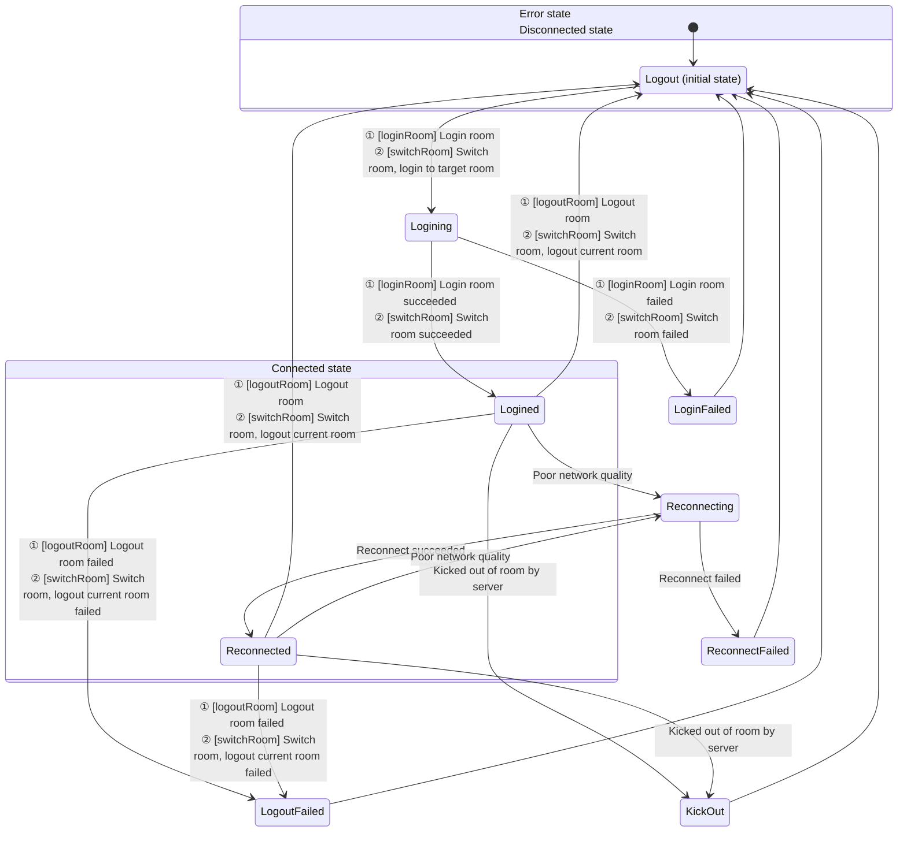

# Audio and Video Recording

- - -

## Introduction

During video calls, live streaming, and online teaching, users often need to record and save videos for subsequent on-demand viewing by other users. ZEGO provides multiple recording solutions to meet recording needs in different scenarios.

<table>

<tbody><tr>
<th>Recording Solution</th>
<th>Introduction</th>
<th>Applicable Scenarios</th>
</tr>
<tr>
<td>
<a href="#solution-1-client-local-recording" >Client Local Recording</a>
</td>
<td>
Record your (local user's) audio and video through the client SDK and save them locally.
</td>
<td>
<p>Need to record your (local user's) audio and video and save them to a local device (mobile phone, computer, or other terminal device). <b>Does not support recording other users' audio and video.</b></p>
<p>Call method: Start recording by calling the client SDK interface.</p>
</td>
</tr>
<tr>
<td><a href="#solution-2-audio-raw-data-recording" >Audio Raw Data Recording</a></td>
<td>Complete audio recording by obtaining raw audio data and saving the raw data locally.</td>
<td>
- Only need to record audio.
- Only need to save locally.
- Need to record your or others' audio.
</td>
</tr>
<tr>
<td><a href="#solution-3-cloud-recording" >Cloud Recording</a></td>
<td>Record through ZEGO cloud services and save audio and video to your activated cloud storage.</td>
<td>
- You have already activated third-party cloud storage services. Currently supports Amazon S3, Alibaba Cloud OSS, Tencent Cloud COS, etc.
- Need to record your or others' audio and video.
- Need to distinguish each user in the recording room and obtain separate audio and video files for each user in the room.
- Need to mix and record multiple audio, video, or audio, video and whiteboard, mixing all users' audio streams, video streams, and whiteboard in the room into one video file.
- Need to use preset stream mixing layout templates.

<p>Call method: Start recording by calling ZEGO server API interface.</p>
</td>
</tr>
<tr>
<td><a href="#solution-4-cdn-recording" >CDN Recording</a></td>
<td>Record live streaming audio and video and save them to ZEGO CDN.</td>
<td>
- Need to record live streaming audio and video and save them to ZEGO's CDN.
- Need to record your or others' audio and video. &nbsp; &nbsp;&nbsp;

<p>Call method: After you enable CDN recording in the <a href="https://console.zego.im" target="_blank">ZEGOCLOUD Console</a>, it defaults to global recording without calling the server API interface; if you need selective recording, please call the ZEGO server API interface to start recording.</p>
</td>
</tr>
<tr>
<td><a href="#solution-5-local-server-recording" >Local Server Recording</a></td>
<td>Record through a server deployed by the developer himself.</td>
<td>
- You want to record through your own server to save costs.
- Need to record your or others' audio and video.
- Need to distinguish each user in the recording room and obtain separate audio and video files for each user in the room.
- Need to mix and record multiple audio, video, or audio, video and whiteboard, mixing all users' audio streams, video streams, and whiteboard in the room into one video file.

<p>Call method: Start recording by calling the server interface set up by the developer himself.</p>
</td>
</tr>
</tbody></table>

## Solution 1: Client Local Recording

During calls or live streaming, record and store your (local user's) preview audio and video data to a local device, saving it as an mp4 or other format file. **Does not support recording other users' audio and video.**

### Applicable Scenarios

- Pure local recording: Record local preview without publishing stream.
- Record while live streaming: Record while publishing stream, saving the entire live streaming process to a local file.
- Record short videos during live streaming: During live streaming, you can record a short video segment at any time and save it locally.
- Only record your (local user's) preview content.

### Supported Formats

- Audio and video: FLV, MP4
- Audio only: AAC

### Sample Source Code

Please refer to [Download Sample Source Code](/real-time-video-windows-cpp/quick-start/run-example-code) to get the source code.

For related source code, please check the files in the "/ZegoExpressExample/Examples/Others/Recording" directory.

### Prerequisites

Before implementing the recording feature, ensure that:

- A project has been created in the [ZEGOCLOUD Console](https://console.zego.im), and a valid AppID and AppSign have been obtained. For details, please refer to [Console - Project Information](/console/project-info).
- ZEGO Express SDK has been integrated into the project, and basic audio/video stream publishing and playing functionality has been implemented. For details, please refer to [Quick Start - Integration](/real-time-video-windows-cpp/quick-start/integrating-sdk) and [Quick Start - Implementation](/real-time-video-windows-cpp/quick-start/implementing-video-call).


### Implementation Steps

The recording function interface call flow is shown in the following diagram:


{/*
<Frame width="512" height="auto" caption=""></Frame>
*/}

**Set recording callback**

Developers need to call [setDataRecordEventHandler](@setDataRecordEventHandler) to set the recording function callback to receive recording information during the recording process.

Developers can use this callback [onCapturedDataRecordStateUpdate](@onCapturedDataRecordStateUpdate) to determine the file recording status or perform UI prompts, etc.

Developers can use this callback [onCapturedDataRecordProgressUpdate](@onCapturedDataRecordProgressUpdate) to determine the file recording process progress or perform UI prompts for the user interface, etc.
<Warning title="Warning">


The set recording callback information will only be received after calling [startRecordingCapturedData](@startRecordingCapturedData) to start recording.
</Warning>

```cpp
// Inherit IZegoDataRecordEventHandler and override related methods
class MyDataRecordEventHandler: public IZegoDataRecordEventHandler{
public:
    void onCapturedDataRecordStateUpdate(ZegoDataRecordState state, int errorCode, ZegoDataRecordConfig config, ZegoPublishChannel channel) override {
        // Developers can handle recording process state changes here based on error codes or recording status, such as performing UI prompts on the interface, etc.
    }

    void onCapturedDataRecordProgressUpdate(ZegoDataRecordProgress progress, ZegoDataRecordConfig config, ZegoPublishChannel channel) override {
        // Developers can handle recording process progress changes here based on recording progress, such as performing UI prompts on the interface, etc.
    }
};

// Set recording callback
engine->setDataRecordEventHandler(std::make_shared<MyDataRecordEventHandler>());
```

**Start recording**

Developers need to call [startRecordingCapturedData](@startRecordingCapturedData) to start recording.

- [ZegoPublishChannel ](@-ZegoPublishChannel) specifies the media channel to record. If only publishing one stream or only doing local preview, "ZEGO_PUBLISH_CHANNEL_MAIN" should be used.

- [ZegoDataRecordConfig ](@-ZegoDataRecordConfig) specifies the recording configuration. You can specify the recording path and recording type [ZegoDataRecordType](@-ZegoDataRecordType).
If you want to record audio and video, specify it as "ZEGO_DATA_RECORD_TYPE_AUDIO_AND_VIDEO".

If you want to record only audio, select "ZEGO_DATA_RECORD_TYPE_ONLY_AUDIO". If you want to record only video, select "ZEGO_DATA_RECORD_TYPE_ONLY_VIDEO".

<Warning title="Warning">


- In the recording configuration specified in [ZegoDataRecordConfig](@-ZegoDataRecordConfig), the file path suffix must end with ".mp4", ".flv" or ".aac" to specify the recording file format.
- The recording type [ZegoDataRecordType](@-ZegoDataRecordType) is independent of the file suffix.
</Warning>


```cpp
// Interface calls such as login room, start publishing stream, start preview, etc.
...

// Create recording configuration
ZegoDataRecordConfig config;
// For example, need to record mp4 format
config.filePath = "path.mp4";
// For example, record audio and video
config.recordType = ZEGO_DATA_RECORD_TYPE_AUDIO_AND_VIDEO;

// Start recording, use main channel to record
engine->startRecordingCapturedData(config, ZEGO_PUBLISH_CHANNEL_MAIN);
```

**Stop recording**

Developers need to call [stopRecordingCapturedData](@stopRecordingCapturedData) to end recording.

<Warning title="Warning">


During recording, if you logout the room [logoutRoom](@logoutRoom), the SDK will actively stop recording internally.
</Warning>


```cpp
engine->stopRecordingCapturedData(ZEGO_PUBLISH_CHANNEL_MAIN);
```

**Play recording files**

There are two optional ways to play recording files.

* Call the system's default player to play.
* Call the ZegoMediaPlayer component in ZegoExpressEngine to play. For details, please refer to [Media Player](/real-time-video-windows-cpp/other/media-player).


### FAQ

1. **What format files does local audio and video recording support?**

  Currently, audio and video support FLV and MP4, and audio only supports AAC. The format is specified by the suffix of the file path. FLV format only supports H.264 encoding, and MP4 format supports H.264 and H.265 encoding. Failure to meet this will result in no picture or no audio.

2. **What are the requirements for storage paths?**

    The storage path can be any file path that the application has permission to read and write. If a directory path is passed, the callback will return a file write failure.

3. **How to get the size of the recording file during recording?**

    The recording duration and recording file size can be obtained in the recording progress callback [onCapturedDataRecordProgressUpdate](@onCapturedDataRecordProgressUpdate).

4. **How does the SDK handle passing a file path of an existing file?**

    It will not cause an error, but the original file content will be cleared before writing.

5. **What should be noted when recording using external capture?**

    When using external capture, you also need to call the SDK's [startPreview](@startPreview) method to start it before recording.

6. **Why does the video I recorded have green edges?**

    Users need to pay attention not to modify the video encoding resolution during recording. Enable flow control (when enabled, the encoding resolution will be dynamically adjusted according to the network environment).

7. **Why does the recorded video freeze for an instant when I stop publishing stream during recording?**

    This is a problem with the SDK's internal processing method. Currently, it cannot be solved temporarily. Users need to try their best to avoid this operation.

8. **Does local media recording support recording sounds from "ZegoMediaPlayer/ZegoAudioPlayer/Mixing function"?**

    You can record sounds from the above input sources, but only sounds mixed into the publishing stream will be recorded. If played locally only, they will not be recorded into the file.

## Solution 2: Audio Raw Data Recording

Complete audio recording by obtaining raw audio data and saving the raw data locally.

### Applicable Scenarios

- Only need to record audio.
- Only need to save locally.
- Need to record your or others' audio.

### Implementation Steps

Please refer to [Get the Raw Audio Data](/real-time-video-windows-cpp/audio/get-audio-raw-data).

## Solution 3: Cloud Recording

Cloud recording refers to recording audio and video by calling ZEGO server API and saving them to your specified CDN. It supports recording any user's audio and video stream in video calls or live streaming, and provides various disaster recovery and security mechanisms.

### Applicable Scenarios

Applicable to various scenarios requiring recording functionality, including but not limited to audio and video calls, live streaming, online classrooms, online meetings, etc.

### Implementation Steps

Please refer to [Cloud Recording](/cloud-recording/quick-start/integration).

## Solution 4: CDN Recording

CDN recording refers to saving the content being live streamed through CDN to the corresponding CDN. You need to publish audio and video to CDN for live streaming before using this method for recording.

### Applicable Scenarios

Developers need to publish audio and video to CDN for live streaming before using this method for recording. If developers are only conducting video calls or co-hosting and have not published audio and video to CDN, they cannot use this function.

After you enable CDN recording in the [ZEGOCLOUD Console](https://console.zego.im), it defaults to global recording without calling the server API interface; if you need selective recording, please call the ZEGO server API interface to start recording.


### Implementation Steps

Please refer to [Start CDN Recording](/real-time-video-server/api-reference/cdn/start-cdn-record).


## Solution 5: Local Server Recording

Developers integrate ZEGO's server recording plugin themselves and deploy it on their own servers. Then developers start recording by accessing their own server interface. For details, please refer to [Local Server Recording](/local-recording-linux-cpp/overview).

### Applicable Scenarios

This solution is suitable if you have your own server development team and the ability to deploy dedicated servers for audio and video recording, and can handle large-scale concurrency issues.

### Implementation Steps

Please refer to [Local Server Recording](/live-streaming-uniapp/quick-start/integrating-sdk).
