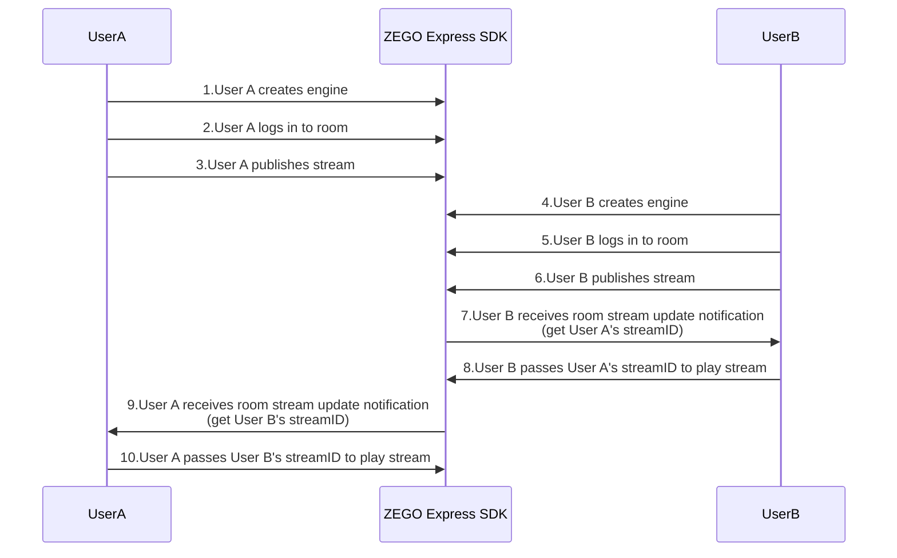
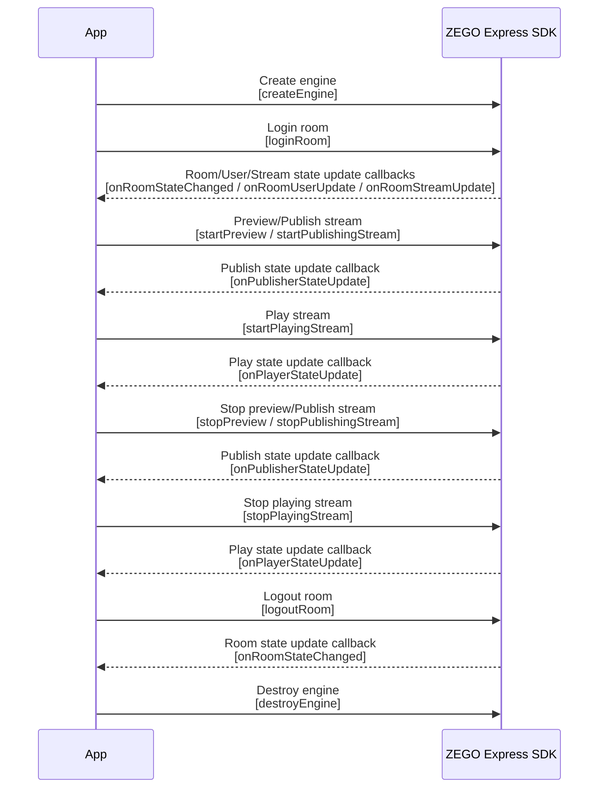

# Implementing Video Call

---


## Introduction

This article will introduce how to quickly implement a simple real-time audio and video call.

Explanation of related concepts:

- ZEGO Express SDK: A real-time audio and video SDK provided by ZEGO, which can provide developers with convenient access, high definition and smoothness, multi-platform interoperability, low latency, and high concurrency audio and video services.
- Stream: Refers to a group of audio and video data that are continuously being sent, packaged according to a specified encoding format. A user can simultaneously publish multiple streams (for example, one for camera data and one for screen sharing data) and can also play multiple streams. Each stream is identified by a stream ID (streamID).
- Publish stream: The process of pushing packaged audio and video data streams to the ZEGOCLOUD.
- Play stream: The process of pulling and playing existing audio and video data streams from the ZEGOCLOUD.
- Room: An audio and video space service provided by ZEGO, used to organize user groups. Users in the same room can send and receive real-time audio and video and messages to each other.
    1. Users need to log in to a room first before they can publish and play streams.
    2. Users can only receive relevant messages in the room they are in (user entries/exits, audio and video stream changes, etc.).
    3. Each room is identified by a unique roomID within an AppID. All users who log in to the room using the same roomID belong to the same room.


For more related concepts, please refer to [Terminology Explanation](/glossary/term-explanation).

## Prerequisites

Before implementing basic real-time audio and video functions, ensure that:

- ZEGO Express SDK has been integrated into the project and basic real-time audio and video functions have been implemented. For details, please refer to [Quick Start - Integration](/real-time-video-windows-cpp/quick-start/integrating-sdk).
- A project has been created in the [ZEGOCLOUD Console](https://console.zegocloud.com), and valid AppID and AppSign have been obtained. 

<Warning title="Warning">

The SDK also supports Token authentication. If you have higher requirements for project security, it is recommended that you upgrade the authentication method. For details, please refer to [How to upgrade from AppSign authentication to Token authentication](https://www.zegocloud.com/docs/faq/express-token-upgrade).
</Warning>


## Implementation Process


The basic process for users to make video calls through ZEGO Express SDK is as follows:

User A and User B push and pull each other's streams: both users create engines, log in to rooms, publish streams, and then receive room stream update notifications to play each other's streams.


{/*
<Frame width="512" height="auto" caption="">
  
</Frame>
*/}

<h1 id="CreateEngine"> </h1>

### 1 Create Engine

**1. Create Interface**

According to scenario needs, create a user interface for video calls for your project. We recommend that you add the following elements to your project:

- Local video window
- Remote video window
- End call button

<Frame width="512" height="auto" caption="">
  
</Frame>

**2. Import Header File**

Import the ZegoExpressEngine header file in your project.

```cpp
// Import ZegoExpressEngine.h header file
#include "ZegoExpressSDK.h"
```

**3. Create Engine**

Call the [createEngine](@createEngine) interface and pass the applied AppID and AppSign into the parameters "appID" and "appSign".

Select an appropriate scenario according to the actual audio and video business of the App. Please refer to the [Scenario-based Audio and Video Configuration](/real-time-video-windows-cpp/quick-start/scenario-based-audio-video-configuration) document and pass the selected scenario enumeration into the parameter "scenario".


<Warning title="Warning">


The SDK also supports Token authentication. If you have higher requirements for project security, it is recommended that you upgrade the authentication method. For details, please refer to [How to upgrade from AppSign authentication to Token authentication](https://www.zegocloud.com/docs/faq/express-token-upgrade).
</Warning>


```cpp
ZegoEngineProfile profile;
// AppID and AppSign are assigned to each App by ZEGO; for security reasons, it is recommended to store AppSign in the App's business backend and obtain it from the backend when needed
profile.appID = appID;
profile.appSign = appSign;
// Specify using the live streaming scenario (please fill in the scenario suitable for your business according to the actual situation)
profile.scenario = ZegoScenario::ZEGO_SCENARIO_BROADCAST;
// Create engine instance
auto engine = ZegoExpressSDK::createEngine(profile, nullptr);
```


**4. Set Callbacks**

You can instantiate a class that implements the [IZegoEventHandler](@-IZegoEventHandler) interface and implement the required callback methods to listen to and handle event callbacks you care about, and then pass the instantiated object as an `eventHandler` parameter to the [createEngine](@createEngine) method or pass it to [setEventHandler](https://www.zegocloud.com/article/api?doc=Express_Video_SDK_API~cpp_windows~class~IZegoExpressEngine#set-event-handler) to register callbacks.


<Warning title="Warning">


 It is recommended to register callbacks when creating the engine or immediately after creating the engine, to avoid delaying registration and missing event notifications.
</Warning>

<Accordion title="Common Notification Callbacks" defaultOpen="false">
**My connection status change notification in the room**

[onRoomStateChanged](@onRoomStateChanged): When the local user calls [loginRoom](@loginRoom) to join the room, you can monitor your connection status in the room in real time by listening to the [onRoomStateChanged](@onRoomStateChanged) callback.

You can handle business logic based on different states in the callback.

```cpp
virtual void onRoomStateChanged(const std::string& roomID, ZegoRoomStateChangedReason reason, int errorCode, const std::string& extendedData) {

}
```

The meanings of ZegoRoomStateChangedReason states are as follows:

<table>

  <tbody><tr>
    <th>State</th>
    <th>Enumeration Value</th>
    <th>Meaning</th>
  </tr>
  <tr>
    <td>ZEGO_ROOM_STATE_CHANGED_REASON_LOGINING</td>
    <td>0</td>
    <td>Logging in to the room. When calling [loginRoom] to log in to the room or [switchRoom] to switch to the target room, enter this state, indicating that a request is being made to connect to the server. Usually, this state is used to display the application interface.</td>
  </tr>
  <tr>
    <td>ZEGO_ROOM_STATE_CHANGED_REASON_LOGINED</td>
    <td>1</td>
    <td>Successfully logged in to the room. After successfully logging in to or switching rooms, enter this state, indicating that logging in to the room has been successful, and users can normally receive callback notifications for additions and deletions of all other users and all stream information in the room.</td>
  </tr>
  <tr>
    <td>ZEGO_ROOM_STATE_CHANGED_REASON_LOGIN_FAILED</td>
    <td>2</td>
    <td>Failed to log in to the room. After failing to log in to or switch rooms, enter this state, indicating that logging in to the room or switching rooms has failed, such as incorrect AppID or Token, etc.</td>
  </tr>
  <tr>
    <td>ZEGO_ROOM_STATE_CHANGED_REASON_RECONNECTING</td>
    <td>3</td>
    <td>Room connection temporarily interrupted. If the interruption is caused by poor network quality, the SDK will perform internal retry.</td>
  </tr>
  <tr>
    <td>ZEGO_ROOM_STATE_CHANGED_REASON_RECONNECTED</td>
    <td>4</td>
    <td>Room reconnection successful. If the interruption is caused by poor network quality, the SDK will perform internal retry. After successful reconnection, enter this state.</td>
  </tr>
  <tr>
    <td>ZEGO_ROOM_STATE_CHANGED_REASON_RECONNECT_FAILED</td>
    <td>5</td>
    <td>Room reconnection failed. If the interruption is caused by poor network quality, the SDK will perform internal retry. After failed reconnection, enter this state.</td>
  </tr>
  <tr>
    <td>ZEGO_ROOM_STATE_CHANGED_REASON_KICK_OUT</td>
    <td>6</td>
    <td>Kicked out of the room by the server. For example, when a user with the same username logs in to the room elsewhere, causing the local end to be kicked out of the room, this state will be entered.</td>
  </tr>
  <tr>
    <td>ZEGO_ROOM_STATE_CHANGED_REASON_LOGOUT</td>
    <td>7</td>
    <td>Successfully logged out of the room. This is the default state before logging in to the room. After successfully calling [logoutRoom] to log out of the room or [switchRoom] internally logging out of the current room successfully, enter this state.</td>
  </tr>
  <tr>
    <td>ZEGO_ROOM_STATE_CHANGED_REASON_LOGOUT_FAILED</td>
    <td>8</td>
    <td>Failed to log out of the room. After failing to call [logoutRoom] to log out of the room or [switchRoom] internally failing to log out of the current room, enter this state.</td>
  </tr>
</tbody></table>


**Notifications of other users entering or leaving the room**

[onRoomUserUpdate](@onRoomUserUpdate): When other users in the same room enter or leave the room, you can receive notifications through this callback.

<Warning title="Warning">


- Only when the isUserStatusNotify parameter in the configuration [ZegoRoomConfig](@ZegoRoomConfig) passed when logging in to the room [loginRoom](@loginRoom) is true, can users receive callbacks of other users in the room.

- When the parameter [ZegoUpdateType](@-ZegoUpdateType) in the callback is ZEGO_UPDATE_TYPE_ADD, it indicates that a user has entered the room; when [ZegoUpdateType](@-ZegoUpdateType) is ZEGO_UPDATE_TYPE_DELETE, it indicates that a user has left the room.
</Warning>

```cpp
void VideoTalk::onRoomUserUpdate(const std::string &roomID, ZegoUpdateType updateType, const std::vector<ZegoUser> &userList) {
    // You can handle corresponding business logic in the callback based on user entry/exit situations
    if (updateType == ZEGO_UPDATE_TYPE_ADD) {

    } else if (updateType == ZEGO_UPDATE_TYPE_DELETE) {

    }
}
```

**Status notification of user publishing audio and video streams**

[onPublisherStateUpdate](@onPublisherStateUpdate): According to actual application needs, after a user publishes audio and video streams, when the status of the published video stream changes (such as network interruption causing publishing stream abnormalities, etc.), you will receive this callback, and the SDK will automatically retry.

```cpp
void VideoTalk::onPublisherStateUpdate(const std::string &streamID, ZegoPublisherState state, int errorCode, const std::string &extendData) {
    if (errorCode != 0) {
        // Publishing stream status error
    } else {
        switch (state) {
            case ZEGO_PUBLISHER_STATE_PUBLISHING:
                // Publishing stream
                break;
            case ZEGO_PUBLISHER_STATE_PUBLISH_REQUESTING:
                // Requesting to publish stream
                break;
            case ZEGO_PUBLISHER_STATE_NO_PUBLISH:
                // Not publishing stream
                break;
        }
    }
}
```

**Status notification of user playing audio and video streams**

[onPlayerStateUpdate](@onPlayerStateUpdate): According to actual application needs, after a user plays audio and video streams, when the status of the played video stream changes (such as network interruption causing playing stream abnormalities, etc.), you will receive this callback, and the SDK will automatically retry.

```cpp
void VideoTalk::onPlayerStateUpdate(const std::string &streamID, ZegoPlayerState state, int errorCode, const std::string &extendData) {
    if (errorCode != 0) {
        //Playing stream status error
    } else {
        switch (state) {
            case ZEGO_PLAYER_STATE_NO_PLAY:
                // Playing stream
                break;
            case ZEGO_PLAYER_STATE_PLAY_REQUESTING:
                // Requesting to play stream
                break;
            case ZEGO_PLAYER_STATE_NO_PLAY:
                // Not playing stream
                break;
        }
    }
}
```
</Accordion>


<a id="createroom"></a>

### 2 Login Room

After creating a [ZegoUser](@ZegoUser) user object by passing in the user ID parameter "userID", call the [loginRoom](@loginRoom) interface and pass in the room ID parameter "roomID" and user parameter "user" to log in to the room. If the room does not exist, calling this interface will create and log in to this room.

The parameters roomID and user are generated locally by you, but need to meet the following conditions:

- Within the same AppID, ensure that "roomID" is globally unique.
- Within the same AppID, ensure that "userID" is globally unique. It is recommended that developers set it to a meaningful value and associate "userID" with their own business account system.

<Warning title="Warning">


[ZegoUser](@ZegoUser) cannot be the default value, otherwise it will cause login room failure.
</Warning>

```cpp
// Create user object
ZegoUser user("user1", "user1");
// Only by passing in ZegoRoomConfig with the "isUserStatusNotify" parameter value of "true" can you receive the onRoomUserUpdate callback.
ZegoRoomConfig roomConfig;
//If you use appsign for authentication, you do not need to fill in the token parameter; if you need to use a more secure authentication method: token authentication, please refer to [How to upgrade from AppSign authentication to Token authentication](https://www.zegocloud.com/docs/faq/express-token-upgrade)
// roomConfig.token = "xxxx";
roomConfig.isUserStatusNotify = true;
// Login room
engine->loginRoom(roomID, user, roomConfig, [=](){
    // (Optional callback) Login room result. If you only care about the login result, just pay attention to this callback
});
```

After calling the login room interface, you can monitor your connection status in the room in real time by listening to the [onRoomStateChanged](@onRoomStateChanged) callback.

Only when the room status is successful login or successful reconnection can publishing stream ([startPublishingStream](@startPublishingStream)) and playing stream ([startPlayingStream](@startPlayingStream)) normally send and receive audio and video.

```cpp
void onRoomStateChanged(const std::string& roomID, ZegoRoomStateChangedReason reason, int errorCode, const std::string& extendedData) {
    if(reason == ZEGO_ROOM_STATE_CHANGED_REASON_LOGINING)
    {
        // Logging in
    }
    else if(reason == ZEGO_ROOM_STATE_CHANGED_REASON_LOGINED)
    {
        // Login successful
        //Only when the room status is successful login or successful reconnection can publishing stream (startPublishingStream) and playing stream (startPlayingStream) normally send and receive audio and video
        //Push your audio and video stream to the ZEGO audio and video cloud
    }
    else if(reason == ZEGO_ROOM_STATE_CHANGED_REASON_LOGIN_FAILED)
    {
        // Login failed
    }
    else if(reason == ZEGO_ROOM_STATE_CHANGED_REASON_RECONNECTING)
    {
        // Reconnecting
    }
    else if(reason == ZEGO_ROOM_STATE_CHANGED_REASON_RECONNECTED)
    {
        // Reconnection successful
    }
    else if(reason == ZEGO_ROOM_STATE_CHANGED_REASON_RECONNECT_FAILED)
    {
        // Reconnection failed
    }
    else if(reason == ZEGO_ROOM_STATE_CHANGED_REASON_KICK_OUT)
    {
        // Kicked out of the room
    }
    else if(reason == ZEGO_ROOM_STATE_CHANGED_REASON_LOGOUT)
    {
        // Logout successful
    }
    else if(reason == ZEGO_ROOM_STATE_CHANGED_REASON_LOGOUT_FAILED)
    {
        // Logout failed
    }
}
```
<a id="publishingStream"></a>

### 3 Preview your own screen and push to ZEGO audio and video cloud

**1. (Optional) Preview your own screen**

<Note title="Note">


Whether or not you call [startPreview](@startPreview) to preview, you can push your audio and video stream to the ZEGO audio and video cloud.
</Note>


Set the preview view and start local preview.

If you want to see the local screen, you can call the [startPreview](@startPreview) interface to set the preview view and start local preview.

```cpp
// Set local preview view and start preview. The view mode uses the SDK default mode, scaling proportionally to fill the entire View
ZegoCanvas canvas((void*)view);
engine->startPreview(&canvas);
```

**2. Push your audio and video stream to the ZEGO audio and video cloud**

After the user calls the [loginRoom](@loginRoom) interface, they can directly call the [startPublishingStream](@startPublishingStream) interface and pass in the streamID to push their audio and video stream to the ZEGO audio and video cloud. You can know whether the publishing stream is successful by listening to the [onPublisherStateUpdate](@onPublisherStateUpdate) callback.

The streamID is generated locally by you, but needs to ensure that:
Under the same AppID, "streamID" is globally unique. If under the same AppID, different users each publish a stream with the same "streamID", the user who publishes the stream later will fail to publish the stream.

The example here publishes stream immediately after calling the [loginRoom](@loginRoom) interface. When implementing specific business, you can choose other timings to publish stream, as long as you ensure to call [loginRoom](@loginRoom) first.

```cpp
// User calls this interface to publish stream after calling loginRoom
// Under the same AppID, developers need to ensure that "streamID" is globally unique. If different users each publish a stream with the same "streamID", the user who publishes the stream later will fail to publish the stream.
engine->startPublishingStream("stream1");
```

<Note title="Note">If you need to know about camera/video/microphone/audio/speaker related interfaces of ZEGO Express SDK, please refer to [FAQ - How to implement switching camera/video screen/microphone/audio/speaker?](https://www.zegocloud.com/docs/faq/device-switching).</Note>

<a id="PlayingStream"></a>

### 4 Play other users' audio and video

When making video calls, we need to play other users' audio and video.

[onRoomStreamUpdate](@onRoomStreamUpdate): When other users in the same room push audio and video streams to the ZEGO audio and video cloud, we will receive notifications of audio and video stream additions in this callback.

We can call [startPlayingStream](@startPlayingStream) in this callback and pass in "streamID" to play the user's audio and video.

<Warning title="Warning">


If users encounter related errors during audio and video calls, they can query [Error Codes](/real-time-video-windows-cpp/client-sdk/error-code).
</Warning>

```cpp
// When other users in the room publish/stop publishing streams, we will receive corresponding stream addition/deletion notifications here
void VideoTalk::onRoomStreamUpdate(const std::string &roomID, ZegoUpdateType updateType, const std::vector<ZegoStream> &streamList, const std::string &extendData) {
    //When updateType is ZEGO_UPDATE_TYPE_ADD, it represents that audio and video streams have been added. At this time, we can call the startPlayingStream interface to play this audio and video stream
    if (updateType == ZEGO_UPDATE_TYPE_ADD) {
        // Start playing stream, set remote playing stream rendering view. The view mode uses the SDK default mode, scaling proportionally to fill the entire View
        // The following playView is the UI window handle
        std::string streamID = streamList[0].streamID;
        ZegoCanvas canvas((void*)playView);
        engine->startPlayingStream(streamID , &canvas);
    }
}

```

### 5 Online test of publishing and playing stream functions

Run the project on the real device. After successful operation, you can see the local video screen.

For convenience, ZEGO provides a [Web platform for debugging](https://zegoim.github.io/express-demo-web/src/Examples/QuickStart/VideoTalk/index.html?lang=en). On this page, enter the same AppID and RoomID, enter different UserIDs and corresponding [Token](/console/development-assistance/temporary-token), and you can join the same room to communicate with the real device. When the audio and video call starts successfully, you can hear the remote audio and see the remote video screen.


### 6 Stop audio and video call

<a id="stopPublishingStream"></a>

**Stop pushing and playing audio and video streams**

**1. Stop publishing stream, stop preview**

Call the [stopPublishingStream](@stopPublishingStream) interface to stop sending the local audio and video stream to remote users.

```cpp
// Stop publishing stream
engine->stopPublishingStream();
```

If local preview is enabled, call the [stopPreview](@stopPreview) interface to stop preview.

```cpp
// Stop local preview
engine->stopPreview();
```

**2. Stop playing stream**

Call the [stopPlayingStream](@stopPlayingStream) interface to stop playing the audio and video stream pushed by remote users.

<Warning title="Warning">
If the developer receives a notification of "decrease" in audio and video streams through the [onRoomStreamUpdate](@onRoomStreamUpdate) callback, please call the [stopPlayingStream](@stopPlayingStream) interface in time to stop playing stream to avoid playing empty streams and generating additional costs; or, developers can choose appropriate timing according to their own business needs and actively call the [stopPlayingStream](@stopPlayingStream) interface to stop playing stream.
</Warning>

```cpp
// Stop playing stream
engine->stopPlayingStream("stream1");
```

**Leave room**

Call the [logoutRoom](@logoutRoom) interface to leave the room.

```cpp
// Leave room
engine->logoutRoom("room1");
```

**Destroy Engine**

If users completely no longer use audio and video functions, they can call the [destroyEngine](@destroyEngine) interface to destroy the engine and release resources such as microphones, cameras, memory, CPU, etc.

- If you need to listen to callbacks to ensure that device hardware resources are released, you can pass in "callback" when destroying the engine. This callback is only used for sending notifications. Developers cannot release engine-related resources in the callback.

- If you don't need to listen to callbacks, you can pass in "nullptr".

```cpp
ZegoExpressSDK::destroyEngine(engine, nullptr);
engine = nullptr;

```

## Video Call API Call Sequence



{/*
<Frame width="512" height="auto" caption=""></Frame>
*/}

## FAQ

**Can I directly kill the process when calling [logoutRoom](@logoutRoom) to log out of the room?**

After calling [logoutRoom](@logoutRoom), directly killing the process has a certain probability of causing the [logoutRoom](@logoutRoom) signal not to be sent. Then the ZEGO server can only consider that this user has left the room after the heartbeat times out. To ensure that the [logoutRoom](@logoutRoom) signal is sent, it is recommended to call [destroyEngine](@destroyEngine) again and wait for the callback before killing the process.

## Related Documentation
- [Common Error Codes](/real-time-video-windows-cpp/client-sdk/error-code)
- [How to handle room and user related issues?](https://www.zegocloud.com/docs/faq/express-room-maintenance)
- [How to set and obtain SDK logs and stack information?](https://www.zegocloud.com/docs/faq/express-logs-stacktrace)
- [Does the SDK support disconnection and reconnection?](https://www.zegocloud.com/docs/faq/express-reconnect)
- [In live streaming scenarios, how to listen to events of remote audience role users logging in/logging out of the room?](https://www.zegocloud.com/docs/faq/audience-room-events)
- [How to adjust the camera focal length (zoom function)?](https://www.zegocloud.com/docs/faq/camera-focal-length-adjustment)

- [Why can't I open the camera?](https://www.zegocloud.com/docs/faq/camera-access-failure)

- [How to ensure smooth audio and video in poor network environments (traffic control function)?](https://www.zegocloud.com/docs/faq/flow-control-in-weak-network)


