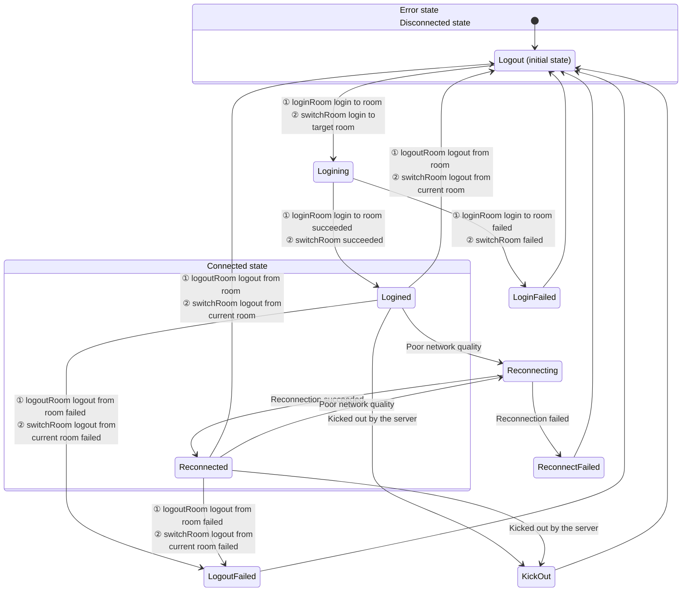

# Room Connection Status

- - -

When users use ZEGO Express SDK for audio and video calls or live streaming, they need to join a room first to receive callback notifications for stream additions/deletions and user entries/exits from other users in the same room. Therefore, the user's connection status in the room determines whether users can normally use audio and video services.

This document mainly introduces how to judge the user's connection status in the room, and the conversion process of each connection status.

## Monitor Room Connection Status

Users can monitor their connection status changes in the room in real time through the [onRoomStateChanged](@onRoomStateChanged) callback. When the user's room connection status changes, the SDK will trigger this callback and provide the reason for the room connection status change (i.e., room connection status) and relevant error codes in the callback.

For room connection interruptions caused by poor network quality, the SDK will automatically retry internally. For details, please refer to the [Room Disconnection and Reconnection](/real-time-video-windows-cpp/room/room-connection-status) section.

**Room Status Description**


{/*
<Frame width="512" height="auto" caption=""></Frame>
*/}

Room connection status will convert to each other due to various situations. Developers can make corresponding business logic processing based on the reason for the room connection status change [ZegoRoomStateChangedReason](@-ZegoRoomStateChangedReason) (i.e., room connection status) combined with errorCode.

| Status and Reason Enumeration Value | Meaning | Common Events Triggering Entry to This Status |
| --- | --- | --- |
| Logining(ZEGO_ROOM_STATE_CHANGED_REASON_LOGINING) | Logging in to the room. When calling [loginRoom] to log in to the room or [switchRoom] to switch to the target room, enter this status, indicating that a request is being made to connect to the server. Usually, this status is used to display the application interface. | - Call [loginRoom] to log in to the room, and will enter this status first, at this time errorCode is 0.<br/>- Call [switchRoom] to switch to the target room, the SDK internally requests to log in to the target room, at this time errorCode is 0. |
| Logined(ZEGO_ROOM_STATE_CHANGED_REASON_LOGINED) | Successfully logged in to the room. After successfully logging in to or switching rooms, enter this status, indicating that logging in to the room has been successful, and users can normally receive callback notifications for additions and deletions of all other users and all stream information in the room. | - Call [loginRoom] to log in to the room successfully, at this time errorCode is 0.<br/>- Call [switchRoom] to switch to the target room, the SDK internally logs in to the target room successfully, at this time errorCode is 0. |
| LoginFailed(ZEGO_ROOM_STATE_CHANGED_REASON_LOGIN_FAILED) | Failed to log in to the room. After failing to log in to or switch rooms, enter this status, indicating that logging in to the room or switching rooms has failed, such as incorrect AppID, AppSign, or Token, etc. | - When using the Token authentication function, the passed-in Token is incorrect, at this time errorCode is 1002033.<br/>- When logging in to the room times out due to network issues, at this time errorCode is 1002053.<br/>- When switching to the target room, the SDK internally fails to log in to the target room, at this time errorCode please refer to the above login error description. |
| Reconnecting(ZEGO_ROOM_STATE_CHANGED_REASON_RECONNECTING) | Room connection temporarily interrupted. If the interruption is caused by poor network quality, the SDK will perform internal retry. | When the room connection is temporarily interrupted due to poor network quality and reconnecting, at this time errorCode is 1002051. |
| Reconnected(ZEGO_ROOM_STATE_CHANGED_REASON_RECONNECTED) | Room reconnection successful. If the interruption is caused by poor network quality, the SDK will perform internal retry. After successful reconnection, enter this status. | When the room connection is temporarily interrupted due to poor network quality and then reconnection is successful, at this time errorCode is 0. |
| Reconnected(ZEGO_ROOM_STATE_CHANGED_REASON_RECONNECTED) | Room reconnection failed. If the interruption is caused by poor network quality, the SDK will perform internal retry. After failed reconnection, enter this status. | When the room connection is temporarily interrupted due to poor network quality and then reconnection fails, at this time errorCode is 1002053. |
| KickOut(ZEGO_ROOM_STATE_CHANGED_REASON_KICK_OUT) | Kicked out of the room by the server. For example, when a user with the same username logs in to the room elsewhere, causing the local end to be kicked out of the room, this status will be entered. | - User is kicked out of the room (because a user with the same userID logs in elsewhere), at this time errorCode is 1002050.<br/>- User is kicked out of the room (developer actively calls the backend's [Kick Out User](/real-time-video-server/api-reference/room/kick-out-user) interface), at this time errorCode is 1002055. |
| Logout(ZEGO_ROOM_STATE_CHANGED_REASON_LOGOUT) | Successfully logged out of the room. This is the default status before logging in to the room. After successfully calling [logoutRoom] to log out of the room or [switchRoom] internally logging out of the current room successfully, enter this status. | - When calling [logoutRoom] to log out of the room successfully, at this time errorCode is 0.<br/>- When calling [switchRoom] to switch rooms, the SDK internally logs out of the current room successfully. |
| LogoutFailed(ZEGO_ROOM_STATE_CHANGED_REASON_LOGOUT_FAILED) | Failed to log out of the room. After failing to call [logoutRoom] to log out of the room or [switchRoom] internally logging out of the current room failing, enter this status. | In multi-room scenarios, when calling [logoutRoom] to log out of a room, the room ID does not exist, at this time errorCode is 1002002.<br/>After failing to log out of the room, please try to log out again according to the actual failure reason, otherwise other users can see this user before the heartbeat times out. |


Developers can refer to the following code to handle common business events:

```cpp
void onRoomStateChanged(const std::string &roomID, ZegoRoomStateChangedReason reason, int errorCode, const std::string &extendedData) {
    if(reason == ZEGO_ROOM_STATE_CHANGED_REASON_LOGINING)
    {
        // Logging in
        // When calling loginRoom to log in to the room or switchRoom to switch to the target room, enter this status, indicating that a request is being made to connect to the server.
    }
    else if(reason == ZEGO_ROOM_STATE_CHANGED_REASON_LOGINED)
    {
        /// Login successful
        // Currently triggered by the developer's active call to loginRoom for successful login, or calling switchRoom for successful room switching. Here you can handle the business logic of first successful login to the room, such as pulling chat room and live room basic information.
    }
    else if(reason == ZEGO_ROOM_STATE_CHANGED_REASON_LOGIN_FAILED)
    {
        // Login failed
        if (errorCode == 1002033) {
            //When using the login room authentication function, the passed-in Token is incorrect or expired
        }
    }
    else if(reason == ZEGO_ROOM_STATE_CHANGED_REASON_RECONNECTING)
    {
        // Reconnecting
        // Currently triggered by successful SDK disconnection and reconnection. Here it is recommended to display some reconnection UI
    }
    else if(reason == ZEGO_ROOM_STATE_CHANGED_REASON_RECONNECTED)
    {
        // Reconnection successful
    }
    else if(reason == ZEGO_ROOM_STATE_CHANGED_REASON_RECONNECT_FAILED)
    {
        // Reconnection failed
        // When the room connection is completely disconnected, the SDK will not retry reconnection anymore. If developers need to log in to the room again, they can actively call the loginRoom interface
        // At this time, you can exit the room/live room/classroom in the business, or manually call the interface to log in again
    }
    else if(reason == ZEGO_ROOM_STATE_CHANGED_REASON_KICK_OUT)
    {
        // Kicked out of the room
        if (errorCode == 1002050) {
            // User is kicked out of the room (because a user with the same userID logs in elsewhere)
        }
        else if (errorCode == 1002055) {
            // User is kicked out of the room (developer actively calls the backend's kick out user interface)
        }
    }
    else if(reason == ZEGO_ROOM_STATE_CHANGED_REASON_LOGOUT)
    {
        // Logout successful
        // Developer actively calls logoutRoom to log out of the room successfully
        // Or calls switchRoom to switch rooms, SDK internally logs out of the current room successfully
        // Developers can handle the logic of active logout room callback here
    }
    else if(reason == ZEGO_ROOM_STATE_CHANGED_REASON_LOGOUT_FAILED)
    {
        // Logout failed
        // Developer actively calls logoutRoom to log out of the room failing
        // Or calls switchRoom to switch rooms, SDK internally logs out of the current room failing
        // The reason for the error may be incorrect logout room ID or does not exist
    }
}
```


## Room Disconnection and Reconnection

After users log in to the room, disconnection from the room caused by network signal issues/network type switching issues will be automatically reconnected by the SDK internally. There are three situations for users reconnection after disconnection from the room:

- Successful reconnection before the ZEGO server determines that user A's heartbeat has timed out
- Successful reconnection after the ZEGO server determines that user A's heartbeat has timed out
- User A fails to reconnect

<Note title="Note">


- Heartbeat timeout time is 90s
- Retry timeout time is 20min
</Note>


The following diagram takes the case where user A and user B have logged in to the same room, and user A reconnects after disconnection from the room as an example:

**Case 1: Successful reconnection before the ZEGO server determines that user A's heartbeat has timed out**

<Frame width="512" height="auto" caption=""></Frame>

If user A briefly disconnects, but successfully reconnects within 90s, then user B will not receive the callback notification of [onRoomUserUpdate](@onRoomUserUpdate).

- T0 = 0s: User A's SDK receives the [loginRoom](@loginRoom__2) request initiated by the client.
- T1 ≈ T0 + 120 ms: Usually 120 ms after calling [loginRoom](@loginRoom__2), the client can join the room. During the room joining process, user A's client will receive 2 [onRoomStateChanged](@onRoomStateChanged) callbacks, respectively notifying the client that it is connecting to the room (Logining) and that connecting to the room is successful (Logined).
- T2 ≈ T1 + 100 ms: Due to network transmission delay, user B receives the [onRoomUserUpdate](@onRoomUserUpdate) callback about 100 ms later to notify the client that user A has joined the room.
- T3: At a certain time point, user A's uplink network becomes worse due to network disconnection or other reasons. The SDK will try to rejoin the room, and the client will receive the [onRoomStateChanged](@onRoomStateChanged) callback to notify the client that user A is disconnecting and reconnecting.
- T5 = T3 + time (less than 90s): User A restores the network within the reconnection time and reconnects successfully. Will receive the [onRoomStateChanged](@onRoomStateChanged) callback to notify the client that user A has successfully reconnected.

**Case 2: Successful reconnection after the ZEGO server determines that user A's heartbeat has timed out**

<Frame width="512" height="auto" caption=""></Frame>

- The situations at moments T0, T1, T2, T3 are the same as T0, T1, T2, T3 in [Case 1: Successful reconnection before the server determines that user A's heartbeat has timed out](/real-time-video-windows-cpp/room/room-connection-status).

- T4' ≈ T3 + 90s: User B receives the [onRoomUserUpdate](@onRoomUserUpdate) callback at this time to notify that user A has disconnected.

- T5' = T3 + time (greater than 90s, less than 20 min): User A restores the network within the reconnection time and reconnects successfully. Will receive the [onRoomStateChanged](@onRoomStateChanged) callback to notify the client that user A has successfully reconnected.

- T6' ≈ T5' + 100ms: Due to network transmission delay, user B receives the [onRoomUserUpdate](@onRoomUserUpdate) callback about 100 ms later to notify the client that user A has joined the room.

**Case 3: User A fails to reconnect**

<Frame width="512" height="auto" caption=""></Frame>

- The situations at moments T0, T1, T2, T3 are the same as T0, T1, T2, T3 in [Case 1: Successful reconnection before the ZEGO server determines that user A's heartbeat has timed out](/real-time-video-windows-cpp/room/room-connection-status).

- T4'' ≈ T3 + 90s: User B receives the [onRoomUserUpdate](@onRoomUserUpdate) callback at this time to notify that user A has disconnected.

- T5'' = T3 + 20 min: If user A cannot rejoin the room within 20 minutes, the SDK will no longer continue to try to reconnect. User A will receive the [onRoomStateChanged](@onRoomStateChanged) callback to notify the client that reconnection has failed.


## Related Documentation

[Does Express SDK support disconnection and reconnection mechanism?](https://www.zegocloud.com/docs/faq/express-reconnect)

