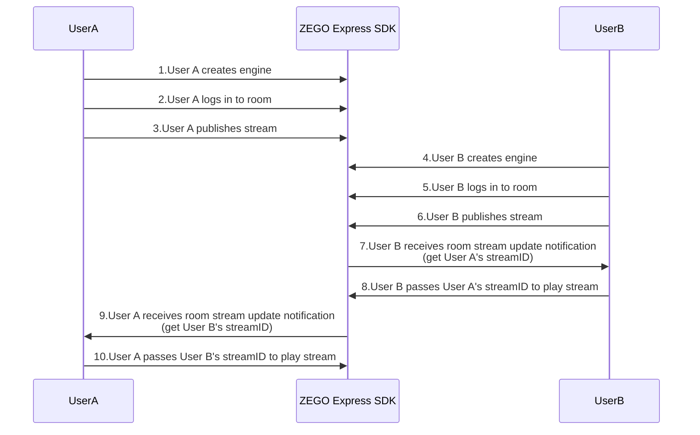
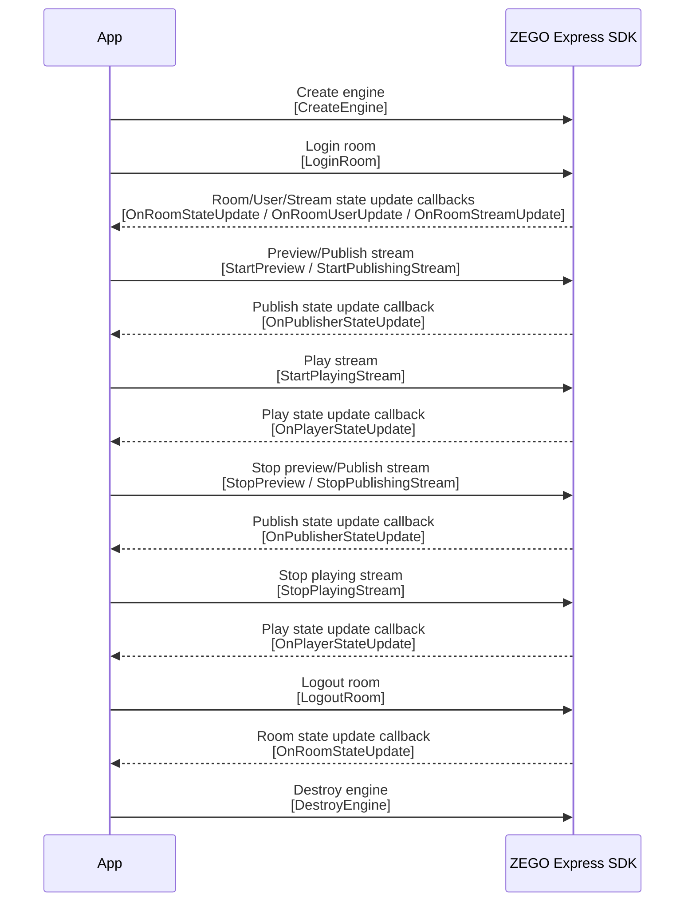

# Implement Video Call

---


## Feature Introduction

This article will introduce how to quickly implement a simple real-time audio and video call.

Explanation of related concepts:

- ZEGO Express SDK: A real-time audio and video SDK provided by ZEGO, which can provide developers with convenient access, high-definition and smooth, multi-platform interoperability, low latency, and high-concurrency audio and video services.
- Stream: Refers to a group of audio and video data encapsulated in a specified encoding format and continuously being sent. A user can publish multiple streams simultaneously (for example, one stream for camera data, one stream for screen sharing data) and can also play multiple streams simultaneously. Each stream is identified by a stream ID (streamID).
- Publish stream: The process of pushing packaged audio and video data streams to ZEGOCLOUD.
- Play stream: The process of pulling and playing existing audio and video data streams from ZEGOCLOUD.
- Room: An audio and video space service provided by ZEGO, used to organize user groups. Users in the same room can send and receive real-time audio and video and messages to each other.
    1. Users need to log in to a room first before they can perform stream publishing and playing operations.
    2. Users can only receive relevant messages in the room they are in (user entry/exit, audio and video stream changes, etc.).
    3. Each room is identified by a unique roomID within an AppID. All users who log in to the room using the same roomID belong to the same room.


## Prerequisites

Before implementing basic real-time audio and video functions, please ensure:

- ZEGO Express SDK has been integrated into the project. For details, please refer to [Quick Start - Integration](/real-time-video-windows-cs/quick-start/integrating-sdk).
- A project has been created in the [ZEGOCLOUD Console](https://console.zegocloud.com), and a valid AppID and AppSign have been applied for. 


## Implementation Process

The basic process for users to make video calls through ZEGO Express SDK is as follows:

Users A and B join the room. User B previews and publishes the audio and video stream to ZEGO cloud service (publish stream). After User A receives the notification of User B's published audio and video stream, User A plays User B's audio and video stream in the notification (play stream).


{/*
<Frame width="512" height="auto" caption="">
  
</Frame>
*/}


### Create Engine

**1. Create User Interface**

Create a user interface for video calls in your project according to scenario needs. We recommend that you add the following elements to your project:

- Local preview window: Type is System.Windows.Forms.PictureBox

- Remote video window: Type is System.Windows.Forms.PictureBox

- End button: Type is System.Windows.Forms.Button

<Frame width="512" height="auto" caption=""></Frame>


**2. Import Header Files**

Import the ZegoExpressEngine namespace in the project.

```csharp
// Import ZegoExpressEngine namespace
using ZEGO;
```

**3. Create Engine and Set Callbacks**

Call the CreateEngine interface, pass the applied AppID and AppSign to the parameters "appID" and "appSign", and create an engine singleton object.

Select an appropriate scenario based on the actual audio and video business of the App, and pass the selected scenario enumeration to the parameter "scenario".

Developers can choose to use anonymous functions to implement callback functions as needed, and assign them to the corresponding callback delegates of the engine instance to register callbacks.

<Warning title="Warning">


To avoid missing event notifications, it is recommended to listen to callbacks immediately after creating the engine.

</Warning>


```csharp

ZegoEngineProfile engine_profile = new ZegoEngineProfile();
// AppID and AppSign are assigned to each App by ZEGO; for security reasons, it is recommended to store AppSign in the App's business backend and obtain it from the backend when needed
engine_profile.appID = appID;
engine_profile.appSign = appSign;
// Specify using live streaming scenario (please fill in the scenario suitable for your business according to the actual situation)
engine_profile.scenario = ZegoScenario.Broadcast;
// Get the current thread synchronization context. The SDK uses this context to synchronize callbacks to the current UI thread. Note that if synchronization to the UI thread is required, SynchronizationContext.Current needs to be called in the UI thread
var context = SynchronizationContext.Current;

// Create engine instance
var engine = ZegoExpressEngine.CreateEngine(engine_profile, context);

// Set SDK callback delegates
engine.OnRoomStateUpdate = (roomID, state, errorCode, extendedData) => {

};
```


<Accordion title="Common Notification Callbacks" defaultOpen="false">
**Notification of my connection status changes in the room**

OnRoomStateUpdate: When locally calling LoginRoom to join a room, you can monitor your connection status in the room in real time by setting the OnRoomStateUpdate callback delegate.

Room connection states will switch to each other. Developers need to judge various situations combined with state and errorCode and handle corresponding logic.


```csharp
public void OnRoomStateUpdate(string roomID, ZegoRoomState state, int errorCode, string extendedData)
{

}
```

The meaning of ZegoRoomState is as follows:

<table>

  <tbody><tr>
    <th>State</th>
    <th>Enumeration Value</th>
    <th>Meaning</th>
  </tr>
  <tr>
    <td>Disconnected</td>
    <td>0</td>
    <td>Disconnected state. Enter this state before logging into the room/after exiting the room. If a steady-state anomaly occurs during the process of logging into the room, such as incorrect AppID and AppSign, or if the same username logs in elsewhere causing the local end to be KickOut, it will enter this state.</td>
  </tr>
  <tr>
    <td>Connecting</td>
    <td>1</td>
    <td>Requesting connection state. After the login room action is successfully executed, it will enter this state. Usually, the UI interface can be displayed through this state. If the interruption is caused by poor network quality, the SDK will retry internally and will also enter the requesting connection state.</td>
  </tr>
  <tr>
    <td>Connected</td>
    <td>2</td>
    <td>Connection successful state. After successfully logging into the room, enter this state. At this time, users can normally receive callback notifications for additions and deletions of users and stream information in the room.</td>
  </tr>
</tbody></table>


**Notification of other users entering/exiting the room**

OnRoomUserUpdate: When other users in the same room enter or exit the room, you can receive notifications through this callback.

<Warning title="Warning">


- Users can receive callbacks of other users in the room only when the isUserStatusNotify parameter in the ZegoRoomConfig passed when logging into the room LoginRoom is true.
- When the parameter ZegoUpdateType in the callback is Add, it indicates that a user has entered the room; when ZegoUpdateType is Delete, it indicates that a user has exited the room.

</Warning>


```csharp
public void OnRoomUserUpdate(string roomID, ZegoUpdateType updateType, List<ZegoUser> userList, uint userCount)
{
    // You can handle corresponding business logic in the callback based on the user's entry/exit situation
    if(updateType == ZegoUpdateType.Add)
    {

    }
    else if(updateType == ZegoUpdateType.Delete)
    {

    }
}
```

**Notification of audio and video stream changes in the room**

OnRoomStreamUpdate: When other users in the same room publish audio and video streams to ZEGO audio and video cloud, we will receive notifications of new audio and video streams in this callback. Usually, if a user wants to play videos published by other users, they can call the StartPlayingStream interface in the callback of receiving stream status updates (new) to play remote published audio and video streams.

```csharp
public void OnRoomStreamUpdate(string roomID, ZegoUpdateType updateType, List<ZegoStream> streamList, string extendedData)
{
    if (updateType == ZegoUpdateType.Add)
    {
        // Stream added in room
    }
    else if(updateType == ZegoUpdateType.Delete)
    {
        // Stream deleted in room
    }
}
```


**Status notification of users publishing audio and video streams**

OnPublisherStateUpdate: According to actual application needs, after a user publishes audio and video streams, when the status of the published video stream changes (such as network interruption causing stream publishing abnormalities, etc.), you will receive this callback, and the SDK will automatically retry.

OnPublisherQualityUpdate: Stream publishing quality callback. After calling the stream publishing interface successfully, the audio and video stream quality data (such as resolution, frame rate, bitrate, etc.) will be called back periodically.

```csharp
public void OnPublisherStateUpdate(string streamID, ZegoPublisherState state, int errorCode, string extendedData)
{
    if (errorCode != 0)
    {
        // Stream publishing status error
        return;
    }

    if (state == ZegoPublisherState.PublishRequesting)
    {
        // Requesting to publish stream
    }
    elseif (state == ZegoPublisherState.NoPublish)
    {
        // No stream publishing
    }
    else if (state == ZegoPublisherState.Publishing)
    {
        // Publishing stream
    }
}
```


**Status notification of users playing audio and video streams**

OnPlayerStateUpdate: According to actual application needs, after a user plays audio and video streams, when the status of the played video stream changes (such as network interruption causing stream playing abnormalities, etc.), you will receive this callback, and the SDK will automatically retry.

OnPlayerQualityUpdate: Quality callback when playing audio and video streams. After calling the stream playing interface successfully, you will periodically receive notifications of quality data when playing audio and video streams (such as resolution, frame rate, bitrate, etc.).

```csharp
public void OnPlayerStateUpdate(string streamID, ZegoPlayerState state, int errorCode, string extendedData)
{
    if(errorCode != 0)
    {
        //Stream playing status error
        return;
    }

    if(state == ZegoPlayerState.Playing)
    {
        // Playing stream
    }
    else if(state == ZegoPlayerState.PlayRequesting)
    {
        // Requesting to play stream
    }
    else if(state == ZegoPlayerState.NoPlay)
    {
        // Not playing stream
    }
```
</Accordion>

### Login Room


After passing the user ID parameter "userID" to create a ZegoUser user object, call the LoginRoom interface, pass in the room ID parameter "roomID" and user parameter "user", and log in to the room. If the room does not exist, calling this interface will create and log in to this room.

The parameters "roomID" and "user" are generated locally by you, but need to meet the following conditions:
- Within the same AppID, ensure that "roomID" is globally unique.
- Within the same AppID, ensure that "userID" is globally unique. It is recommended that developers set it to a meaningful value and can associate "userID" with their own business account system.

<Warning title="Warning">


ZegoUser cannot be the default value, otherwise it will cause login room failure.


</Warning>


```csharp
// Create user object
ZegoUser user = new ZegoUser("user1");
// Only when passing ZegoRoomConfig with "isUserStatusNotify" parameter value "true" can you receive onRoomUserUpdate callback.
ZegoRoomConfig config = new ZegoRoomConfig();
config.isUserStatusNotify = true;
// Login room
engine.LoginRoom(room_id, user, config);
```

<Warning title="Warning">

To avoid missing any notifications, you need to listen to callbacks before logging into the room.

</Warning>


After calling the login room interface, you can monitor your connection status in the room in real time by setting the OnRoomStateUpdate callback delegate.


```csharp
public void OnRoomStateUpdate(string roomID, ZegoRoomState state, int errorCode, string extendedData)
{
    if(errorCode != 0)
    {
        // Room status error
    }

    if (state == ZegoRoomState.Connecting)
    {
        // Room connecting
    }
    else if (state == ZegoRoomState.Connected)
    {

    }
    else if (state == ZegoRoomState.Disconnected)
    {
        // Room disconnected
    }
}
```


### Preview your own image and publish to ZEGO audio and video cloud

**1. (Optional) Preview your own image**

If you want to see your local image, you can call the StartPreview interface to set the preview view and start local preview.

<Note title="Note">


Regardless of whether [StartPreview ](@StartPreview) is called for preview, you can publish your audio and video streams to ZEGO audio and video cloud.

</Note>


```csharp
// Set local preview view and start preview. The view mode uses the SDK's default mode, scaling proportionally to fill the entire View
ZegoCanvas canvas = new ZegoCanvas();
canvas.view = pictureBox.Handle;
engine.StartPreview(canvas);
```

**2. Publish your audio and video streams to ZEGO audio and video cloud**

After the user calls the LoginRoom interface, they can directly call the StartPublishingStream interface, pass in "streamID", and publish their audio and video streams to ZEGO audio and video cloud. You can know whether stream publishing is successful by setting the onPublisherStateUpdate callback delegate.

"streamID" is generated locally by you, but needs to ensure:
Under the same AppID, "streamID" is globally unique. If under the same AppID, different users each publish a stream with the same "streamID", the user who publishes later will fail to publish the stream.


The example here publishes streams immediately after calling the LoginRoom interface. When implementing specific business, you can choose other timing to publish streams, as long as you ensure to call LoginRoom first.

```csharp
// User calls this interface to publish streams after calling LoginRoom
// Under the same AppID, developers need to ensure that "streamID" is globally unique. If different users each publish a stream with the same "streamID", the user who publishes later will fail to publish the stream.
engine.StartPublishingStream("stream1");
```

### Play other users' audio and video

When making a video call, we need to play other users' audio and video.

OnRoomStreamUpdate: When other users in the same room publish audio and video streams to ZEGO audio and video cloud, we will receive notifications of new audio and video streams in this callback, based on which we can obtain other users' "streamID".

At this time, we can call StartPlayingStream in this callback, pass in other users' "streamID", and play the audio and video images published to the ZEGO server.

<Warning title="Warning">


If users encounter related errors during audio and video calls, they can check [Error Codes](/real-time-video-windows-cs/client-sdk/error-code).

</Warning>


```csharp
// When other users in the room publish/stop publishing streams, we will receive notifications of corresponding stream additions/deletions here
public void OnRoomStreamUpdate(string roomID, ZegoUpdateType updateType, List<ZegoStream> streamList, string extendedData)
{
    // When updateType is ZegoUpdateType.Add, it means there is a new audio and video stream. At this time, we can call the StartPlayingStream interface to play this audio and video stream
    if(updateType == ZegoUpdateType.Add && streamList.Count > 0)
    {
        // Start playing stream, set remote playing rendering view. The view mode uses the SDK's default mode, scaling proportionally to fill the entire View
        var current_play_stream = streamList.ElementAt(streamList.Count - 1);

        // The following pictureBox_Remote.Handle is the UI window handle
        ZegoCanvas canvas = new ZegoCanvas();
        canvas.view = pictureBox_Remote.Handle;
        engine.StartPlayingStream(current_play_stream.streamID, canvas);
    }
}
```
### Test stream publishing and playing functions online

Run the project on a real device. After running successfully, you can see the local video image.

For convenience, ZEGO provides a [Web platform for debugging](https://zegoim.github.io/express-demo-web/src/Examples/QuickStart/VideoTalk/index.html?lang=en). On this page, enter the same AppID and RoomID, enter different UserIDs, and the corresponding [Token](/console/development-assistance/temporary-token), you can join the same room and communicate with real devices. When the audio and video call starts successfully, you can hear the remote audio and see the remote video image.


### Stop audio and video call

#### Stop publishing and playing audio and video streams

**1. Stop publishing stream, stop preview**

Call the StopPublishingStream interface to stop sending local audio and video streams to remote users.

```csharp
// Stop publishing stream
engine.StopPublishingStream();
```

If local preview is enabled, call the StopPreview interface to stop preview.

```csharp
// Stop local preview
engine.StopPreview();
```

**2. Stop playing stream**

Call the StopPlayingStream interface to stop playing remote published audio and video streams.

<Warning title="Warning">


If developers receive a notification of "reduction" of audio and video streams through the OnRoomStreamUpdate callback, please call the StopPlayingStream interface in time to stop playing streams to avoid playing empty streams and generating additional costs; or, developers can choose the appropriate timing according to their own business needs and actively call the StopPlayingStream interface to stop playing streams.

</Warning>


```csharp
// Stop playing stream
engine.StopPlayingStream("stream1");
```

#### Logout room

Call the LogoutRoom interface to logout of the room.

```csharp
// Logout room
engine.LogoutRoom();
```


#### Destroy engine

If users will no longer use audio and video functions, they can call the DestroyEngine interface to destroy the engine and release resources such as microphones, cameras, memory, CPU, etc.


- If you need to listen to callbacks to ensure that device hardware resources are released, you can pass in "callback" when destroying the engine. This callback is only used for sending notifications, and developers must not release engine-related resources in the callback.

- If you don't need to listen to callbacks, you can pass in "nullptr".


```csharp
ZegoExpressEngine.DestroyEngine();
```


## Video Call API Call Sequence



{/*
<Frame width="512" height="auto" caption=""></Frame>
*/}

## FAQ

##### Can I kill the process directly when calling LogoutRoom to logout of the room?
After calling LogoutRoom, killing the process directly has a certain probability of causing the LogoutRoom signal not to be sent. Then the ZEGO server can only consider that the user has exited the room after the heartbeat times out. To ensure that the LogoutRoom signal is sent, it is recommended to call DestroyEngine again and wait for the callback before killing the process.


## Related Documentation

- [How to set and obtain SDK logs and stack information?](https://www.zegocloud.com/docs/faq/express-logs-stacktrace)
- [Does the SDK support automatic reconnection after disconnection?](https://www.zegocloud.com/docs/faq/express-reconnect)
- [How to handle room-related issues?](https://www.zegocloud.com/docs/faq/express-room-maintenance)
- [In live streaming scenarios, how to listen to events of remote audience role users logging in/exiting the room?](https://www.zegocloud.com/docs/faq/audience-room-events)
- [How to adjust the focal length of the camera (zoom function)?](https://www.zegocloud.com/docs/faq/camera-focal-length-adjustment)
- [How to ensure smooth audio and video in poor network environments?](https://www.zegocloud.com/docs/faq/flow-control-in-weak-network)
