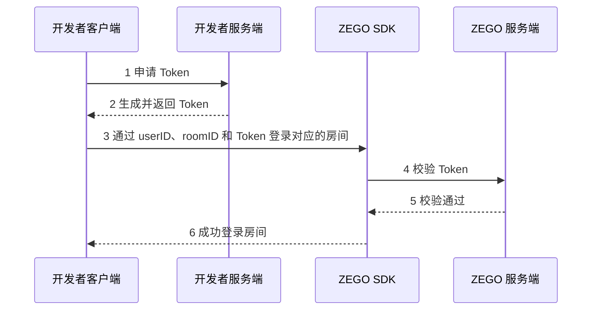

# 使用 Token 鉴权

---

## 功能介绍

鉴权是指验证用户是否拥有访问系统的权限，来避免因权限控制缺失或操作不当引发的安全风险问题，ZEGO 通过 Token（包括基础鉴权 Token 和权限认证 Token） 对用户进行鉴权。


|鉴权方式|描述|应用场景|
|-|-|-|
|[基础鉴权 Token](/real-time-video-flutter/communication/using-token-authentication)|开发者在登录房间时必须带上 Token 参数，来验证用户的合法性。|基础鉴权 Token 为 Token 的基本能力，用于业务的简单权限验证场景，绝大多数情况下生成该 Token 即可。 |
|[权限认证 Token](/real-time-video-flutter/communication/using-token-authentication)|为了进一步提高安全性开放了房间 ID 和推流 ID 这两个权限位，可以验证登录房间的 ID 和推流 ID。|房间 ID 和推流 ID 权限位的一般使用场景如下：<ul><li>房间有普通房间和会员房间的区别，需要控制非会员用户登录会员房间。</li><li>语聊房或秀场直播中，需要控制推流用户和麦上用户的一致，防止“幽灵麦”现象，即在房间里听到了非麦上用户声音的情况。</li><li>狼人杀等发言游戏，需要防止应用被黑客破解之后，黑客可以使用其他用户 ID 登录同一房间，获取到游戏进行的信息进行作弊，影响正常用户的游戏体验。</li></ul>|


## 前提条件

基础鉴权 Token 默认开通，权限认证 Token（即房间 ID 和推流 ID 权限位）请联系 ZEGO 技术支持开通。

<Warning title="注意">


- 仅 2.17.1 及以上版本 ZEGO Express SDK，支持参考本文档使用 Token 鉴权。
- 若您集成的是 2.17.1 之前版本的 ZEGO Express SDK（使用 AppSign 鉴权），现在想升级到 2.17.1 版本且使用 Token 鉴权，可以通过 [如何从 AppSign 鉴权升级为 Token 鉴权](https://doc-zh.zego.im/faq/express-token-upgrade) 文档了解 AppSign 鉴权和 Token 鉴权更多信息。

</Warning>


## 流程概述

使用 Token 鉴权时，需要开发者先生成 Token，再携带 Token 登录房间。ZEGO 服务端对带着 Token 的用户进行校验。

以使用 Token 判断用户是否能登录房间为例介绍使用流程，如下图：



{/*
<Frame width="512" height="auto" caption=""></Frame>
*/}

1. 开发者客户端发起申请 Token 的请求。
2. 在开发者的服务端上生成 Token，并返回给开发者客户端。
3. 开发者客户端携带申请到的 Token 和 userID、roomID 信息，登录对应的房间。
4. ZEGO SDK 会自动将 Token 发送到 ZEGO 服务端进行校验。
5. ZEGO 服务端会将校验结果返回给 ZEGO SDK。
6. ZEGO SDK 再将校验的结果直接返回给开发者客户端，没有权限的客户端将登录失败。


## 生成 Token 与使用

本节将详细介绍开发者如何通过服务端生成 Token、如何使用 Token 和 Token 过期时的处理方式。

### 1 获取 AppID 和 ServerSecret

生成 Token 需要开发者项目的唯一标识 AppID 和密钥 ServerSecret，请参考 [控制台 - 项目管理](/console/project-info) 中的 “项目信息”获取。

开发者获得项目的 AppID 和 ServerSecret 信息后，根据实际业务需求，即可在自己的服务端生成 Token。开发者客户端向开发者服务端发送申请 Token 请求，由开发者服务端生成 Token 后返回给对应客户端。


### 2 在服务端生成 Token

import GenerateTemporaryToken from '/snippets/common/zh/token/generate-temporary-token.mdx'

<GenerateTemporaryToken />

ZEGO 在 GitHub/Gitee 提供了一个开源的 zego_server_assistant 插件，请使用插件中的 “token04” 版本来生成 Token。插件支持 Go、C++、Java、Objective-C、Python、PHP、.NET、Node.js 语言：

<table>

<tbody><tr>
<th rowspan="2">语言</th>
<th rowspan="2">支持版本</th>
<th rowspan="2">关键函数</th>
<th rowspan="2">插件下载地址</th>
<th colspan="2">使用示例</th>
</tr>
<tr>
<th>基础鉴权 Token</th>
<th>权限认证 Token</th>
</tr>
<tr>
<td>Go</td>
<td>Go 1.14.15 或以上版本</td>
<td>GenerateToken04</td>
<td><ul><li><a target="_blank" href="https://github.com/zegoim/zego_server_assistant/tree/release/github/token/go/src/token04">GitHub</a></li><li><a target="_blank" href="https://gitee.com/zegodev_admin/zego_server_assistant/tree/release/github/token/go/src/token04">Gitee</a></li></ul></td>
<td><ul><li><a target="_blank" href="https://github.com/zegoim/zego_server_assistant/blob/release/github/token/go/sample/token04/sample-base.go">GitHub</a></li><li><a target="_blank" href="https://gitee.com/zegodev_admin/zego_server_assistant/blob/release/github/token/go/sample/token04/sample-base.go">Gitee</a></li></ul></td>
<td><ul><li><a target="_blank" href="https://github.com/zegoim/zego_server_assistant/blob/release/github/token/go/sample/token04/sample-for-rtcroom.go">GitHub</a></li><li><a target="_blank" href="https://gitee.com/zegodev_admin/zego_server_assistant/blob/release/github/token/go/sample/token04/sample-for-rtcroom.go">Gitee</a></li></ul></td>
</tr>
<tr>
<td>C++</td>
<td>C++ 11 或以上版本</td>
<td>GenerateToken04</td>
<td><ul><li><a target="_blank" href="https://github.com/zegoim/zego_server_assistant/blob/release/github/token/c%2B%2B/token04">GitHub</a></li><li><a target="_blank" href="https://gitee.com/zegodev_admin/zego_server_assistant/tree/release/github/token/c++/token04">Gitee</a></li></ul></td>
<td><ul><li><a target="_blank" href="https://github.com/zegoim/zego_server_assistant/blob/release/github/token/c%2B%2B/token04/sample/demo/main.cc">GitHub</a></li><li><a target="_blank" href="https://gitee.com/zegodev_admin/zego_server_assistant/blob/release/github/token/c%2B%2B/token04/sample/demo/main.cc">Gitee</a></li></ul></td>
<td><ul><li><a target="_blank" href="https://github.com/zegoim/zego_server_assistant/blob/release/github/token/c%2B%2B/token04/sample/demo/main.cc">GitHub</a></li><li><a target="_blank" href="https://gitee.com/zegodev_admin/zego_server_assistant/blob/release/github/token/c%2B%2B/token04/sample/demo/main.cc">Gitee</a></li></ul></td>
</tr>
<tr>
<td>Java</td>
<td>Java 1.8 或以上版本</td>
<td>generateToken04</td>
<td><ul><li><a target="_blank" href="https://github.com/zegoim/zego_server_assistant/tree/release/github/token/java/token04">GitHub</a></li><li><a target="_blank" href="https://gitee.com/zegodev_admin/zego_server_assistant/tree/release/github/token/java/token04">Gitee</a></li></ul></td>
<td><ul><li><a target="_blank" href="https://github.com/zegoim/zego_server_assistant/blob/release/github/token/java/token04/src/im/zego/serverassistant/sample/Token04SampleBase.java">GitHub</a></li><li><a target="_blank" href="https://gitee.com/zegodev_admin/zego_server_assistant/blob/release/github/token/java/token04/src/im/zego/serverassistant/sample/Token04SampleBase.java">Gitee</a></li></ul></td>
<td><ul><li><a target="_blank" href="https://github.com/zegoim/zego_server_assistant/blob/release/github/token/java/token04/src/im/zego/serverassistant/sample/Token04SampleForRtcRoom.java">GitHub</a></li><li><a target="_blank" href="https://gitee.com/zegodev_admin/zego_server_assistant/blob/release/github/token/java/token04/src/im/zego/serverassistant/sample/Token04SampleForRtcRoom.java">Gitee</a></li></ul></td>
</tr>
<tr>
<td>Python</td>
<td>Python 3.6.8 或以上版本</td>
<td>generate_token04</td>
<td><ul><li><a target="_blank" href="https://github.com/zegoim/zego_server_assistant/tree/release/github/token/python/token04">GitHub</a></li><li><a target="_blank" href="https://gitee.com/zegodev_admin/zego_server_assistant/tree/release/github/token/python/token04">Gitee</a></li></ul></td>
<td><ul><li><a target="_blank" href="https://github.com/zegoim/zego_server_assistant/blob/release/github/token/python/token04/test/base_sample.py">GitHub</a></li><li><a target="_blank" href="https://gitee.com/zegodev_admin/zego_server_assistant/blob/release/github/token/python/token04/test/base_sample.py">Gitee</a></li></ul></td>
<td><ul><li><a target="_blank" href="https://github.com/zegoim/zego_server_assistant/blob/release/github/token/python/token04/test/rtcroom_sample.py">GitHub</a></li><li><a target="_blank" href="https://gitee.com/zegodev_admin/zego_server_assistant/blob/release/github/token/python/token04/test/rtcroom_sample.py">Gitee</a></li></ul></td>
</tr>
<tr>
<td>PHP</td>
<td>PHP 7.1 或以上版本</td>
<td>generateToken04</td>
<td><ul><li><a target="_blank" href="https://github.com/zegoim/zego_server_assistant/tree/release/github/token/php/token04">GitHub</a></li><li><a target="_blank" href="https://gitee.com/zegodev_admin/zego_server_assistant/tree/release/github/token/php/token04">Gitee</a></li></ul></td>
<td><ul><li><a target="_blank" href="https://github.com/zegoim/zego_server_assistant_php/blob/main/test/test.php">GitHub</a></li><li><a target="_blank" href="https://gitee.com/zegodev_admin/zego_server_assistant/blob/release/github/token/php/token04/test/test.php">Gitee</a></li></ul></td>
<td><ul><li><a target="_blank" href="https://github.com/zegoim/zego_server_assistant_php/blob/main/test/testForRtcRoom.php">GitHub</a></li><li><a target="_blank" href="https://gitee.com/zegodev_admin/zego_server_assistant/blob/release/github/token/php/token04/test/testForRtcRoom.php">Gitee</a></li></ul></td>
</tr>
<tr>
<td>.NET</td>
<td>.NET Framework 3.5 或以上版本</td>
<td>GenerateToken04</td>
<td><ul><li><a target="_blank" href="https://github.com/zegoim/zego_server_assistant/tree/release/github/token/.net/token04">GitHub</a></li><li><a target="_blank" href="https://gitee.com/zegodev_admin/zego_server_assistant/tree/release/github/token/.net/token04">Gitee</a></li></ul></td>
<td><ul><li><a target="_blank" href="https://github.com/zegoim/zego_server_assistant/blob/feature/token04/token/.net/token04/demo/WindowsFormsApp1/Form1.cs">GitHub</a></li><li><a target="_blank" href="https://gitee.com/zegodev_admin/zego_server_assistant/blob/feature/token04/token/.net/token04/demo/WindowsFormsApp1/Form1.cs">Gitee</a></li></ul></td>
<td><ul><li><a target="_blank" href="https://github.com/zegoim/zego_server_assistant/blob/feature/token04/token/.net/token04/demo/WindowsFormsApp1/Form1.cs">GitHub</a></li><li><a target="_blank" href="https://gitee.com/zegodev_admin/zego_server_assistant/blob/feature/token04/token/.net/token04/demo/WindowsFormsApp1/Form1.cs">Gitee</a></li></ul></td>
</tr>
<tr>
<td>Node.js</td>
<td>Node.js 8 或以上版本</td>
<td>generateToken04</td>
<td><ul><li><a target="_blank" href="https://github.com/zegoim/zego_server_assistant/tree/release/github/token/nodejs/token04">GitHub</a></li><li><a target="_blank" href="https://gitee.com/zegodev_admin/zego_server_assistant/tree/release/github/token/nodejs/token04">Gitee</a></li></ul></td>
<td><ul><li><a target="_blank" href="https://github.com/zegoim/zego_server_assistant/blob/release/github/token/nodejs/token04/sample/sample-base.js">GitHub</a></li><li><a target="_blank" href="https://gitee.com/zegodev_admin/zego_server_assistant/blob/release/github/token/nodejs/token04/sample/sample-base.js">Gitee</a></li></ul></td>
<td><ul><li><a target="_blank" href="https://github.com/zegoim/zego_server_assistant/blob/release/github/token/nodejs/token04/sample/sample-rtc-room.js">GitHub</a></li><li><a target="_blank" href="https://gitee.com/zegodev_admin/zego_server_assistant/blob/release/github/token/nodejs/token04/sample/sample-rtc-room.js">Gitee</a></li></ul></td>
</tr>
</tbody></table>

以 Go 语言为例，开发者可参考以下步骤使用 zego_server_assistant 生成 Token：

1. 使用命令 `git clone https://github.com/zegoim/zego_server_assistant` 获取依赖包。
2. 在您的代码中，通过 `import "github.com/zegoim/zego_server_assistant/token/go/src/token04"` 引入插件。
3. 调用插件提供的 GenerateToken04 方法生成 Token。


<a id="tab_item1"></a>
<Tabs>
<Tab title="生成基础鉴权 Token">
生成基础鉴权 Token 时，“payload” 字段传空，具体示例代码如下：

```go
package main
import (
    "fmt"
    "github.com/zegoim/zego_server_assistant/token/go/src/token04"
)
/*
基础鉴权token生成示例代码
*/
func main() {
    var appId uint32 = 1    // Zego派发的数字ID, 各个开发者的唯一标识
    userId := "demo"   // 用户 ID
    serverSecret := "fa94dd0f974cf2e293728a526b028271"  // 在获取 token 时进行 AES 加密的密钥
    var effectiveTimeInSeconds int64 = 3600    // token 的有效时长，单位：秒
    var payload string = ""   // token业务认证扩展，基础鉴权token此处填空
    //生成token
    token, err := token04.GenerateToken04(appId, userId, serverSecret, effectiveTimeInSeconds, payload)
    if err != nil {
	fmt.Println(err)
	return
    }
    fmt.Println(token)
}
```
</Tab>
<Tab title="生成权限认证 Token">

import PrivilegeContent from '/core_products/real-time-voice-video/zh/snippets/privilege-token.mdx'

<PrivilegeContent />

</Tab>
</Tabs>

<Warning title="注意">

运行生成 Token 的 Java 源码时，如果出现 “java.security.InvalidKeyException:illegal Key Size” 异常提示，请参考 [相关常见问题文档](https://doc-zh.zego.im/faq/java-token-key-size-error) 解决。
</Warning>


### 3 使用 Token

用户携带获取到的 Token 和 user、roomID 信息，通过 [loginRoom](https://doc-zh.zego.im/unique-api/express-video-sdk/zh/dart_flutter/zego_express_engine/ZegoExpressEngineRoom/loginRoom.html) 接口登录对应的房间。

<Warning title="注意">


调用 [loginRoom](https://doc-zh.zego.im/unique-api/express-video-sdk/zh/dart_flutter/zego_express_engine/ZegoExpressEngineRoom/loginRoom.html) 接口登录房间时使用的 userID，必须和 “在服务端生成 Token” 时使用的 userID 保持一致。

</Warning>


```dart
var config = ZegoRoomConfig.defaultConfig();
config.token = '您的token';
var user = ZegoUser('您的userID', '您的userName');
ZegoExpressEngine.instance.loginRoom('您的roomID', user, config: config);
```

如果开发者需要在登录房间后修改权限位，也可以调用 [renewToken](https://doc-zh.zego.im/unique-api/express-video-sdk/zh/dart_flutter/zego_express_engine/ZegoExpressEngineRoom/renewToken.html) 接口更新 Token，更新后会影响下一次登录某些房间和推某些流的权限，之前已经成功的房间登录和推流不受影响。


```dart
ZegoExpressEngine.instance.renewToken('你的roomID', '新的token');
```


### 4 Token 过期处理机制

<Warning title="注意">

Token 过期可能导致推拉流异常等问题，请严格按照以下说明，及时处理过期 Token。
</Warning>


在 Token 过期前 30 秒，SDK 会通过 [onRoomTokenWillExpire](https://doc-zh.zego.im/unique-api/express-video-sdk/zh/dart_flutter/zego_express_engine/ZegoExpressEngine/onRoomTokenWillExpire.html) 回调发出通知；在 Token 过期后再进行登录房间操作时会通过 `onDebugError` 或 `onRoomStateChanged` 收到 `1002078` （Token 过期）错误码。

收到 Token 即将过期回调或者收到 Token 过期错误码后，开发者需要从自己的服务端获取新的有效 Token，并调用 SDK 提供的 [renewToken](https://doc-zh.zego.im/unique-api/express-video-sdk/zh/dart_flutter/zego_express_engine/ZegoExpressEngineRoom/renewToken.html) 接口更新 Token。

若您接入的是 **2.17.0** 及以上版本的 ZEGO Express SDK，在 Token 过期后，未调用 [renewToken](https://doc-zh.zego.im/unique-api/express-video-sdk/zh/dart_flutter/zego_express_engine/ZegoExpressEngineRoom/renewToken.html) 接口更新 Token，则当权限过期时：
  - 已登录的用户不会被踢出房间。
  - 当前已成功的推拉流不受影响。但是停止推流后无法再推流，除非更新 Token。


<Note title="说明">
ZEGO 还提供了另一种 Token 过期处理方式，您可以联系 ZEGO 技术支持配置：
  - 已登录的用户会被踢出房间，且只有更新 Token 后，才可以再次登录房间。
  - 当前已成功的推流会被停止。
</Note>


```dart
ZegoExpressEngine.onRoomTokenWillExpire = (String roomID, int remainTimeInSecond) {
    String token = getToken(); // 重新请求开发者服务端获取 Token；
    ZegoExpressEngine.instance.renewToken(roomID, token);
  };
```

## 其他

<Accordion title="客户端生成 Token 与使用（不推荐）" defaultOpen="false">
若您在开发过程中还无法通过服务端下发 Token 时，可以先使用客户端代码生成 Token，待服务端开发完后，再完成对接。

<Warning title="注意">

- App 上线时，切勿在客户端生成 Token，否则您的 ServerSecret 将暴露在风险中。
- 为保证安全性，强烈推荐您使用服务端生成 Token，否则会存在 ServerSecret 被窃取的风险。
</Warning>


zego_server_assistant 插件中用于客户端生成 Token 的各语言参考信息如下：

<table>

  <tbody><tr>
    <th>语言</th>
    <th>支持版本</th>
    <th>关键函数</th>
    <th>具体地址</th>
  </tr>
  <tr>
    <td>C++</td>
    <td>C++ 11 或以上版本</td>
    <td>GenerateToken04</td>
    <td><ul><li><a target="_blank" href="https://github.com/zegoim/zego_server_assistant/blob/release/github/token/c%2B%2B/token04">GitHub</a></li><li><a target="_blank" href="https://gitee.com/zegodev_admin/zego_server_assistant/tree/release/github/token/c++/token04">Gitee</a></li></ul></td>
  </tr>
  <tr>
    <td>Java</td>
    <td>Java 1.8 或以上版本</td>
    <td>generateToken04</td>
    <td><ul><li><a target="_blank" href="https://github.com/zegoim/zego_server_assistant/tree/release/github/token/java/token04">GitHub</a></li><li><a target="_blank" href="https://gitee.com/zegodev_admin/zego_server_assistant/tree/release/github/token/java/token04">Gitee</a></li></ul></td>
  </tr>
  <tr>
    <td>Objective-C</td>
    <td>-</td>
    <td>GenerateToken04</td>
    <td><ul><li><a target="_blank" href="https://github.com/zegoim/zego_server_assistant/tree/release/github/token/oc/token04">GitHub</a></li><li><a target="_blank" href="https://gitee.com/zegodev_admin/zego_server_assistant/tree/release/github/token/oc/token04">Gitee</a></li><ul></ul></ul></td>
  </tr>
</tbody></table>

如需使用客户端生成 Token，请参考 [使用 Token](#3-使用-token)。

若 Token 过期，请参考 [Token 过期时的处理方式](#4-token-过期处理机制) 进行处理。
</Accordion>


## API 参考

| 方法 | 描述 |
|-------|--------|
| [loginRoom](https://doc-zh.zego.im/unique-api/express-video-sdk/zh/dart_flutter/zego_express_engine/ZegoExpressEngineRoom/loginRoom.html) | 登录房间 |
| [renewToken](https://doc-zh.zego.im/unique-api/express-video-sdk/zh/dart_flutter/zego_express_engine/ZegoExpressEngineRoom/renewToken.html) | 更新 Token |
| [onRoomTokenWillExpire](https://doc-zh.zego.im/unique-api/express-video-sdk/zh/dart_flutter/zego_express_engine/ZegoExpressEngine/onRoomTokenWillExpire.html) | Token 过期回调 |


## 相关文档

[如何防止音视频互动中的幽灵麦或炸房的现象？](https://doc-zh.zego.im/faq/room-bombing-prevention)
