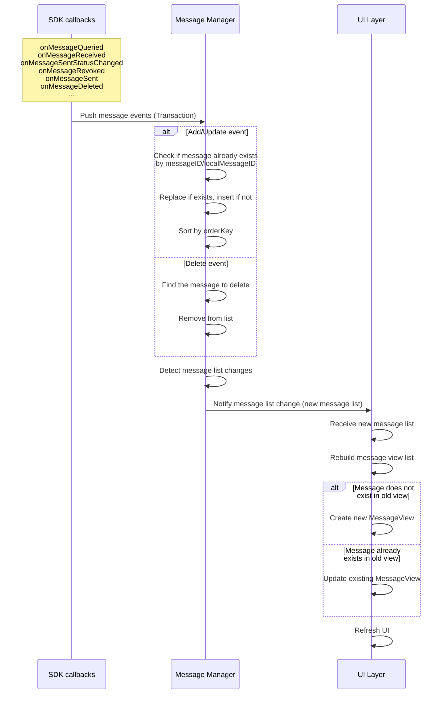

import { getPlatformData } from "/snippets/utils-content-parser.js"

export const ZIMMessageMap = {
  'Android': <a href='@-ZIMMessage' target='_blank'>ZIMMessage</a>,
  'Flutter': <a href='https://pub.dev/documentation/zego_zim/latest/zego_zim/ZIMMessage-class.html' target='_blank'>ZIMMessage</a>,
  'iOS': <a href='@-ZIMMessage' target='_blank'>ZIMMessage</a>,
  'mac': <a href='@-ZIMMessage' target='_blank'>ZIMMessage</a>,
  'window': <a href='@-ZIMMessage' target='_blank'>ZIMMessage</a>,
  'web': <a href='@-ZIMMessage' target='_blank'>ZIMMessage</a>,
}
export const queryHistoryMessageMap = {
  'Android': <a href='@queryHistoryMessage' target='_blank'>queryHistoryMessage</a>,
  'Flutter': <a href='https://pub.dev/documentation/zego_zim/latest/zego_zim/ZIM/queryHistoryMessage.html' target='_blank'>queryHistoryMessage</a>,
  'iOS': <a href='@queryHistoryMessageByConversationID' target='_blank'>queryHistoryMessageByConversationID</a>,
  'mac': <a href='@queryHistoryMessageByConversationID' target='_blank'>queryHistoryMessageByConversationID</a>,
  'window': <a href='@queryHistoryMessage' target='_blank'>queryHistoryMessage</a>,
  'web': <a href='@queryHistoryMessage' target='_blank'>queryHistoryMessage</a>,
}
export const messageReceivedMap= {
  'Android': <a href='@onMessageReceived' target='_blank'>onMessageReceived</a>,
  'iOS': <a href='/zim-ios/client-sdks/api-reference/protocol#zimmessagereceivedeventresult' target='_blank'>messageReceived</a>,
  'mac': <a href='/zim-macos/client-sdks/api-reference/protocol#zimmessagereceivedeventresult' target='_blank'>messageReceived</a>,
}

export const messageSentStatusChangedMap= {
  'Android': <a href='@onMessageSentStatusChanged' target='_blank'>onMessageSentStatusChanged</a>,
  'Flutter': <a href='https://pub.dev/documentation/zego_zim/latest/zego_zim/ZIMEventHandler/onMessageSentStatusChanged.html' target='_blank'>onMessageSentStatusChanged</a>,
  'iOS': <a href='/zim-ios/client-sdks/api-reference/protocol#zimmessagesentstatuschanged' target='_blank'>messageSentStatusChanged</a>,
  'mac': <a href='/zim-macos/client-sdks/api-reference/protocol#zimmessagesentstatuschanged' target='_blank'>messageSentStatusChanged</a>,
  'window': <a href='@onMessageSentStatusChanged' target='_blank'>onMessageSentStatusChanged</a>,
  'web': <a href='@onMessageSentStatusChanged' target='_blank'>onMessageSentStatusChanged</a>,
}


# Render Conversation Messages on the Chat Page

---

## Overview

This article describes how to use the ZIM SDK to render conversation messages on a basic one-on-one chat page.

<Frame width="40%" height="40%" >
  
</Frame>

## Prerequisites

You have already integrated the ZIM SDK into your project and implemented basic message sending and receiving. For details, refer to [Quick Start - Implement Basic Message Sending and Receiving](../Send%20and%20receive%20messages.mdx).

## Message Data Source Overview


The message data sources that need to be rendered on the page mainly include the following:

1. Historical conversation messages: When you first enter the chat page and view historical messages, you need to query historical conversation messages and render them to the chat interface.
2. Real-time received messages: Real-time received chat messages need to be rendered to the chat interface.
3. Local sent messages: Local sent chat messages (including sending, sending successfully, and sending failed statuses) need to be rendered to the chat interface.

<Accordion title="Message data flow diagram" defaultOpen="false">


</Accordion>


## Get Message Data and Render to the Chat Interface


As an example of a single chat conversation, when you navigate to the chat page, you need to save the corresponding single chat **conversationID** (the userID of the other party) and maintain a message list `myMessageList` for saving the current conversation.

Before obtaining message data, you also need to implement an `addMessage` utility method to merge message data.


:::if{props.platform="undefined"}
```java
public void addMessage(List<ZIMMessage> addList) {
    if (addList == null || addList.isEmpty()) return;

    List<ZIMMessage> mutableList = new ArrayList<>();
    if (myMessageList != null) {
        mutableList.addAll(myMessageList);
    }

    for (ZIMMessage newMsg : addList) {
        boolean replaced = false;
        for (int i = 0; i < mutableList.size(); i++) {
            ZIMMessage oldMsg = mutableList.get(i);
            if ((newMsg.getMessageID() != null && newMsg.getMessageID().equals(oldMsg.getMessageID())) ||
                (newMsg.getLocalMessageID() != null && newMsg.getLocalMessageID().equals(oldMsg.getLocalMessageID()))) {
                mutableList.set(i, newMsg);
                replaced = true;
                break;
            }
        }
        if (!replaced) {
            mutableList.add(newMsg);
        }
    }

    mutableList.sort(Comparator.comparingLong(ZIMMessage::getOrderKey));
    myMessageList = mutableList;
}

```
:::
:::if{props.platform="iOS|mac"}
```oc
// When there are new messages, update the messages to the message list through this method
- (void)addMessage:(NSArray<ZIMMessage *> *)addList {
    if (!addList || addList.count == 0) return;
    
    NSMutableArray<ZIMMessage *> *mutableList = [self.myMessageList mutableCopy];
    if (!mutableList) {
        mutableList = [NSMutableArray array];
    }
    
    for (ZIMMessage *newMsg in addList) {
        BOOL replaced = NO;
        for (NSInteger i = 0; i < mutableList.count; i++) {
            ZIMMessage *oldMsg = mutableList[i];
            if ((newMsg.messageID && oldMsg.messageID && [newMsg.messageID isEqualToString:oldMsg.messageID]) ||
                (newMsg.localMessageID && oldMsg.localMessageID && [newMsg.localMessageID isEqualToString:oldMsg.localMessageID])) {
                // Replace existing messages
                mutableList[i] = newMsg;
                replaced = YES;
                break;
            }
        }
        if (!replaced) {
            [mutableList addObject:newMsg];
        }
    }
    
    // Sort by orderKey from small to large
    [mutableList sortUsingComparator:^NSComparisonResult(ZIMMessage *msg1, ZIMMessage *msg2) {
        if (msg1.orderKey < msg2.orderKey) return NSOrderedAscending;
        if (msg1.orderKey > msg2.orderKey) return NSOrderedDescending;
        return NSOrderedSame;
    }];
    
    self.myMessageList = [mutableList copy];
}
```
:::

:::if{props.platform="window"}
```cpp
void addMessage(const std::vector<std::shared_ptr<ZIMMessage>>& addList) {
    if (addList.empty()) return;

    std::vector<std::shared_ptr<ZIMMessage>> mutableList = myMessageList;

    for (auto& newMsg : addList) {
        bool replaced = false;
        for (size_t i = 0; i < mutableList.size(); ++i) {
            auto& oldMsg = mutableList[i];
            if ((!newMsg->messageID.empty() && newMsg->messageID == oldMsg->messageID) ||
                (!newMsg->localMessageID.empty() && newMsg->localMessageID == oldMsg->localMessageID)) {
                mutableList[i] = newMsg;
                replaced = true;
                break;
            }
        }
        if (!replaced) {
            mutableList.push_back(newMsg);
        }
    }

    std::sort(mutableList.begin(), mutableList.end(),
              [](const std::shared_ptr<ZIMMessage>& a, const std::shared_ptr<ZIMMessage>& b) {
                  return a->orderKey < b->orderKey;
              });

    myMessageList = mutableList;
}

```
:::
:::if{props.platform="web"}
```ts
function addMessage(addList: ZIMMessage[]) {
    if (!addList || addList.length === 0) return;

    const mutableList: ZIMMessage[] = myMessageList ? [...myMessageList] : [];

    for (const newMsg of addList) {
        let replaced = false;
        for (let i = 0; i < mutableList.length; i++) {
            const oldMsg = mutableList[i];
            if ((newMsg.messageID && oldMsg.messageID && newMsg.messageID === oldMsg.messageID) ||
                (newMsg.localMessageID && oldMsg.localMessageID && newMsg.localMessageID === oldMsg.localMessageID)) {
                mutableList[i] = newMsg;
                replaced = true;
                break;
            }
        }
        if (!replaced) {
            mutableList.push(newMsg);
        }
    }

    mutableList.sort((a, b) => a.orderKey - b.orderKey);
    myMessageList = mutableList;
}

```
:::
:::if{props.platform="Flutter"}
```dart

void addMessage(List<ZIMMessage>? addList) {
  if (addList == null || addList.isEmpty) return;

  List<ZIMMessage> mutableList = myMessageList != null ? List.from(myMessageList!) : [];

  for (var newMsg in addList) {
    bool replaced = false;
    for (var i = 0; i < mutableList.length; i++) {
      var oldMsg = mutableList[i];
      if ((newMsg.messageID != null && oldMsg.messageID != null && newMsg.messageID == oldMsg.messageID) ||
          (newMsg.localMessageID != null && oldMsg.localMessageID != null && newMsg.localMessageID == oldMsg.localMessageID)) {
        mutableList[i] = newMsg;
        replaced = true;
        break;
      }
    }
    if (!replaced) {
      mutableList.add(newMsg);
    }
  }

  mutableList.sort((a, b) => a.orderKey.compareTo(b.orderKey));
  myMessageList = mutableList;
}
```
:::


<Note title="Note">

Each time you call a message-related interface (such as the interfaces shown below), you will get a message list `ZIMMessage[]`. The obtained message list needs to be merged to obtain a message list without duplicate messages and ordered messages for rendering on the message page. The message sorting rule is to sort by the `orderkey` property in {getPlatformData(props,ZIMMessageMap)} (the larger the orderkey, the newer the current message); the de-duplication rule is to determine whether the message object is the same message based on the `localMessageID` of the message, and replace the new data with the old data when it is duplicated.

</Note>

### Query Historical Messages and Render Them to the Chat Interface

Call the {getPlatformData(props,queryHistoryMessageMap)} interface to query historical messages from new to old (from the most recent message to the oldest message in chronological order) and render them to the chat interface.

:::if{props.platform=undefined}
```java

ZIMMessageQueryConfig queryConfig = new ZIMMessageQueryConfig();
queryConfig.count = 20;
queryConfig.nextMessage = null; // When the first query is empty, the earliest message is passed in when more historical messages are needed

zim.queryHistoryMessage(
        myConversationID,
        ZIMConversationType.PEER,
        queryConfig,
        (conversationID, conversationType, messageList, errorInfo) -> {
            addMessage(messageList);
            // update UI
        });
```
:::
:::if{props.platform="iOS|mac"}
```oc
ZIMMessageQueryConfig *queryConfig = [[ZIMMessageQueryConfig alloc] init];
queryConfig.count = 20;//
queryConfig.nextMessage = nil;//When the first query is empty, the earliest message in the message list is passed in again when more historical messages are needed
[zim queryHistoryMessageByConversationID:myConversationID 
            conversationType:ZIMConversationTypePeer 
            config:queryConfig 
            callback:callback:^(NSString * _Nonnull conversationID, ZIMConversationType conversationType, NSArray<ZIMMessage *> * _Nonnull messageList, ZIMError * _Nonnull errorInfo){
    [self addMessage:messageList];            
    // update UI
}];
```
:::
:::if{props.platform="window|mac"}
```cpp

ZIMMessageQueryConfig queryConfig;
queryConfig.count = 20;
queryConfig.nextMessage = nullptr; // When the first query is empty

zim->queryHistoryMessage(
    myConversationID,
    ZIMConversationType::Peer,
    queryConfig,
    [this](const std::string& conversationID, ZIMConversationType type,
           const std::vector<ZIMMessage>& messageList, const ZIMError& errorInfo) {
        addMessage(messageList);
        refreshUI(); // Custom UI refresh function
    });
    
```
:::
:::if{props.platform="web"}
```ts
const queryConfig: ZIMMessageQueryConfig = {
  count: 20,
  nextMessage: null // When the first query is empty
};

zim.queryHistoryMessage(
  myConversationID,
  ZIMConversationType.Peer,
  queryConfig,
  (conversationID, conversationType, messageList, errorInfo) => {
    addMessage(messageList);
    updateUI(); // Custom refresh message list function
  }
);

```
:::
:::if{props.platform="Flutter"}

```dart

final queryConfig = ZIMMessageQueryConfig();
queryConfig.count = 20;
queryConfig.nextMessage = null; // When the first query is empty

zim.queryHistoryMessage(
  myConversationID,
  ZIMConversationType.peer,
  queryConfig,
  (String conversationID, ZIMConversationType conversationType,
      List<ZIMMessage> messageList, ZIMError errorInfo) {
    addMessage(messageList);

    // Update UI
  },
);
```
:::

### Get Real-time Received Messages and Render Them to the Chat Interface

Listen to the {getPlatformData(props,messageReceivedMap)} interface to get real-time received messages and render them to the chat interface.

:::if{props.platform=undefined}

```java
 @Override
 public void onMessageReceived(ZIM zim, ZIMMessageReceivedEventResult result) {
     List<ZIMMessage> messageList = result.messageList;
     ZIMMessageReceivedInfo info = result.info;
     String conversationID = result.conversationID;
     ZIMConversationType conversationType = result.conversationType;
     // Only process messages from the current conversation
     if (!conversationID.equals(myConversationID)) {
         return; // Messages from non-current conversations are ignored
     }

     // Merge messages into message list
     addMessage(messageList);

     // Update UI, such as refreshing RecyclerView
     runOnUiThread(() -> {
         myAdapter.notifyDataSetChanged();
         if (!myMessageList.isEmpty()) {
             recyclerView.scrollToPosition(myMessageList.size() - 1);
         }
     });
 }

```
:::
:::if{props.platform="iOS|mac"}
```oc

- (void)zim:(ZIM *)zim messageReceivedWithResult:(ZIMMessageReceivedEventResult *)result {
     NSArray<ZIMMessage *> *messageList = result.messageList;
     ZIMMessageReceivedInfo *info = result.info;
     NSString *conversationID = result.conversationID;
     ZIMConversationType conversationType = result.conversationType;
     if(conversationID != myConversationID){
         return;// Messages from non-current conversations are ignored
     }
     [self addMessage: messageList];
     // update UI
 }
```
:::
:::if{props.platform="window"}
```cpp

virtual void onMessageReceived(ZIM *zim, const ZIMMessageReceivedEventResult &result) override {
    auto &messageList = result.messageList;
    auto &info = result.info;
    auto &conversationID = result.conversationID;
    auto conversationType = result.conversationType;
    // Only process messages from the current conversation
    if (conversationID != myConversationID) {
        return; // Messages from non-current conversations are ignored
    }

    // Merge messages into message list
    addMessage(messageList);

    // Update UI
    // Assume there is a refresh function refreshUI()
    refreshUI();
}

```
:::
:::if{props.platform="web"}
```ts

zim.on('messageReceived', function (zim, result) {
    const { messageList, info, conversationID, conversationType } = result;
    // Only process messages from the current conversation
    if (conversationID !== myConversationID) return;

    // Merge messages into message list
    addMessage(messageList);

    // Update UI, such as refreshing message list
    updateUI();
});


```
:::
:::if{props.platform="Flutter"}
```dart

ZIMEventHandler().onMessageReceived = (ZIM zim, ZIMMessageReceivedEventResult result) {
  List<ZIMMessage> messageList = result.messageList;
  ZIMMessageReceivedInfo info = result.info;
  String conversationID = result.conversationID;
  ZIMConversationType conversationType = result.conversationType;
  // Only process messages from the current conversation
  if (conversationID != myConversationID) return;

  // Merge messages into message list
  addMessage(messageList);

  // Update UI
  WidgetsBinding.instance.addPostFrameCallback((_) {
    setState(() {});
    if (myMessageList.isNotEmpty) {
      scrollController.jumpTo(scrollController.position.maxScrollExtent);
    }
  });
};
```
:::

### Render Local Sent Messages to the Chat Interface

Listen to the {getPlatformData(props,messageSentStatusChangedMap)} interface to get the change of the sending status of the local sent message (sending, sending successfully, and sending failed), and render the local sent message and its sending status to the chat interface.

:::if{props.platform=undefined}
```java

@Override
public void onMessageSentStatusChanged(List<ZIMMessageSentStatusChangeInfo> messageSentStatusChangeInfoList) {
    for (ZIMMessageSentStatusChangeInfo info : messageSentStatusChangeInfoList) {
        if (!info.getMessage().getConversationID().equals(myConversationID)) {
            continue;
        }
        addMessage(Collections.singletonList(info.getMessage()));
    }
    // Update UI
    runOnUiThread(() -> {
        myAdapter.notifyDataSetChanged();
        if (!myMessageList.isEmpty()) {
            recyclerView.scrollToPosition(myMessageList.size() - 1);
        }
    });
}


```
:::
:::if{props.platform="iOS|mac"}
```oc
- (void)zim:(ZIM *)zim
    messageSentStatusChanged:
        (NSArray<ZIMMessageSentStatusChangeInfo *> *)messageSentStatusChangeInfoList{
       for(ZIMMessageSentStatusChangeInfo *info in messageSentStatusChangeInfoList){
           if(info.message.conversationID != myConversationID){
               continue;
           }
           [self addMessage:info.message];
       }
       // update UI
}

```
:::
:::if{props.platform="window"}
```cpp
void onMessageSentStatusChanged(const std::vector<ZIMMessageSentStatusChangeInfo>& messageSentStatusChangeInfoList) {
    for (const auto& info : messageSentStatusChangeInfoList) {
        if (info.message.conversationID != myConversationID) continue;
        addMessage({info.message}); // Assume addMessage supports vector or list
    }
    refreshUI(); // Custom refresh UI function
}


```
:::
:::if{props.platform="web"}
```ts
zim.onMessageSentStatusChanged = (messageSentStatusChangeInfoList: ZIMMessageSentStatusChangeInfo[]) => {
    for (const info of messageSentStatusChangeInfoList) {
        if (info.message.conversationID !== myConversationID) continue;
        addMessage([info.message]);
    }
    updateUI(); // Custom refresh UI function
};


```
:::
:::if{props.platform="Flutter"}
```dart
void onMessageSentStatusChanged(List<ZIMMessageSentStatusChangeInfo> messageSentStatusChangeInfoList) {
  for (var info in messageSentStatusChangeInfoList) {
    if (info.message.conversationID != myConversationID) continue;
    addMessage([info.message]);
  }
  
  // Update UI
}
```
:::


By following the above steps, you can render historical messages, real-time received messages, and local sent messages (including sending status) in the chat page.


## FAQ

<Accordion title="Why is it necessary to replace the old message object with the new one?" defaultOpen="false">

Message data may change during its lifecycle. Common scenarios include:
1. The sending status changes from "sending" to "sent" or "failed".
2. The message is recalled, causing the message type to change (e.g., from a text message to a recalled message).
3. A sent message is edited.

The SDK pushes the latest message object when any of the above changes occur. To maintain message data consistency, you should replace the existing message with the latest message object and refresh the UI.

</Accordion>

<Accordion title="Why use both messageID and localMessageID to identify the same message?" defaultOpen="false">

`messageID` is assigned by the server and has global uniqueness, serving as the primary identifier of a message.

In the following scenarios, a message may not yet have a `messageID`:
- The message is being sent
- The message failed to send
- The message is only saved locally (inserted via `insertMessageToLocalDB`)

In these cases, `localMessageID` is used as a temporary client-side identifier. The matching rule is: use `messageID` when available, otherwise use `localMessageID`.

By combining these two identifiers, you can accurately determine whether two message objects represent the same message at any stage of the message lifecycle.
</Accordion>

<Accordion title="Why should messages be sorted by orderKey instead of timestamp?" defaultOpen="false">

`timestamp` reflects the time the message reached the server, while `orderKey` is specifically designed for message sorting and provides consistent sorting results.

When messages are sent rapidly in succession or under unstable network conditions, `timestamp` may deviate, causing message ordering issues. `orderKey` takes into account both the global message order and the sending order of the same sender, ensuring that messages are displayed consistently with the conversation flow.

Sorting by `orderKey` ensures:
- Stable sorting results
- Correct conversation order
- Consistent display across different clients

</Accordion>
<Accordion title="Why is sorting performed on the client side? Can an ordered message list be provided directly?" defaultOpen="false">

ZIM already sorts messages by `orderKey` in the results returned by each API or event.

In practice, the chat page message list is composed of multiple data sources merged together:
- Historical messages (`queryHistoryMessage`)
- Real-time received messages (`onMessageReceived`)
- Message updates (status changes, recalls, edits, etc.)

The client is the only layer that can access all data sources simultaneously. After merging, it needs to uniformly re-sort by `orderKey` to ensure:
- Stable and correct message order
- Coherent conversation flow
- Unified view across all data sources

ZIM is responsible for internal ordering within each data source, while the client is responsible for global sorting consistency after merging.
</Accordion>