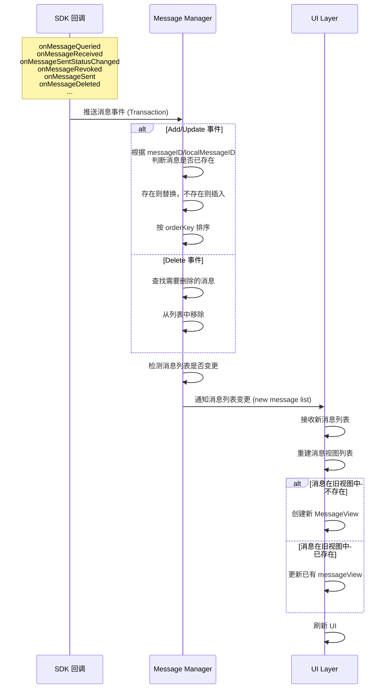

import { getPlatformData } from "/snippets/utils-content-parser.js"

export const ZIMMessageMap = {
  'Android': <a href='@-ZIMMessage' target='_blank'>ZIMMessage</a>,
  'Flutter': <a href='https://pub.dev/documentation/zego_zim/latest/zego_zim/ZIMMessage-class.html' target='_blank'>ZIMMessage</a>,
  'iOS': <a href='@-ZIMMessage' target='_blank'>ZIMMessage</a>,
  'mac': <a href='@-ZIMMessage' target='_blank'>ZIMMessage</a>,
  'window': <a href='@-ZIMMessage' target='_blank'>ZIMMessage</a>,
  'web': <a href='@-ZIMMessage' target='_blank'>ZIMMessage</a>,
}
export const queryHistoryMessageMap = {
  'Android': <a href='@queryHistoryMessage' target='_blank'>queryHistoryMessage</a>,
  'Flutter': <a href='https://pub.dev/documentation/zego_zim/latest/zego_zim/ZIM/queryHistoryMessage.html' target='_blank'>queryHistoryMessage</a>,
  'iOS': <a href='@queryHistoryMessageByConversationID' target='_blank'>queryHistoryMessageByConversationID</a>,
  'mac': <a href='@queryHistoryMessageByConversationID' target='_blank'>queryHistoryMessageByConversationID</a>,
  'window': <a href='@queryHistoryMessage' target='_blank'>queryHistoryMessage</a>,
  'web': <a href='@queryHistoryMessage' target='_blank'>queryHistoryMessage</a>,
}
export const messageReceivedMap= {
  'Android': <a href='@onMessageReceived' target='_blank'>onMessageReceived</a>,
  'iOS': <a href='/zim-ios/client-sdks/api-reference/protocol#zimmessagereceived' target='_blank'>messageReceived</a>,
  'mac': <a href='/zim-macos/client-sdks/api-reference/protocol#zimmessagereceived' target='_blank'>messageReceived</a>,
}

export const messageSentStatusChangedMap= {
  'Android': <a href='@onMessageSentStatusChanged' target='_blank'>onMessageSentStatusChanged</a>,
  'Flutter': <a href='https://pub.dev/documentation/zego_zim/latest/zego_zim/ZIMEventHandler/onMessageSentStatusChanged.html' target='_blank'>onMessageSentStatusChanged</a>,
  'iOS': <a href='/zim-ios/client-sdks/api-reference/protocol#zimmessagesentstatuschanged' target='_blank'>messageSentStatusChanged</a>,
  'mac': <a href='/zim-macos/client-sdks/api-reference/protocol#zimmessagesentstatuschanged' target='_blank'>messageSentStatusChanged</a>,
  'window': <a href='@onMessageSentStatusChanged' target='_blank'>onMessageSentStatusChanged</a>,
  'web': <a href='@onMessageSentStatusChanged' target='_blank'>onMessageSentStatusChanged</a>,
}


# 在聊天页面中渲染对话消息

---

## 功能简介

本文介绍了如何使用 ZIM SDK 在基本的聊天页面中渲染消息。

<Frame width="40%" height="40%" >
  
</Frame>

## 前提条件

已在项目中集成了 ZIM SDK 并实现了基本收发消息的功能，详情请参考 [快速开始 - 实现基本收发消息](../Send%20and%20receive%20messages.mdx)。

## 消息数据来源概述

页面上需要渲染的消息数据来源主要有以下几种：

1. 历史对话消息： 首次进入聊天页面和查看历史消息时，需要查询历史对话消息并渲染到聊天界面。
2. 实时收到的消息： 实时收到的聊天消息需要渲染到聊天界面。
3. 本地发送的消息： 本地发送的聊天消息（包含发送中、发送成功、发送失败等状态）需要渲染到聊天界面。


<Accordion title="消息数据流示意图" defaultOpen="false">


</Accordion>

## 获取消息数据渲染到聊天界面


以单聊会话为例，跳转到聊天页面时，需要保存对应单聊的 **conversationID**（对方的 userID）并维护一个用于保存当前会话的消息列表 `myMessageList`。

在获取消息数据时建议实现 `addMessage` 工具方法用于合并历史消息、实时接收的消息和本地发送的消息。


:::if{props.platform="undefined"}
```java
public void addMessage(List<ZIMMessage> addList) {
    if (addList == null || addList.isEmpty()) return;

    List<ZIMMessage> mutableList = new ArrayList<>();
    if (myMessageList != null) {
        mutableList.addAll(myMessageList);
    }

    for (ZIMMessage newMsg : addList) {
        boolean replaced = false;
        for (int i = 0; i < mutableList.size(); i++) {
            ZIMMessage oldMsg = mutableList.get(i);
            if ((newMsg.getMessageID() != null && newMsg.getMessageID().equals(oldMsg.getMessageID())) ||
                (newMsg.getLocalMessageID() != null && newMsg.getLocalMessageID().equals(oldMsg.getLocalMessageID()))) {
                mutableList.set(i, newMsg);
                replaced = true;
                break;
            }
        }
        if (!replaced) {
            mutableList.add(newMsg);
        }
    }

    mutableList.sort(Comparator.comparingLong(ZIMMessage::getOrderKey));
    myMessageList = mutableList;
}

```
:::
:::if{props.platform="iOS|mac"}
```oc
// 有新消息时，通过该方法将消息更新到消息列表中
- (void)addMessage:(NSArray<ZIMMessage *> *)addList {
    if (!addList || addList.count == 0) return;
    
    NSMutableArray<ZIMMessage *> *mutableList = [self.myMessageList mutableCopy];
    if (!mutableList) {
        mutableList = [NSMutableArray array];
    }
    
    for (ZIMMessage *newMsg in addList) {
        BOOL replaced = NO;
        for (NSInteger i = 0; i < mutableList.count; i++) {
            ZIMMessage *oldMsg = mutableList[i];
            if ((newMsg.messageID && oldMsg.messageID && [newMsg.messageID isEqualToString:oldMsg.messageID]) ||
                (newMsg.localMessageID && oldMsg.localMessageID && [newMsg.localMessageID isEqualToString:oldMsg.localMessageID])) {
                // 替换已有消息
                mutableList[i] = newMsg;
                replaced = YES;
                break;
            }
        }
        if (!replaced) {
            [mutableList addObject:newMsg];
        }
    }
    
    // 根据 orderKey 从小到大排序
    [mutableList sortUsingComparator:^NSComparisonResult(ZIMMessage *msg1, ZIMMessage *msg2) {
        if (msg1.orderKey < msg2.orderKey) return NSOrderedAscending;
        if (msg1.orderKey > msg2.orderKey) return NSOrderedDescending;
        return NSOrderedSame;
    }];
    
    self.myMessageList = [mutableList copy];
}
```
:::

:::if{props.platform="window"}
```cpp
void addMessage(const std::vector<std::shared_ptr<ZIMMessage>>& addList) {
    if (addList.empty()) return;

    std::vector<std::shared_ptr<ZIMMessage>> mutableList = myMessageList;

    for (auto& newMsg : addList) {
        bool replaced = false;
        for (size_t i = 0; i < mutableList.size(); ++i) {
            auto& oldMsg = mutableList[i];
            if ((!newMsg->messageID.empty() && newMsg->messageID == oldMsg->messageID) ||
                (!newMsg->localMessageID.empty() && newMsg->localMessageID == oldMsg->localMessageID)) {
                mutableList[i] = newMsg;
                replaced = true;
                break;
            }
        }
        if (!replaced) {
            mutableList.push_back(newMsg);
        }
    }

    std::sort(mutableList.begin(), mutableList.end(),
              [](const std::shared_ptr<ZIMMessage>& a, const std::shared_ptr<ZIMMessage>& b) {
                  return a->orderKey < b->orderKey;
              });

    myMessageList = mutableList;
}

```
:::
:::if{props.platform="web"}
```ts
function addMessage(addList: ZIMMessage[]) {
    if (!addList || addList.length === 0) return;

    const mutableList: ZIMMessage[] = myMessageList ? [...myMessageList] : [];

    for (const newMsg of addList) {
        let replaced = false;
        for (let i = 0; i < mutableList.length; i++) {
            const oldMsg = mutableList[i];
            if ((newMsg.messageID && oldMsg.messageID && newMsg.messageID === oldMsg.messageID) ||
                (newMsg.localMessageID && oldMsg.localMessageID && newMsg.localMessageID === oldMsg.localMessageID)) {
                mutableList[i] = newMsg;
                replaced = true;
                break;
            }
        }
        if (!replaced) {
            mutableList.push(newMsg);
        }
    }

    mutableList.sort((a, b) => a.orderKey - b.orderKey);
    myMessageList = mutableList;
}

```
:::
:::if{props.platform="Flutter"}
```dart

void addMessage(List<ZIMMessage>? addList) {
  if (addList == null || addList.isEmpty) return;

  List<ZIMMessage> mutableList = myMessageList != null ? List.from(myMessageList!) : [];

  for (var newMsg in addList) {
    bool replaced = false;
    for (var i = 0; i < mutableList.length; i++) {
      var oldMsg = mutableList[i];
      if ((newMsg.messageID != null && oldMsg.messageID != null && newMsg.messageID == oldMsg.messageID) ||
          (newMsg.localMessageID != null && oldMsg.localMessageID != null && newMsg.localMessageID == oldMsg.localMessageID)) {
        mutableList[i] = newMsg;
        replaced = true;
        break;
      }
    }
    if (!replaced) {
      mutableList.add(newMsg);
    }
  }

  mutableList.sort((a, b) => a.orderKey.compareTo(b.orderKey));
  myMessageList = mutableList;
}
```
:::


<Note title="说明">

每次调用消息相关的接口时（比如以下展示的接口），会得到一个消息列表 `ZIMMessage[]`。获得的消息列表需要进行合并数据的操作，从而得到一个无重复消息、有序的消息列表用于在消息页面进行渲染。消息排序规则为根据 {getPlatformData(props,ZIMMessageMap)} 中的 `orderkey` 属性进行排序（orderkey 越大表示当前消息越新）；去重规则为根据消息的 `localMessageID` 判断消息对象是否为同一条消息，重复时新数据替换旧数据。

</Note>

### 查询历史消息并渲染到聊天界面

调用 {getPlatformData(props,queryHistoryMessageMap)} 接口从新分页到旧分页（按时间顺序从最近的消息到更久之前的消息）进行查询，获取双方的历史消息并渲染到聊天界面。

:::if{props.platform=undefined}
```java

ZIMMessageQueryConfig queryConfig = new ZIMMessageQueryConfig();
queryConfig.count = 20;
queryConfig.nextMessage = null; // 首次查询时为空，需要更多历史消息时传入最早消息

zim.queryHistoryMessage(
        myConversationID,
        ZIMConversationType.PEER,
        queryConfig,
        (conversationID, conversationType, messageList, errorInfo) -> {
            addMessage(messageList);
            // 更新 UI
        });
```
:::
:::if{props.platform="iOS|mac"}
```oc
ZIMMessageQueryConfig *queryConfig = [[ZIMMessageQueryConfig alloc] init];
queryConfig.count = 20;//
queryConfig.nextMessage = nil;//首次查询时传空，需要更多历史消息时，传入消息列表中最早的消息再次调用
[zim queryHistoryMessageByConversationID:myConversationID 
            conversationType:ZIMConversationTypePeer 
            config:queryConfig 
            callback:callback:^(NSString * _Nonnull conversationID, ZIMConversationType conversationType, NSArray<ZIMMessage *> * _Nonnull messageList, ZIMError * _Nonnull errorInfo){
    [self addMessage:messageList];            
    // update UI
}];
```
:::
:::if{props.platform="window|mac"}
```cpp

ZIMMessageQueryConfig queryConfig;
queryConfig.count = 20;
queryConfig.nextMessage = nullptr; // 首次查询为空

zim->queryHistoryMessage(
    myConversationID,
    ZIMConversationType::Peer,
    queryConfig,
    [this](const std::string& conversationID, ZIMConversationType type,
           const std::vector<ZIMMessage>& messageList, const ZIMError& errorInfo) {
        addMessage(messageList);
        refreshUI(); // 自定义 UI 刷新函数
    });
    
```
:::
:::if{props.platform="web"}
```ts
const queryConfig: ZIMMessageQueryConfig = {
  count: 20,
  nextMessage: null // 首次查询
};

zim.queryHistoryMessage(myConversationID, 0, queryConfig).then((res: ZIMMessageQueriedResult) => {
    addMessage(res.messageList);
    updateUI(); // 自定义刷新消息列表函数
});

```
:::
:::if{props.platform="Flutter"}

```dart

final queryConfig = ZIMMessageQueryConfig();
queryConfig.count = 20;
queryConfig.nextMessage = null; // 首次查询

zim.queryHistoryMessage(
  myConversationID,
  ZIMConversationType.peer,
  queryConfig,
  (String conversationID, ZIMConversationType conversationType,
      List<ZIMMessage> messageList, ZIMError errorInfo) {
    addMessage(messageList);

    // 更新 UI
  },
);
```
:::

### 获取实时接收的消息并渲染到聊天界面

监听 {getPlatformData(props,messageReceivedMap)} 接口获取实时接收的消息，并渲染到聊天界面。

:::if{props.platform=undefined}

```java
@Override
public void onMessageReceived(ZIM zim, ZIMMessageReceivedEventResult result) {
    List<ZIMMessage> messageList = result.messageList;
    ZIMMessageReceivedInfo info = result.info;
    String conversationID = result.conversationID;
    ZIMConversationType conversationType = result.conversationType;

    // 只处理当前会话的消息
    if (!conversationID.equals(myConversationID)) {
        return; // 非当前会话的消息忽略
    }

    // 合并消息到消息列表
    addMessage(messageList);

    // 更新 UI，比如刷新 RecyclerView
    runOnUiThread(() -> {
        myAdapter.notifyDataSetChanged();
        if (!myMessageList.isEmpty()) {
            recyclerView.scrollToPosition(myMessageList.size() - 1);
        }
    });
}

```
:::
:::if{props.platform="iOS|mac"}
```oc

- (void)zim:(ZIM *)zim messageReceivedWithResult:(ZIMMessageReceivedEventResult *)result {
    NSArray<ZIMMessage *> *messageList = result.messageList;
    ZIMMessageReceivedInfo *info = result.info;
    NSString *conversationID = result.conversationID;
    ZIMConversationType conversationType = result.conversationType;

    if(conversationID != myConversationID){
        return;// 非当前会话收到的聊天消息，忽略
    }
    [self addMessage: messageList];
    // update UI
}
```
:::
:::if{props.platform="window"}
```cpp

virtual void onMessageReceived(ZIM *zim, const ZIMMessageReceivedEventResult &result) override {
    auto &messageList = result.messageList;
    auto &info = result.info;
    auto &conversationID = result.conversationID;
    auto conversationType = result.conversationType;

    // 只处理当前会话消息
    if (conversationID != myConversationID) {
        return; // 非当前会话消息忽略
    }

    // 合并消息到消息列表
    addMessage(messageList);

    // 更新 UI
    // 假设有刷新函数 refreshUI()
    refreshUI();
}

```
:::
:::if{props.platform="web"}
```ts

zim.on('messageReceived', function (zim, result) {
    const { messageList, info, conversationID, conversationType } = result;
    // 只处理当前会话消息
    if (conversationID !== myConversationID) return;

    // 合并消息到消息列表
    addMessage(messageList);

    // 更新 UI，例如重新渲染消息列表
    updateUI();
});


```
:::
:::if{props.platform="Flutter"}
```dart

ZIMEventHandler().onMessageReceived = (ZIM zim, ZIMMessageReceivedEventResult result) {
  List<ZIMMessage> messageList = result.messageList;
  ZIMMessageReceivedInfo info = result.info;
  String conversationID = result.conversationID;
  ZIMConversationType conversationType = result.conversationType;

  // 只处理当前会话消息
  if (conversationID != myConversationID) return;

  // 合并消息到消息列表
  addMessage(messageList);

  // 更新 UI
  WidgetsBinding.instance.addPostFrameCallback((_) {
    setState(() {});
    if (myMessageList.isNotEmpty) {
      scrollController.jumpTo(scrollController.position.maxScrollExtent);
    }
  });
};
```
:::


### 将本地发送的消息渲染到聊天界面

监听 {getPlatformData(props,messageSentStatusChangedMap)} ，获取本地发送消息的发送状态的变化（发送中、发送成功、发送失败），渲染本地发送的消息及其发送状态到聊天界面。

:::if{props.platform=undefined}
```java

@Override
public void onMessageSentStatusChanged(List<ZIMMessageSentStatusChangeInfo> messageSentStatusChangeInfoList) {
    for (ZIMMessageSentStatusChangeInfo info : messageSentStatusChangeInfoList) {
        if (!info.getMessage().getConversationID().equals(myConversationID)) {
            continue;
        }
        addMessage(Collections.singletonList(info.getMessage()));
    }
    // 更新 UI
    runOnUiThread(() -> {
        myAdapter.notifyDataSetChanged();
        if (!myMessageList.isEmpty()) {
            recyclerView.scrollToPosition(myMessageList.size() - 1);
        }
    });
}


```
:::
:::if{props.platform="iOS|mac"}
```oc
- (void)zim:(ZIM *)zim
    messageSentStatusChanged:
        (NSArray<ZIMMessageSentStatusChangeInfo *> *)messageSentStatusChangeInfoList{
       for(ZIMMessageSentStatusChangeInfo *info in messageSentStatusChangeInfoList){
           if(info.message.conversationID != myConversationID){
               continue;
           }
           [self addMessage:info.message];
       }
       // update UI
}

```
:::
:::if{props.platform="window"}
```cpp
void onMessageSentStatusChanged(const std::vector<ZIMMessageSentStatusChangeInfo>& messageSentStatusChangeInfoList) {
    for (const auto& info : messageSentStatusChangeInfoList) {
        if (info.message.conversationID != myConversationID) continue;
        addMessage({info.message}); // 假设 addMessage 支持 vector 或 list
    }
    refreshUI(); // 自定义刷新 UI 函数
}


```
:::
:::if{props.platform="web"}
```ts
zim.onMessageSentStatusChanged = (messageSentStatusChangeInfoList: ZIMMessageSentStatusChangeInfo[]) => {
    for (const info of messageSentStatusChangeInfoList) {
        if (info.message.conversationID !== myConversationID) continue;
        addMessage([info.message]);
    }
    updateUI(); // 自定义刷新 UI 函数
};


```
:::
:::if{props.platform="Flutter"}
```dart
void onMessageSentStatusChanged(List<ZIMMessageSentStatusChangeInfo> messageSentStatusChangeInfoList) {
  for (var info in messageSentStatusChangeInfoList) {
    if (info.message.conversationID != myConversationID) continue;
    addMessage([info.message]);
  }
  
  // 更新 UI
}
```
:::


通过以上方式，即可实现在聊天页面中渲染历史消息、实时接收的消息和本地发送的消息（包含发送状态）。


## 常见问题

<Accordion title="为什么需要使用新的消息对象替换旧的消息对象？" defaultOpen="false">

消息数据在生命周期内可能发生变化，常见场景包括：
1. 发送状态从 “发送中” 变为 “发送成功” 或 “发送失败”。
2. 消息被撤回后，消息类型发生变更（例如从文本消息变为已撤回消息）。
3. 已发送的消息被编辑。

SDK 会在上述变化发生时推送最新的消息对象。为保持消息数据的一致性，应使用最新消息对象替换已有消息，并刷新 UI。

</Accordion>

<Accordion title="为什么需要同时使用 messageID 和 localMessageID 标识同一条消息？" defaultOpen="false">

`messageID` 由服务器分配，具备全局唯一性，是消息的主要标识符。

在以下场景中，消息可能尚未分配 `messageID`：
- 消息正在发送中
- 消息发送失败
- 消息仅保存在本地（通过 `insertMessageToLocalDB` 插入）

此时需使用 `localMessageID` 作为客户端的临时标识符。匹配规则为：`messageID` 可用时优先使用 `messageID`，不可用时使用 `localMessageID`。

结合这两个标识符，可在消息生命周期的各个阶段准确判断两个消息对象是否为同一条消息。
</Accordion>

<Accordion title="为什么消息应按 orderKey 而不是 timestamp 排序？" defaultOpen="false">

`timestamp` 反映消息到达服务器的时间，`orderKey` 专为消息排序设计，能提供一致的排序结果。

在快速连续发送消息或网络条件不稳定时，`timestamp` 可能出现偏差，导致消息乱序。`orderKey` 综合考虑了全局消息顺序和同一发送者的发送顺序，确保消息显示与对话流程一致。

使用 `orderKey` 排序可保证：
- 排序结果稳定
- 对话顺序正确
- 不同客户端间显示一致

</Accordion>
<Accordion title="为什么由客户端进行排序？能否直接提供有序的消息列表？" defaultOpen="false">

ZIM 在每个 API 或事件的返回结果中，已按 `orderKey` 对消息完成排序。

实际应用中，聊天页面的消息列表由多个数据源合并构成：
- 历史消息（`queryHistoryMessage`）
- 实时接收消息（`onMessageReceived`）
- 消息更新（状态变更、撤回、编辑等）

客户端是唯一能同时获取所有数据源的层级，需在合并后统一按 `orderKey` 重新排序，以确保：
- 消息顺序稳定正确
- 对话流程连贯
- 所有数据源的视图统一

ZIM 负责各数据源内部的有序性，客户端负责合并后的全局排序一致性。
</Accordion>